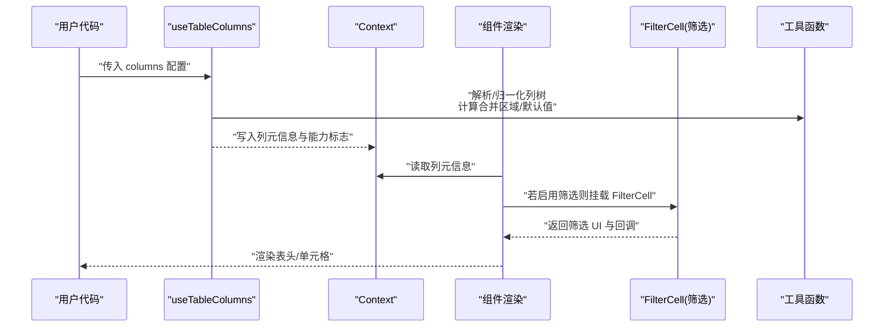
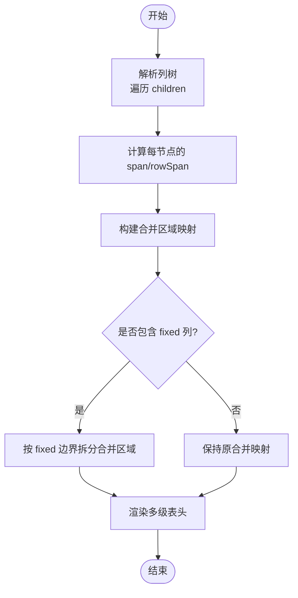
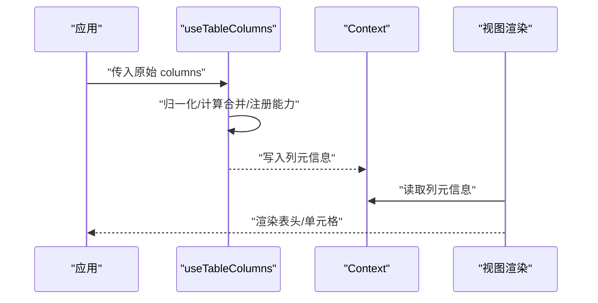
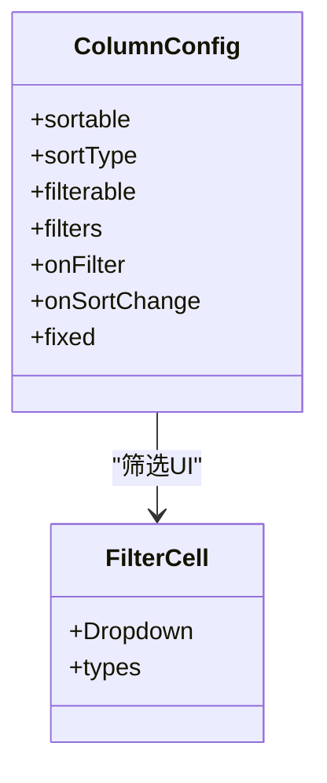
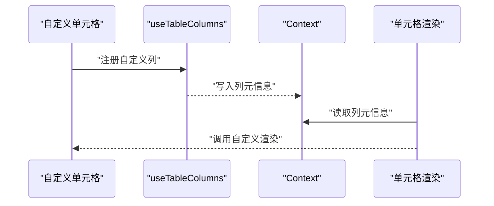
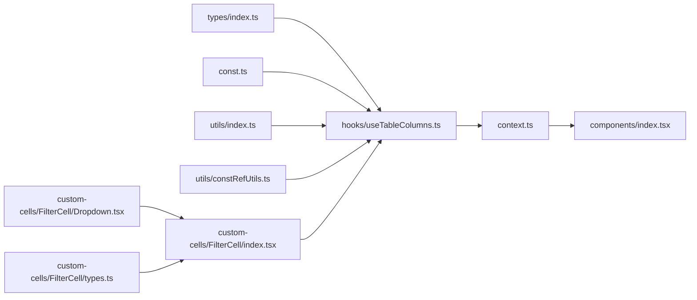

# 列配置系统

<cite>
**本文引用的文件**   
- [src/StkTable/types/index.ts](file://src/StkTable/types/index.ts)
- [src/StkTable/hooks/useTableColumns.ts](file://src/StkTable/hooks/useTableColumns.ts)
- [src/StkTable/context.ts](file://src/StkTable/context.ts)
- [src/StkTable/const.ts](file://src/StkTable/const.ts)
- [src/StkTable/components/index.tsx](file://src/StkTable/components/index.tsx)
- [src/StkTable/custom-cells/FilterCell/index.tsx](file://src/StkTable/custom-cells/FilterCell/index.tsx)
- [src/StkTable/custom-cells/FilterCell/Dropdown.tsx](file://src/StkTable/custom-cells/FilterCell/Dropdown.tsx)
- [src/StkTable/custom-cells/FilterCell/types.ts](file://src/StkTable/custom-cells/FilterCell/types.ts)
- [src/StkTable/utils/index.ts](file://src/StkTable/utils/index.ts)
- [src/StkTable/utils/constRefUtils.ts](file://src/StkTable/utils/constRefUtils.ts)
- [docs-demo/basic/multi-header/MultiHeader.tsx](file://docs-demo/basic/multi-header/MultiHeader.tsx)
- [docs-demo/basic/fixed/Fixed.tsx](file://docs-demo/basic/fixed/Fixed.tsx)
- [docs-demo/basic/sort/DefaultSort.tsx](file://docs-demo/basic/sort/DefaultSort.tsx)
- [docs-demo/basic/column-width/ColumnWidth.tsx](file://docs-demo/basic/column-width/ColumnWidth.tsx)
- [docs-demo/advanced/custom-cell/CustomCell/index.tsx](file://docs-demo/advanced/custom-cell/CustomCell/index.tsx)
- [docs-demo/advanced/custom-cells/FilterCell/index.tsx](file://docs-demo/advanced/custom-cells/FilterCell/index.tsx)
- [docs-demo/advanced/custom-sort/CustomSort/index.tsx](file://docs-demo/advanced/custom-sort/CustomSort/index.tsx)
- [docs-demo/advanced/column-resize/ColResizable.tsx](file://docs-demo/advanced/column-resize/ColResizable.tsx)
- [docs-src/main/api/stk-table-column.md](file://docs-src/main/api/stk-table-column.md)
- [docs-src/main/table/basic/multi-header.md](file://docs-src/main/table/basic/multi-header.md)
- [docs-src/main/table/basic/fixed.md](file://docs-src/main/table/basic/fixed.md)
- [docs-src/main/table/basic/sort.md](file://docs-src/main/table/basic/sort.md)
- [docs-src/main/table/basic/column-width.md](file://docs-src/main/table/basic/column-width.md)
- [docs-src/main/table/advanced/custom-cell.md](file://docs-src/main/table/advanced/custom-cell.md)
</cite>

## 目录
1. [简介](#简介)
2. [项目结构](#项目结构)
3. [核心组件](#核心组件)
4. [架构总览](#架构总览)
5. [详细组件分析](#详细组件分析)
6. [依赖关系分析](#依赖关系分析)
7. [性能考量](#性能考量)
8. [故障排查指南](#故障排查指南)
9. [结论](#结论)
10. [附录](#附录)

## 简介
本文件聚焦 StkTable 的“列配置系统”，围绕 ColumnConfig 接口、多级表头嵌套与合并、动态生成与计算、渲染流程、排序/筛选/固定等能力，以及自定义列组件集成与扩展机制进行系统化解析。同时提供复杂场景示例、列宽自适应与响应式布局要点、高性能渲染细节，以及调试技巧与常见问题解决方案。

## 项目结构
与列配置系统直接相关的源码位于 src/StkTable 下，类型定义、上下文、钩子、工具函数与内置单元格均在此组织；演示与文档位于 docs-demo 与 docs-src。

```mermaid
graph TB
subgraph "类型与常量"
T["types/index.ts"]
C["const.ts"]
end
subgraph "运行时"
H["hooks/useTableColumns.ts"]
X["context.ts"]
U["utils/index.ts"]
R["utils/constRefUtils.ts"]
Comp["components/index.tsx"]
end
subgraph "内置功能"
Fc["custom-cells/FilterCell/index.tsx"]
Fd["custom-cells/FilterCell/Dropdown.tsx"]
Ft["custom-cells/FilterCell/types.ts"]
end
subgraph "演示与文档"
Dm["docs-demo/basic/multi-header/MultiHeader.tsx"]
Df["docs-demo/basic/fixed/Fixed.tsx"]
Ds["docs-demo/basic/sort/DefaultSort.tsx"]
Dw["docs-demo/basic/column-width/ColumnWidth.tsx"]
Dcc["docs-demo/advanced/custom-cell/CustomCell/index.tsx"]
Dcf["docs-demo/advanced/custom-cells/FilterCell/index.tsx"]
Dcs["docs-demo/advanced/custom-sort/CustomSort/index.tsx"]
Drz["docs-demo/advanced/column-resize/ColResizable.tsx"]
DocC["docs-src/main/api/stk-table-column.md"]
DocMH["docs-src/main/table/basic/multi-header.md"]
DocF["docs-src/main/table/basic/fixed.md"]
DocS["docs-src/main/table/basic/sort.md"]
DocW["docs-src/main/table/basic/column-width.md"]
DocCC["docs-src/main/table/advanced/custom-cell.md"]
end
T --> H
C --> H
X --> H
U --> H
R --> H
H --> Comp
Fc --> H
Fd --> Fc
Ft --> Fc
Dm --> H
Df --> H
Ds --> H
Dw --> H
Dcc --> H
Dcf --> H
Dcs --> H
Drz --> H
DocC --> T
DocMH --> T
DocF --> T
DocS --> T
DocW --> T
DocCC --> T
```

图表来源
- [src/StkTable/types/index.ts](file://src/StkTable/types/index.ts)
- [src/StkTable/hooks/useTableColumns.ts](file://src/StkTable/hooks/useTableColumns.ts)
- [src/StkTable/context.ts](file://src/StkTable/context.ts)
- [src/StkTable/const.ts](file://src/StkTable/const.ts)
- [src/StkTable/utils/index.ts](file://src/StkTable/utils/index.ts)
- [src/StkTable/utils/constRefUtils.ts](file://src/StkTable/utils/constRefUtils.ts)
- [src/StkTable/components/index.tsx](file://src/StkTable/components/index.tsx)
- [src/StkTable/custom-cells/FilterCell/index.tsx](file://src/StkTable/custom-cells/FilterCell/index.tsx)
- [src/StkTable/custom-cells/FilterCell/Dropdown.tsx](file://src/StkTable/custom-cells/FilterCell/Dropdown.tsx)
- [src/StkTable/custom-cells/FilterCell/types.ts](file://src/StkTable/custom-cells/FilterCell/types.ts)
- [docs-demo/basic/multi-header/MultiHeader.tsx](file://docs-demo/basic/multi-header/MultiHeader.tsx)
- [docs-demo/basic/fixed/Fixed.tsx](file://docs-demo/basic/fixed/Fixed.tsx)
- [docs-demo/basic/sort/DefaultSort.tsx](file://docs-demo/basic/sort/DefaultSort.tsx)
- [docs-demo/basic/column-width/ColumnWidth.tsx](file://docs-demo/basic/column-width/ColumnWidth.tsx)
- [docs-demo/advanced/custom-cell/CustomCell/index.tsx](file://docs-demo/advanced/custom-cell/CustomCell/index.tsx)
- [docs-demo/advanced/custom-cells/FilterCell/index.tsx](file://docs-demo/advanced/custom-cells/FilterCell/index.tsx)
- [docs-demo/advanced/custom-sort/CustomSort/index.tsx](file://docs-demo/advanced/custom-sort/CustomSort/index.tsx)
- [docs-demo/advanced/column-resize/ColResizable.tsx](file://docs-demo/advanced/column-resize/ColResizable.tsx)
- [docs-src/main/api/stk-table-column.md](file://docs-src/main/api/stk-table-column.md)
- [docs-src/main/table/basic/multi-header.md](file://docs-src/main/table/basic/multi-header.md)
- [docs-src/main/table/basic/fixed.md](file://docs-src/main/table/basic/fixed.md)
- [docs-src/main/table/basic/sort.md](file://docs-src/main/table/basic/sort.md)
- [docs-src/main/table/basic/column-width.md](file://docs-src/main/table/basic/column-width.md)
- [docs-src/main/table/advanced/custom-cell.md](file://docs-src/main/table/advanced/custom-cell.md)

章节来源
- [src/StkTable/types/index.ts](file://src/StkTable/types/index.ts)
- [src/StkTable/hooks/useTableColumns.ts](file://src/StkTable/hooks/useTableColumns.ts)
- [src/StkTable/context.ts](file://src/StkTable/context.ts)
- [src/StkTable/const.ts](file://src/StkTable/const.ts)
- [src/StkTable/utils/index.ts](file://src/StkTable/utils/index.ts)
- [src/StkTable/utils/constRefUtils.ts](file://src/StkTable/utils/constRefUtils.ts)
- [src/StkTable/components/index.tsx](file://src/StkTable/components/index.tsx)
- [src/StkTable/custom-cells/FilterCell/index.tsx](file://src/StkTable/custom-cells/FilterCell/index.tsx)
- [src/StkTable/custom-cells/FilterCell/Dropdown.tsx](file://src/StkTable/custom-cells/FilterCell/Dropdown.tsx)
- [src/StkTable/custom-cells/FilterCell/types.ts](file://src/StkTable/custom-cells/FilterCell/types.ts)
- [docs-demo/basic/multi-header/MultiHeader.tsx](file://docs-demo/basic/multi-header/MultiHeader.tsx)
- [docs-demo/basic/fixed/Fixed.tsx](file://docs-demo/basic/fixed/Fixed.tsx)
- [docs-demo/basic/sort/DefaultSort.tsx](file://docs-demo/basic/sort/DefaultSort.tsx)
- [docs-demo/basic/column-width/ColumnWidth.tsx](file://docs-demo/basic/column-width/ColumnWidth.tsx)
- [docs-demo/advanced/custom-cell/CustomCell/index.tsx](file://docs-demo/advanced/custom-cell/CustomCell/index.tsx)
- [docs-demo/advanced/custom-cells/FilterCell/index.tsx](file://docs-demo/advanced/custom-cells/FilterCell/index.tsx)
- [docs-demo/advanced/custom-sort/CustomSort/index.tsx](file://docs-demo/advanced/custom-sort/CustomSort/index.tsx)
- [docs-demo/advanced/column-resize/ColResizable.tsx](file://docs-demo/advanced/column-resize/ColResizable.tsx)
- [docs-src/main/api/stk-table-column.md](file://docs-src/main/api/stk-table-column.md)
- [docs-src/main/table/basic/multi-header.md](file://docs-src/main/table/basic/multi-header.md)
- [docs-src/main/table/basic/fixed.md](file://docs-src/main/table/basic/fixed.md)
- [docs-src/main/table/basic/sort.md](file://docs-src/main/table/basic/sort.md)
- [docs-src/main/table/basic/column-width.md](file://docs-src/main/table/basic/column-width.md)
- [docs-src/main/table/advanced/custom-cell.md](file://docs-src/main/table/advanced/custom-cell.md)

## 核心组件
本节从类型到运行时的关键路径，梳理列配置系统的核心构件：
- 类型层：ColumnConfig 接口及其相关联合类型、枚举、工具类型，定义了列的所有可配置项（如标题、数据键、宽度、对齐、排序、筛选、固定、树形、展开、合并、插槽、自定义渲染等）。
- 上下文层：通过 context 暴露表格全局状态与列元信息，供各层级消费。
- 钩子层：useTableColumns 负责将用户传入的列配置转换为内部规范化的列树，处理多级表头的扁平化、合并区域、默认值填充、排序/筛选/固定等能力的注册。
- 工具层：utils 提供列宽计算、样式合并、常量引用稳定化等辅助方法。
- 组件层：components 使用规范化后的列树进行头部与单元格的渲染。
- 内置能力：FilterCell 提供筛选下拉与过滤逻辑；const 提供默认值与行为开关。

章节来源
- [src/StkTable/types/index.ts](file://src/StkTable/types/index.ts)
- [src/StkTable/context.ts](file://src/StkTable/context.ts)
- [src/StkTable/hooks/useTableColumns.ts](file://src/StkTable/hooks/useTableColumns.ts)
- [src/StkTable/utils/index.ts](file://src/StkTable/utils/index.ts)
- [src/StkTable/utils/constRefUtils.ts](file://src/StkTable/utils/constRefUtils.ts)
- [src/StkTable/components/index.tsx](file://src/StkTable/components/index.tsx)
- [src/StkTable/custom-cells/FilterCell/index.tsx](file://src/StkTable/custom-cells/FilterCell/index.tsx)
- [src/StkTable/custom-cells/FilterCell/Dropdown.tsx](file://src/StkTable/custom-cells/FilterCell/Dropdown.tsx)
- [src/StkTable/custom-cells/FilterCell/types.ts](file://src/StkTable/custom-cells/FilterCell/types.ts)
- [src/StkTable/const.ts](file://src/StkTable/const.ts)

## 架构总览
下图展示了列配置从声明到渲染的关键路径：用户列配置 → useTableColumns 规范化 → 上下文共享 → 组件渲染（含多级表头、合并、排序/筛选/固定、自定义单元格）。

图表来源
- [src/StkTable/hooks/useTableColumns.ts](file://src/StkTable/hooks/useTableColumns.ts)
- [src/StkTable/context.ts](file://src/StkTable/context.ts)
- [src/StkTable/components/index.tsx](file://src/StkTable/components/index.tsx)
- [src/StkTable/custom-cells/FilterCell/index.tsx](file://src/StkTable/custom-cells/FilterCell/index.tsx)
- [src/StkTable/utils/index.ts](file://src/StkTable/utils/index.ts)

## 详细组件分析

### ColumnConfig 接口与属性说明
ColumnConfig 是列配置的契约，涵盖以下维度（以字段类别归纳）：
- 标识与层级
  - key、title、children、level、path 等用于唯一标识与多级表头定位。
- 数据绑定
  - dataIndex、field、formatter、render、slot 等决定数据来源与展示内容。
- 尺寸与布局
  - width、minWidth、maxWidth、fixed、align、ellipsis、overflow 等控制列宽与溢出表现。
- 交互能力
  - sortable、sortType、filterable、filters、onFilter、onSortChange 等开启排序/筛选及回调。
- 树与展开
  - tree、expandable、expandedRowRender 等支持树形与行展开。
- 合并与占位
  - mergeCells、span 等控制行列合并。
- 样式与主题
  - className、style、cellClassName、headerClassName 等细粒度样式覆盖。
- 其他
  - hidden、visible、disabled、required、tooltip 等辅助属性。

注意：具体字段名与可选值以类型定义为准，不同版本可能演进。建议结合 API 文档与类型提示使用。

章节来源
- [src/StkTable/types/index.ts](file://src/StkTable/types/index.ts)
- [docs-src/main/api/stk-table-column.md](file://docs-src/main/api/stk-table-column.md)

### 多级表头嵌套结构与合并逻辑
- 嵌套结构
  - 通过 children 构建多级表头树；每个节点携带 level 与 path，便于定位与计算跨度。
- 合并逻辑
  - 根据 children 数量与层级计算 span（跨列数），并生成合并区域映射，供渲染阶段绘制表头合并边框与点击命中区域。
- 固定列兼容
  - 固定列与多级表头共存时，需保证合并区域在固定区与非固定区的边界正确分割。

图表来源
- [src/StkTable/hooks/useTableColumns.ts](file://src/StkTable/hooks/useTableColumns.ts)
- [src/StkTable/components/index.tsx](file://src/StkTable/components/index.tsx)
- [docs-demo/basic/multi-header/MultiHeader.tsx](file://docs-demo/basic/multi-header/MultiHeader.tsx)
- [docs-src/main/table/basic/multi-header.md](file://docs-src/main/table/basic/multi-header.md)

章节来源
- [src/StkTable/hooks/useTableColumns.ts](file://src/StkTable/hooks/useTableColumns.ts)
- [src/StkTable/components/index.tsx](file://src/StkTable/components/index.tsx)
- [docs-demo/basic/multi-header/MultiHeader.tsx](file://docs-demo/basic/multi-header/MultiHeader.tsx)
- [docs-src/main/table/basic/multi-header.md](file://docs-src/main/table/basic/multi-header.md)

### 列的动态生成、计算与渲染流程
- 动态生成
  - 支持基于业务条件动态构造 columns，例如根据权限或视图模式切换。
- 计算阶段
  - useTableColumns 对列树进行归一化：补全默认值、计算合并区域、注册排序/筛选/固定能力、生成稳定的 key 与 path。
- 渲染阶段
  - 组件读取上下文中的列元信息，按需渲染表头、单元格，并根据能力标志挂载对应交互（排序图标、筛选器、拖拽调整宽度等）。

图表来源
- [src/StkTable/hooks/useTableColumns.ts](file://src/StkTable/hooks/useTableColumns.ts)
- [src/StkTable/context.ts](file://src/StkTable/context.ts)
- [src/StkTable/components/index.tsx](file://src/StkTable/components/index.tsx)

章节来源
- [src/StkTable/hooks/useTableColumns.ts](file://src/StkTable/hooks/useTableColumns.ts)
- [src/StkTable/context.ts](file://src/StkTable/context.ts)
- [src/StkTable/components/index.tsx](file://src/StkTable/components/index.tsx)

### 排序、筛选、固定的配置方式
- 排序
  - 通过 sortable 开启，sortType 指定升序/降序/多段排序策略，onSortChange 接收排序状态变化。
- 筛选
  - filterable 开启，filters 提供选项列表，onFilter 接收筛选结果；内置 FilterCell 提供下拉 UI。
- 固定
  - fixed 指定左/右固定，配合虚拟滚动与多级表头时需关注合并区域与滚动同步。

图表来源
- [src/StkTable/types/index.ts](file://src/StkTable/types/index.ts)
- [src/StkTable/custom-cells/FilterCell/index.tsx](file://src/StkTable/custom-cells/FilterCell/index.tsx)
- [src/StkTable/custom-cells/FilterCell/Dropdown.tsx](file://src/StkTable/custom-cells/FilterCell/Dropdown.tsx)
- [src/StkTable/custom-cells/FilterCell/types.ts](file://src/StkTable/custom-cells/FilterCell/types.ts)

章节来源
- [src/StkTable/types/index.ts](file://src/StkTable/types/index.ts)
- [src/StkTable/custom-cells/FilterCell/index.tsx](file://src/StkTable/custom-cells/FilterCell/index.tsx)
- [src/StkTable/custom-cells/FilterCell/Dropdown.tsx](file://src/StkTable/custom-cells/FilterCell/Dropdown.tsx)
- [src/StkTable/custom-cells/FilterCell/types.ts](file://src/StkTable/custom-cells/FilterCell/types.ts)
- [docs-demo/basic/sort/DefaultSort.tsx](file://docs-demo/basic/sort/DefaultSort.tsx)
- [docs-demo/advanced/custom-sort/CustomSort/index.tsx](file://docs-demo/advanced/custom-sort/CustomSort/index.tsx)
- [docs-demo/advanced/custom-cells/FilterCell/index.tsx](file://docs-demo/advanced/custom-cells/FilterCell/index.tsx)
- [docs-src/main/table/basic/sort.md](file://docs-src/main/table/basic/sort.md)
- [docs-src/main/table/basic/fixed.md](file://docs-src/main/table/basic/fixed.md)

### 自定义列组件的集成与扩展机制
- 集成方式
  - 通过 render 或 slot 注入自定义单元格组件，接收行数据、列元信息等参数。
- 扩展点
  - 可通过 hooks 或 context 访问表格状态，实现复杂交互；也可复用内置 FilterCell 作为筛选入口。
- 最佳实践
  - 避免在 render 中创建不稳定对象；使用 memo 包裹自定义单元格以减少重渲染。

图表来源
- [src/StkTable/hooks/useTableColumns.ts](file://src/StkTable/hooks/useTableColumns.ts)
- [src/StkTable/context.ts](file://src/StkTable/context.ts)
- [src/StkTable/components/index.tsx](file://src/StkTable/components/index.tsx)
- [docs-demo/advanced/custom-cell/CustomCell/index.tsx](file://docs-demo/advanced/custom-cell/CustomCell/index.tsx)
- [docs-src/main/table/advanced/custom-cell.md](file://docs-src/main/table/advanced/custom-cell.md)

章节来源
- [src/StkTable/hooks/useTableColumns.ts](file://src/StkTable/hooks/useTableColumns.ts)
- [src/StkTable/context.ts](file://src/StkTable/context.ts)
- [src/StkTable/components/index.tsx](file://src/StkTable/components/index.tsx)
- [docs-demo/advanced/custom-cell/CustomCell/index.tsx](file://docs-demo/advanced/custom-cell/CustomCell/index.tsx)
- [docs-src/main/table/advanced/custom-cell.md](file://docs-src/main/table/advanced/custom-cell.md)

### 复杂场景示例与处理方案
- 多级表头 + 固定列
  - 确保合并区域在固定边界处正确拆分，避免错位。
- 树形 + 展开 + 排序/筛选
  - 在 onSortChange/onFilter 中维护外部状态，结合虚拟滚动提升性能。
- 列宽自适应 + 响应式布局
  - 使用 minWidth/maxWidth 与百分比/像素混合策略，结合容器宽度监听实现自适应。
- 大列表 + 自定义单元格
  - 使用虚拟滚动与 memo 优化，避免频繁创建闭包。

章节来源
- [docs-demo/basic/multi-header/MultiHeader.tsx](file://docs-demo/basic/multi-header/MultiHeader.tsx)
- [docs-demo/basic/fixed/Fixed.tsx](file://docs-demo/basic/fixed/Fixed.tsx)
- [docs-demo/basic/column-width/ColumnWidth.tsx](file://docs-demo/basic/column-width/ColumnWidth.tsx)
- [docs-demo/advanced/column-resize/ColResizable.tsx](file://docs-demo/advanced/column-resize/ColResizable.tsx)
- [docs-src/main/table/basic/multi-header.md](file://docs-src/main/table/basic/multi-header.md)
- [docs-src/main/table/basic/fixed.md](file://docs-src/main/table/basic/fixed.md)
- [docs-src/main/table/basic/column-width.md](file://docs-src/main/table/basic/column-width.md)

## 依赖关系分析
列配置系统内部依赖如下：
- types/index.ts 为所有列相关类型的权威来源。
- hooks/useTableColumns.ts 依赖 const.ts 与 utils/*，完成列树的归一化与能力注册。
- components/index.tsx 消费 context.ts 提供的列元信息，驱动渲染。
- custom-cells/FilterCell 提供筛选能力，被列配置通过 filterable 触发。

图表来源
- [src/StkTable/types/index.ts](file://src/StkTable/types/index.ts)
- [src/StkTable/hooks/useTableColumns.ts](file://src/StkTable/hooks/useTableColumns.ts)
- [src/StkTable/const.ts](file://src/StkTable/const.ts)
- [src/StkTable/utils/index.ts](file://src/StkTable/utils/index.ts)
- [src/StkTable/utils/constRefUtils.ts](file://src/StkTable/utils/constRefUtils.ts)
- [src/StkTable/context.ts](file://src/StkTable/context.ts)
- [src/StkTable/components/index.tsx](file://src/StkTable/components/index.tsx)
- [src/StkTable/custom-cells/FilterCell/index.tsx](file://src/StkTable/custom-cells/FilterCell/index.tsx)
- [src/StkTable/custom-cells/FilterCell/Dropdown.tsx](file://src/StkTable/custom-cells/FilterCell/Dropdown.tsx)
- [src/StkTable/custom-cells/FilterCell/types.ts](file://src/StkTable/custom-cells/FilterCell/types.ts)

章节来源
- [src/StkTable/types/index.ts](file://src/StkTable/types/index.ts)
- [src/StkTable/hooks/useTableColumns.ts](file://src/StkTable/hooks/useTableColumns.ts)
- [src/StkTable/const.ts](file://src/StkTable/const.ts)
- [src/StkTable/utils/index.ts](file://src/StkTable/utils/index.ts)
- [src/StkTable/utils/constRefUtils.ts](file://src/StkTable/utils/constRefUtils.ts)
- [src/StkTable/context.ts](file://src/StkTable/context.ts)
- [src/StkTable/components/index.tsx](file://src/StkTable/components/index.tsx)
- [src/StkTable/custom-cells/FilterCell/index.tsx](file://src/StkTable/custom-cells/FilterCell/index.tsx)
- [src/StkTable/custom-cells/FilterCell/Dropdown.tsx](file://src/StkTable/custom-cells/FilterCell/Dropdown.tsx)
- [src/StkTable/custom-cells/FilterCell/types.ts](file://src/StkTable/custom-cells/FilterCell/types.ts)

## 性能考量
- 列树归一化缓存
  - 使用稳定引用与 memo 减少重复计算。
- 虚拟滚动
  - 大数据量场景优先启用虚拟滚动，降低 DOM 压力。
- 单元格渲染优化
  - 自定义单元格使用 memo 与稳定 props，避免不必要的重渲染。
- 列宽计算
  - 避免在每次渲染中重新计算列宽，必要时使用防抖或增量更新。
- 事件与回调
  - 将回调函数稳定化，避免触发父级重渲染。

[本节为通用性能建议，不直接分析具体文件]

## 故障排查指南
- 多级表头错位
  - 检查 children 层级与 span 计算是否正确，确认 fixed 列边界拆分逻辑。
- 固定列与滚动不同步
  - 确认固定列的容器与滚动容器一致，避免多层滚动导致偏移。
- 排序/筛选无效
  - 核对 sortable/filterable 是否开启，onSortChange/onFilter 是否正确维护外部状态。
- 自定义单元格闪烁
  - 检查 render 中是否创建新对象或函数，使用 memo 与稳定引用。
- 列宽异常
  - 检查 minWidth/maxWidth/width 的组合，避免冲突；必要时重置列宽。

章节来源
- [src/StkTable/hooks/useTableColumns.ts](file://src/StkTable/hooks/useTableColumns.ts)
- [src/StkTable/components/index.tsx](file://src/StkTable/components/index.tsx)
- [src/StkTable/custom-cells/FilterCell/index.tsx](file://src/StkTable/custom-cells/FilterCell/index.tsx)
- [docs-demo/basic/multi-header/MultiHeader.tsx](file://docs-demo/basic/multi-header/MultiHeader.tsx)
- [docs-demo/basic/fixed/Fixed.tsx](file://docs-demo/basic/fixed/Fixed.tsx)
- [docs-demo/basic/sort/DefaultSort.tsx](file://docs-demo/basic/sort/DefaultSort.tsx)
- [docs-demo/advanced/custom-cell/CustomCell/index.tsx](file://docs-demo/advanced/custom-cell/CustomCell/index.tsx)

## 结论
StkTable 的列配置系统以 ColumnConfig 为核心契约，通过 useTableColumns 完成列树的归一化与能力注册，借助 context 在各层间传递列元信息，最终由组件渲染出具备多级表头、合并、排序、筛选、固定、自定义单元格等丰富能力的表格。遵循本文的配置与优化建议，可在复杂场景中实现高可用、高性能的表格体验。

[本节为总结性内容，不直接分析具体文件]

## 附录
- 参考示例
  - 多级表头：[MultiHeader.tsx](file://docs-demo/basic/multi-header/MultiHeader.tsx)
  - 固定列：[Fixed.tsx](file://docs-demo/basic/fixed/Fixed.tsx)
  - 排序：[DefaultSort.tsx](file://docs-demo/basic/sort/DefaultSort.tsx)、[CustomSort/index.tsx](file://docs-demo/advanced/custom-sort/CustomSort/index.tsx)
  - 筛选：[FilterCell/index.tsx](file://docs-demo/advanced/custom-cells/FilterCell/index.tsx)
  - 列宽与自适应：[ColumnWidth.tsx](file://docs-demo/basic/column-width/ColumnWidth.tsx)、[ColResizable.tsx](file://docs-demo/advanced/column-resize/ColResizable.tsx)
  - 自定义单元格：[CustomCell/index.tsx](file://docs-demo/advanced/custom-cell/CustomCell/index.tsx)
- 文档参考
  - 列配置 API：[stk-table-column.md](file://docs-src/main/api/stk-table-column.md)
  - 多级表头：[multi-header.md](file://docs-src/main/table/basic/multi-header.md)
  - 固定列：[fixed.md](file://docs-src/main/table/basic/fixed.md)
  - 排序：[sort.md](file://docs-src/main/table/basic/sort.md)
  - 列宽：[column-width.md](file://docs-src/main/table/basic/column-width.md)
  - 自定义单元格：[custom-cell.md](file://docs-src/main/table/advanced/custom-cell.md)