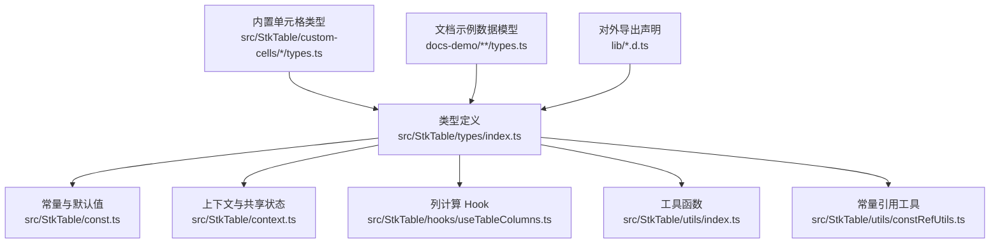
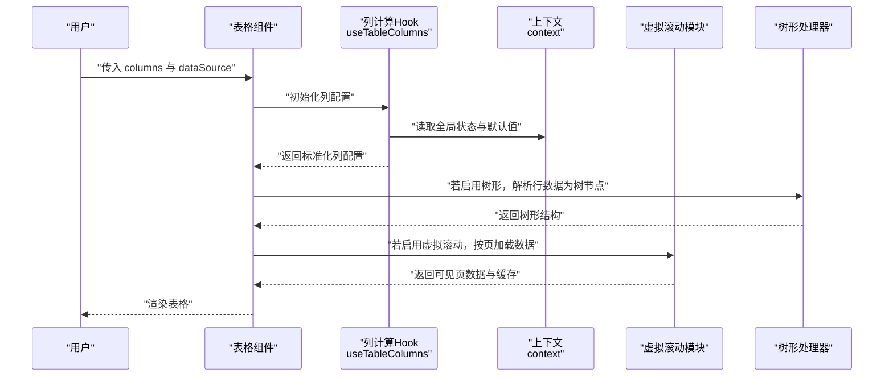
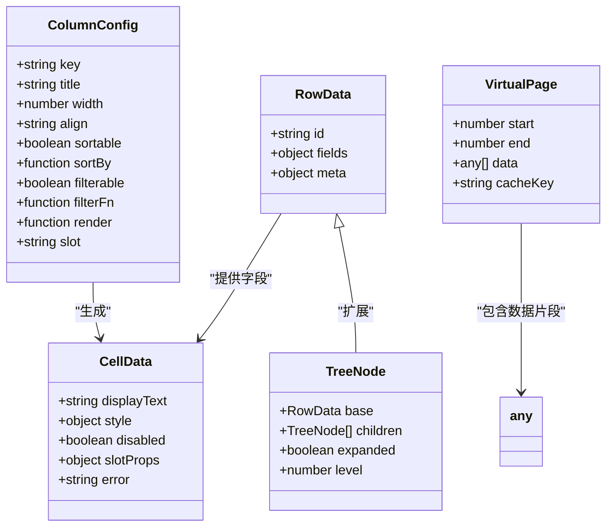
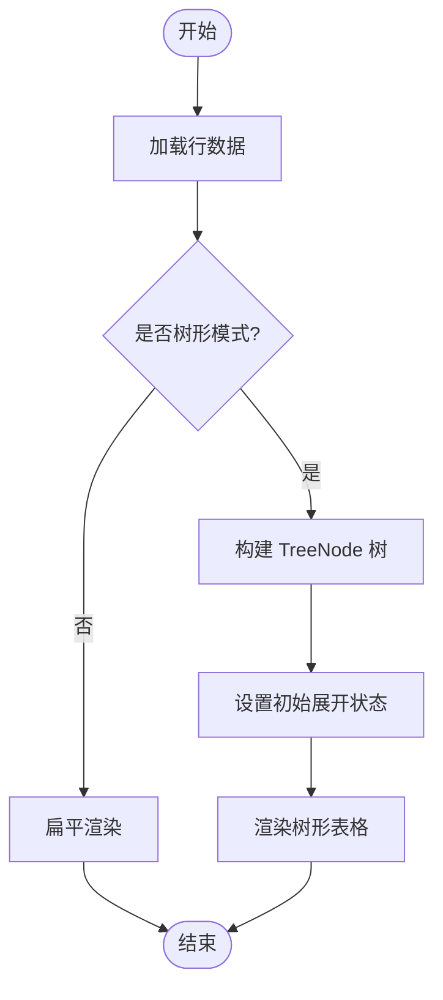
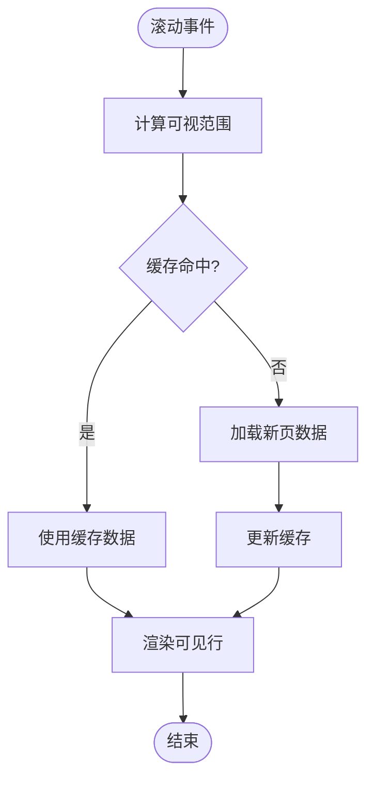
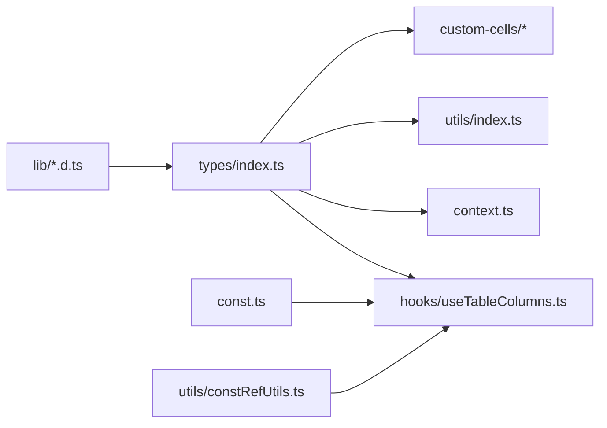

# 数据模型

<cite>
**本文引用的文件**   
- [src/StkTable/types/index.ts](file://src/StkTable/types/index.ts)
- [src/StkTable/const.ts](file://src/StkTable/const.ts)
- [src/StkTable/context.ts](file://src/StkTable/context.ts)
- [src/StkTable/hooks/useTableColumns.ts](file://src/StkTable/hooks/useTableColumns.ts)
- [src/StkTable/utils/index.ts](file://src/StkTable/utils/index.ts)
- [src/StkTable/utils/constRefUtils.ts](file://src/StkTable/utils/constRefUtils.ts)
- [src/StkTable/components/index.tsx](file://src/StkTable/components/index.tsx)
- [src/StkTable/custom-cells/FilterCell/types.ts](file://src/StkTable/custom-cells/FilterCell/types.ts)
- [src/StkTable/custom-cells/EditableCell/index.tsx](file://src/StkTable/custom-cells/EditableCell/index.tsx)
- [src/StkTable/custom-cells/CheckboxCell/index.tsx](file://src/StkTable/custom-cells/CheckboxCell/index.tsx)
- [docs-demo/basic/tree/config.ts](file://docs-demo/basic/tree/config.ts)
- [docs-demo/basic/tree/Tree.tsx](file://docs-demo/basic/tree/Tree.tsx)
- [docs-demo/basic/tree/TreeVirtualList.tsx](file://docs-demo/basic/tree/TreeVirtualList.tsx)
- [docs-demo/basic/merge-cells/MergeCellsRowVirtua1/dataSource.ts](file://docs-demo/basic/merge-cells/MergeCellsRowVirtua1/dataSource.ts)
- [docs-demo/demos/HugeData/mockData.ts](file://docs-demo/demos/HugeData/mockData.ts)
- [docs-demo/demos/HugeData/types.ts](file://docs-demo/demos/HugeData/types.ts)
- [docs-demo/demos/VirtualList/types.ts](file://docs-demo/demos/VirtualList/types.ts)
- [docs-demo/advanced/auto-height-virtual/AutoHeightVirtual/types.ts](file://docs-demo/advanced/auto-height-virtual/AutoHeightVirtual/types.ts)
- [docs-demo/advanced/auto-height-virtual/PretextAutoHeight/types.ts](file://docs-demo/advanced/auto-height-virtual/PretextAutoHeight/types.ts)
- [lib/index.d.ts](file://lib/index.d.ts)
- [lib/StkTable.d.ts](file://lib/StkTable.d.ts)
</cite>

## 目录
1. [简介](#简介)
2. [项目结构](#项目结构)
3. [核心组件](#核心组件)
4. [架构总览](#架构总览)
5. [详细组件分析](#详细组件分析)
6. [依赖关系分析](#依赖关系分析)
7. [性能考量](#性能考量)
8. [故障排查指南](#故障排查指南)
9. [结论](#结论)
10. [附录](#附录)

## 简介
本文件聚焦 StkTable React 的数据模型，围绕表格的核心数据结构与类型定义展开，包括行数据 RowData、列配置 ColumnConfig、单元格数据 CellData 等关键类型；阐述数据的输入格式、验证规则与转换机制；解释树形数据的层级结构与父子关系处理；说明虚拟滚动中的分页与缓存策略；并通过 TypeScript 接口设计展示数据模型的设计思路。同时提供数据绑定模式、状态同步机制与性能优化建议，并给出常见数据处理场景的最佳实践示例路径。

## 项目结构
StkTable 的数据模型主要分布在以下位置：
- 类型定义：src/StkTable/types/index.ts
- 常量与默认值：src/StkTable/const.ts
- 上下文与共享状态：src/StkTable/context.ts
- 列计算 Hook：src/StkTable/hooks/useTableColumns.ts
- 工具函数（含常量引用）：src/StkTable/utils/index.ts、src/StkTable/utils/constRefUtils.ts
- 内置自定义单元格（编辑、复选、过滤）：src/StkTable/custom-cells/*
- 文档演示（树、合并、虚拟列表、海量数据）：docs-demo/*
- 对外导出类型声明：lib/*.d.ts

图表来源
- [src/StkTable/types/index.ts](file://src/StkTable/types/index.ts)
- [src/StkTable/const.ts](file://src/StkTable/const.ts)
- [src/StkTable/context.ts](file://src/StkTable/context.ts)
- [src/StkTable/hooks/useTableColumns.ts](file://src/StkTable/hooks/useTableColumns.ts)
- [src/StkTable/utils/index.ts](file://src/StkTable/utils/index.ts)
- [src/StkTable/utils/constRefUtils.ts](file://src/StkTable/utils/constRefUtils.ts)
- [src/StkTable/custom-cells/FilterCell/types.ts](file://src/StkTable/custom-cells/FilterCell/types.ts)
- [docs-demo/demos/HugeData/types.ts](file://docs-demo/demos/HugeData/types.ts)
- [docs-demo/demos/VirtualList/types.ts](file://docs-demo/demos/VirtualList/types.ts)
- [lib/index.d.ts](file://lib/index.d.ts)

章节来源
- [src/StkTable/types/index.ts](file://src/StkTable/types/index.ts)
- [src/StkTable/const.ts](file://src/StkTable/const.ts)
- [src/StkTable/context.ts](file://src/StkTable/context.ts)
- [src/StkTable/hooks/useTableColumns.ts](file://src/StkTable/hooks/useTableColumns.ts)
- [src/StkTable/utils/index.ts](file://src/StkTable/utils/index.ts)
- [src/StkTable/utils/constRefUtils.ts](file://src/StkTable/utils/constRefUtils.ts)
- [src/StkTable/custom-cells/FilterCell/types.ts](file://src/StkTable/custom-cells/FilterCell/types.ts)
- [docs-demo/demos/HugeData/types.ts](file://docs-demo/demos/HugeData/types.ts)
- [docs-demo/demos/VirtualList/types.ts](file://docs-demo/demos/VirtualList/types.ts)
- [lib/index.d.ts](file://lib/index.d.ts)

## 核心组件
本节从数据模型角度梳理 StkTable 的关键类型与职责边界：
- RowData：表示一行数据的通用结构，通常包含唯一标识、字段值集合以及可选的扩展元信息（如是否可展开、是否选中、排序权重等）。
- ColumnConfig：描述列的配置，包括列键、标题、宽度、对齐、排序、过滤、渲染器、格式化器等。
- CellData：单元格的渲染数据，由 RowData 与 ColumnConfig 组合生成，可能包含显示文本、样式、禁用态、插槽信息等。
- TreeNode：树形节点数据，除基础字段外，还包含 children 子节点集合及展开状态等控制字段。
- VirtualPage：虚拟滚动分页单元，用于在大数据量下按页加载与缓存可见区域数据。

这些类型通过上下文与 Hook 进行装配，形成“列配置 + 行数据 → 单元格数据”的转换链路，并在树形与虚拟滚动场景下进行特殊处理。

章节来源
- [src/StkTable/types/index.ts](file://src/StkTable/types/index.ts)
- [src/StkTable/context.ts](file://src/StkTable/context.ts)
- [src/StkTable/hooks/useTableColumns.ts](file://src/StkTable/hooks/useTableColumns.ts)

## 架构总览
下图展示了数据模型在表格运行时的流转关系：外部传入的列配置与行数据进入列计算 Hook，结合上下文中的全局状态（主题、国际化、事件总线等），生成最终的单元格数据；在树形模式下，行数据被解析为树节点并按需展开；在虚拟滚动模式下，数据按页切分并缓存可见区域，减少重排与重绘。

图表来源
- [src/StkTable/hooks/useTableColumns.ts](file://src/StkTable/hooks/useTableColumns.ts)
- [src/StkTable/context.ts](file://src/StkTable/context.ts)
- [src/StkTable/types/index.ts](file://src/StkTable/types/index.ts)

## 详细组件分析

### 类型体系与数据模型
- RowData
  - 作用：承载单行数据，作为表格的最小数据单元。
  - 关键字段：唯一标识（id/key）、字段映射（key→value）、扩展元信息（如 expandable、selected、disabled 等）。
  - 约束：唯一标识应稳定且不可变，避免频繁变更导致渲染异常。
- ColumnConfig
  - 作用：描述列的展示与交互行为。
  - 关键字段：列键（key）、标题（title）、宽度（width）、对齐（align）、排序（sortable/sortBy）、过滤（filterable/filterFn）、渲染器（render/format）、插槽（slot）等。
  - 约束：key 必须唯一；sort/filter/render 等回调应避免副作用或确保幂等。
- CellData
  - 作用：由 RowData 与 ColumnConfig 组合生成的最终渲染数据。
  - 关键字段：显示文本（displayText）、样式（style/class）、禁用态（disabled）、插槽参数（slotProps）、校验错误（error）等。
  - 生成流程：列配置决定如何从行数据中提取与格式化字段，再根据上下文状态（如主题、国际化）进行二次加工。
- TreeNode
  - 作用：树形结构的节点数据。
  - 关键字段：基础字段（继承自 RowData）、children（子节点数组）、expanded（展开状态）、level（层级深度）等。
  - 父子关系：通过 children 递归组织；展开状态可由父节点控制子节点的可见性。
- VirtualPage
  - 作用：虚拟滚动的分页单元。
  - 关键字段：起始索引（start）、结束索引（end）、数据片段（data）、缓存键（cacheKey）等。
  - 策略：按可视窗口大小与行高估算每页范围，命中缓存则直接复用，未命中则按需加载。

图表来源
- [src/StkTable/types/index.ts](file://src/StkTable/types/index.ts)

章节来源
- [src/StkTable/types/index.ts](file://src/StkTable/types/index.ts)

### 数据输入格式与验证规则
- 输入格式
  - dataSource：数组形式，元素为 RowData；树形模式下元素为 TreeNode。
  - columns：数组形式，元素为 ColumnConfig。
- 验证规则
  - 唯一性：RowData.id 与 ColumnConfig.key 必须唯一。
  - 必填性：ColumnConfig.title 与 RowData.id 为必需字段。
  - 类型一致性：sortBy 与 filterFn 的参数类型应与 RowData.fields 对应字段一致。
  - 稳定性：id 与 key 不应在渲染周期内变化。
- 转换机制
  - 列计算：useTableColumns 将 ColumnConfig 标准化，合并默认值与上下文配置。
  - 单元格生成：遍历 RowData 与 ColumnConfig，调用 render/format 生成 CellData。
  - 树形转换：将扁平 RowData 转换为 TreeNode 树结构，维护展开状态。
  - 虚拟分页：根据可视区域与行高估算 VirtualPage，命中缓存则复用。

章节来源
- [src/StkTable/hooks/useTableColumns.ts](file://src/StkTable/hooks/useTableColumns.ts)
- [src/StkTable/utils/index.ts](file://src/StkTable/utils/index.ts)
- [src/StkTable/const.ts](file://src/StkTable/const.ts)

### 树形数据的层级结构与父子关系
- 层级定义
  - TreeNode.children 为子节点数组，支持多层嵌套。
  - expanded 控制当前节点是否展开；level 表示节点深度。
- 父子关系处理
  - 展开逻辑：父节点展开时，其子节点可见；折叠时隐藏。
  - 选择联动：可选择是否启用父子选择联动（全选/半选）。
  - 排序与过滤：可在父级或叶子级应用，注意对子树的传播策略。
- 最佳实践
  - 使用稳定的 id 作为节点标识，避免重排。
  - 懒加载子节点：在展开时按需请求子树数据，提升性能。
  - 控制展开深度：默认展开层数可通过配置限制，避免一次性渲染过深。

图表来源
- [src/StkTable/types/index.ts](file://src/StkTable/types/index.ts)
- [docs-demo/basic/tree/config.ts](file://docs-demo/basic/tree/config.ts)
- [docs-demo/basic/tree/Tree.tsx](file://docs-demo/basic/tree/Tree.tsx)
- [docs-demo/basic/tree/TreeVirtualList.tsx](file://docs-demo/basic/tree/TreeVirtualList.tsx)

章节来源
- [docs-demo/basic/tree/config.ts](file://docs-demo/basic/tree/config.ts)
- [docs-demo/basic/tree/Tree.tsx](file://docs-demo/basic/tree/Tree.tsx)
- [docs-demo/basic/tree/TreeVirtualList.tsx](file://docs-demo/basic/tree/TreeVirtualList.tsx)

### 虚拟滚动中的数据分页与缓存策略
- 分页策略
  - 基于可视高度与预估行高计算每页起止索引（start/end）。
  - 当滚动超出当前页范围时，触发下一页加载或预取。
- 缓存策略
  - 以 VirtualPage.cacheKey 为键缓存已加载的数据片段。
  - 缓存容量受内存限制，可按 LRU 策略淘汰旧页。
- 性能优化
  - 固定行高或使用行高估计器，提高分页精度。
  - 合并相邻页以减少重复渲染。
  - 避免在 render 中创建新对象，保持引用稳定。

图表来源
- [src/StkTable/types/index.ts](file://src/StkTable/types/index.ts)
- [docs-demo/demos/VirtualList/types.ts](file://docs-demo/demos/VirtualList/types.ts)
- [docs-demo/demos/HugeData/mockData.ts](file://docs-demo/demos/HugeData/mockData.ts)

章节来源
- [docs-demo/demos/VirtualList/types.ts](file://docs-demo/demos/VirtualList/types.ts)
- [docs-demo/demos/HugeData/mockData.ts](file://docs-demo/demos/HugeData/mockData.ts)

### 数据绑定模式与状态同步
- 受控与非受控
  - 受控模式：dataSource 与 columns 由外部状态驱动，内部仅发出变更事件。
  - 非受控模式：内部维护默认状态，适合简单场景。
- 状态同步
  - 通过 context 暴露全局状态（如主题、国际化、事件总线），各组件订阅更新。
  - 列计算 Hook 在依赖变化时重新计算，保证列配置与行数据的一致性。
- 最佳实践
  - 使用 useMemo 缓存列配置与行数据转换结果。
  - 避免在 render 中创建新回调，使用 useCallback 包裹。
  - 对大对象使用浅比较或结构化克隆，减少不必要的重渲染。

章节来源
- [src/StkTable/context.ts](file://src/StkTable/context.ts)
- [src/StkTable/hooks/useTableColumns.ts](file://src/StkTable/hooks/useTableColumns.ts)
- [src/StkTable/utils/constRefUtils.ts](file://src/StkTable/utils/constRefUtils.ts)

### 内置单元格与数据模型集成
- 可编辑单元格
  - 输入：CellData 与行数据引用。
  - 输出：提交后更新 RowData.fields，触发表格刷新。
  - 校验：在失焦或提交时执行，错误信息写入 CellData.error。
- 复选框单元格
  - 输入：选中状态与切换回调。
  - 输出：更新 RowData.meta.selected，支持批量操作。
- 过滤单元格
  - 输入：过滤条件与重置回调。
  - 输出：更新全局过滤状态，影响列计算与数据展示。

章节来源
- [src/StkTable/custom-cells/EditableCell/index.tsx](file://src/StkTable/custom-cells/EditableCell/index.tsx)
- [src/StkTable/custom-cells/CheckboxCell/index.tsx](file://src/StkTable/custom-cells/CheckboxCell/index.tsx)
- [src/StkTable/custom-cells/FilterCell/types.ts](file://src/StkTable/custom-cells/FilterCell/types.ts)

### 实际数据结构示例与最佳实践
- 树形数据示例
  - 参考路径：[docs-demo/basic/tree/config.ts](file://docs-demo/basic/tree/config.ts)、[docs-demo/basic/tree/Tree.tsx](file://docs-demo/basic/tree/Tree.tsx)
  - 要点：使用稳定的 id，合理设置 expanded 与 children。
- 合并单元格数据示例
  - 参考路径：[docs-demo/basic/merge-cells/MergeCellsRowVirtua1/dataSource.ts](file://docs-demo/basic/merge-cells/MergeCellsRowVirtua1/dataSource.ts)
  - 要点：明确合并范围，避免重叠与越界。
- 海量数据与虚拟列表示例
  - 参考路径：[docs-demo/demos/HugeData/mockData.ts](file://docs-demo/demos/HugeData/mockData.ts)、[docs-demo/demos/HugeData/types.ts](file://docs-demo/demos/HugeData/types.ts)、[docs-demo/demos/VirtualList/types.ts](file://docs-demo/demos/VirtualList/types.ts)
  - 要点：分页加载、缓存命中、行高估计。
- 自动高度与虚拟滚动示例
  - 参考路径：[docs-demo/advanced/auto-height-virtual/AutoHeightVirtual/types.ts](file://docs-demo/advanced/auto-height-virtual/AutoHeightVirtual/types.ts)、[docs-demo/advanced/auto-height-virtual/PretextAutoHeight/types.ts](file://docs-demo/advanced/auto-height-virtual/PretextAutoHeight/types.ts)
  - 要点：动态行高与虚拟滚动的兼容性处理。

章节来源
- [docs-demo/basic/tree/config.ts](file://docs-demo/basic/tree/config.ts)
- [docs-demo/basic/tree/Tree.tsx](file://docs-demo/basic/tree/Tree.tsx)
- [docs-demo/basic/merge-cells/MergeCellsRowVirtua1/dataSource.ts](file://docs-demo/basic/merge-cells/MergeCellsRowVirtua1/dataSource.ts)
- [docs-demo/demos/HugeData/mockData.ts](file://docs-demo/demos/HugeData/mockData.ts)
- [docs-demo/demos/HugeData/types.ts](file://docs-demo/demos/HugeData/types.ts)
- [docs-demo/demos/VirtualList/types.ts](file://docs-demo/demos/VirtualList/types.ts)
- [docs-demo/advanced/auto-height-virtual/AutoHeightVirtual/types.ts](file://docs-demo/advanced/auto-height-virtual/AutoHeightVirtual/types.ts)
- [docs-demo/advanced/auto-height-virtual/PretextAutoHeight/types.ts](file://docs-demo/advanced/auto-height-virtual/PretextAutoHeight/types.ts)

## 依赖关系分析
- 类型依赖
  - types/index.ts 为核心类型源，被 context、hooks、utils 与自定义单元格广泛引用。
- 运行时依赖
  - useTableColumns 依赖 const 与 utils，负责列配置的标准化与合并。
  - context 提供全局状态，供各组件与 Hook 订阅。
- 外部依赖
  - lib/*.d.ts 导出公共类型，供上层应用消费。

图表来源
- [src/StkTable/types/index.ts](file://src/StkTable/types/index.ts)
- [src/StkTable/hooks/useTableColumns.ts](file://src/StkTable/hooks/useTableColumns.ts)
- [src/StkTable/context.ts](file://src/StkTable/context.ts)
- [src/StkTable/utils/index.ts](file://src/StkTable/utils/index.ts)
- [src/StkTable/utils/constRefUtils.ts](file://src/StkTable/utils/constRefUtils.ts)
- [src/StkTable/const.ts](file://src/StkTable/const.ts)
- [lib/index.d.ts](file://lib/index.d.ts)

章节来源
- [src/StkTable/types/index.ts](file://src/StkTable/types/index.ts)
- [src/StkTable/hooks/useTableColumns.ts](file://src/StkTable/hooks/useTableColumns.ts)
- [src/StkTable/context.ts](file://src/StkTable/context.ts)
- [src/StkTable/utils/index.ts](file://src/StkTable/utils/index.ts)
- [src/StkTable/utils/constRefUtils.ts](file://src/StkTable/utils/constRefUtils.ts)
- [src/StkTable/const.ts](file://src/StkTable/const.ts)
- [lib/index.d.ts](file://lib/index.d.ts)

## 性能考量
- 列配置与行数据转换
  - 使用 useMemo 缓存列计算结果，避免每次渲染重新计算。
  - 对 render/format 回调使用 useCallback，保持引用稳定。
- 树形渲染
  - 控制默认展开深度，避免一次性渲染过深树。
  - 懒加载子节点，仅在展开时请求数据。
- 虚拟滚动
  - 固定行高或使用行高估计器，提高分页精度。
  - 合理设置缓存容量，避免内存泄漏。
- 状态同步
  - 使用浅比较或结构化克隆，减少不必要的重渲染。
  - 避免在 render 中创建新对象或函数。

## 故障排查指南
- 常见问题
  - 唯一标识冲突：检查 RowData.id 与 ColumnConfig.key 的唯一性。
  - 树形展开异常：确认 TreeNode.children 与 expanded 的状态管理是否正确。
  - 虚拟滚动错位：核对行高估计与可视高度计算逻辑。
- 调试建议
  - 打印列计算中间结果，定位格式化问题。
  - 使用浏览器性能面板分析重渲染热点。
  - 对大数据集进行抽样测试，观察内存占用与帧率。

## 结论
StkTable 的数据模型以类型为中心，通过列配置与行数据的组合生成单元格数据，并在树形与虚拟滚动场景下进行专门处理。遵循唯一性与稳定性原则，合理使用缓存与懒加载，可有效提升性能与用户体验。建议在复杂场景中采用受控模式与细粒度状态管理，确保数据流清晰可控。

## 附录
- 对外导出类型声明参考路径：
  - [lib/index.d.ts](file://lib/index.d.ts)
  - [lib/StkTable.d.ts](file://lib/StkTable.d.ts)