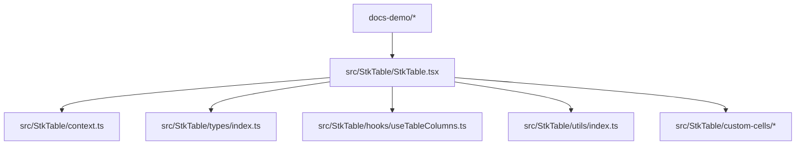
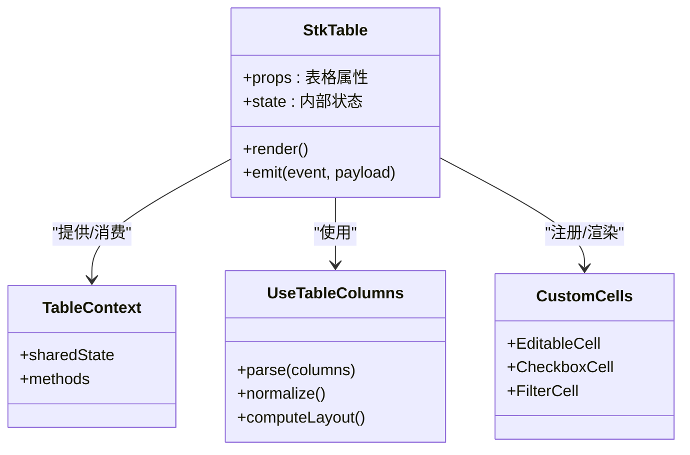
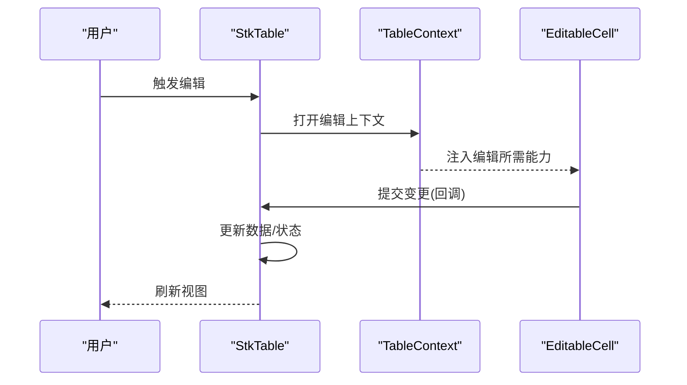
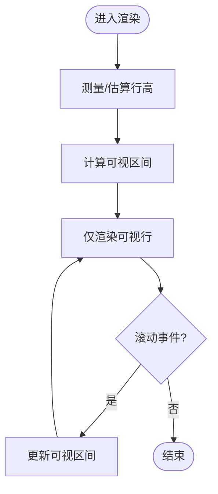
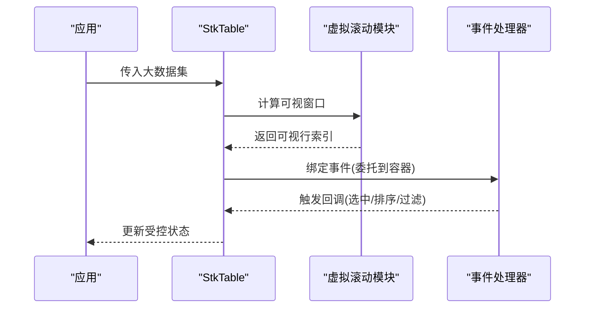
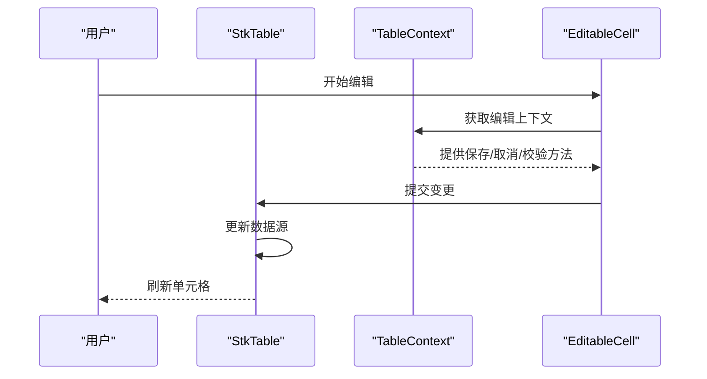
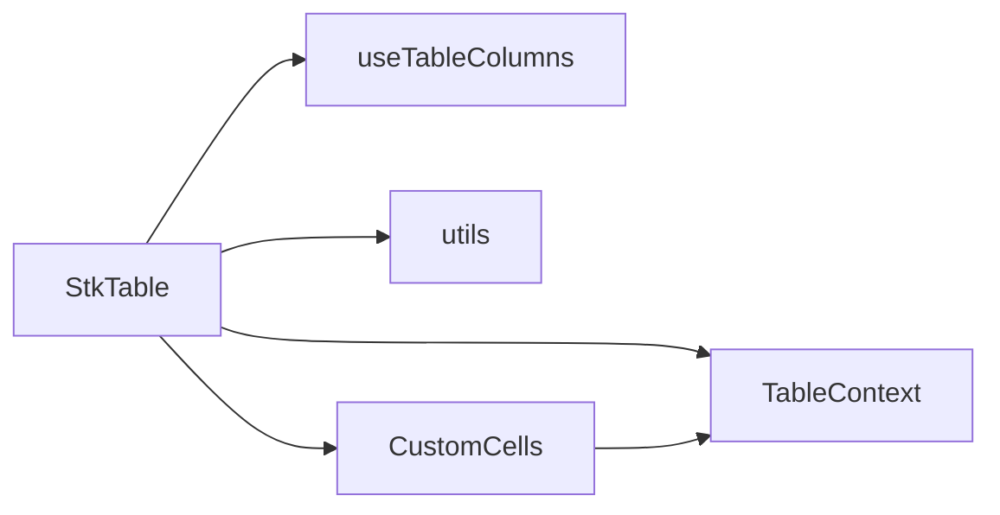

# 核心概念

<cite>
**本文引用的文件**
- [src/StkTable/StkTable.tsx](file://src/StkTable/StkTable.tsx)
- [src/StkTable/context.ts](file://src/StkTable/context.ts)
- [src/StkTable/types/index.ts](file://src/StkTable/types/index.ts)
- [src/StkTable/hooks/useTableColumns.ts](file://src/StkTable/hooks/useTableColumns.ts)
- [src/StkTable/utils/index.ts](file://src/StkTable/utils/index.ts)
- [src/StkTable/custom-cells/EditableCell/index.tsx](file://src/StkTable/custom-cells/EditableCell/index.tsx)
- [src/StkTable/custom-cells/CheckboxCell/index.tsx](file://src/StkTable/custom-cells/CheckboxCell/index.tsx)
- [src/StkTable/custom-cells/FilterCell/index.tsx](file://src/StkTable/custom-cells/FilterCell/index.tsx)
- [docs-demo/basic/fixed/FixedVirtual.tsx](file://docs-demo/basic/fixed/FixedVirtual.tsx)
- [docs-demo/advanced/virtual/VirtualY.tsx](file://docs-demo/advanced/virtual/VirtualY.tsx)
- [docs-demo/advanced/auto-height-virtual/AutoHeightVirtual/index.tsx](file://docs-demo/advanced/auto-height-virtual/AutoHeightVirtual/index.tsx)
- [docs-demo/demos/HugeData/index.tsx](file://docs-demo/demos/HugeData/index.tsx)
- [docs-demo/demos/cell-edit/index.tsx](file://docs-demo/demos/cell-edit/index.tsx)
</cite>

## 目录
1. [引言](#引言)
2. [项目结构](#项目结构)
3. [核心组件与数据模型](#核心组件与数据模型)
4. [架构总览](#架构总览)
5. [详细组件分析](#详细组件分析)
6. [依赖关系分析](#依赖关系分析)
7. [性能考量](#性能考量)
8. [故障排查指南](#故障排查指南)
9. [结论](#结论)
10. [附录：最佳实践与常见陷阱](#附录最佳实践与常见陷阱)

## 引言
本文件聚焦 StkTable React 的核心概念与设计模式，围绕以下主题展开：
- 表格的数据模型与列配置系统
- 事件处理机制与状态管理
- 虚拟滚动实现原理与性能优化策略
- 组件上下文（Context）架构与生命周期管理
- 类型系统设计思路与 TypeScript 集成方式
- 通过示例路径展示关键概念的实际应用
- 面向初学者的概念解释与面向高级开发者的实现细节
- 最佳实践建议与常见陷阱避免方法

## 项目结构
仓库采用“源码 + 文档演示 + 构建产物”的分层组织方式：
- src/StkTable：核心库源码，包含主组件、类型定义、上下文、钩子、工具函数与内置自定义单元格
- docs-demo：基于 VitePress 的文档与示例，覆盖基础用法、高级特性与复杂场景
- lib：打包后的声明与样式等产物
- test：单元测试与构建验证

图表来源
- [src/StkTable/StkTable.tsx](file://src/StkTable/StkTable.tsx)
- [src/StkTable/context.ts](file://src/StkTable/context.ts)
- [src/StkTable/types/index.ts](file://src/StkTable/types/index.ts)
- [src/StkTable/hooks/useTableColumns.ts](file://src/StkTable/hooks/useTableColumns.ts)
- [src/StkTable/utils/index.ts](file://src/StkTable/utils/index.ts)

章节来源
- [src/StkTable/StkTable.tsx](file://src/StkTable/StkTable.tsx)
- [src/StkTable/context.ts](file://src/StkTable/context.ts)
- [src/StkTable/types/index.ts](file://src/StkTable/types/index.ts)
- [src/StkTable/hooks/useTableColumns.ts](file://src/StkTable/hooks/useTableColumns.ts)
- [src/StkTable/utils/index.ts](file://src/StkTable/utils/index.ts)

## 核心组件与数据模型
StkTable 的核心由“表头/行/单元格渲染管线 + 列配置 + 数据模型 + 事件总线 + 上下文”构成。

- 数据模型
  - 行数据：以数组形式提供，每行需具备稳定 key（推荐唯一 id），用于高效更新与虚拟滚动定位
  - 列配置：描述列的字段映射、排序、过滤、宽度、对齐、可编辑、树形节点等元信息
  - 视图状态：当前可见范围、选中态、展开态、排序/过滤结果、滚动位置等

- 列配置系统
  - 支持多级表头、合并单元格、固定列、自适应宽度、自定义渲染插槽
  - 通过统一列接口聚合显示逻辑与交互能力，便于复用与组合

- 事件处理机制
  - 行/列/单元格级事件（点击、双击、悬停、拖拽、键盘导航等）
  - 统一事件派发与冒泡控制，避免重复计算与不必要的重渲染

- 状态管理
  - 内部状态：滚动位置、可视区域、选中项、展开项、排序/过滤结果
  - 外部可控状态：受控 props 与回调配合，上层业务负责持久化与同步

章节来源
- [src/StkTable/StkTable.tsx](file://src/StkTable/StkTable.tsx)
- [src/StkTable/types/index.ts](file://src/StkTable/types/index.ts)
- [src/StkTable/hooks/useTableColumns.ts](file://src/StkTable/hooks/useTableColumns.ts)

## 架构总览
StkTable 采用“上下文驱动 + 钩子编排 + 组件拼装”的架构：
- 上下文（Context）承载全局共享状态与能力（如主题、国际化、选择器、滚动容器等）
- 钩子封装复杂逻辑（如列解析、尺寸计算、虚拟窗口计算）
- 组件按职责拆分（表头、行、单元格、滚动容器、工具栏等）

图表来源
- [src/StkTable/StkTable.tsx](file://src/StkTable/StkTable.tsx)
- [src/StkTable/context.ts](file://src/StkTable/context.ts)
- [src/StkTable/hooks/useTableColumns.ts](file://src/StkTable/hooks/useTableColumns.ts)
- [src/StkTable/custom-cells/EditableCell/index.tsx](file://src/StkTable/custom-cells/EditableCell/index.tsx)
- [src/StkTable/custom-cells/CheckboxCell/index.tsx](file://src/StkTable/custom-cells/CheckboxCell/index.tsx)
- [src/StkTable/custom-cells/FilterCell/index.tsx](file://src/StkTable/custom-cells/FilterCell/index.tsx)

## 详细组件分析

### 主组件 StkTable
- 职责
  - 接收并校验 props（数据、列、分页、排序、过滤、虚拟滚动开关等）
  - 维护内部状态（可视窗口、选中、展开、排序/过滤结果）
  - 通过 Context 暴露能力给子组件
  - 协调各子系统（列布局、滚动、渲染管线）
- 关键点
  - 对大数据集启用虚拟滚动时，仅渲染可视区行
  - 对固定列/冻结头部进行独立渲染与滚动同步
  - 对外暴露事件回调与 expose API，供上层调用

章节来源
- [src/StkTable/StkTable.tsx](file://src/StkTable/StkTable.tsx)

### 上下文 TableContext
- 职责
  - 集中管理跨层级共享的状态与方法（如主题、国际化、选择器、滚动容器引用等）
  - 为子组件提供统一的访问入口，降低 prop drilling
- 设计要点
  - 将频繁变更的状态拆分为多个 context 或 memo 值，减少不必要重渲染
  - 提供稳定的方法引用，避免子组件因函数变化而重渲染

章节来源
- [src/StkTable/context.ts](file://src/StkTable/context.ts)

### 列解析与布局 useTableColumns
- 职责
  - 解析列配置，生成扁平/树形列结构
  - 计算列宽、对齐、合并规则、固定列边界
  - 输出最终渲染所需的列元数据
- 复杂度
  - 列解析通常为 O(n)，布局计算与合并规则可能引入额外开销，应缓存中间结果

章节来源
- [src/StkTable/hooks/useTableColumns.ts](file://src/StkTable/hooks/useTableColumns.ts)

### 工具函数 utils/index
- 职责
  - 提供通用工具：深比较、防抖节流、尺寸测量、坐标转换、事件辅助等
- 性能
  - 对高频调用函数做缓存与惰性初始化

章节来源
- [src/StkTable/utils/index.ts](file://src/StkTable/utils/index.ts)

### 内置自定义单元格
- EditableCell
  - 支持行内编辑、失焦保存、键盘导航、撤销/重做扩展点
  - 与表格选择、校验、批量操作联动
- CheckboxCell
  - 多选框渲染与全选联动，支持不可选态与禁用态
- FilterCell
  - 列级筛选面板，支持多条件、远程筛选、筛选状态持久化

图表来源
- [src/StkTable/custom-cells/EditableCell/index.tsx](file://src/StkTable/custom-cells/EditableCell/index.tsx)
- [src/StkTable/context.ts](file://src/StkTable/context.ts)
- [src/StkTable/StkTable.tsx](file://src/StkTable/StkTable.tsx)

章节来源
- [src/StkTable/custom-cells/EditableCell/index.tsx](file://src/StkTable/custom-cells/EditableCell/index.tsx)
- [src/StkTable/custom-cells/CheckboxCell/index.tsx](file://src/StkTable/custom-cells/CheckboxCell/index.tsx)
- [src/StkTable/custom-cells/FilterCell/index.tsx](file://src/StkTable/custom-cells/FilterCell/index.tsx)

### 虚拟滚动与自动高度
- 垂直虚拟滚动
  - 根据滚动位置与行高估算可视区间，仅渲染该区间内的行
  - 通过占位容器维持整体滚动高度
- 水平虚拟滚动
  - 针对超宽表格，仅渲染可视列，提升横向滚动性能
- 自动高度虚拟列表
  - 动态测量行高，结合增量更新与懒加载，适配内容高度不定的场景

图表来源
- [docs-demo/advanced/virtual/VirtualY.tsx](file://docs-demo/advanced/virtual/VirtualY.tsx)
- [docs-demo/basic/fixed/FixedVirtual.tsx](file://docs-demo/basic/fixed/FixedVirtual.tsx)
- [docs-demo/advanced/auto-height-virtual/AutoHeightVirtual/index.tsx](file://docs-demo/advanced/auto-height-virtual/AutoHeightVirtual/index.tsx)

章节来源
- [docs-demo/advanced/virtual/VirtualY.tsx](file://docs-demo/advanced/virtual/VirtualY.tsx)
- [docs-demo/basic/fixed/FixedVirtual.tsx](file://docs-demo/basic/fixed/FixedVirtual.tsx)
- [docs-demo/advanced/auto-height-virtual/AutoHeightVirtual/index.tsx](file://docs-demo/advanced/auto-height-virtual/AutoHeightVirtual/index.tsx)

### 大型数据与事件流
- HugeData 示例展示了在海量数据下的渲染与交互优化
- 典型流程：数据切片 -> 可视区渲染 -> 事件委派 -> 局部更新

图表来源
- [docs-demo/demos/HugeData/index.tsx](file://docs-demo/demos/HugeData/index.tsx)
- [src/StkTable/StkTable.tsx](file://src/StkTable/StkTable.tsx)

章节来源
- [docs-demo/demos/HugeData/index.tsx](file://docs-demo/demos/HugeData/index.tsx)

### 单元格编辑与上下文协作
- 通过 Context 传递编辑能力，使 EditableCell 无需层层透传 props
- 支持表单校验、批量编辑、撤销/重做等扩展

图表来源
- [docs-demo/demos/cell-edit/index.tsx](file://docs-demo/demos/cell-edit/index.tsx)
- [src/StkTable/custom-cells/EditableCell/index.tsx](file://src/StkTable/custom-cells/EditableCell/index.tsx)
- [src/StkTable/context.ts](file://src/StkTable/context.ts)

章节来源
- [docs-demo/demos/cell-edit/index.tsx](file://docs-demo/demos/cell-edit/index.tsx)
- [src/StkTable/custom-cells/EditableCell/index.tsx](file://src/StkTable/custom-cells/EditableCell/index.tsx)
- [src/StkTable/context.ts](file://src/StkTable/context.ts)

## 依赖关系分析
- 组件耦合
  - StkTable 与 Context 强耦合，用于跨层级通信
  - 列解析钩子与工具函数松耦合，便于替换与测试
- 外部依赖
  - 虚拟滚动通常依赖第三方库或自研算法；固定列与冻结头部依赖 DOM 测量与滚动同步
- 循环依赖
  - 应避免在 Context 中直接引入主组件，防止循环依赖

图表来源
- [src/StkTable/StkTable.tsx](file://src/StkTable/StkTable.tsx)
- [src/StkTable/context.ts](file://src/StkTable/context.ts)
- [src/StkTable/hooks/useTableColumns.ts](file://src/StkTable/hooks/useTableColumns.ts)
- [src/StkTable/utils/index.ts](file://src/StkTable/utils/index.ts)
- [src/StkTable/custom-cells/EditableCell/index.tsx](file://src/StkTable/custom-cells/EditableCell/index.tsx)

章节来源
- [src/StkTable/StkTable.tsx](file://src/StkTable/StkTable.tsx)
- [src/StkTable/context.ts](file://src/StkTable/context.ts)
- [src/StkTable/hooks/useTableColumns.ts](file://src/StkTable/hooks/useTableColumns.ts)
- [src/StkTable/utils/index.ts](file://src/StkTable/utils/index.ts)
- [src/StkTable/custom-cells/EditableCell/index.tsx](file://src/StkTable/custom-cells/EditableCell/index.tsx)

## 性能考量
- 虚拟滚动
  - 行高稳定时可使用固定行高；行高不定时使用测量缓存与增量更新
  - 合理设置缓冲区域，减少滚动抖动
- 渲染优化
  - 使用 memo 包裹列渲染与单元格组件
  - 避免在列配置中创建新对象/函数导致重渲染
- 事件优化
  - 事件委托至容器，减少监听器数量
  - 对高频事件进行节流/防抖
- 内存占用
  - 及时释放大对象引用，避免闭包持有长生命周期引用
- 网络与数据
  - 远端分页/排序/过滤，服务端承担计算压力
  - 数据去重与稳定 key，确保 diff 高效

[本节为通用性能指导，不直接分析具体文件]

## 故障排查指南
- 常见问题
  - 行高不一致导致虚拟滚动错位：检查是否混用不同行高或未启用自适应测量
  - 固定列错位：确认容器宽度与滚动同步逻辑
  - 编辑后未刷新：检查提交回调是否正确更新受控状态
  - 性能退化：排查列配置中的不稳定引用与过度渲染
- 调试建议
  - 开启开发模式日志，观察渲染次数与耗时
  - 使用浏览器性能面板分析重排/重绘热点
  - 逐步关闭功能（如虚拟滚动、固定列）定位问题

[本节为通用排查指导，不直接分析具体文件]

## 结论
StkTable 通过清晰的上下文架构、可组合的列配置系统与高效的虚拟滚动方案，提供了高性能、可扩展的企业级表格能力。对于初学者，建议从基础用法入手，逐步掌握列配置与事件机制；对于高级开发者，可深入定制单元格、扩展上下文能力与优化渲染路径，以满足复杂业务需求。

[本节为总结性内容，不直接分析具体文件]

## 附录：最佳实践与常见陷阱
- 最佳实践
  - 为每行数据提供稳定且唯一的 key
  - 将列配置提升到组件外或使用 useMemo 缓存
  - 对大表格优先启用虚拟滚动与分页
  - 使用受控模式管理选中/展开/排序/过滤状态，保证数据一致性
  - 自定义单元格保持无副作用与纯渲染，复杂逻辑下沉到钩子
- 常见陷阱
  - 在列配置中创建新函数/对象导致子组件频繁重渲染
  - 忽略行高变化导致虚拟滚动错乱
  - 在事件回调中执行昂贵计算阻塞主线程
  - 过度嵌套自定义单元格导致渲染链过长

[本节为通用建议，不直接分析具体文件]