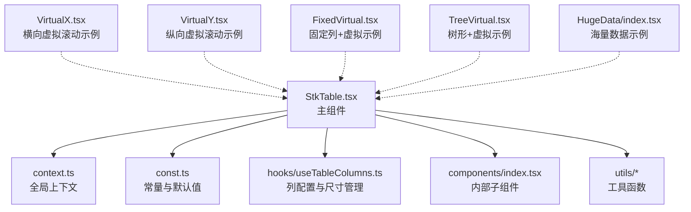
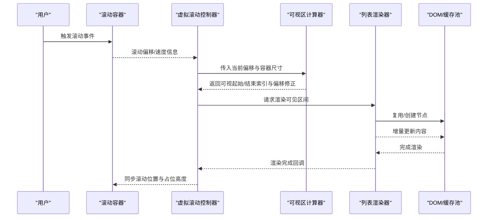
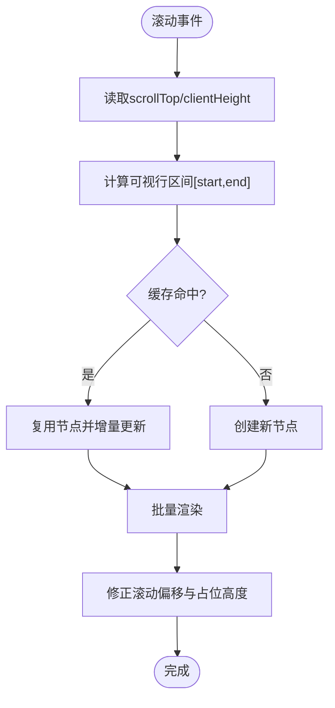
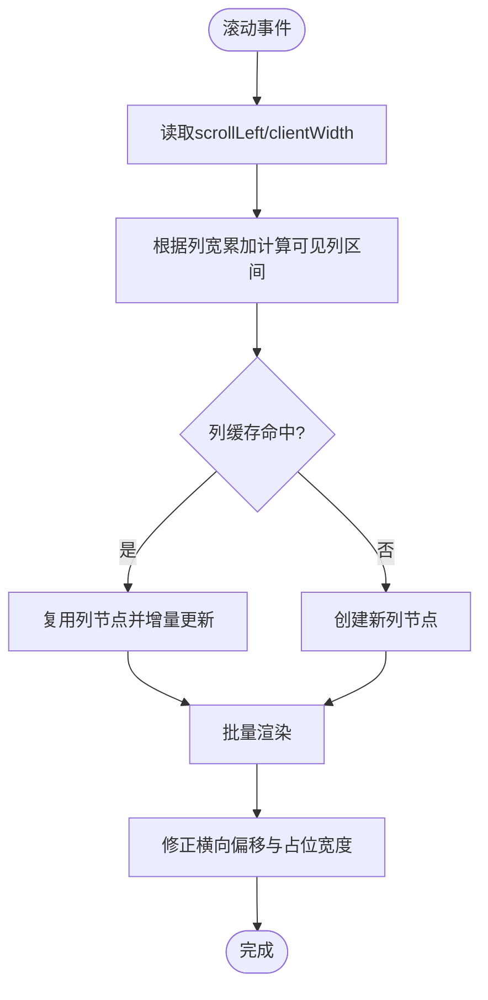
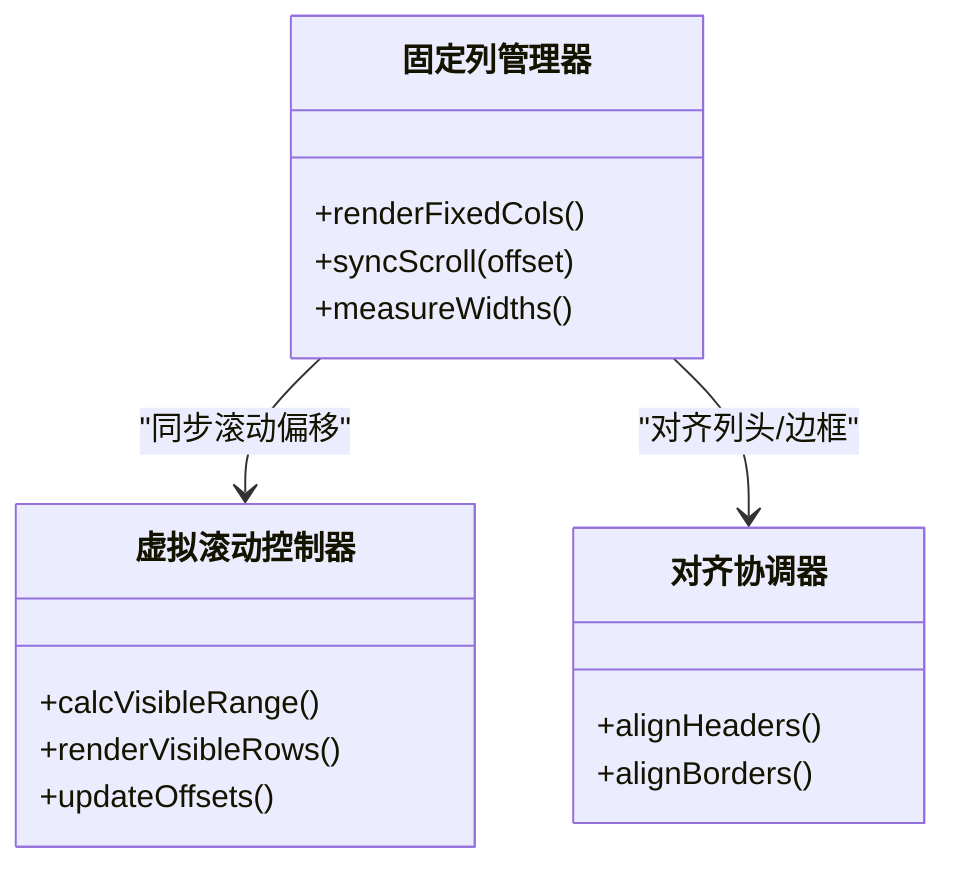
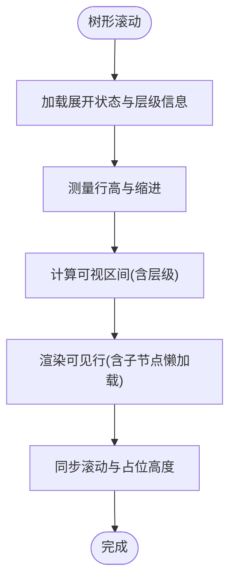
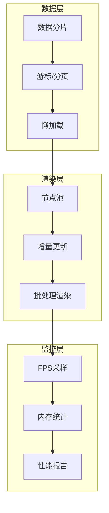
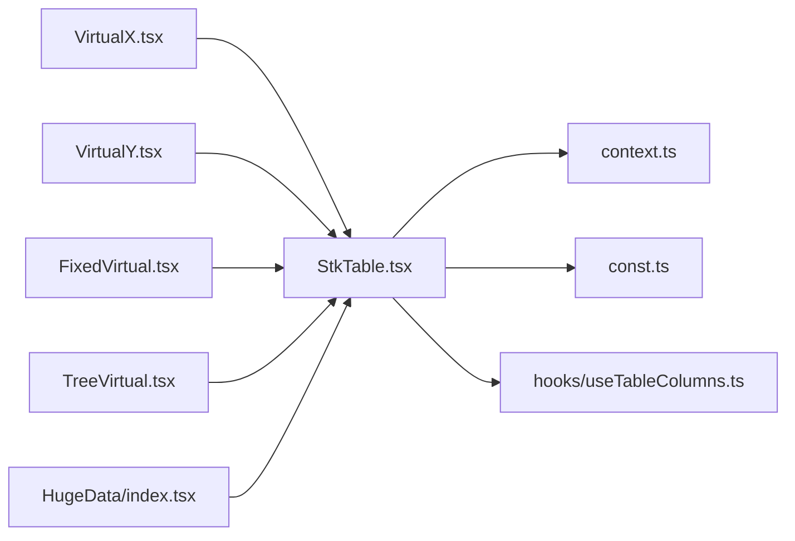

# 虚拟化引擎

<cite>
**本文引用的文件**
- [StkTable.tsx](file://src/StkTable/StkTable.tsx)
- [index.ts](file://src/StkTable/index.ts)
- [const.ts](file://src/StkTable/const.ts)
- [context.ts](file://src/StkTable/context.ts)
- [useTableColumns.ts](file://src/StkTable/hooks/useTableColumns.ts)
- [VirtualX.tsx](file://docs-demo/advanced/virtual/VirtualX.tsx)
- [VirtualY.tsx](file://docs-demo/advanced/virtual/VirtualY.tsx)
- [FixedVirtual.tsx](file://docs-demo/basic/fixed/FixedVirtual.tsx)
- [TreeVirtual.tsx](file://docs-demo/basic/tree/TreeVirtual.tsx)
- [HugeData/index.tsx](file://docs-demo/demos/HugeData/index.tsx)
- [virtual-list.md](file://docs-src/main/table/advanced/virtual.md)
</cite>

## 目录
1. [简介](#简介)
2. [项目结构](#项目结构)
3. [核心组件](#核心组件)
4. [架构总览](#架构总览)
5. [详细组件分析](#详细组件分析)
6. [依赖关系分析](#依赖关系分析)
7. [性能考量](#性能考量)
8. [故障排查指南](#故障排查指南)
9. [结论](#结论)
10. [附录](#附录)

## 简介
本文件聚焦 StkTable 的虚拟滚动引擎，系统阐述其核心算法、可视区域计算、DOM 节点复用与增量更新机制，并对比横向与纵向虚拟滚动的实现差异。文档还覆盖大数据量场景下的内存管理与渲染优化、与固定列和树形结构的兼容性处理，以及性能监控与基准测试方法。最后提供配置调优建议、常见问题定位与自定义虚拟化方案开发指南。

## 项目结构
围绕虚拟滚动能力，代码主要分布在以下位置：
- 核心表格实现与上下文：src/StkTable 目录（入口、常量、上下文、钩子）
- 演示用例：docs-demo 中高级特性与基础示例（横向/纵向虚拟滚动、固定列+虚拟、树形+虚拟、海量数据）
- 文档说明：docs-src 中的虚拟滚动使用说明

图表来源
- [StkTable.tsx](file://src/StkTable/StkTable.tsx)
- [context.ts](file://src/StkTable/context.ts)
- [const.ts](file://src/StkTable/const.ts)
- [useTableColumns.ts](file://src/StkTable/hooks/useTableColumns.ts)
- [VirtualX.tsx](file://docs-demo/advanced/virtual/VirtualX.tsx)
- [VirtualY.tsx](file://docs-demo/advanced/virtual/VirtualY.tsx)
- [FixedVirtual.tsx](file://docs-demo/basic/fixed/FixedVirtual.tsx)
- [TreeVirtual.tsx](file://docs-demo/basic/tree/TreeVirtual.tsx)
- [HugeData/index.tsx](file://docs-demo/demos/HugeData/index.tsx)

章节来源
- [StkTable.tsx](file://src/StkTable/StkTable.tsx)
- [index.ts](file://src/StkTable/index.ts)
- [virtual-list.md](file://docs-src/main/table/advanced/virtual.md)

## 核心组件
- 主组件 StkTable：负责整合列配置、数据源、滚动容器、虚拟列表渲染与事件分发。
- 上下文 context：暴露表格状态（如滚动偏移、可视范围、列宽等），供子组件消费。
- 常量 const：定义默认阈值、缓冲策略、滚动模式开关等。
- 钩子 useTableColumns：统一处理列宽测量、自适应与变更通知。
- 演示用例：
  - VirtualX.tsx：横向虚拟滚动（列方向）
  - VirtualY.tsx：纵向虚拟滚动（行方向）
  - FixedVirtual.tsx：固定列与虚拟滚动协同
  - TreeVirtual.tsx：树形展开与虚拟滚动协同
  - HugeData/index.tsx：百万级数据渲染与性能优化实践

章节来源
- [StkTable.tsx](file://src/StkTable/StkTable.tsx)
- [context.ts](file://src/StkTable/context.ts)
- [const.ts](file://src/StkTable/const.ts)
- [useTableColumns.ts](file://src/StkTable/hooks/useTableColumns.ts)
- [VirtualX.tsx](file://docs-demo/advanced/virtual/VirtualX.tsx)
- [VirtualY.tsx](file://docs-demo/advanced/virtual/VirtualY.tsx)
- [FixedVirtual.tsx](file://docs-demo/basic/fixed/FixedVirtual.tsx)
- [TreeVirtual.tsx](file://docs-demo/basic/tree/TreeVirtual.tsx)
- [HugeData/index.tsx](file://docs-demo/demos/HugeData/index.tsx)

## 架构总览
虚拟滚动引擎由“滚动监听—可视区计算—索引映射—节点复用—增量渲染”构成闭环。整体流程如下：

图表来源
- [StkTable.tsx](file://src/StkTable/StkTable.tsx)
- [VirtualY.tsx](file://docs-demo/advanced/virtual/VirtualY.tsx)
- [VirtualX.tsx](file://docs-demo/advanced/virtual/VirtualX.tsx)

## 详细组件分析

### 纵向虚拟滚动（行方向）
- 可视区域计算：基于滚动容器的 scrollTop、clientHeight 与行高估算，得到可视范围内的行索引区间。
- DOM 节点复用：维护一个对象池或 Map，按 key（行标识）复用已创建的单元格/行节点，避免频繁创建销毁。
- 增量更新：仅对进入可视区的行进行渲染，离开可视区的行释放或隐藏；使用 diff 最小化重排。
- 性能优化：
  - 行高预估与动态测量结合，首屏快速渲染，后续按需精确测量。
  - 防抖/节流滚动事件，降低高频更新频率。
  - 使用 requestAnimationFrame 批量更新，减少布局抖动。
- 边界处理：空数据、超大数据集、行高不一致、滚动到顶部/底部时的偏移修正。

图表来源
- [VirtualY.tsx](file://docs-demo/advanced/virtual/VirtualY.tsx)
- [StkTable.tsx](file://src/StkTable/StkTable.tsx)

章节来源
- [VirtualY.tsx](file://docs-demo/advanced/virtual/VirtualY.tsx)
- [StkTable.tsx](file://src/StkTable/StkTable.tsx)

### 横向虚拟滚动（列方向）
- 可视区域计算：基于 scrollLeft、clientWidth 与列宽累加，确定可见列区间。
- 节点复用：以列 key 为维度复用单元格节点，支持列宽变化后的增量更新。
- 增量更新：仅更新进入可视区的列，避免全表重绘。
- 性能优化：
  - 列宽测量采用懒加载与缓存，避免重复测量。
  - 使用 transform 平移而非改变布局属性，减少回流。
- 边界处理：列数过多、列宽动态变化、合并单元格对齐。

图表来源
- [VirtualX.tsx](file://docs-demo/advanced/virtual/VirtualX.tsx)
- [StkTable.tsx](file://src/StkTable/StkTable.tsx)

章节来源
- [VirtualX.tsx](file://docs-demo/advanced/virtual/VirtualX.tsx)
- [StkTable.tsx](file://src/StkTable/StkTable.tsx)

### 固定列与虚拟滚动的兼容
- 固定列不参与虚拟渲染，始终显示在视口两侧；虚拟区域位于中间可滚动部分。
- 滚动同步：横向滚动时，固定列保持不动，中间区域通过 transform 平移；纵向滚动时，固定列跟随行高变化。
- 对齐与分割线：确保固定列与虚拟区域的列头、分割线对齐一致。
- 性能要点：固定列数量通常较少，渲染开销可控；重点在于与虚拟区域的坐标同步与边界裁剪。

图表来源
- [FixedVirtual.tsx](file://docs-demo/basic/fixed/FixedVirtual.tsx)
- [StkTable.tsx](file://src/StkTable/StkTable.tsx)

章节来源
- [FixedVirtual.tsx](file://docs-demo/basic/fixed/FixedVirtual.tsx)
- [StkTable.tsx](file://src/StkTable/StkTable.tsx)

### 树形结构与虚拟滚动的兼容
- 树形展开态影响行高与层级缩进，需维护每行的展开状态与缩进像素。
- 可视区计算需考虑层级深度与展开/折叠导致的行高变化。
- 节点复用需区分层级 key，避免不同层级节点误用。
- 性能优化：
  - 预计算层级缩进与行高缓存，减少重复计算。
  - 懒加载子节点数据，仅在展开时请求。
- 边界处理：大量展开、深层嵌套、动态增删节点。

图表来源
- [TreeVirtual.tsx](file://docs-demo/basic/tree/TreeVirtual.tsx)
- [StkTable.tsx](file://src/StkTable/StkTable.tsx)

章节来源
- [TreeVirtual.tsx](file://docs-demo/basic/tree/TreeVirtual.tsx)
- [StkTable.tsx](file://src/StkTable/StkTable.tsx)

### 海量数据场景的内存与渲染优化
- 数据分片与懒加载：分页或游标式加载，避免一次性载入全部数据。
- 节点池与弱引用：使用对象池复用节点，必要时引入弱引用避免内存泄漏。
- 渲染批处理：合并多次更新，使用 requestAnimationFrame 批量提交。
- 测量优化：行高/列宽测量结果缓存，变更时局部失效。
- 监控与基准：记录首次渲染时间、滚动帧率、内存占用峰值，持续评估优化效果。

图表来源
- [HugeData/index.tsx](file://docs-demo/demos/HugeData/index.tsx)
- [StkTable.tsx](file://src/StkTable/StkTable.tsx)

章节来源
- [HugeData/index.tsx](file://docs-demo/demos/HugeData/index.tsx)
- [StkTable.tsx](file://src/StkTable/StkTable.tsx)

## 依赖关系分析
- StkTable 依赖 context 暴露状态，const 提供默认配置，hooks/useTableColumns 管理列尺寸。
- 演示用例通过 props 或 hooks 接入 StkTable，验证不同虚拟滚动模式与高级特性的组合。

图表来源
- [StkTable.tsx](file://src/StkTable/StkTable.tsx)
- [context.ts](file://src/StkTable/context.ts)
- [const.ts](file://src/StkTable/const.ts)
- [useTableColumns.ts](file://src/StkTable/hooks/useTableColumns.ts)
- [VirtualX.tsx](file://docs-demo/advanced/virtual/VirtualX.tsx)
- [VirtualY.tsx](file://docs-demo/advanced/virtual/VirtualY.tsx)
- [FixedVirtual.tsx](file://docs-demo/basic/fixed/FixedVirtual.tsx)
- [TreeVirtual.tsx](file://docs-demo/basic/tree/TreeVirtual.tsx)
- [HugeData/index.tsx](file://docs-demo/demos/HugeData/index.tsx)

章节来源
- [StkTable.tsx](file://src/StkTable/StkTable.tsx)
- [index.ts](file://src/StkTable/index.ts)

## 性能考量
- 滚动事件节流/防抖：限制每秒更新次数，避免频繁重绘。
- 可视区缓冲：在可视区前后增加缓冲行/列，减少滚动抖动带来的频繁切换。
- 行高/列宽缓存：变更时局部失效，避免全量重新测量。
- 批量更新：合并多次 setState 或 DOM 操作，使用 requestAnimationFrame。
- 内存管理：及时释放不可见节点，避免闭包引用导致泄漏。
- 监控指标：首屏渲染时间、滚动 FPS、内存峰值、GC 频率。

[本节为通用指导，不直接分析具体文件]

## 故障排查指南
- 滚动卡顿：检查是否未节流滚动事件、是否存在阻塞性计算、是否频繁触发重排。
- 错位/重叠：确认可视区计算是否正确、行列对齐逻辑是否生效、固定列与虚拟区域偏移是否同步。
- 内存泄漏：检查节点池是否释放、是否存在循环引用或未解绑的事件监听。
- 树形错乱：确认层级 key 唯一性、展开状态与缩进计算是否正确。
- 固定列不对齐：核对列头与边框对齐逻辑、滚动同步时机。

章节来源
- [VirtualY.tsx](file://docs-demo/advanced/virtual/VirtualY.tsx)
- [VirtualX.tsx](file://docs-demo/advanced/virtual/VirtualX.tsx)
- [FixedVirtual.tsx](file://docs-demo/basic/fixed/FixedVirtual.tsx)
- [TreeVirtual.tsx](file://docs-demo/basic/tree/TreeVirtual.tsx)
- [HugeData/index.tsx](file://docs-demo/demos/HugeData/index.tsx)

## 结论
StkTable 的虚拟滚动引擎通过可视区计算、节点复用与增量更新，实现了在大体量数据下的高性能渲染。纵向与横向虚拟滚动分别针对行与列方向进行优化，并与固定列、树形结构等高级特性良好兼容。通过合理的配置调优与监控手段，可在复杂业务场景中稳定运行并保持流畅体验。

[本节为总结，不直接分析具体文件]

## 附录

### 配置调优建议
- 可视区缓冲行数/列数：根据设备性能与交互习惯调整，平衡内存与流畅度。
- 行高/列宽测量策略：优先预估，必要时精确测量并缓存。
- 滚动节流间隔：移动端适当增大，桌面端适当减小以提升灵敏度。
- 懒加载阈值：控制数据加载粒度，避免一次性加载过大。

章节来源
- [virtual-list.md](file://docs-src/main/table/advanced/virtual.md)
- [StkTable.tsx](file://src/StkTable/StkTable.tsx)

### 自定义虚拟化方案开发指南
- 设计可视区计算接口：输入滚动偏移与容器尺寸，输出可视索引区间与偏移修正。
- 实现节点池：以唯一 key 管理节点生命周期，支持复用与回收。
- 增量更新策略：最小化变更集，避免全量重绘。
- 与框架集成：通过 hooks 或 context 暴露状态，便于上层组件消费。
- 测试与基准：覆盖边界场景（空数据、超大集合、动态尺寸），建立性能基线。

章节来源
- [StkTable.tsx](file://src/StkTable/StkTable.tsx)
- [context.ts](file://src/StkTable/context.ts)
- [const.ts](file://src/StkTable/const.ts)
- [useTableColumns.ts](file://src/StkTable/hooks/useTableColumns.ts)