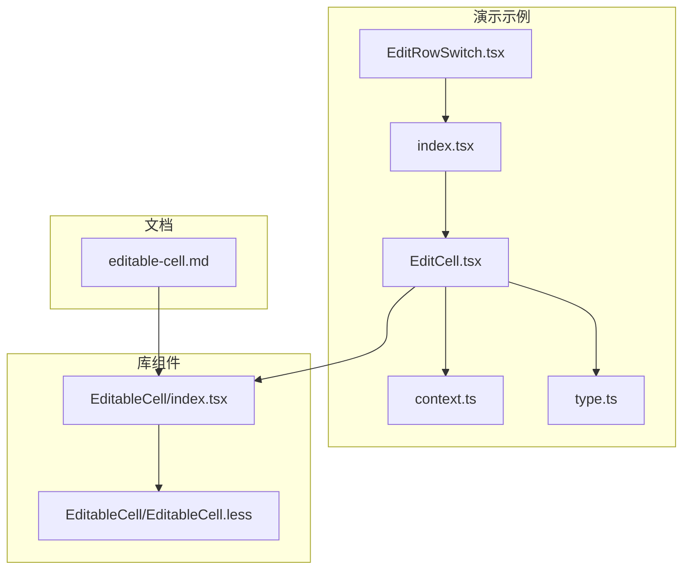
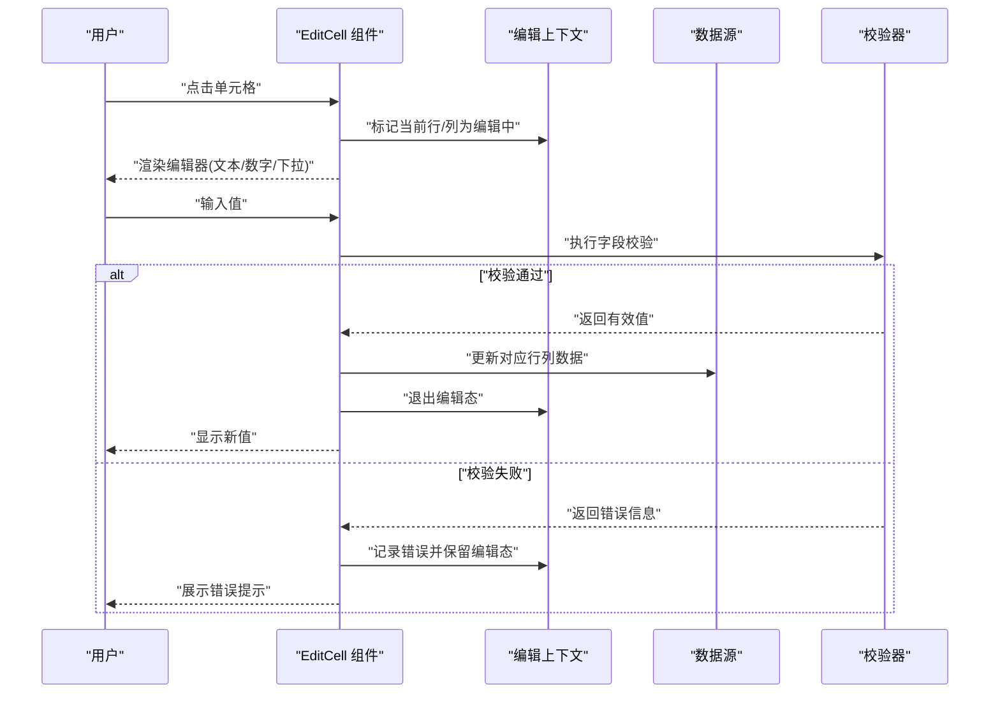
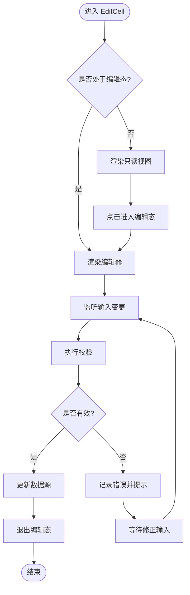
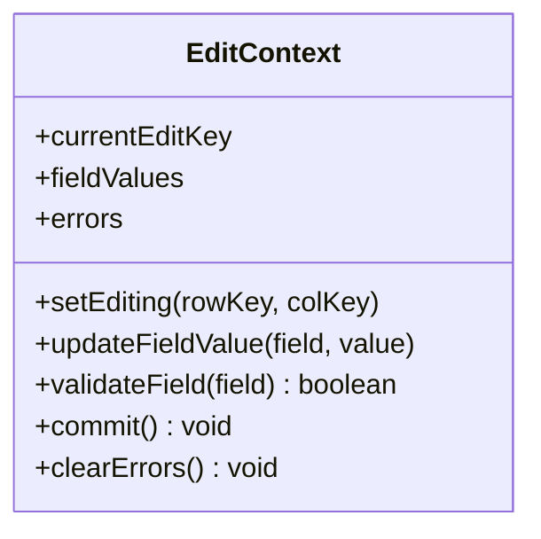
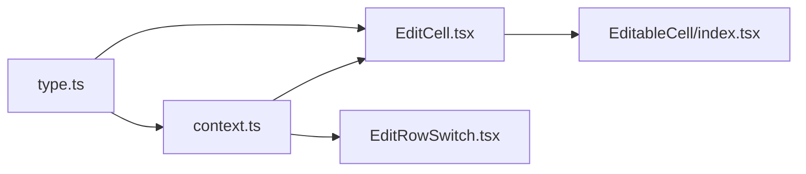

# 单元格编辑

<cite>
**本文引用的文件**   
- [demos/CellEdit/EditCell.tsx](file://docs-demo/demos/CellEdit/EditCell.tsx)
- [demos/CellEdit/EditRowSwitch.tsx](file://docs-demo/demos/CellEdit/EditRowSwitch.tsx)
- [demos/CellEdit/context.ts](file://docs-demo/demos/CellEdit/context.ts)
- [demos/CellEdit/index.tsx](file://docs-demo/demos/CellEdit/index.tsx)
- [demos/CellEdit/type.ts](file://docs-demo/demos/CellEdit/type.ts)
- [src/StkTable/custom-cells/EditableCell/index.tsx](file://src/StkTable/custom-cells/EditableCell/index.tsx)
- [src/StkTable/custom-cells/EditableCell/EditableCell.less](file://src/StkTable/custom-cells/EditableCell/EditableCell.less)
- [docs-src/main/table/advanced/custom-cells/editable-cell.md](file://docs-src/main/table/advanced/custom-cells/editable-cell.md)
</cite>

## 目录
1. [简介](#简介)
2. [项目结构](#项目结构)
3. [核心组件与能力](#核心组件与能力)
4. [架构总览](#架构总览)
5. [详细组件分析](#详细组件分析)
6. [依赖关系分析](#依赖关系分析)
7. [性能考虑](#性能考虑)
8. [故障排查指南](#故障排查指南)
9. [结论](#结论)
10. [附录：多场景实现方案](#附录多场景实现方案)

## 简介
本文件围绕“单元格编辑”主题，系统化梳理行内编辑、单元格验证、数据同步等关键能力。文档以仓库中的演示示例与内置可编辑单元格组件为依据，提供从类型定义、上下文状态管理到交互流程的完整说明，并给出多种编辑场景（文本、数字、下拉选择）的实现思路与最佳实践建议。

## 项目结构
与单元格编辑相关的代码主要分布在以下位置：
- 演示层：docs-demo/demos/CellEdit 下包含完整的行内编辑示例，包括 EditCell 组件、行级编辑开关、上下文与类型定义。
- 库层：src/StkTable/custom-cells/EditableCell 提供了内置的可编辑单元格组件及其样式。
- 文档层：docs-src/main/table/advanced/custom-cells/editable-cell.md 对内置可编辑单元格进行说明。

图表来源
- [demos/CellEdit/index.tsx](file://docs-demo/demos/CellEdit/index.tsx)
- [demos/CellEdit/EditCell.tsx](file://docs-demo/demos/CellEdit/EditCell.tsx)
- [demos/CellEdit/context.ts](file://docs-demo/demos/CellEdit/context.ts)
- [demos/CellEdit/type.ts](file://docs-demo/demos/CellEdit/type.ts)
- [src/StkTable/custom-cells/EditableCell/index.tsx](file://src/StkTable/custom-cells/EditableCell/index.tsx)
- [src/StkTable/custom-cells/EditableCell/EditableCell.less](file://src/StkTable/custom-cells/EditableCell/EditableCell.less)
- [docs-src/main/table/advanced/custom-cells/editable-cell.md](file://docs-src/main/table/advanced/custom-cells/editable-cell.md)

章节来源
- [demos/CellEdit/index.tsx](file://docs-demo/demos/CellEdit/index.tsx)
- [demos/CellEdit/EditCell.tsx](file://docs-demo/demos/CellEdit/EditCell.tsx)
- [demos/CellEdit/context.ts](file://docs-demo/demos/CellEdit/context.ts)
- [demos/CellEdit/type.ts](file://docs-demo/demos/CellEdit/type.ts)
- [src/StkTable/custom-cells/EditableCell/index.tsx](file://src/StkTable/custom-cells/EditableCell/index.tsx)
- [src/StkTable/custom-cells/EditableCell/EditableCell.less](file://src/StkTable/custom-cells/EditableCell/EditableCell.less)
- [docs-src/main/table/advanced/custom-cells/editable-cell.md](file://docs-src/main/table/advanced/custom-cells/editable-cell.md)

## 核心组件与能力
- EditCell 组件：负责单格编辑态渲染、输入控制、校验与提交，支持在只读与编辑模式间切换。
- 行级编辑开关：通过上下文或外部状态控制整行的编辑行为，便于批量开启/关闭编辑。
- 上下文状态管理：集中维护当前编辑行、编辑字段、错误信息等，避免分散状态导致的数据不一致。
- 类型定义：为表格数据、列配置、编辑状态与错误信息提供强类型约束，提升可维护性与开发体验。
- 数据双向绑定：在编辑过程中将用户输入映射回数据源，并在提交时触发更新回调，保证视图与数据一致。
- 错误处理：在输入变更与提交阶段进行校验，展示错误提示并阻止非法数据进入数据源。

章节来源
- [demos/CellEdit/EditCell.tsx](file://docs-demo/demos/CellEdit/EditCell.tsx)
- [demos/CellEdit/context.ts](file://docs-demo/demos/CellEdit/context.ts)
- [demos/CellEdit/type.ts](file://docs-demo/demos/CellEdit/type.ts)
- [src/StkTable/custom-cells/EditableCell/index.tsx](file://src/StkTable/custom-cells/EditableCell/index.tsx)

## 架构总览
下图展示了“行内编辑”的整体交互流程：用户点击单元格进入编辑态，输入后触发校验，成功则同步至数据源并退出编辑态；失败则保留编辑态并展示错误信息。

图表来源
- [demos/CellEdit/EditCell.tsx](file://docs-demo/demos/CellEdit/EditCell.tsx)
- [demos/CellEdit/context.ts](file://docs-demo/demos/CellEdit/context.ts)
- [src/StkTable/custom-cells/EditableCell/index.tsx](file://src/StkTable/custom-cells/EditableCell/index.tsx)

## 详细组件分析

### EditCell 组件
职责与特性
- 模式切换：根据上下文或外部状态决定渲染“只读视图”还是“编辑器”。
- 输入控制：封装受控输入，统一处理 onChange、onBlur、onKeyDown 等事件。
- 校验与错误：在输入变更与失焦时进行校验，并将错误信息写入上下文以便展示。
- 数据同步：在提交时调用数据更新回调，确保数据源与视图一致。
- 可访问性：为编辑器提供合适的 aria 属性与键盘导航支持。

关键流程
- 进入编辑态：捕获点击事件，设置当前编辑标识。
- 输入变更：实时或延迟校验，必要时阻止非法值进入数据源。
- 提交与退出：在回车或失焦时完成提交，清除编辑态与错误。

图表来源
- [demos/CellEdit/EditCell.tsx](file://docs-demo/demos/CellEdit/EditCell.tsx)

章节来源
- [demos/CellEdit/EditCell.tsx](file://docs-demo/demos/CellEdit/EditCell.tsx)

### 上下文状态管理（EditContext）
职责
- 维护当前编辑的行/列标识，避免多个单元格同时编辑。
- 存储各字段的临时值与错误信息，支持撤销/重做扩展。
- 暴露统一的更新接口，供 EditCell 与行级开关组件调用。

数据结构要点
- 编辑标识：行键 + 列键，用于定位目标单元格。
- 临时值：按字段维度缓存用户输入，未提交前不污染数据源。
- 错误信息：按字段维度保存错误消息，便于 UI 展示。

图表来源
- [demos/CellEdit/context.ts](file://docs-demo/demos/CellEdit/context.ts)

章节来源
- [demos/CellEdit/context.ts](file://docs-demo/demos/CellEdit/context.ts)

### 行级编辑开关（EditRowSwitch）
职责
- 提供整行编辑的快捷开关，配合上下文控制该行的所有可编辑单元格。
- 在开启编辑时，自动聚焦首个可编辑单元格，提升可用性。

交互要点
- 切换状态时，向上下文写入行级编辑标志。
- 关闭编辑时，触发整行校验与提交，清理临时状态。

章节来源
- [demos/CellEdit/EditRowSwitch.tsx](file://docs-demo/demos/CellEdit/EditRowSwitch.tsx)

### 类型定义（type.ts）
职责
- 定义表格数据模型、列配置、编辑状态与错误信息的类型。
- 为 EditCell、上下文与上层容器提供强类型约束，减少运行时错误。

典型类型
- 数据项类型：包含行键与各字段值。
- 列配置类型：包含字段名、标题、是否可编辑、校验规则等。
- 编辑状态类型：包含当前编辑键、临时值与错误集合。

章节来源
- [demos/CellEdit/type.ts](file://docs-demo/demos/CellEdit/type.ts)

### 内置可编辑单元格（EditableCell）
职责
- 作为通用可编辑单元格实现，提供开箱即用的编辑能力。
- 与自定义 EditCell 形成互补：当不需要复杂业务逻辑时可直接使用。

集成方式
- 在列配置中将 cellRender 指向内置组件。
- 传入数据项、列键、更新回调等必要参数。

样式
- 通过独立样式文件管理编辑态视觉反馈（如边框高亮）。

章节来源
- [src/StkTable/custom-cells/EditableCell/index.tsx](file://src/StkTable/custom-cells/EditableCell/index.tsx)
- [src/StkTable/custom-cells/EditableCell/EditableCell.less](file://src/StkTable/custom-cells/EditableCell/EditableCell.less)
- [docs-src/main/table/advanced/custom-cells/editable-cell.md](file://docs-src/main/table/advanced/custom-cells/editable-cell.md)

## 依赖关系分析
- EditCell 依赖上下文以获取/更新编辑状态与错误信息。
- EditCell 依赖类型定义以确保数据与状态的一致性。
- 行级开关依赖上下文以控制整行编辑行为。
- 内置 EditableCell 可作为替代方案，减少对自定义实现的耦合。

图表来源
- [demos/CellEdit/type.ts](file://docs-demo/demos/CellEdit/type.ts)
- [demos/CellEdit/context.ts](file://docs-demo/demos/CellEdit/context.ts)
- [demos/CellEdit/EditCell.tsx](file://docs-demo/demos/CellEdit/EditCell.tsx)
- [demos/CellEdit/EditRowSwitch.tsx](file://docs-demo/demos/CellEdit/EditRowSwitch.tsx)
- [src/StkTable/custom-cells/EditableCell/index.tsx](file://src/StkTable/custom-cells/EditableCell/index.tsx)

章节来源
- [demos/CellEdit/type.ts](file://docs-demo/demos/CellEdit/type.ts)
- [demos/CellEdit/context.ts](file://docs-demo/demos/CellEdit/context.ts)
- [demos/CellEdit/EditCell.tsx](file://docs-demo/demos/CellEdit/EditCell.tsx)
- [demos/CellEdit/EditRowSwitch.tsx](file://docs-demo/demos/CellEdit/EditRowSwitch.tsx)
- [src/StkTable/custom-cells/EditableCell/index.tsx](file://src/StkTable/custom-cells/EditableCell/index.tsx)

## 性能考虑
- 局部更新：仅在目标单元格或行级别触发重渲染，避免全表刷新。
- 防抖与节流：对高频输入（如搜索型文本框）采用防抖，降低校验与更新频率。
- 惰性渲染：仅对可见区域或当前编辑单元格启用编辑器，其余保持只读。
- 计算优化：将校验规则与格式化逻辑抽取为纯函数，结合 useMemo/useCallback 减少重复计算。
- 虚拟滚动：大数据量场景下结合虚拟列表，提高滚动性能。
- 最小化副作用：在 onBlur/onSubmit 等边界处执行数据持久化，避免每次按键都写数据源。

[本节为通用指导，无需源码引用]

## 故障排查指南
常见问题与定位思路
- 无法进入编辑态：检查上下文是否正确写入当前编辑键，以及列配置是否允许编辑。
- 输入未同步：确认是否在提交路径中调用了数据更新回调，且 key 与字段名匹配。
- 校验不生效：核对校验函数的返回值与错误信息结构是否符合预期。
- 多次编辑冲突：确保上下文在同一时刻仅允许一个单元格处于编辑态。
- 样式异常：检查编辑态样式类是否被正确应用，必要时对比内置组件样式。

章节来源
- [demos/CellEdit/context.ts](file://docs-demo/demos/CellEdit/context.ts)
- [demos/CellEdit/EditCell.tsx](file://docs-demo/demos/CellEdit/EditCell.tsx)
- [src/StkTable/custom-cells/EditableCell/EditableCell.less](file://src/StkTable/custom-cells/EditableCell/EditableCell.less)

## 结论
通过上下文驱动的状态管理与 EditCell 组件的封装，可以在表格中实现稳定、可扩展的行内编辑能力。结合类型定义与校验机制，既能保障数据一致性，也能提供良好的用户体验。对于简单场景可直接复用内置 EditableCell，复杂场景则可在 EditCell 中扩展更多交互与业务逻辑。

[本节为总结性内容，无需源码引用]

## 附录：多场景实现方案

### 文本编辑
- 适用字段：字符串类型，支持长度限制与格式校验。
- 关键点：受控输入、失焦提交、可选防抖。
- 参考路径
  - [demos/CellEdit/EditCell.tsx](file://docs-demo/demos/CellEdit/EditCell.tsx)
  - [demos/CellEdit/context.ts](file://docs-demo/demos/CellEdit/context.ts)

### 数字输入
- 适用字段：数值类型，支持范围校验与小数位控制。
- 关键点：输入过滤（仅数字）、单位换算、精度处理。
- 参考路径
  - [demos/CellEdit/EditCell.tsx](file://docs-demo/demos/CellEdit/EditCell.tsx)
  - [demos/CellEdit/type.ts](file://docs-demo/demos/CellEdit/type.ts)

### 下拉选择
- 适用字段：枚举或字典类型，支持远程加载选项。
- 关键点：选项去重、默认值处理、选中项高亮。
- 参考路径
  - [demos/CellEdit/EditCell.tsx](file://docs-demo/demos/CellEdit/EditCell.tsx)
  - [demos/CellEdit/context.ts](file://docs-demo/demos/CellEdit/context.ts)

### 日期/时间编辑
- 适用字段：日期时间类型，支持本地化与范围选择。
- 关键点：时区处理、格式转换、禁用无效日期。
- 参考路径
  - [demos/CellEdit/EditCell.tsx](file://docs-demo/demos/CellEdit/EditCell.tsx)
  - [demos/CellEdit/type.ts](file://docs-demo/demos/CellEdit/type.ts)

### 富文本编辑
- 适用字段：HTML/Markdown 内容，支持工具栏与预览。
- 关键点：内容清洗、大小限制、异步保存。
- 参考路径
  - [demos/CellEdit/EditCell.tsx](file://docs-demo/demos/CellEdit/EditCell.tsx)
  - [demos/CellEdit/context.ts](file://docs-demo/demos/CellEdit/context.ts)

### 组合字段编辑
- 适用字段：由多个子字段组成的复合对象。
- 关键点：子字段联动、整体校验、原子提交。
- 参考路径
  - [demos/CellEdit/EditCell.tsx](file://docs-demo/demos/CellEdit/EditCell.tsx)
  - [demos/CellEdit/type.ts](file://docs-demo/demos/CellEdit/type.ts)