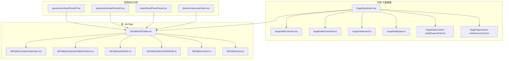
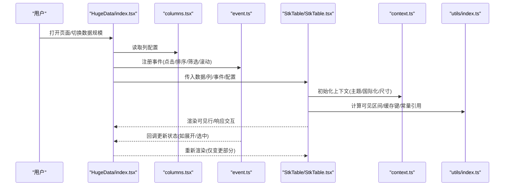
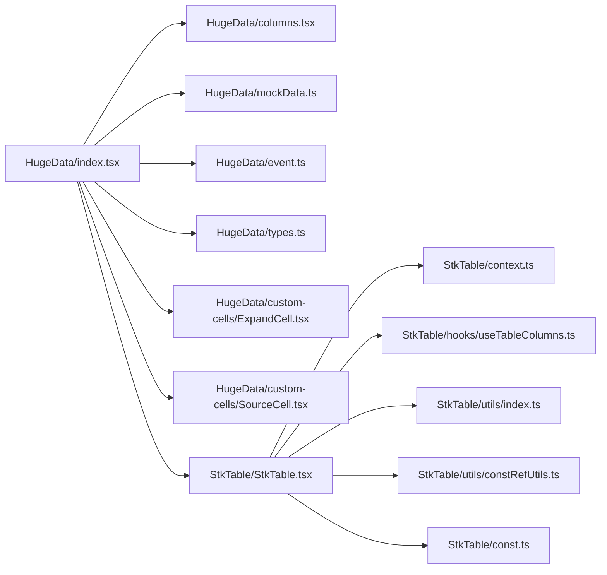

# 大数据量处理

<cite>
**本文引用的文件**   
- [HugeData/index.tsx](file://docs-demo/demos/HugeData/index.tsx)
- [HugeData/mockData.ts](file://docs-demo/demos/HugeData/mockData.ts)
- [HugeData/columns.tsx](file://docs-demo/demos/HugeData/columns.tsx)
- [HugeData/event.ts](file://docs-demo/demos/HugeData/event.ts)
- [HugeData/types.ts](file://docs-demo/demos/HugeData/types.ts)
- [HugeData/custom-cells/ExpandCell.tsx](file://docs-demo/demos/HugeData/custom-cells/ExpandCell.tsx)
- [HugeData/custom-cells/SourceCell.tsx](file://docs-demo/demos/HugeData/custom-cells/SourceCell.tsx)
- [StkTable/StkTable.tsx](file://src/StkTable/StkTable.tsx)
- [StkTable/components/index.tsx](file://src/StkTable/components/index.tsx)
- [StkTable/hooks/useTableColumns.ts](file://src/StkTable/hooks/useTableColumns.ts)
- [StkTable/utils/index.ts](file://src/StkTable/utils/index.ts)
- [StkTable/utils/constRefUtils.ts](file://src/StkTable/utils/constRefUtils.ts)
- [StkTable/context.ts](file://src/StkTable/context.ts)
- [StkTable/const.ts](file://src/StkTable/const.ts)
- [advanced/virtual/VirtualY.tsx](file://docs-demo/advanced/virtual/VirtualY.tsx)
- [advanced/virtual/VirtualX.tsx](file://docs-demo/advanced/virtual/VirtualX.tsx)
- [basic/fixed/FixedVirtual.tsx](file://docs-demo/basic/fixed/FixedVirtual.tsx)
- [demos/LazyLoad/index.tsx](file://docs-demo/demos/LazyLoad/index.tsx)
</cite>

## 目录
1. [简介](#简介)
2. [项目结构](#项目结构)
3. [核心组件](#核心组件)
4. [架构总览](#架构总览)
5. [详细组件分析](#详细组件分析)
6. [依赖关系分析](#依赖关系分析)
7. [性能考量](#性能考量)
8. [故障排查指南](#故障排查指南)
9. [结论](#结论)
10. [附录](#附录)

## 简介
本文件面向需要在 React 中高效渲染百万级数据表格的开发者，围绕虚拟滚动、内存管理、性能监控与自定义单元格等关键技术展开。文档以仓库中的“大数据量”示例为核心，结合 StkTable 库的实现要点，给出从数据模拟、列配置优化到事件处理的完整实践路径，并附带可复用的优化建议与对比思路，帮助你在真实项目中稳定、流畅地处理海量数据。

## 项目结构
本项目采用“示例 + 库源码”的双层组织：
- docs-demo：面向演示与实战的示例代码，包含大数据量场景、高级特性（虚拟滚动、固定列、合并单元格等）以及基础用法。
- src/StkTable：StkTable 库的核心实现，包括主组件、上下文、工具函数、类型定义与样式。
- lib/lib-demo：构建产物与本地运行入口，便于调试库本身。

下图展示了与大数据量处理密切相关的目录与文件关系：

图表来源
- [HugeData/index.tsx](file://docs-demo/demos/HugeData/index.tsx)
- [HugeData/columns.tsx](file://docs-demo/demos/HugeData/columns.tsx)
- [HugeData/mockData.ts](file://docs-demo/demos/HugeData/mockData.ts)
- [HugeData/event.ts](file://docs-demo/demos/HugeData/event.ts)
- [HugeData/types.ts](file://docs-demo/demos/HugeData/types.ts)
- [HugeData/custom-cells/ExpandCell.tsx](file://docs-demo/demos/HugeData/custom-cells/ExpandCell.tsx)
- [HugeData/custom-cells/SourceCell.tsx](file://docs-demo/demos/HugeData/custom-cells/SourceCell.tsx)
- [StkTable/StkTable.tsx](file://src/StkTable/StkTable.tsx)
- [StkTable/components/index.tsx](file://src/StkTable/components/index.tsx)
- [StkTable/hooks/useTableColumns.ts](file://src/StkTable/hooks/useTableColumns.ts)
- [StkTable/utils/index.ts](file://src/StkTable/utils/index.ts)
- [StkTable/utils/constRefUtils.ts](file://src/StkTable/utils/constRefUtils.ts)
- [StkTable/context.ts](file://src/StkTable/context.ts)
- [StkTable/const.ts](file://src/StkTable/const.ts)
- [advanced/virtual/VirtualY.tsx](file://docs-demo/advanced/virtual/VirtualY.tsx)
- [advanced/virtual/VirtualX.tsx](file://docs-demo/advanced/virtual/VirtualX.tsx)
- [basic/fixed/FixedVirtual.tsx](file://docs-demo/basic/fixed/FixedVirtual.tsx)
- [demos/LazyLoad/index.tsx](file://docs-demo/demos/LazyLoad/index.tsx)

章节来源
- [HugeData/index.tsx](file://docs-demo/demos/HugeData/index.tsx)
- [StkTable/StkTable.tsx](file://src/StkTable/StkTable.tsx)

## 核心组件
- 大数据量示例入口：负责生成/加载百万级数据、配置列、挂载表格、绑定事件与展示关键指标。
- 自定义单元格：
  - ExpandCell：用于行展开/收起的交互单元，通常配合行展开功能使用。
  - SourceCell：用于展示数据来源或富信息内容的单元，强调轻量渲染与事件隔离。
- StkTable 主组件：提供虚拟滚动、列配置、事件分发、上下文共享等能力，是大数据量渲染的关键承载者。

章节来源
- [HugeData/index.tsx](file://docs-demo/demos/HugeData/index.tsx)
- [HugeData/custom-cells/ExpandCell.tsx](file://docs-demo/demos/HugeData/custom-cells/ExpandCell.tsx)
- [HugeData/custom-cells/SourceCell.tsx](file://docs-demo/demos/HugeData/custom-cells/SourceCell.tsx)
- [StkTable/StkTable.tsx](file://src/StkTable/StkTable.tsx)

## 架构总览
下图展示了大数据量场景下的整体调用链与数据流：用户交互触发事件，通过事件处理器更新状态；表格基于列配置与当前可见区域计算渲染范围；StkTable 内部通过上下文与工具函数协调渲染与性能优化。

图表来源
- [HugeData/index.tsx](file://docs-demo/demos/HugeData/index.tsx)
- [HugeData/columns.tsx](file://docs-demo/demos/HugeData/columns.tsx)
- [HugeData/event.ts](file://docs-demo/demos/HugeData/event.ts)
- [StkTable/StkTable.tsx](file://src/StkTable/StkTable.tsx)
- [StkTable/context.ts](file://src/StkTable/context.ts)
- [StkTable/utils/index.ts](file://src/StkTable/utils/index.ts)

## 详细组件分析

### 大数据量示例入口（HugeData/index.tsx）
职责与关键点
- 数据规模控制：通过参数或开关切换不同数据量级，便于进行性能对比。
- 列配置组装：组合基础列与自定义单元格列，统一事件绑定。
- 事件集中处理：将点击、排序、筛选、滚动等事件收敛至 event.ts，避免在渲染层产生闭包开销。
- 指标采集：记录首帧时间、滚动帧率、内存占用等，辅助定位瓶颈。

优化建议
- 使用稳定的列对象引用，避免每次渲染重建导致子组件重渲染。
- 对复杂列内容使用 memo 化或惰性渲染策略。
- 将高频事件（如滚动）节流/防抖，减少状态更新频率。

章节来源
- [HugeData/index.tsx](file://docs-demo/demos/HugeData/index.tsx)
- [HugeData/event.ts](file://docs-demo/demos/HugeData/event.ts)

### 列配置（HugeData/columns.tsx）
职责与关键点
- 声明式列定义：标题、宽度、对齐、排序、筛选、单元格渲染器。
- 自定义单元格注入：将 ExpandCell、SourceCell 等作为列的渲染器。
- 列级优化：为需要固定宽度的列设置精确宽度，减少布局抖动。

优化建议
- 对只读列启用不可编辑/不可交互模式，降低事件监听数量。
- 对长文本列启用省略与悬浮预览，避免大 DOM 节点。

章节来源
- [HugeData/columns.tsx](file://docs-demo/demos/HugeData/columns.tsx)

### 数据模拟（HugeData/mockData.ts）
职责与关键点
- 批量构造行数据：字段类型覆盖字符串、数字、布尔、日期等。
- 可控随机性：保证多次生成的数据一致，便于回归测试与性能对比。
- 可扩展字段：预留扩展字段，方便后续接入更多业务场景。

优化建议
- 预分配数组长度，减少扩容开销。
- 对重复值进行去重或压缩存储，降低内存占用。

章节来源
- [HugeData/mockData.ts](file://docs-demo/demos/HugeData/mockData.ts)

### 事件处理（HugeData/event.ts）
职责与关键点
- 事件聚合：将点击、双击、右键、键盘导航等事件统一封装。
- 状态同步：与父组件状态保持单向数据流，避免越权修改。
- 性能保护：对高频事件做节流/防抖，避免阻塞主线程。

优化建议
- 使用事件委托减少监听器数量。
- 将昂贵操作放入 requestIdleCallback 或 Web Worker。

章节来源
- [HugeData/event.ts](file://docs-demo/demos/HugeData/event.ts)

### 类型定义（HugeData/types.ts）
职责与关键点
- 行数据结构：明确字段名、类型、是否必填。
- 列接口约束：确保列配置与渲染器签名一致。
- 事件回调类型：规范回调参数，提升类型安全。

章节来源
- [HugeData/types.ts](file://docs-demo/demos/HugeData/types.ts)

### 自定义单元格：ExpandCell
设计思路
- 作用：在单元格内提供行展开/收起的交互入口，常用于二级详情展示。
- 渲染策略：仅渲染必要的图标与容器，详情内容按需挂载，避免一次性创建大量 DOM。
- 事件隔离：阻止冒泡，防止与行选择、拖拽等事件冲突。
- 状态管理：与父组件的展开集合保持一致，保证跨行状态正确。

优化建议
- 使用 key 标识唯一行，避免复用错乱。
- 对展开面板内容做懒加载与虚拟化，避免二次渲染风暴。

章节来源
- [HugeData/custom-cells/ExpandCell.tsx](file://docs-demo/demos/HugeData/custom-cells/ExpandCell.tsx)

### 自定义单元格：SourceCell
设计思路
- 作用：展示数据来源、版本、链接等富信息，支持点击跳转或复制。
- 渲染策略：轻量文本与图标优先，必要时再引入富媒体。
- 交互最小化：仅在 hover 时显示操作按钮，减少常驻事件监听。

优化建议
- 对长链接进行截断与 Tooltip 展示。
- 对图片等资源使用占位图与懒加载。

章节来源
- [HugeData/custom-cells/SourceCell.tsx](file://docs-demo/demos/HugeData/custom-cells/SourceCell.tsx)

### StkTable 主组件与协作模块
职责与关键点
- 主组件（StkTable/StkTable.tsx）：接收 props，驱动虚拟滚动、列渲染、事件分发。
- 组件索引（components/index.tsx）：导出常用子组件，供外部按需引入。
- 列钩子（hooks/useTableColumns.ts）：规范化列解析、默认值填充、排序/筛选集成。
- 工具函数（utils/index.ts）：通用算法与格式化逻辑，如可见区间计算、键生成。
- 常量与引用（utils/constRefUtils.ts、const.ts）：稳定引用常量，减少不必要的重渲染。
- 上下文（context.ts）：跨层级共享主题、语言、尺寸等全局信息。

优化建议
- 利用 constRefUtils 提供的稳定引用，避免列/事件对象频繁重建。
- 在 useTableColumns 中对列进行预处理，减少运行时分支判断。

章节来源
- [StkTable/StkTable.tsx](file://src/StkTable/StkTable.tsx)
- [StkTable/components/index.tsx](file://src/StkTable/components/index.tsx)
- [StkTable/hooks/useTableColumns.ts](file://src/StkTable/hooks/useTableColumns.ts)
- [StkTable/utils/index.ts](file://src/StkTable/utils/index.ts)
- [StkTable/utils/constRefUtils.ts](file://src/StkTable/utils/constRefUtils.ts)
- [StkTable/const.ts](file://src/StkTable/const.ts)
- [StkTable/context.ts](file://src/StkTable/context.ts)

### 虚拟滚动与其他相关示例
- 纵向虚拟滚动（VirtualY.tsx）：按可视高度动态计算可见行范围，大幅减少 DOM 节点数量。
- 横向虚拟滚动（VirtualX.tsx）：对超宽表格进行列级虚拟化，避免水平方向的大体量渲染。
- 固定列+虚拟滚动（FixedVirtual.tsx）：在固定列场景下仍保持高性能滚动体验。
- 懒加载（LazyLoad/index.tsx）：按需加载重型内容，进一步降低首屏压力。

章节来源
- [advanced/virtual/VirtualY.tsx](file://docs-demo/advanced/virtual/VirtualY.tsx)
- [advanced/virtual/VirtualX.tsx](file://docs-demo/advanced/virtual/VirtualX.tsx)
- [basic/fixed/FixedVirtual.tsx](file://docs-demo/basic/fixed/FixedVirtual.tsx)
- [demos/LazyLoad/index.tsx](file://docs-demo/demos/LazyLoad/index.tsx)

## 依赖关系分析
下图展示了大数据量示例与 StkTable 核心模块之间的依赖关系，有助于理解耦合点与潜在风险。

图表来源
- [HugeData/index.tsx](file://docs-demo/demos/HugeData/index.tsx)
- [HugeData/columns.tsx](file://docs-demo/demos/HugeData/columns.tsx)
- [HugeData/mockData.ts](file://docs-demo/demos/HugeData/mockData.ts)
- [HugeData/event.ts](file://docs-demo/demos/HugeData/event.ts)
- [HugeData/types.ts](file://docs-demo/demos/HugeData/types.ts)
- [HugeData/custom-cells/ExpandCell.tsx](file://docs-demo/demos/HugeData/custom-cells/ExpandCell.tsx)
- [HugeData/custom-cells/SourceCell.tsx](file://docs-demo/demos/HugeData/custom-cells/SourceCell.tsx)
- [StkTable/StkTable.tsx](file://src/StkTable/StkTable.tsx)
- [StkTable/context.ts](file://src/StkTable/context.ts)
- [StkTable/hooks/useTableColumns.ts](file://src/StkTable/hooks/useTableColumns.ts)
- [StkTable/utils/index.ts](file://src/StkTable/utils/index.ts)
- [StkTable/utils/constRefUtils.ts](file://src/StkTable/utils/constRefUtils.ts)
- [StkTable/const.ts](file://src/StkTable/const.ts)

章节来源
- [HugeData/index.tsx](file://docs-demo/demos/HugeData/index.tsx)
- [StkTable/StkTable.tsx](file://src/StkTable/StkTable.tsx)

## 性能考量
- 虚拟滚动
  - 纵向/横向虚拟化显著减少 DOM 节点数量，适用于百万级行列场景。
  - 固定列与虚拟滚动结合时，需确保滚动容器与固定区域的尺寸同步。
- 内存管理
  - 使用稳定引用（列、事件、常量）避免无谓重渲染。
  - 对大型对象进行浅比较或拆分状态，减少 diff 成本。
  - 及时释放不再使用的资源（定时器、订阅、大对象）。
- 渲染优化
  - 对复杂单元格使用 memo 化与条件渲染。
  - 对长列表启用行高预估与增量更新。
- 事件优化
  - 对滚动、输入等高频事件进行节流/防抖。
  - 使用事件委托减少监听器数量。
- 监控与度量
  - 记录首帧时间、滚动帧率、内存峰值、GC 次数等指标。
  - 在不同数据规模下进行 A/B 对比，验证优化效果。

[本节为通用指导，不直接分析具体文件]

## 故障排查指南
常见问题与定位思路
- 卡顿或掉帧
  - 检查是否存在未 memo 化的复杂单元格或频繁重建的对象。
  - 确认滚动事件是否做了节流/防抖。
- 内存泄漏
  - 排查是否在组件卸载后仍有定时器或订阅未清理。
  - 检查是否有循环引用或过大对象长期驻留。
- 展开/折叠异常
  - 核对 ExpandCell 的 key 是否与行唯一标识一致。
  - 确认展开状态与行数据的映射是否正确。
- 固定列错位
  - 检查固定列容器与滚动容器的宽高同步逻辑。
  - 确认列宽变化时是否触发了正确的重排。

章节来源
- [HugeData/custom-cells/ExpandCell.tsx](file://docs-demo/demos/HugeData/custom-cells/ExpandCell.tsx)
- [basic/fixed/FixedVirtual.tsx](file://docs-demo/basic/fixed/FixedVirtual.tsx)

## 结论
在处理百万级数据时，虚拟滚动与内存管理是两大基石。通过合理的列配置、稳定的引用、事件优化与精细化监控，可以在保证用户体验的同时维持系统稳定性。自定义单元格应遵循“轻量渲染、按需挂载、事件隔离”的原则，避免成为性能瓶颈。建议在上线前进行多规模压测与回归，持续迭代优化策略。

[本节为总结性内容，不直接分析具体文件]

## 附录
- 快速上手清单
  - 开启虚拟滚动（纵向/横向），并根据列宽与行高估算合理缓冲区。
  - 使用稳定列与事件对象，避免每次渲染重建。
  - 对复杂单元格进行 memo 化与懒加载。
  - 对高频事件进行节流/防抖，必要时使用 Web Worker。
  - 建立性能监控埋点，定期评估与对比。

[本节为补充说明，不直接分析具体文件]