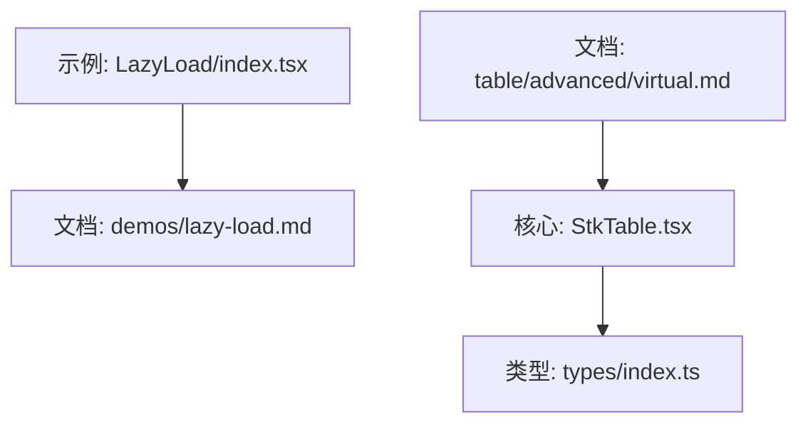
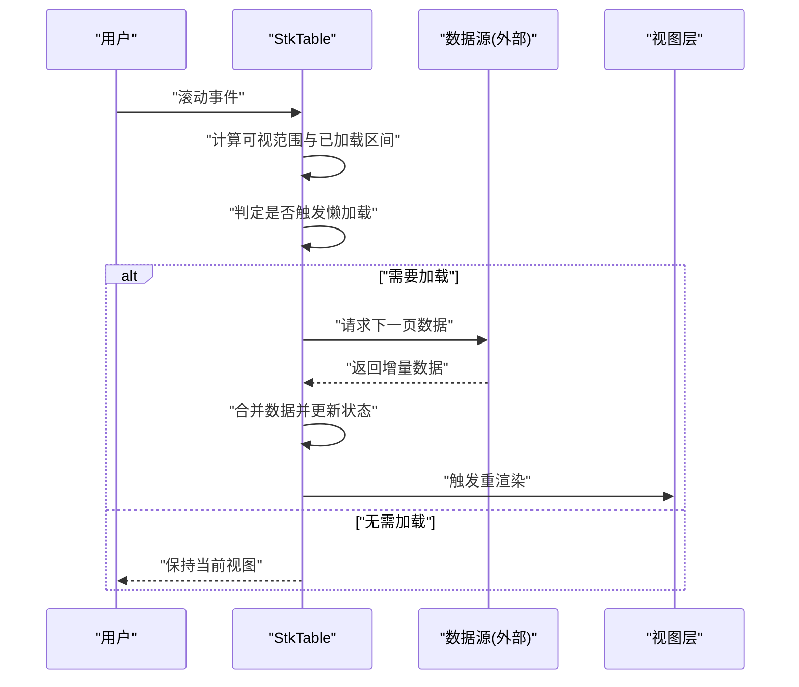
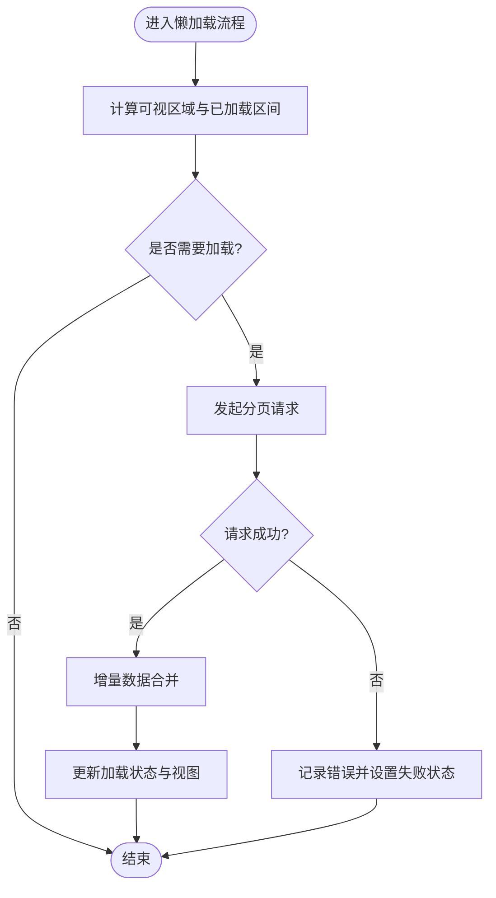
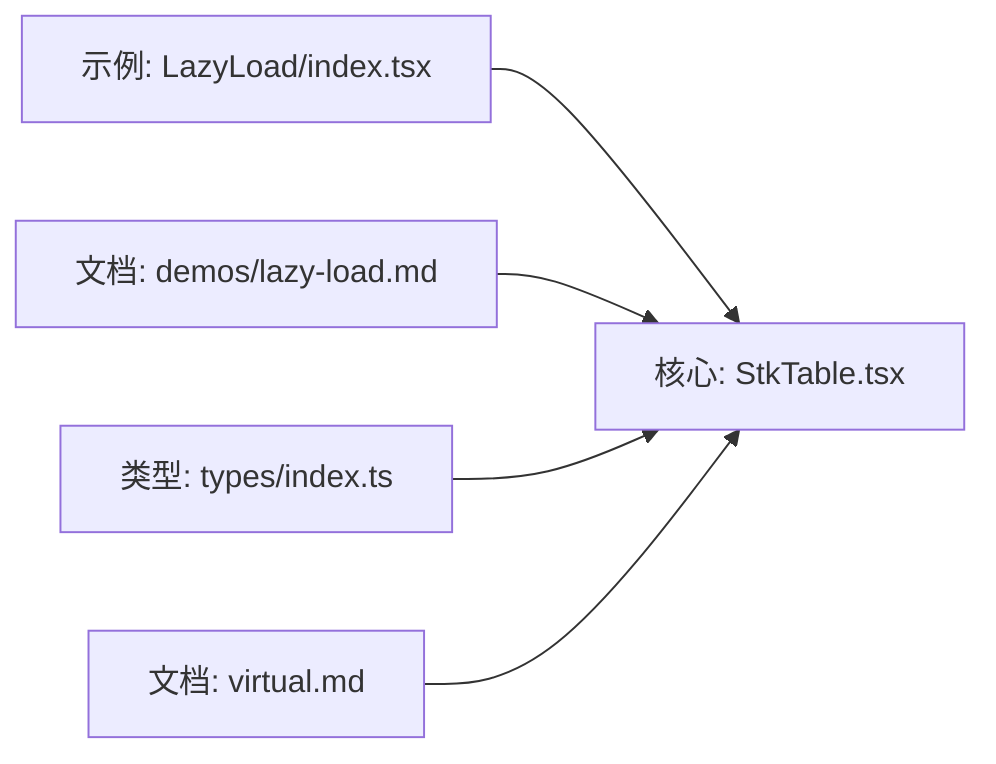

# 懒加载

<cite>
**本文引用的文件**   
- [docs-demo/demos/LazyLoad/index.tsx](file://docs-demo/demos/LazyLoad/index.tsx)
- [docs-src/demos/lazy-load.md](file://docs-src/demos/lazy-load.md)
- [src/StkTable/StkTable.tsx](file://src/StkTable/StkTable.tsx)
- [src/StkTable/types/index.ts](file://src/StkTable/types/index.ts)
- [docs-src/main/table/advanced/virtual.md](file://docs-src/main/table/advanced/virtual.md)
</cite>

## 目录
1. [简介](#简介)
2. [项目结构](#项目结构)
3. [核心组件](#核心组件)
4. [架构总览](#架构总览)
5. [详细组件分析](#详细组件分析)
6. [依赖分析](#依赖分析)
7. [性能考虑](#性能考虑)
8. [故障排查指南](#故障排查指南)
9. [结论](#结论)
10. [附录](#附录)

## 简介
本章节围绕“懒加载”能力，系统阐述在表格场景下如何实现按需加载数据、提升首屏渲染速度与交互体验。内容涵盖：
- 懒加载的实现原理与触发时机
- 数据缓存策略与一致性保障
- 与虚拟滚动的结合使用
- 错误重试机制与加载状态管理
- 不同业务场景的配置方案与性能优化建议

## 项目结构
仓库中与懒加载直接相关的示例与文档位于 docs-demo 与 docs-src 目录；核心实现与类型定义位于 src/StkTable 目录。下图给出与懒加载相关的关键文件关系概览。

图表来源
- [docs-demo/demos/LazyLoad/index.tsx](file://docs-demo/demos/LazyLoad/index.tsx)
- [docs-src/demos/lazy-load.md](file://docs-src/demos/lazy-load.md)
- [src/StkTable/StkTable.tsx](file://src/StkTable/StkTable.tsx)
- [src/StkTable/types/index.ts](file://src/StkTable/types/index.ts)
- [docs-src/main/table/advanced/virtual.md](file://docs-src/main/table/advanced/virtual.md)

章节来源
- [docs-demo/demos/LazyLoad/index.tsx](file://docs-demo/demos/LazyLoad/index.tsx)
- [docs-src/demos/lazy-load.md](file://docs-src/demos/lazy-load.md)
- [src/StkTable/StkTable.tsx](file://src/StkTable/StkTable.tsx)
- [src/StkTable/types/index.ts](file://src/StkTable/types/index.ts)
- [docs-src/main/table/advanced/virtual.md](file://docs-src/main/table/advanced/virtual.md)

## 核心组件
- 示例入口：LazyLoad 示例用于演示懒加载的用法与配置项组合，便于快速上手。
- 文档说明：lazy-load.md 提供懒加载的使用说明、API 要点与注意事项。
- 核心实现：StkTable.tsx 中负责监听滚动事件、计算可视区域、触发数据加载、合并增量数据以及维护加载状态。
- 类型定义：types/index.ts 包含懒加载相关属性、回调与内部状态的类型约束，确保调用方正确配置。

章节来源
- [docs-demo/demos/LazyLoad/index.tsx](file://docs-demo/demos/LazyLoad/index.tsx)
- [docs-src/demos/lazy-load.md](file://docs-src/demos/lazy-load.md)
- [src/StkTable/StkTable.tsx](file://src/StkTable/StkTable.tsx)
- [src/StkTable/types/index.ts](file://src/StkTable/types/index.ts)

## 架构总览
懒加载在表格中的整体流程如下：用户滚动时，表格根据可视区域与已加载区间判断是否需要请求下一页数据；若需要则发起异步请求，成功后将新数据追加到现有数据源并更新视图；同时维护加载状态与错误处理逻辑。

图表来源
- [src/StkTable/StkTable.tsx](file://src/StkTable/StkTable.tsx)

## 详细组件分析

### 懒加载触发与数据流
- 触发时机
  - 滚动事件触发后，基于可视区域与已加载边界进行判断。
  - 当可视区域接近或超出已加载数据的末尾时，触发下一页请求。
- 数据流
  - 请求成功后，将增量数据与已有数据进行合并，避免重复加载。
  - 更新加载状态（加载中/完成/失败），驱动视图刷新。
- 关键实现位置
  - 滚动监听与可视区计算：[src/StkTable/StkTable.tsx](file://src/StkTable/StkTable.tsx)
  - 增量合并与状态更新：[src/StkTable/StkTable.tsx](file://src/StkTable/StkTable.tsx)
  - 类型约束与配置项：[src/StkTable/types/index.ts](file://src/StkTable/types/index.ts)

图表来源
- [src/StkTable/StkTable.tsx](file://src/StkTable/StkTable.tsx)

章节来源
- [src/StkTable/StkTable.tsx](file://src/StkTable/StkTable.tsx)
- [src/StkTable/types/index.ts](file://src/StkTable/types/index.ts)

### 与虚拟滚动的结合
- 协同方式
  - 虚拟滚动仅渲染可视范围内的行，减少 DOM 节点数量。
  - 懒加载在虚拟滚动基础上按需拉取数据，进一步降低初始负载。
- 配置要点
  - 合理设置虚拟滚动的高度与行高估算，避免频繁尺寸变化导致额外重排。
  - 调整懒加载阈值，使滚动更平滑且减少不必要的请求。
- 参考文档
  - 虚拟滚动使用说明与最佳实践：[docs-src/main/table/advanced/virtual.md](file://docs-src/main/table/advanced/virtual.md)

章节来源
- [docs-src/main/table/advanced/virtual.md](file://docs-src/main/table/advanced/virtual.md)

### 错误重试与加载状态管理
- 加载状态
  - 支持加载中、完成、失败等状态，便于展示骨架屏、空态或错误提示。
- 重试机制
  - 对失败的请求提供重试入口或自动重试策略，增强鲁棒性。
- 实现位置
  - 状态管理与重试逻辑：[src/StkTable/StkTable.tsx](file://src/StkTable/StkTable.tsx)
  - 类型定义与回调约定：[src/StkTable/types/index.ts](file://src/StkTable/types/index.ts)

章节来源
- [src/StkTable/StkTable.tsx](file://src/StkTable/StkTable.tsx)
- [src/StkTable/types/index.ts](file://src/StkTable/types/index.ts)

### 示例与文档对照
- 示例入口
  - LazyLoad 示例展示了懒加载的基本用法与常用配置项组合，适合快速集成。
- 文档说明
  - lazy-load.md 提供了 API 说明、注意事项与常见问题解答。

章节来源
- [docs-demo/demos/LazyLoad/index.tsx](file://docs-demo/demos/LazyLoad/index.tsx)
- [docs-src/demos/lazy-load.md](file://docs-src/demos/lazy-load.md)

## 依赖分析
- 模块耦合
  - 示例与文档依赖核心实现与类型定义，形成“示例/文档 -> 核心 -> 类型”的单向依赖。
- 外部依赖
  - 懒加载的数据获取通常由外部数据源提供，表格侧只负责触发与合并。
- 潜在风险
  - 避免在高频滚动事件中执行昂贵计算，应使用节流/防抖或基于可视区的增量计算。

图表来源
- [docs-demo/demos/LazyLoad/index.tsx](file://docs-demo/demos/LazyLoad/index.tsx)
- [docs-src/demos/lazy-load.md](file://docs-src/demos/lazy-load.md)
- [src/StkTable/StkTable.tsx](file://src/StkTable/StkTable.tsx)
- [src/StkTable/types/index.ts](file://src/StkTable/types/index.ts)
- [docs-src/main/table/advanced/virtual.md](file://docs-src/main/table/advanced/virtual.md)

章节来源
- [docs-demo/demos/LazyLoad/index.tsx](file://docs-demo/demos/LazyLoad/index.tsx)
- [docs-src/demos/lazy-load.md](file://docs-src/demos/lazy-load.md)
- [src/StkTable/StkTable.tsx](file://src/StkTable/StkTable.tsx)
- [src/StkTable/types/index.ts](file://src/StkTable/types/index.ts)
- [docs-src/main/table/advanced/virtual.md](file://docs-src/main/table/advanced/virtual.md)

## 性能考虑
- 首屏优化
  - 优先加载首屏所需数据，后续通过懒加载逐步补充。
- 请求去重
  - 对同一页的请求进行去重，避免并发重复请求。
- 增量合并
  - 使用稳定的键值进行增量合并，避免整表重算。
- 滚动节流
  - 在滚动事件中采用节流或基于可视区的事件合并，降低计算开销。
- 虚拟滚动配合
  - 合理设置行高与容器高度，减少布局抖动与重排。

## 故障排查指南
- 现象：滚动无响应或无法加载更多
  - 检查可视区计算是否正确，确认滚动容器与事件绑定。
  - 核对已加载区间与阈值配置，避免过早或过晚触发。
- 现象：数据重复或丢失
  - 确认增量合并逻辑是否基于稳定键值，避免覆盖或遗漏。
- 现象：频繁闪烁或卡顿
  - 评估虚拟滚动参数与行高估算，必要时引入固定行高或预估高度。
- 现象：网络错误未恢复
  - 检查错误状态与重试入口，确保用户可手动重试或自动重试生效。

章节来源
- [src/StkTable/StkTable.tsx](file://src/StkTable/StkTable.tsx)
- [src/StkTable/types/index.ts](file://src/StkTable/types/index.ts)

## 结论
通过将懒加载与虚拟滚动结合，可在大数据量场景下显著提升首屏加载速度与交互流畅度。合理的触发时机、稳健的增量合并、完善的错误重试与状态管理，是构建高质量懒加载体验的关键。建议在实际项目中结合业务特性，持续调优阈值与渲染策略，以获得更佳的性能与用户体验。

## 附录
- 快速上手
  - 参考示例与文档，先以默认配置接入，再逐步调整阈值与虚拟滚动参数。
- 进阶配置
  - 根据数据规模与网络状况，调整预加载阈值、重试次数与超时时间。
- 最佳实践
  - 为每行数据提供稳定唯一键，确保增量合并的正确性与高效性。