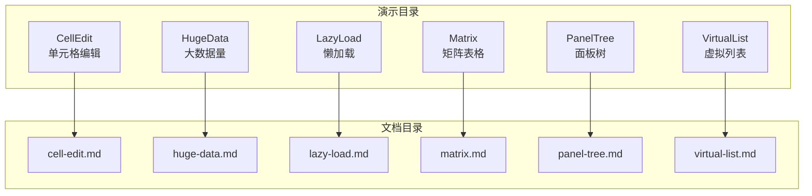
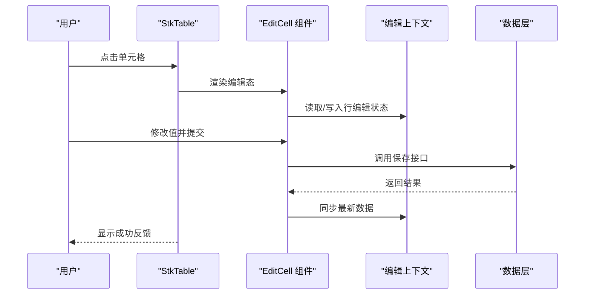
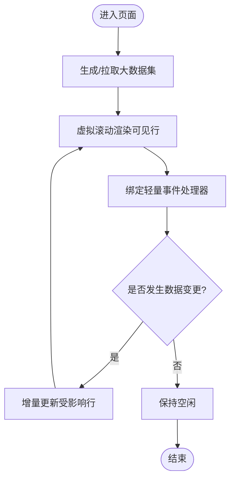
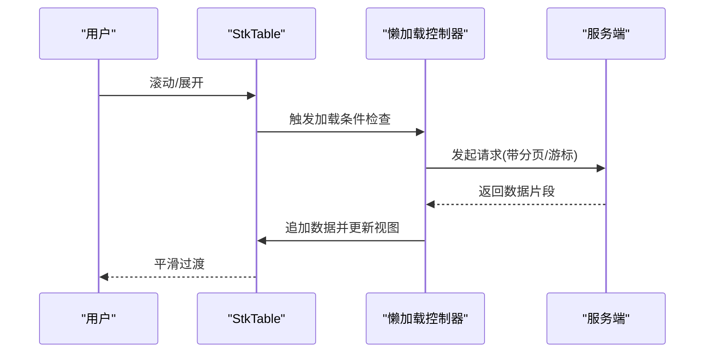
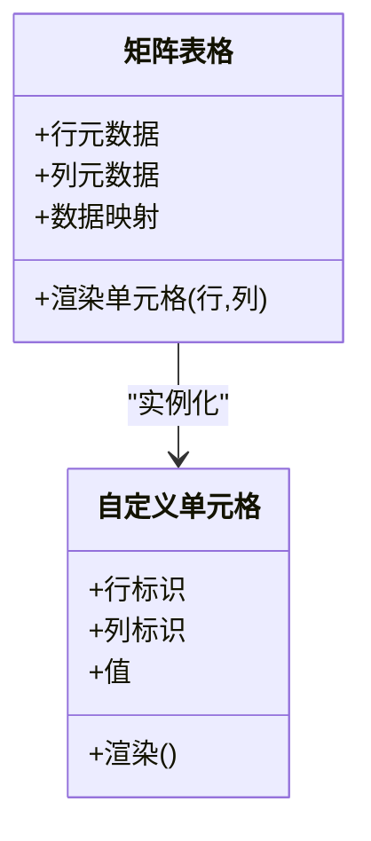
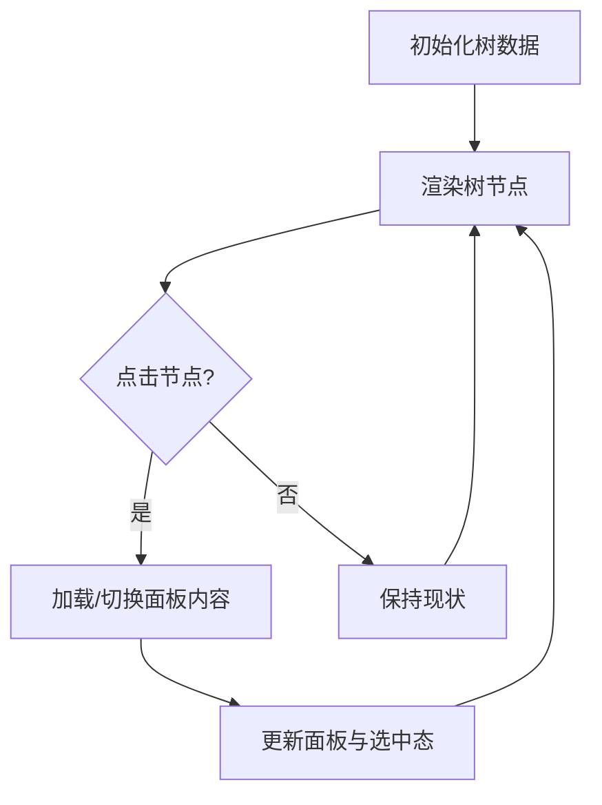
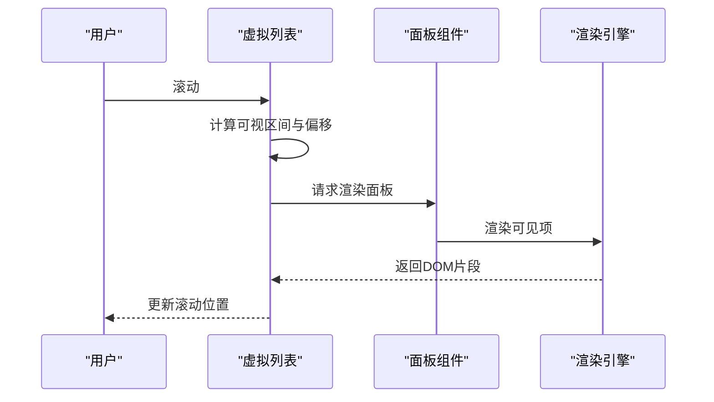
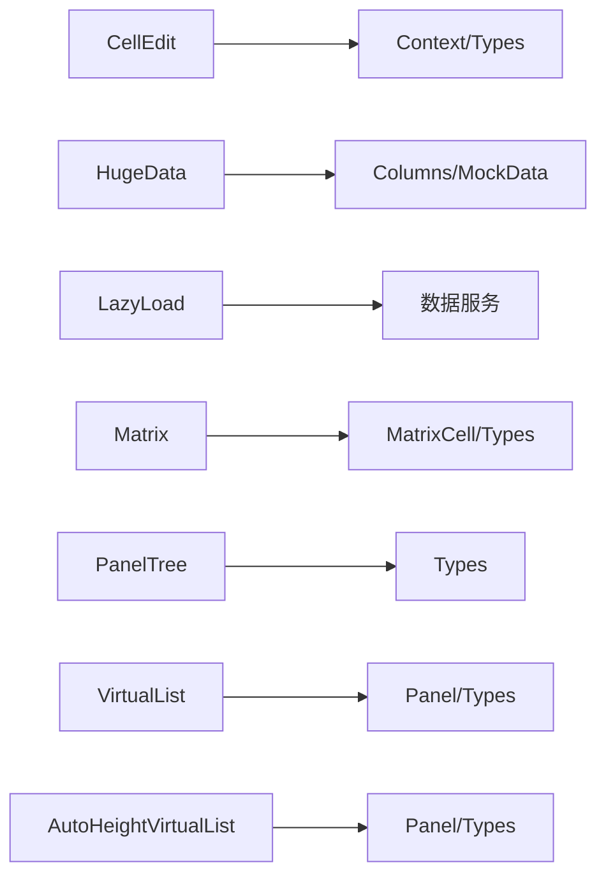

# 演示案例

<cite>
**本文引用的文件**   
- [docs-demo/demos/CellEdit/index.tsx](file://docs-demo/demos/CellEdit/index.tsx)
- [docs-demo/demos/CellEdit/EditCell.tsx](file://docs-demo/demos/CellEdit/EditCell.tsx)
- [docs-demo/demos/CellEdit/EditRowSwitch.tsx](file://docs-demo/demos/CellEdit/EditRowSwitch.tsx)
- [docs-demo/demos/CellEdit/context.ts](file://docs-demo/demos/CellEdit/context.ts)
- [docs-demo/demos/CellEdit/type.ts](file://docs-demo/demos/CellEdit/type.ts)
- [docs-demo/demos/HugeData/index.tsx](file://docs-demo/demos/HugeData/index.tsx)
- [docs-demo/demos/HugeData/mockData.ts](file://docs-demo/demos/HugeData/mockData.ts)
- [docs-demo/demos/HugeData/columns.tsx](file://docs-demo/demos/HugeData/columns.tsx)
- [docs-demo/demos/HugeData/event.ts](file://docs-demo/demos/HugeData/event.ts)
- [docs-demo/demos/HugeData/types.ts](file://docs-demo/demos/HugeData/types.ts)
- [docs-demo/demos/LazyLoad/index.tsx](file://docs-demo/demos/LazyLoad/index.tsx)
- [docs-demo/demos/Matrix/index.tsx](file://docs-demo/demos/Matrix/index.tsx)
- [docs-demo/demos/Matrix/MatrixCell.tsx](file://docs-demo/demos/Matrix/MatrixCell.tsx)
- [docs-demo/demos/Matrix/type.ts](file://docs-demo/demos/Matrix/type.ts)
- [docs-demo/demos/PanelTree/index.tsx](file://docs-demo/demos/PanelTree/index.tsx)
- [docs-demo/demos/PanelTree/type.ts](file://docs-demo/demos/PanelTree/type.ts)
- [docs-demo/demos/VirtualList/index.tsx](file://docs-demo/demos/VirtualList/index.tsx)
- [docs-demo/demos/VirtualList/Panel.tsx](file://docs-demo/demos/VirtualList/Panel.tsx)
- [docs-demo/demos/VirtualList/types.ts](file://docs-demo/demos/VirtualList/types.ts)
- [docs-demo/demos/VirtualList/AutoHeightVirtualList/index.tsx](file://docs-demo/demos/VirtualList/AutoHeightVirtualList/index.tsx)
- [docs-demo/demos/VirtualList/AutoHeightVirtualList/Panel.tsx](file://docs-demo/demos/VirtualList/AutoHeightVirtualList/Panel.tsx)
- [docs-demo/demos/VirtualList/AutoHeightVirtualList/types.ts](file://docs-demo/demos/VirtualList/AutoHeightVirtualList/types.ts)
- [docs-src/demos/cell-edit.md](file://docs-src/demos/cell-edit.md)
- [docs-src/demos/huge-data.md](file://docs-src/demos/huge-data.md)
- [docs-src/demos/lazy-load.md](file://docs-src/demos/lazy-load.md)
- [docs-src/demos/matrix.md](file://docs-src/demos/matrix.md)
- [docs-src/demos/panel-tree.md](file://docs-src/demos/panel-tree.md)
- [docs-src/demos/virtual-list.md](file://docs-src/demos/virtual-list.md)
</cite>

## 目录
1. [简介](#简介)
2. [项目结构](#项目结构)
3. [核心组件](#核心组件)
4. [架构总览](#架构总览)
5. [详细组件分析](#详细组件分析)
6. [依赖分析](#依赖分析)
7. [性能考虑](#性能考虑)
8. [故障排查指南](#故障排查指南)
9. [结论](#结论)
10. [附录](#附录)

## 简介
本章节聚焦 StkTable 在实际项目中的高级用法与完整示例，覆盖以下复杂场景：
- 单元格编辑（含行内切换、上下文状态管理）
- 大数据量处理（虚拟滚动、列渲染优化、事件解耦）
- 懒加载（按需展开、分页或滚动触发）
- 矩阵表格（行列交叉的自定义单元格）
- 面板树（树形数据 + 面板式布局）
- 虚拟列表（纵向/横向/自适应高度）

每个案例均包含：功能说明、实现要点、使用指导、组合方案、在线演示入口与源码路径。文末提供性能对比与优化建议，帮助开发者快速落地生产级应用。

## 项目结构
演示代码集中在 docs-demo/demos 目录下，按场景分目录组织；文档说明位于 docs-src/demos。以下为关键目录与职责概览：
- CellEdit：单元格编辑相关示例，包括行内编辑、行开关切换、上下文与类型定义
- HugeData：大数据量示例，包含数据生成、列配置、事件处理与类型
- LazyLoad：懒加载示例，展示按需加载策略
- Matrix：矩阵表格示例，行列交叉渲染与交互
- PanelTree：面板树示例，树形结构与面板组合
- VirtualList：虚拟列表示例，含普通面板与自适应高度面板

[本节为概念性结构说明，不直接分析具体文件，故无“章节来源”]

## 核心组件
- 单元格编辑
  - 通过自定义单元格组件实现行内编辑，结合上下文与类型约束保证状态一致性
  - 支持整行编辑开关，便于批量控制
- 大数据量处理
  - 采用虚拟滚动与列渲染优化，避免一次性渲染大量节点
  - 事件处理与数据更新解耦，降低重排开销
- 懒加载
  - 在滚动到底部或展开节点时触发数据加载，减少首屏压力
- 矩阵表格
  - 基于行列映射的自定义单元格，适合指标/维度交叉展示
- 面板树
  - 将树形数据与面板布局结合，提升信息密度与导航效率
- 虚拟列表
  - 纵向/横向/自适应高度三种模式，适配不同业务容器

**章节来源**
- [docs-demo/demos/CellEdit/index.tsx](file://docs-demo/demos/CellEdit/index.tsx)
- [docs-demo/demos/HugeData/index.tsx](file://docs-demo/demos/HugeData/index.tsx)
- [docs-demo/demos/LazyLoad/index.tsx](file://docs-demo/demos/LazyLoad/index.tsx)
- [docs-demo/demos/Matrix/index.tsx](file://docs-demo/demos/Matrix/index.tsx)
- [docs-demo/demos/PanelTree/index.tsx](file://docs-demo/demos/PanelTree/index.tsx)
- [docs-demo/demos/VirtualList/index.tsx](file://docs-demo/demos/VirtualList/index.tsx)

## 架构总览
下图展示了各演示模块与其文档说明之间的对应关系，以及内部子模块的组织方式。

```mermaid
graph TB
A["CellEdit 示例"] --> A1["index.tsx"]
A --> A2["EditCell.tsx"]
A --> A3["EditRowSwitch.tsx"]
A --> A4["context.ts"]
A --> A5["type.ts"]
B["HugeData 示例"] --> B1["index.tsx"]
B --> B2["mockData.ts"]
B --> B3["columns.tsx"]
B --> B4["event.ts"]
B --> B5["types.ts"]
C["LazyLoad 示例"] --> C1["index.tsx"]
D["Matrix 示例"] --> D1["index.tsx"]
D --> D2["MatrixCell.tsx"]
D --> D3["type.ts"]
E["PanelTree 示例"] --> E1["index.tsx"]
E --> E2["type.ts"]
F["VirtualList 示例"] --> F1["index.tsx"]
F --> F2["Panel.tsx"]
F --> F3["types.ts"]
F --> F4["AutoHeightVirtualList/index.tsx"]
F --> F5["AutoHeightVirtualList/Panel.tsx"]
F --> F6["AutoHeightVirtualList/types.ts"]
```

**图表来源**
- [docs-demo/demos/CellEdit/index.tsx](file://docs-demo/demos/CellEdit/index.tsx)
- [docs-demo/demos/CellEdit/EditCell.tsx](file://docs-demo/demos/CellEdit/EditCell.tsx)
- [docs-demo/demos/CellEdit/EditRowSwitch.tsx](file://docs-demo/demos/CellEdit/EditRowSwitch.tsx)
- [docs-demo/demos/CellEdit/context.ts](file://docs-demo/demos/CellEdit/context.ts)
- [docs-demo/demos/CellEdit/type.ts](file://docs-demo/demos/CellEdit/type.ts)
- [docs-demo/demos/HugeData/index.tsx](file://docs-demo/demos/HugeData/index.tsx)
- [docs-demo/demos/HugeData/mockData.ts](file://docs-demo/demos/HugeData/mockData.ts)
- [docs-demo/demos/HugeData/columns.tsx](file://docs-demo/demos/HugeData/columns.tsx)
- [docs-demo/demos/HugeData/event.ts](file://docs-demo/demos/HugeData/event.ts)
- [docs-demo/demos/HugeData/types.ts](file://docs-demo/demos/HugeData/types.ts)
- [docs-demo/demos/LazyLoad/index.tsx](file://docs-demo/demos/LazyLoad/index.tsx)
- [docs-demo/demos/Matrix/index.tsx](file://docs-demo/demos/Matrix/index.tsx)
- [docs-demo/demos/Matrix/MatrixCell.tsx](file://docs-demo/demos/Matrix/MatrixCell.tsx)
- [docs-demo/demos/Matrix/type.ts](file://docs-demo/demos/Matrix/type.ts)
- [docs-demo/demos/PanelTree/index.tsx](file://docs-demo/demos/PanelTree/index.tsx)
- [docs-demo/demos/PanelTree/type.ts](file://docs-demo/demos/PanelTree/type.ts)
- [docs-demo/demos/VirtualList/index.tsx](file://docs-demo/demos/VirtualList/index.tsx)
- [docs-demo/demos/VirtualList/Panel.tsx](file://docs-demo/demos/VirtualList/Panel.tsx)
- [docs-demo/demos/VirtualList/types.ts](file://docs-demo/demos/VirtualList/types.ts)
- [docs-demo/demos/VirtualList/AutoHeightVirtualList/index.tsx](file://docs-demo/demos/VirtualList/AutoHeightVirtualList/index.tsx)
- [docs-demo/demos/VirtualList/AutoHeightVirtualList/Panel.tsx](file://docs-demo/demos/VirtualList/AutoHeightVirtualList/Panel.tsx)
- [docs-demo/demos/VirtualList/AutoHeightVirtualList/types.ts](file://docs-demo/demos/VirtualList/AutoHeightVirtualList/types.ts)

## 详细组件分析

### 单元格编辑（CellEdit）
- 功能说明
  - 行内编辑：点击单元格进入编辑态，提交后回写数据源
  - 行级编辑开关：一键开启/关闭某行的所有可编辑字段
  - 上下文管理：通过 React Context 共享编辑状态与回调
- 实现要点
  - 自定义单元格组件封装输入控件与校验逻辑
  - 行开关组件维护行级编辑标志位
  - 类型定义统一字段与编辑值类型，确保 TS 安全
- 使用指导
  - 在列配置中指定可编辑列及编辑器组件
  - 监听数据变更事件，持久化到后端或本地存储
  - 结合表单校验规则，阻止非法提交
- 组合方案
  - 与虚拟列表组合：仅对可见行启用编辑，减少内存占用
  - 与筛选/排序组合：编辑后刷新视图并保持当前页码与排序状态

**图表来源**
- [docs-demo/demos/CellEdit/EditCell.tsx](file://docs-demo/demos/CellEdit/EditCell.tsx)
- [docs-demo/demos/CellEdit/context.ts](file://docs-demo/demos/CellEdit/context.ts)
- [docs-demo/demos/CellEdit/type.ts](file://docs-demo/demos/CellEdit/type.ts)

**章节来源**
- [docs-demo/demos/CellEdit/index.tsx](file://docs-demo/demos/CellEdit/index.tsx)
- [docs-demo/demos/CellEdit/EditCell.tsx](file://docs-demo/demos/CellEdit/EditCell.tsx)
- [docs-demo/demos/CellEdit/EditRowSwitch.tsx](file://docs-demo/demos/CellEdit/EditRowSwitch.tsx)
- [docs-demo/demos/CellEdit/context.ts](file://docs-demo/demos/CellEdit/context.ts)
- [docs-demo/demos/CellEdit/type.ts](file://docs-demo/demos/CellEdit/type.ts)
- [docs-src/demos/cell-edit.md](file://docs-src/demos/cell-edit.md)

### 大数据量处理（HugeData）
- 功能说明
  - 百万级数据渲染：通过虚拟滚动与列渲染优化保持流畅
  - 事件解耦：将交互事件与数据更新分离，避免连锁重渲染
- 实现要点
  - 数据生成器：构造大规模模拟数据，便于压测
  - 列配置：精简列内容，避免复杂计算
  - 事件处理：使用防抖/节流与增量更新
- 使用指导
  - 合理设置行高与可视区域，平衡性能与体验
  - 对长文本与富媒体进行裁剪或懒加载
- 组合方案
  - 与固定列/冻结头组合：注意虚拟滚动下的对齐与边界处理
  - 与搜索/过滤组合：服务端分页+前端虚拟滚动

**图表来源**
- [docs-demo/demos/HugeData/index.tsx](file://docs-demo/demos/HugeData/index.tsx)
- [docs-demo/demos/HugeData/mockData.ts](file://docs-demo/demos/HugeData/mockData.ts)
- [docs-demo/demos/HugeData/columns.tsx](file://docs-demo/demos/HugeData/columns.tsx)
- [docs-demo/demos/HugeData/event.ts](file://docs-demo/demos/HugeData/event.ts)
- [docs-demo/demos/HugeData/types.ts](file://docs-demo/demos/HugeData/types.ts)

**章节来源**
- [docs-demo/demos/HugeData/index.tsx](file://docs-demo/demos/HugeData/index.tsx)
- [docs-demo/demos/HugeData/mockData.ts](file://docs-demo/demos/HugeData/mockData.ts)
- [docs-demo/demos/HugeData/columns.tsx](file://docs-demo/demos/HugeData/columns.tsx)
- [docs-demo/demos/HugeData/event.ts](file://docs-demo/demos/HugeData/event.ts)
- [docs-demo/demos/HugeData/types.ts](file://docs-demo/demos/HugeData/types.ts)
- [docs-src/demos/huge-data.md](file://docs-src/demos/huge-data.md)

### 懒加载（LazyLoad）
- 功能说明
  - 按需加载：滚动到底部或展开节点时触发数据请求
  - 占位与骨架屏：提升感知性能
- 实现要点
  - 监听滚动位置与阈值，触发加载函数
  - 合并重复请求与去重键，避免抖动
- 使用指导
  - 合理设置预加载阈值，兼顾首屏与后续体验
  - 失败重试与错误提示
- 组合方案
  - 与树形数据组合：节点展开即加载子节点
  - 与虚拟列表组合：可视区外延迟渲染

**图表来源**
- [docs-demo/demos/LazyLoad/index.tsx](file://docs-demo/demos/LazyLoad/index.tsx)

**章节来源**
- [docs-demo/demos/LazyLoad/index.tsx](file://docs-demo/demos/LazyLoad/index.tsx)
- [docs-src/demos/lazy-load.md](file://docs-src/demos/lazy-load.md)

### 矩阵表格（Matrix）
- 功能说明
  - 行列交叉展示：适用于指标×维度的报表场景
  - 自定义单元格：根据行列坐标渲染不同内容
- 实现要点
  - 行列元数据与映射表：构建索引以快速定位
  - 单元格组件：接收行列标识与数据，决定渲染逻辑
- 使用指导
  - 控制行列数量，避免过大导致性能问题
  - 对热点单元格做缓存与懒渲染
- 组合方案
  - 与筛选/排序组合：动态调整行列集合
  - 与导出/打印组合：生成静态矩阵快照

**图表来源**
- [docs-demo/demos/Matrix/index.tsx](file://docs-demo/demos/Matrix/index.tsx)
- [docs-demo/demos/Matrix/MatrixCell.tsx](file://docs-demo/demos/Matrix/MatrixCell.tsx)
- [docs-demo/demos/Matrix/type.ts](file://docs-demo/demos/Matrix/type.ts)

**章节来源**
- [docs-demo/demos/Matrix/index.tsx](file://docs-demo/demos/Matrix/index.tsx)
- [docs-demo/demos/Matrix/MatrixCell.tsx](file://docs-demo/demos/Matrix/MatrixCell.tsx)
- [docs-demo/demos/Matrix/type.ts](file://docs-demo/demos/Matrix/type.ts)
- [docs-src/demos/matrix.md](file://docs-src/demos/matrix.md)

### 面板树（PanelTree）
- 功能说明
  - 树形导航 + 面板内容：提高信息密度与操作效率
  - 节点展开/折叠联动面板内容更新
- 实现要点
  - 树数据结构：扁平化或嵌套均可，需维护父子关系
  - 面板容器：根据选中节点渲染对应内容
- 使用指导
  - 默认展开层级与键控策略
  - 大树的虚拟滚动与懒加载
- 组合方案
  - 与表格组合：左侧树筛选，右侧表格展示
  - 与标签页组合：多面板并行打开

**图表来源**
- [docs-demo/demos/PanelTree/index.tsx](file://docs-demo/demos/PanelTree/index.tsx)
- [docs-demo/demos/PanelTree/type.ts](file://docs-demo/demos/PanelTree/type.ts)

**章节来源**
- [docs-demo/demos/PanelTree/index.tsx](file://docs-demo/demos/PanelTree/index.tsx)
- [docs-demo/demos/PanelTree/type.ts](file://docs-demo/demos/PanelTree/type.ts)
- [docs-src/demos/panel-tree.md](file://docs-src/demos/panel-tree.md)

### 虚拟列表（VirtualList）
- 功能说明
  - 纵向/横向/自适应高度三种模式，满足多样容器需求
  - 面板式内容：每行可承载复杂 UI
- 实现要点
  - 视口计算与偏移：精准定位可见区间
  - 高度预估与自适应：处理不定高内容的滚动稳定性
- 使用指导
  - 设置合适的行高与缓冲区域
  - 对复杂面板进行懒渲染与缓存
- 组合方案
  - 与树形数据组合：虚拟树
  - 与拖拽/选择组合：保持选中态与滚动位置一致

**图表来源**
- [docs-demo/demos/VirtualList/index.tsx](file://docs-demo/demos/VirtualList/index.tsx)
- [docs-demo/demos/VirtualList/Panel.tsx](file://docs-demo/demos/VirtualList/Panel.tsx)
- [docs-demo/demos/VirtualList/types.ts](file://docs-demo/demos/VirtualList/types.ts)
- [docs-demo/demos/VirtualList/AutoHeightVirtualList/index.tsx](file://docs-demo/demos/VirtualList/AutoHeightVirtualList/index.tsx)
- [docs-demo/demos/VirtualList/AutoHeightVirtualList/Panel.tsx](file://docs-demo/demos/VirtualList/AutoHeightVirtualList/Panel.tsx)
- [docs-demo/demos/VirtualList/AutoHeightVirtualList/types.ts](file://docs-demo/demos/VirtualList/AutoHeightVirtualList/types.ts)

**章节来源**
- [docs-demo/demos/VirtualList/index.tsx](file://docs-demo/demos/VirtualList/index.tsx)
- [docs-demo/demos/VirtualList/Panel.tsx](file://docs-demo/demos/VirtualList/Panel.tsx)
- [docs-demo/demos/VirtualList/types.ts](file://docs-demo/demos/VirtualList/types.ts)
- [docs-demo/demos/VirtualList/AutoHeightVirtualList/index.tsx](file://docs-demo/demos/VirtualList/AutoHeightVirtualList/index.tsx)
- [docs-demo/demos/VirtualList/AutoHeightVirtualList/Panel.tsx](file://docs-demo/demos/VirtualList/AutoHeightVirtualList/Panel.tsx)
- [docs-demo/demos/VirtualList/AutoHeightVirtualList/types.ts](file://docs-demo/demos/VirtualList/AutoHeightVirtualList/types.ts)
- [docs-src/demos/virtual-list.md](file://docs-src/demos/virtual-list.md)

## 依赖分析
- 模块内聚与耦合
  - 各演示模块相对独立，通过 props/context 通信，耦合度低
  - 类型定义集中管理，利于复用与维护
- 外部依赖
  - 主要依赖 React 生态与 StkTable 组件库
  - 第三方 UI 组件按需引入，避免打包体积膨胀
- 潜在循环依赖
  - 当前结构未见明显循环引用，建议在新增模块时保持单向依赖

**图表来源**
- [docs-demo/demos/CellEdit/context.ts](file://docs-demo/demos/CellEdit/context.ts)
- [docs-demo/demos/CellEdit/type.ts](file://docs-demo/demos/CellEdit/type.ts)
- [docs-demo/demos/HugeData/columns.tsx](file://docs-demo/demos/HugeData/columns.tsx)
- [docs-demo/demos/HugeData/mockData.ts](file://docs-demo/demos/HugeData/mockData.ts)
- [docs-demo/demos/Matrix/MatrixCell.tsx](file://docs-demo/demos/Matrix/MatrixCell.tsx)
- [docs-demo/demos/Matrix/type.ts](file://docs-demo/demos/Matrix/type.ts)
- [docs-demo/demos/PanelTree/type.ts](file://docs-demo/demos/PanelTree/type.ts)
- [docs-demo/demos/VirtualList/Panel.tsx](file://docs-demo/demos/VirtualList/Panel.tsx)
- [docs-demo/demos/VirtualList/types.ts](file://docs-demo/demos/VirtualList/types.ts)
- [docs-demo/demos/VirtualList/AutoHeightVirtualList/Panel.tsx](file://docs-demo/demos/VirtualList/AutoHeightVirtualList/Panel.tsx)
- [docs-demo/demos/VirtualList/AutoHeightVirtualList/types.ts](file://docs-demo/demos/VirtualList/AutoHeightVirtualList/types.ts)

**章节来源**
- [docs-demo/demos/CellEdit/context.ts](file://docs-demo/demos/CellEdit/context.ts)
- [docs-demo/demos/HugeData/columns.tsx](file://docs-demo/demos/HugeData/columns.tsx)
- [docs-demo/demos/Matrix/MatrixCell.tsx](file://docs-demo/demos/Matrix/MatrixCell.tsx)
- [docs-demo/demos/PanelTree/type.ts](file://docs-demo/demos/PanelTree/type.ts)
- [docs-demo/demos/VirtualList/Panel.tsx](file://docs-demo/demos/VirtualList/Panel.tsx)
- [docs-demo/demos/VirtualList/AutoHeightVirtualList/Panel.tsx](file://docs-demo/demos/VirtualList/AutoHeightVirtualList/Panel.tsx)

## 性能考虑
- 渲染性能
  - 优先使用虚拟滚动与列渲染优化，避免一次性渲染过多节点
  - 对复杂单元格进行懒渲染与缓存，减少重绘
- 交互性能
  - 事件处理使用防抖/节流，避免高频触发导致的卡顿
  - 数据更新采用增量策略，缩小 diff 范围
- 内存占用
  - 及时释放不可见节点的引用，避免内存泄漏
  - 大数据场景下限制同时存在的编辑态与弹窗数量
- 网络与 I/O
  - 懒加载与分页结合，减少单次响应体大小
  - 请求合并与去重，避免抖动与重复渲染

[本节为通用性能建议，不直接分析具体文件，故无“章节来源”]

## 故障排查指南
- 常见问题
  - 滚动错位：检查行高配置与自适应高度策略
  - 编辑态丢失：确认上下文状态是否与数据源同步
  - 大数据卡顿：验证虚拟滚动参数与列渲染复杂度
- 定位方法
  - 使用浏览器性能面板记录时间线，定位主线程阻塞点
  - 在关键路径添加日志，观察数据流与事件触发频率
- 修复建议
  - 拆分复杂组件，降低单组件职责
  - 对长列表使用稳定 key，避免不必要的重建

[本节为通用排查建议，不直接分析具体文件，故无“章节来源”]

## 结论
通过上述六大场景的完整示例，StkTable 能够高效应对企业级复杂表格需求。建议在生产环境中：
- 以虚拟滚动为基础，结合懒加载与列优化
- 将编辑、筛选、排序等能力模块化，便于组合复用
- 建立性能基线与监控，持续优化用户体验

[本节为总结性内容，不直接分析具体文件，故无“章节来源”]

## 附录
- 在线演示与源码下载
  - 单元格编辑：[演示入口](file://docs-src/demos/cell-edit.md) | [源码路径](file://docs-demo/demos/CellEdit/index.tsx)
  - 大数据量：[演示入口](file://docs-src/demos/huge-data.md) | [源码路径](file://docs-demo/demos/HugeData/index.tsx)
  - 懒加载：[演示入口](file://docs-src/demos/lazy-load.md) | [源码路径](file://docs-demo/demos/LazyLoad/index.tsx)
  - 矩阵表格：[演示入口](file://docs-src/demos/matrix.md) | [源码路径](file://docs-demo/demos/Matrix/index.tsx)
  - 面板树：[演示入口](file://docs-src/demos/panel-tree.md) | [源码路径](file://docs-demo/demos/PanelTree/index.tsx)
  - 虚拟列表：[演示入口](file://docs-src/demos/virtual-list.md) | [源码路径](file://docs-demo/demos/VirtualList/index.tsx)

[本节为资源指引，不直接分析具体文件，故无“章节来源”]