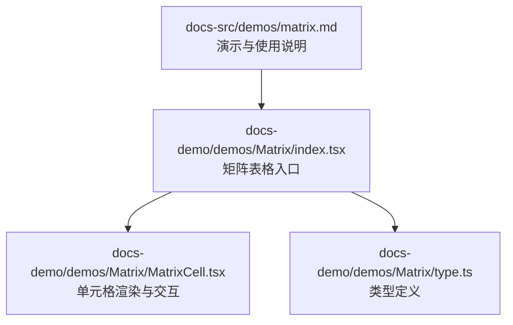
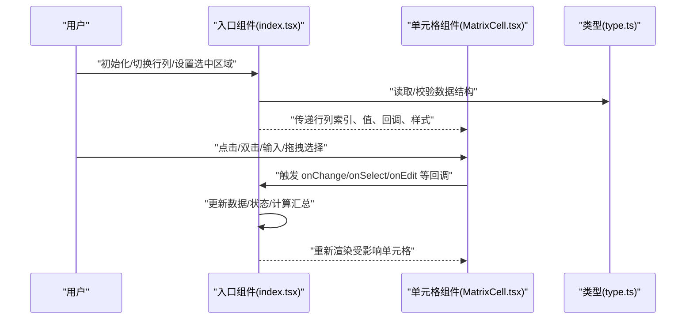
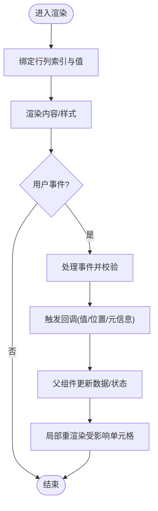
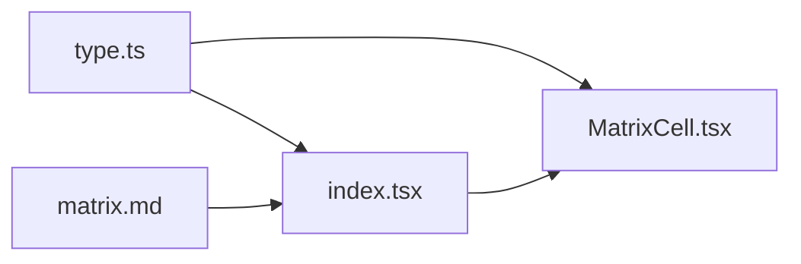

# 矩阵表格

<cite>
**本文引用的文件**   
- [Matrix/index.tsx](file://docs-demo/demos/Matrix/index.tsx)
- [Matrix/MatrixCell.tsx](file://docs-demo/demos/Matrix/MatrixCell.tsx)
- [Matrix/type.ts](file://docs-demo/demos/Matrix/type.ts)
- [demos/matrix.md](file://docs-src/demos/matrix.md)
</cite>

## 目录
1. [简介](#简介)
2. [项目结构](#项目结构)
3. [核心组件](#核心组件)
4. [架构总览](#架构总览)
5. [详细组件分析](#详细组件分析)
6. [依赖关系分析](#依赖关系分析)
7. [性能考虑](#性能考虑)
8. [故障排查指南](#故障排查指南)
9. [结论](#结论)
10. [附录](#附录)

## 简介
本章节面向需要在 React 应用中实现“矩阵表格”（二维数据网格）的开发者，聚焦以下目标：
- 高效展示与交互：行列交叉操作、动态计算、样式定制。
- 关键组件 MatrixCell 的实现要点：数据绑定、事件处理、性能优化。
- 复杂业务场景的数据处理方案与用户交互设计。
- 扩展性与可维护性的最佳实践。

## 项目结构
矩阵表格示例位于 demos 目录下，包含入口页面、单元格组件与类型定义；文档说明位于 docs-src/demos 下。

图示来源
- [Matrix/index.tsx](file://docs-demo/demos/Matrix/index.tsx)
- [Matrix/MatrixCell.tsx](file://docs-demo/demos/Matrix/MatrixCell.tsx)
- [Matrix/type.ts](file://docs-demo/demos/Matrix/type.ts)
- [demos/matrix.md](file://docs-src/demos/matrix.md)

章节来源
- [Matrix/index.tsx](file://docs-demo/demos/Matrix/index.tsx)
- [Matrix/MatrixCell.tsx](file://docs-demo/demos/Matrix/MatrixCell.tsx)
- [Matrix/type.ts](file://docs-demo/demos/Matrix/type.ts)
- [demos/matrix.md](file://docs-src/demos/matrix.md)

## 核心组件
- 入口组件（Matrix/index.tsx）
  - 负责准备二维数据源、列头与行头配置、状态管理（如选中区域、编辑态）、事件分发与回调。
  - 将列头、行头与单元格渲染逻辑组合，形成完整的矩阵视图。
- 单元格组件（Matrix/MatrixCell.tsx）
  - 负责单个单元格的渲染、输入/选择交互、值变更回写、样式与高亮等。
  - 通过 props 接收行列索引、当前值、回调函数等，完成数据绑定与事件处理。
- 类型定义（Matrix/type.ts）
  - 定义矩阵数据结构、列/行配置、单元格属性、事件参数等类型，确保类型安全与可扩展性。

章节来源
- [Matrix/index.tsx](file://docs-demo/demos/Matrix/index.tsx)
- [Matrix/MatrixCell.tsx](file://docs-demo/demos/Matrix/MatrixCell.tsx)
- [Matrix/type.ts](file://docs-demo/demos/Matrix/type.ts)

## 架构总览
下图展示了矩阵表格的整体交互流程：入口组件组织数据与状态，向单元格下发渲染所需信息；单元格在交互时触发回调，由入口组件统一更新数据与状态。

图示来源
- [Matrix/index.tsx](file://docs-demo/demos/Matrix/index.tsx)
- [Matrix/MatrixCell.tsx](file://docs-demo/demos/Matrix/MatrixCell.tsx)
- [Matrix/type.ts](file://docs-demo/demos/Matrix/type.ts)

## 详细组件分析

### 入口组件（Matrix/index.tsx）
职责与关键点
- 数据准备：构建二维数组或对象映射，支持行列维度扩展。
- 状态管理：维护选中区域、编辑态、排序/过滤结果、汇总计算缓存等。
- 事件分发：将单元格事件转发到上层处理器，进行数据一致性校验与副作用处理。
- 渲染编排：根据行列配置生成表头与主体区域，按需渲染单元格。

建议实现模式
- 使用不可变更新策略，避免不必要的重渲染。
- 对大矩阵采用虚拟滚动或分页加载（结合项目其他能力）。
- 将计算密集型逻辑（如汇总、筛选）放入独立模块或 Web Worker。

章节来源
- [Matrix/index.tsx](file://docs-demo/demos/Matrix/index.tsx)

### 单元格组件（Matrix/MatrixCell.tsx）
职责与关键点
- 数据绑定：从 props 获取行列索引、当前值、只读/禁用状态、样式类名等。
- 事件处理：封装 click、dblclick、input、change、blur、focus、drag 等事件，向上抛出标准化事件。
- 交互反馈：提供 hover、active、selected、editing 等视觉状态。
- 性能优化：使用 memo 化、受控/非受控模式可选、最小化 re-render 范围。

典型交互流程

图示来源
- [Matrix/MatrixCell.tsx](file://docs-demo/demos/Matrix/MatrixCell.tsx)

章节来源
- [Matrix/MatrixCell.tsx](file://docs-demo/demos/Matrix/MatrixCell.tsx)

### 类型定义（Matrix/type.ts）
作用与建议
- 明确矩阵数据结构：行键、列键、值类型、元数据（如合并、锁定、统计）。
- 定义列/行配置：标题、宽度、对齐、排序、过滤、是否固定等。
- 定义事件参数：行列坐标、旧值/新值、鼠标/键盘事件对象、上下文信息。
- 为后续扩展预留字段：如自定义渲染插槽、国际化文案、权限控制等。

章节来源
- [Matrix/type.ts](file://docs-demo/demos/Matrix/type.ts)

## 依赖关系分析
- 入口组件依赖类型定义以保障数据结构一致。
- 单元格组件依赖入口组件提供的回调与样式，保持无状态或弱状态。
- 文档说明与示例代码相互印证，便于快速上手与二次开发。

图示来源
- [Matrix/index.tsx](file://docs-demo/demos/Matrix/index.tsx)
- [Matrix/MatrixCell.tsx](file://docs-demo/demos/Matrix/MatrixCell.tsx)
- [Matrix/type.ts](file://docs-demo/demos/Matrix/type.ts)
- [demos/matrix.md](file://docs-src/demos/matrix.md)

章节来源
- [Matrix/index.tsx](file://docs-demo/demos/Matrix/index.tsx)
- [Matrix/MatrixCell.tsx](file://docs-demo/demos/Matrix/MatrixCell.tsx)
- [Matrix/type.ts](file://docs-demo/demos/Matrix/type.ts)
- [demos/matrix.md](file://docs-src/demos/matrix.md)

## 性能考虑
- 渲染优化
  - 仅重渲染变化单元格：基于行列坐标作为 key，配合 memo 化减少无关更新。
  - 虚拟滚动：对超大矩阵启用行列虚拟滚动，降低 DOM 节点数量。
  - 增量更新：使用不可变数据结构与浅比较，避免整表重绘。
- 计算优化
  - 汇总/筛选/排序结果缓存，按维度粒度失效。
  - 复杂计算异步化（requestIdleCallback/Web Worker），避免阻塞主线程。
- 交互优化
  - 防抖/节流：输入与拖拽选择场景下减少频繁回调。
  - 事件委托：在容器层集中处理高频事件，降低监听器开销。
- 内存优化
  - 及时释放临时对象与大数组引用。
  - 避免闭包捕获过大对象，必要时使用稳定引用。

[本节为通用指导，不直接分析具体文件]

## 故障排查指南
常见问题与定位思路
- 单元格不更新
  - 检查 key 是否稳定且唯一（行列坐标组合）。
  - 确认回调是否正确回写数据，父组件是否触发了必要的状态更新。
- 交互卡顿
  - 排查是否存在同步重型计算；引入缓存或异步策略。
  - 检查是否缺少 memo 化或存在多余的全局状态订阅。
- 样式错乱
  - 确认样式类名与主题变量命名空间隔离，避免全局污染。
  - 检查固定列/冻结区与滚动容器的层级关系。
- 事件冲突
  - 区分单击/双击/拖拽选择的事件冒泡顺序，必要时阻止默认行为。
  - 在容器层统一拦截与分发，避免重复处理。

章节来源
- [Matrix/index.tsx](file://docs-demo/demos/Matrix/index.tsx)
- [Matrix/MatrixCell.tsx](file://docs-demo/demos/Matrix/MatrixCell.tsx)

## 结论
通过入口组件与单元格组件的职责分离、严格的类型约束以及合理的性能优化策略，矩阵表格能够在大数据量与复杂交互场景下保持稳定与流畅。建议在项目中复用该模式，并结合虚拟滚动、计算缓存与事件委托等手段进一步提升体验。

[本节为总结性内容，不直接分析具体文件]

## 附录
- 参考文档
  - 演示与使用说明见：[demos/matrix.md](file://docs-src/demos/matrix.md)
- 相关示例
  - 若需对比学习，可参考仓库中其他高级特性示例（如虚拟列表、区域选择、自定义单元格等），以便将矩阵表格与现有能力融合。

章节来源
- [demos/matrix.md](file://docs-src/demos/matrix.md)