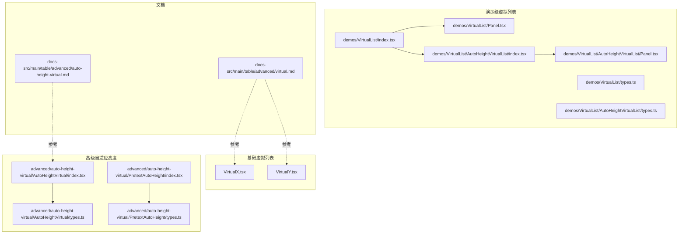
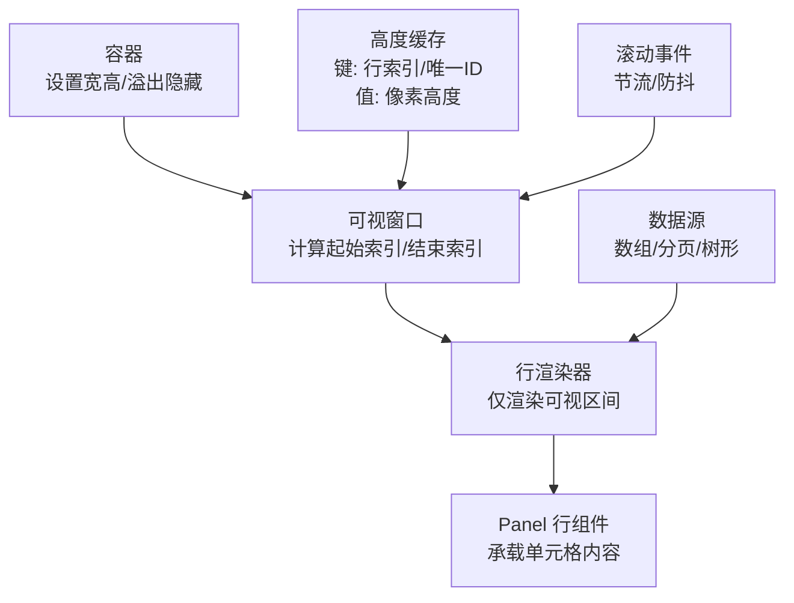
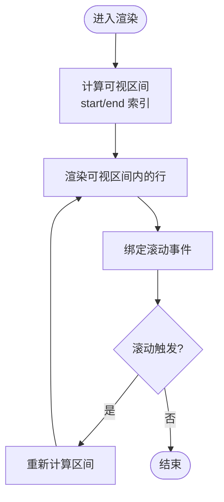
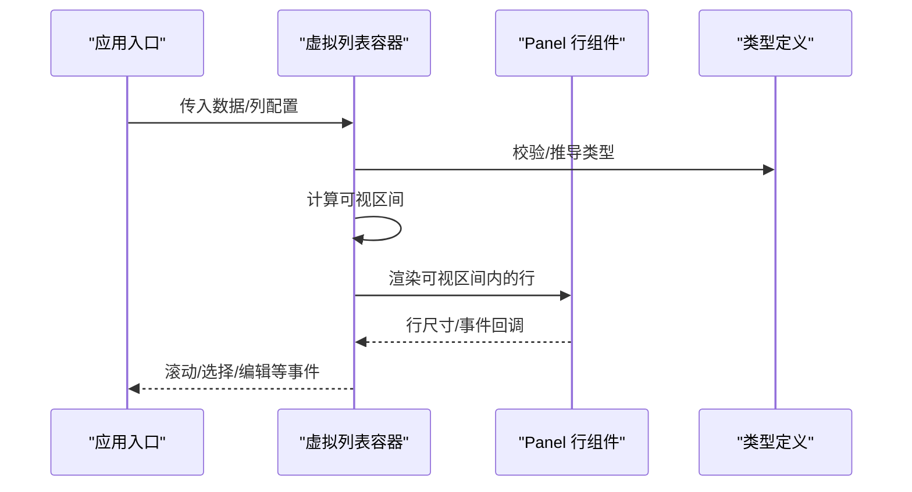
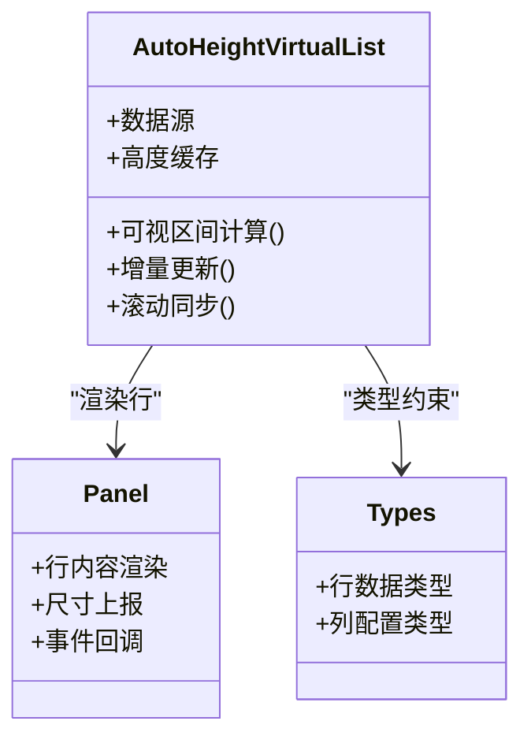
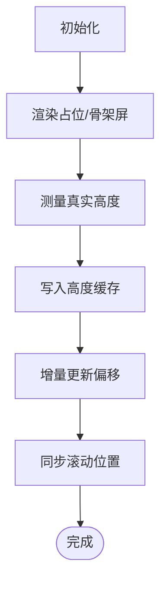
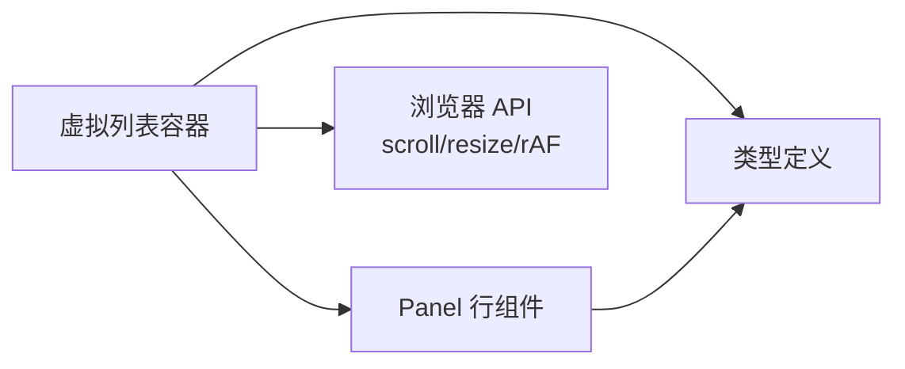

# 虚拟列表

<cite>
**本文引用的文件**   
- [docs-demo/advanced/virtual/VirtualX.tsx](file://docs-demo/advanced/virtual/VirtualX.tsx)
- [docs-demo/advanced/virtual/VirtualY.tsx](file://docs-demo/advanced/virtual/VirtualY.tsx)
- [docs-demo/demos/VirtualList/index.tsx](file://docs-demo/demos/VirtualList/index.tsx)
- [docs-demo/demos/VirtualList/Panel.tsx](file://docs-demo/demos/VirtualList/Panel.tsx)
- [docs-demo/demos/VirtualList/types.ts](file://docs-demo/demos/VirtualList/types.ts)
- [docs-demo/demos/VirtualList/AutoHeightVirtualList/index.tsx](file://docs-demo/demos/VirtualList/AutoHeightVirtualList/index.tsx)
- [docs-demo/demos/VirtualList/AutoHeightVirtualList/Panel.tsx](file://docs-demo/demos/VirtualList/AutoHeightVirtualList/Panel.tsx)
- [docs-demo/demos/VirtualList/AutoHeightVirtualList/types.ts](file://docs-demo/demos/VirtualList/AutoHeightVirtualList/types.ts)
- [docs-demo/advanced/auto-height-virtual/AutoHeightVirtual/index.tsx](file://docs-demo/advanced/auto-height-virtual/AutoHeightVirtual/index.tsx)
- [docs-demo/advanced/auto-height-virtual/AutoHeightVirtual/types.ts](file://docs-demo/advanced/auto-height-virtual/AutoHeightVirtual/types.ts)
- [docs-demo/advanced/auto-height-virtual/PretextAutoHeight/index.tsx](file://docs-demo/advanced/auto-height-virtual/PretextAutoHeight/index.tsx)
- [docs-demo/advanced/auto-height-virtual/PretextAutoHeight/types.ts](file://docs-demo/advanced/auto-height-virtual/PretextAutoHeight/types.ts)
- [docs-src/main/table/advanced/auto-height-virtual.md](file://docs-src/main/table/advanced/auto-height-virtual.md)
- [docs-src/main/table/advanced/virtual.md](file://docs-src/main/table/advanced/virtual.md)
</cite>

## 目录
1. [简介](#简介)
2. [项目结构](#项目结构)
3. [核心组件](#核心组件)
4. [架构总览](#架构总览)
5. [详细组件分析](#详细组件分析)
6. [依赖关系分析](#依赖关系分析)
7. [性能考量](#性能考量)
8. [故障排查指南](#故障排查指南)
9. [结论](#结论)
10. [附录](#附录)

## 简介
本文件聚焦于“虚拟列表”能力，覆盖固定高度与自适应高度的两种实现路径，重点解析 Panel 组件设计模式、滚动监听、内存管理策略，以及 AutoHeightVirtualList 的高级用法（动态高度计算与性能优化）。文档同时提供不同场景下的配置方案与调优建议，帮助开发者构建流畅的长列表体验。

## 项目结构
仓库中与虚拟列表相关的代码主要分布在以下位置：
- 基础虚拟列表示例：docs-demo/advanced/virtual
- 演示级虚拟列表与 Panel 组合：docs-demo/demos/VirtualList
- 自适应高度虚拟列表示例与类型定义：docs-demo/demos/VirtualList/AutoHeightVirtualList
- 高级自适应高度示例：docs-demo/advanced/auto-height-virtual
- 文档说明：docs-src/main/table/advanced

图表来源
- [docs-demo/advanced/virtual/VirtualX.tsx](file://docs-demo/advanced/virtual/VirtualX.tsx)
- [docs-demo/advanced/virtual/VirtualY.tsx](file://docs-demo/advanced/virtual/VirtualY.tsx)
- [docs-demo/demos/VirtualList/index.tsx](file://docs-demo/demos/VirtualList/index.tsx)
- [docs-demo/demos/VirtualList/Panel.tsx](file://docs-demo/demos/VirtualList/Panel.tsx)
- [docs-demo/demos/VirtualList/types.ts](file://docs-demo/demos/VirtualList/types.ts)
- [docs-demo/demos/VirtualList/AutoHeightVirtualList/index.tsx](file://docs-demo/demos/VirtualList/AutoHeightVirtualList/index.tsx)
- [docs-demo/demos/VirtualList/AutoHeightVirtualList/Panel.tsx](file://docs-demo/demos/VirtualList/AutoHeightVirtualList/Panel.tsx)
- [docs-demo/demos/VirtualList/AutoHeightVirtualList/types.ts](file://docs-demo/demos/VirtualList/AutoHeightVirtualList/types.ts)
- [docs-demo/advanced/auto-height-virtual/AutoHeightVirtual/index.tsx](file://docs-demo/advanced/auto-height-virtual/AutoHeightVirtual/index.tsx)
- [docs-demo/advanced/auto-height-virtual/AutoHeightVirtual/types.ts](file://docs-demo/advanced/auto-height-virtual/AutoHeightVirtual/types.ts)
- [docs-demo/advanced/auto-height-virtual/PretextAutoHeight/index.tsx](file://docs-demo/advanced/auto-height-virtual/PretextAutoHeight/index.tsx)
- [docs-demo/advanced/auto-height-virtual/PretextAutoHeight/types.ts](file://docs-demo/advanced/auto-height-virtual/PretextAutoHeight/types.ts)
- [docs-src/main/table/advanced/auto-height-virtual.md](file://docs-src/main/table/advanced/auto-height-virtual.md)
- [docs-src/main/table/advanced/virtual.md](file://docs-src/main/table/advanced/virtual.md)

章节来源
- [docs-demo/advanced/virtual/VirtualX.tsx](file://docs-demo/advanced/virtual/VirtualX.tsx)
- [docs-demo/advanced/virtual/VirtualY.tsx](file://docs-demo/advanced/virtual/VirtualY.tsx)
- [docs-demo/demos/VirtualList/index.tsx](file://docs-demo/demos/VirtualList/index.tsx)
- [docs-demo/demos/VirtualList/Panel.tsx](file://docs-demo/demos/VirtualList/Panel.tsx)
- [docs-demo/demos/VirtualList/types.ts](file://docs-demo/demos/VirtualList/types.ts)
- [docs-demo/demos/VirtualList/AutoHeightVirtualList/index.tsx](file://docs-demo/demos/VirtualList/AutoHeightVirtualList/index.tsx)
- [docs-demo/demos/VirtualList/AutoHeightVirtualList/Panel.tsx](file://docs-demo/demos/VirtualList/AutoHeightVirtualList/Panel.tsx)
- [docs-demo/demos/VirtualList/AutoHeightVirtualList/types.ts](file://docs-demo/demos/VirtualList/AutoHeightVirtualList/types.ts)
- [docs-demo/advanced/auto-height-virtual/AutoHeightVirtual/index.tsx](file://docs-demo/advanced/auto-height-virtual/AutoHeightVirtual/index.tsx)
- [docs-demo/advanced/auto-height-virtual/AutoHeightVirtual/types.ts](file://docs-demo/advanced/auto-height-virtual/AutoHeightVirtual/types.ts)
- [docs-demo/advanced/auto-height-virtual/PretextAutoHeight/index.tsx](file://docs-demo/advanced/auto-height-virtual/PretextAutoHeight/index.tsx)
- [docs-demo/advanced/auto-height-virtual/PretextAutoHeight/types.ts](file://docs-demo/advanced/auto-height-virtual/PretextAutoHeight/types.ts)
- [docs-src/main/table/advanced/auto-height-virtual.md](file://docs-src/main/table/advanced/auto-height-virtual.md)
- [docs-src/main/table/advanced/virtual.md](file://docs-src/main/table/advanced/virtual.md)

## 核心组件
- 基础虚拟列表（固定高度）
  - 水平方向虚拟滚动：通过控制可见窗口与偏移量渲染少量行，减少 DOM 节点数量。
  - 垂直方向虚拟滚动：基于容器可视高度与行高估算，仅渲染可视区域附近的行。
- 演示级虚拟列表（Panel 组合）
  - 使用 Panel 作为单行容器，配合虚拟列表在大数据集下保持渲染性能。
  - 通过 types 约束数据与列结构，保证类型安全与可维护性。
- 自适应高度虚拟列表（AutoHeightVirtualList）
  - 支持行内容高度动态变化，内部维护高度缓存与增量更新策略。
  - 结合 Panel 与类型定义，提供可扩展的自定义单元格与布局能力。
- 高级自适应高度示例
  - 展示更复杂的自适应场景，如预文本占位、复杂嵌套等。

章节来源
- [docs-demo/advanced/virtual/VirtualX.tsx](file://docs-demo/advanced/virtual/VirtualX.tsx)
- [docs-demo/advanced/virtual/VirtualY.tsx](file://docs-demo/advanced/virtual/VirtualY.tsx)
- [docs-demo/demos/VirtualList/index.tsx](file://docs-demo/demos/VirtualList/index.tsx)
- [docs-demo/demos/VirtualList/Panel.tsx](file://docs-demo/demos/VirtualList/Panel.tsx)
- [docs-demo/demos/VirtualList/types.ts](file://docs-demo/demos/VirtualList/types.ts)
- [docs-demo/demos/VirtualList/AutoHeightVirtualList/index.tsx](file://docs-demo/demos/VirtualList/AutoHeightVirtualList/index.tsx)
- [docs-demo/demos/VirtualList/AutoHeightVirtualList/Panel.tsx](file://docs-demo/demos/VirtualList/AutoHeightVirtualList/Panel.tsx)
- [docs-demo/demos/VirtualList/AutoHeightVirtualList/types.ts](file://docs-demo/demos/VirtualList/AutoHeightVirtualList/types.ts)
- [docs-demo/advanced/auto-height-virtual/AutoHeightVirtual/index.tsx](file://docs-demo/advanced/auto-height-virtual/AutoHeightVirtual/index.tsx)
- [docs-demo/advanced/auto-height-virtual/PretextAutoHeight/index.tsx](file://docs-demo/advanced/auto-height-virtual/PretextAutoHeight/index.tsx)

## 架构总览
虚拟列表整体由“容器 + 可视窗口 + 行渲染器 + 高度缓存”构成。固定高度场景下，高度为常量；自适应高度场景下，需要测量并缓存每行高度，并在数据或样式变更时进行增量更新。

图表来源
- [docs-demo/demos/VirtualList/index.tsx](file://docs-demo/demos/VirtualList/index.tsx)
- [docs-demo/demos/VirtualList/Panel.tsx](file://docs-demo/demos/VirtualList/Panel.tsx)
- [docs-demo/demos/VirtualList/AutoHeightVirtualList/index.tsx](file://docs-demo/demos/VirtualList/AutoHeightVirtualList/index.tsx)
- [docs-demo/demos/VirtualList/AutoHeightVirtualList/Panel.tsx](file://docs-demo/demos/VirtualList/AutoHeightVirtualList/Panel.tsx)

## 详细组件分析

### 基础虚拟列表（固定高度）
- 目标
  - 在大量数据下，仅渲染可视区域内的行，避免一次性创建过多 DOM。
- 关键要点
  - 容器需固定高度并启用滚动条。
  - 根据滚动位置与行高计算当前可视区间的起止索引。
  - 使用 transform 或 top 偏移将可视区间定位到正确位置。
- 适用场景
  - 表格行高稳定、单元格内容简单、无复杂异步加载。

图表来源
- [docs-demo/advanced/virtual/VirtualX.tsx](file://docs-demo/advanced/virtual/VirtualX.tsx)
- [docs-demo/advanced/virtual/VirtualY.tsx](file://docs-demo/advanced/virtual/VirtualY.tsx)

章节来源
- [docs-demo/advanced/virtual/VirtualX.tsx](file://docs-demo/advanced/virtual/VirtualX.tsx)
- [docs-demo/advanced/virtual/VirtualY.tsx](file://docs-demo/advanced/virtual/VirtualY.tsx)

### 演示级虚拟列表（Panel 组合）
- 目标
  - 以 Panel 作为单行容器，封装行内布局与交互，提升复用性与可维护性。
- 关键要点
  - 通过 types 定义数据结构与列配置，确保类型安全。
  - 虚拟列表负责可视区间计算与渲染调度，Panel 专注行内表现。
- 适用场景
  - 中等复杂度行内容，需要统一行样式与交互逻辑。

图表来源
- [docs-demo/demos/VirtualList/index.tsx](file://docs-demo/demos/VirtualList/index.tsx)
- [docs-demo/demos/VirtualList/Panel.tsx](file://docs-demo/demos/VirtualList/Panel.tsx)
- [docs-demo/demos/VirtualList/types.ts](file://docs-demo/demos/VirtualList/types.ts)

章节来源
- [docs-demo/demos/VirtualList/index.tsx](file://docs-demo/demos/VirtualList/index.tsx)
- [docs-demo/demos/VirtualList/Panel.tsx](file://docs-demo/demos/VirtualList/Panel.tsx)
- [docs-demo/demos/VirtualList/types.ts](file://docs-demo/demos/VirtualList/types.ts)

### 自适应高度虚拟列表（AutoHeightVirtualList）
- 目标
  - 支持行内容高度动态变化，包括图片加载、折叠展开、富文本等场景。
- 关键要点
  - 高度缓存：以行索引或唯一 ID 为键，记录已测量的高度，避免重复测量。
  - 增量更新：当某行高度变化时，仅更新受影响区域的偏移量。
  - 滚动同步：在高度变更后快速恢复滚动位置，避免跳动。
  - 性能优化：对测量过程进行节流/防抖，必要时使用 requestAnimationFrame 批处理。
- 适用场景
  - 行内容高度不确定、存在异步资源加载或用户交互导致高度变化。

图表来源
- [docs-demo/demos/VirtualList/AutoHeightVirtualList/index.tsx](file://docs-demo/demos/VirtualList/AutoHeightVirtualList/index.tsx)
- [docs-demo/demos/VirtualList/AutoHeightVirtualList/Panel.tsx](file://docs-demo/demos/VirtualList/AutoHeightVirtualList/Panel.tsx)
- [docs-demo/demos/VirtualList/AutoHeightVirtualList/types.ts](file://docs-demo/demos/VirtualList/AutoHeightVirtualList/types.ts)

章节来源
- [docs-demo/demos/VirtualList/AutoHeightVirtualList/index.tsx](file://docs-demo/demos/VirtualList/AutoHeightVirtualList/index.tsx)
- [docs-demo/demos/VirtualList/AutoHeightVirtualList/Panel.tsx](file://docs-demo/demos/VirtualList/AutoHeightVirtualList/Panel.tsx)
- [docs-demo/demos/VirtualList/AutoHeightVirtualList/types.ts](file://docs-demo/demos/VirtualList/AutoHeightVirtualList/types.ts)

### 高级自适应高度示例
- 目标
  - 展示更复杂的自适应场景，例如预文本占位、复杂嵌套、懒加载等。
- 关键要点
  - 预占位：在真实高度未知时显示骨架屏或占位文本，降低重排抖动。
  - 渐进式测量：优先渲染低开销内容，再逐步替换为完整内容。
  - 边界处理：空数据、超长文本、极端高度等异常情况的兜底策略。

图表来源
- [docs-demo/advanced/auto-height-virtual/AutoHeightVirtual/index.tsx](file://docs-demo/advanced/auto-height-virtual/AutoHeightVirtual/index.tsx)
- [docs-demo/advanced/auto-height-virtual/PretextAutoHeight/index.tsx](file://docs-demo/advanced/auto-height-virtual/PretextAutoHeight/index.tsx)

章节来源
- [docs-demo/advanced/auto-height-virtual/AutoHeightVirtual/index.tsx](file://docs-demo/advanced/auto-height-virtual/AutoHeightVirtual/index.tsx)
- [docs-demo/advanced/auto-height-virtual/PretextAutoHeight/index.tsx](file://docs-demo/advanced/auto-height-virtual/PretextAutoHeight/index.tsx)

## 依赖关系分析
- 组件耦合
  - 虚拟列表容器与 Panel 解耦：容器负责可视区间与渲染调度，Panel 专注行内渲染与事件。
  - 类型定义集中管理：types.ts 统一约束数据与列结构，降低耦合度。
- 外部依赖
  - 浏览器 API：scroll、resize、requestAnimationFrame 等用于滚动监听与批处理。
  - 可选工具：节流/防抖函数用于高频事件优化。
- 潜在循环依赖
  - 通过类型与接口隔离，避免容器与行组件相互引用导致的循环依赖。

图表来源
- [docs-demo/demos/VirtualList/index.tsx](file://docs-demo/demos/VirtualList/index.tsx)
- [docs-demo/demos/VirtualList/Panel.tsx](file://docs-demo/demos/VirtualList/Panel.tsx)
- [docs-demo/demos/VirtualList/types.ts](file://docs-demo/demos/VirtualList/types.ts)
- [docs-demo/demos/VirtualList/AutoHeightVirtualList/index.tsx](file://docs-demo/demos/VirtualList/AutoHeightVirtualList/index.tsx)
- [docs-demo/demos/VirtualList/AutoHeightVirtualList/Panel.tsx](file://docs-demo/demos/VirtualList/AutoHeightVirtualList/Panel.tsx)
- [docs-demo/demos/VirtualList/AutoHeightVirtualList/types.ts](file://docs-demo/demos/VirtualList/AutoHeightVirtualList/types.ts)

章节来源
- [docs-demo/demos/VirtualList/index.tsx](file://docs-demo/demos/VirtualList/index.tsx)
- [docs-demo/demos/VirtualList/Panel.tsx](file://docs-demo/demos/VirtualList/Panel.tsx)
- [docs-demo/demos/VirtualList/types.ts](file://docs-demo/demos/VirtualList/types.ts)
- [docs-demo/demos/VirtualList/AutoHeightVirtualList/index.tsx](file://docs-demo/demos/VirtualList/AutoHeightVirtualList/index.tsx)
- [docs-demo/demos/VirtualList/AutoHeightVirtualList/Panel.tsx](file://docs-demo/demos/VirtualList/AutoHeightVirtualList/Panel.tsx)
- [docs-demo/demos/VirtualList/AutoHeightVirtualList/types.ts](file://docs-demo/demos/VirtualList/AutoHeightVirtualList/types.ts)

## 性能考量
- 固定高度
  - 优点：无需高度测量，计算简单，性能最优。
  - 建议：尽量保持行高一致，避免频繁样式切换。
- 自适应高度
  - 高度缓存：避免重复测量，显著降低重排开销。
  - 增量更新：只更新受影响的偏移量，减少整表重绘。
  - 滚动节流/防抖：限制高频滚动事件的处理频率。
  - 批处理：使用 requestAnimationFrame 合并多次更新。
  - 占位渲染：在高度未知时显示轻量占位，提升首帧体验。
- 内存管理
  - 回收不可见行的中间状态，避免内存泄漏。
  - 清理事件监听与定时器，防止组件卸载后继续占用资源。
- 大数据集
  - 分页或无限滚动：按需加载数据，降低初始渲染压力。
  - 虚拟化窗口大小：适当增大可视窗口以减少频繁重算。

[本节为通用指导，不直接分析具体文件]

## 故障排查指南
- 滚动位置跳变
  - 检查高度缓存是否及时更新，确认增量更新逻辑是否正确。
  - 验证滚动同步是否在高度变更后立即执行。
- 渲染闪烁
  - 检查是否存在未缓存的高度导致重复测量。
  - 确认占位渲染与真实内容替换的顺序。
- 内存增长
  - 检查是否清理事件监听与定时器。
  - 确认不可见行的中间状态是否被释放。
- 性能瓶颈
  - 评估滚动事件是否做了节流/防抖。
  - 考虑使用 requestAnimationFrame 批处理更新。

章节来源
- [docs-demo/demos/VirtualList/AutoHeightVirtualList/index.tsx](file://docs-demo/demos/VirtualList/AutoHeightVirtualList/index.tsx)
- [docs-demo/advanced/auto-height-virtual/AutoHeightVirtual/index.tsx](file://docs-demo/advanced/auto-height-virtual/AutoHeightVirtual/index.tsx)
- [docs-demo/advanced/auto-height-virtual/PretextAutoHeight/index.tsx](file://docs-demo/advanced/auto-height-virtual/PretextAutoHeight/index.tsx)

## 结论
虚拟列表通过可视区间渲染与高度缓存机制，有效解决了长列表的性能问题。固定高度场景下实现简单且性能优异；自适应高度场景则需要更精细的测量与更新策略。结合 Panel 组件的设计模式，可将行内逻辑与列表容器解耦，提升可维护性与扩展性。在实际项目中，应根据业务场景选择合适的方案，并结合节流、批处理、占位渲染等手段进一步优化用户体验。

[本节为总结性内容，不直接分析具体文件]

## 附录
- 相关文档
  - 自适应高度虚拟列表文档：docs-src/main/table/advanced/auto-height-virtual.md
  - 虚拟列表文档：docs-src/main/table/advanced/virtual.md

章节来源
- [docs-src/main/table/advanced/auto-height-virtual.md](file://docs-src/main/table/advanced/auto-height-virtual.md)
- [docs-src/main/table/advanced/virtual.md](file://docs-src/main/table/advanced/virtual.md)