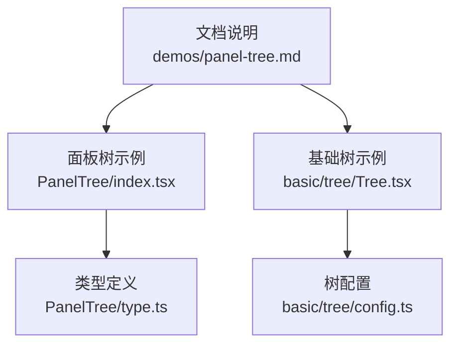
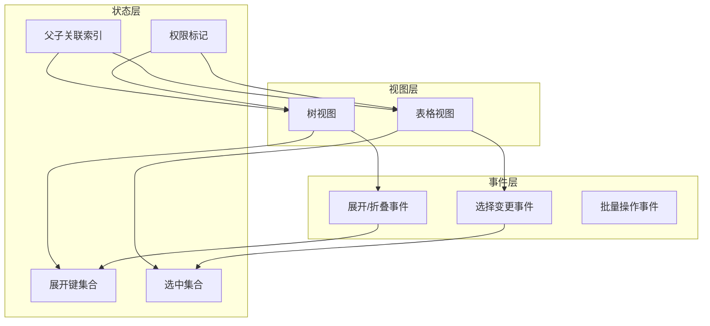
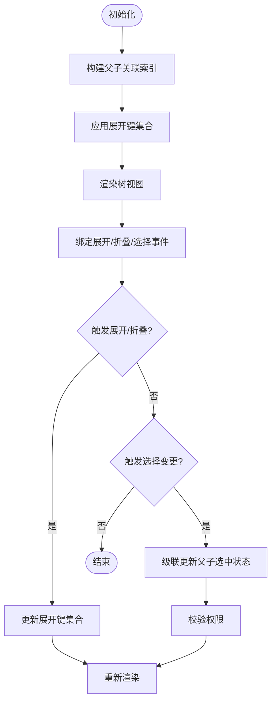
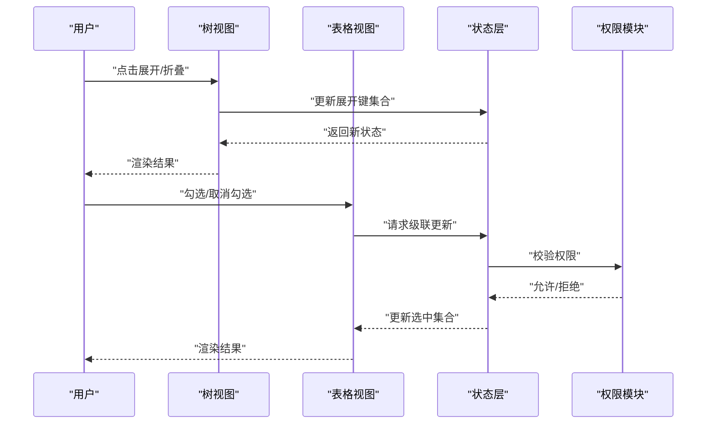
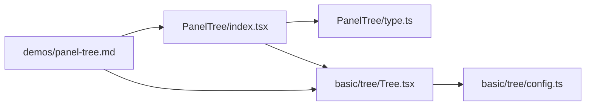

# 面板树

<cite>
**本文引用的文件**   
- [PanelTree/index.tsx](file://docs-demo/demos/PanelTree/index.tsx)
- [PanelTree/type.ts](file://docs-demo/demos/PanelTree/type.ts)
- [tree.tsx](file://docs-demo/basic/tree/Tree.tsx)
- [tree-config.ts](file://docs-demo/basic/tree/config.ts)
- [panel-tree.md](file://docs-src/demos/panel-tree.md)
</cite>

## 目录
1. [简介](#简介)
2. [项目结构](#项目结构)
3. [核心组件](#核心组件)
4. [架构总览](#架构总览)
5. [详细组件分析](#详细组件分析)
6. [依赖分析](#依赖分析)
7. [性能考虑](#性能考虑)
8. [故障排查指南](#故障排查指南)
9. [结论](#结论)
10. [附录](#附录)

## 简介
本文件围绕“面板树”能力，系统化阐述如何在表格中实现树形结构与表格的融合：支持层级数据的展开/折叠、节点操作与数据联动、父子关联、权限控制、批量操作等复杂业务逻辑；同时覆盖状态管理、渲染优化、响应式设计与无障碍访问方案。文档以仓库中的示例与基础树能力为依据，提供从数据结构到交互流程、从性能到可访问性的完整实践路径。

## 项目结构
面板树示例位于演示目录，基础树能力由通用树配置与示例支撑。关键位置如下：
- 面板树示例入口与类型定义
  - docs-demo/demos/PanelTree/index.tsx
  - docs-demo/demos/PanelTree/type.ts
- 基础树能力与示例
  - docs-demo/basic/tree/Tree.tsx
  - docs-demo/basic/tree/config.ts
- 文档说明
  - docs-src/demos/panel-tree.md

图示来源
- [PanelTree/index.tsx](file://docs-demo/demos/PanelTree/index.tsx)
- [PanelTree/type.ts](file://docs-demo/demos/PanelTree/type.ts)
- [tree.tsx](file://docs-demo/basic/tree/Tree.tsx)
- [tree-config.ts](file://docs-demo/basic/tree/config.ts)
- [panel-tree.md](file://docs-src/demos/panel-tree.md)

章节来源
- [PanelTree/index.tsx](file://docs-demo/demos/PanelTree/index.tsx)
- [PanelTree/type.ts](file://docs-demo/demos/PanelTree/type.ts)
- [tree.tsx](file://docs-demo/basic/tree/Tree.tsx)
- [tree-config.ts](file://docs-demo/basic/tree/config.ts)
- [panel-tree.md](file://docs-src/demos/panel-tree.md)

## 核心组件
- 面板树容器（示例）
  - 负责将树形数据与表格列组合，处理展开/折叠、选中联动、批量操作等交互。
  - 通过类型定义约束树节点字段与表格列映射关系。
- 基础树能力
  - 提供树形渲染、展开/折叠、默认展开策略、虚拟滚动等通用能力，作为面板树的底层支撑。

章节来源
- [PanelTree/index.tsx](file://docs-demo/demos/PanelTree/index.tsx)
- [PanelTree/type.ts](file://docs-demo/demos/PanelTree/type.ts)
- [tree.tsx](file://docs-demo/basic/tree/Tree.tsx)
- [tree-config.ts](file://docs-demo/basic/tree/config.ts)

## 架构总览
面板树在概念上由“树层 + 表格层 + 状态层 + 事件总线”构成：
- 树层：负责层级展示、展开/折叠、缩进与图标。
- 表格层：承载行数据、列渲染、排序/筛选/选择等。
- 状态层：维护展开键集合、选中集合、父/子关联、权限标记等。
- 事件总线：统一派发节点点击、展开/折叠、选择变更、批量操作等事件。

[此图为概念性架构图，不直接映射具体源码文件]

## 详细组件分析

### 数据结构设计
- 树节点模型
  - 唯一标识：用于展开/折叠与选中定位。
  - 显示文本：用于树节点与表格单元格展示。
  - 层级信息：深度或路径，用于缩进与面包屑。
  - 子节点引用：children 数组或扁平化 id->parent 映射。
  - 扩展字段：如是否叶子、是否禁用、权限标记、统计值等。
- 表格列映射
  - 列 key 与节点字段一一对应，支持自定义渲染器。
  - 对树节点特有字段（如 children）进行隐藏或特殊处理。
- 父子关联索引
  - 为高效计算全选/半选、级联更新，维护 parent->children 与 child->parent 的双向索引。

章节来源
- [PanelTree/type.ts](file://docs-demo/demos/PanelTree/type.ts)
- [tree-config.ts](file://docs-demo/basic/tree/config.ts)

### 状态管理
- 展开/折叠状态
  - 使用展开键集合维护当前可见层级，支持默认展开全部、按层级展开、按指定键展开。
- 选中状态
  - 维护选中键集合，支持单选/多选、全选/半选联动。
- 父子联动
  - 父节点选中时级联选中所有子孙；取消父节点时级联取消；子节点部分选中时父节点呈现半选态。
- 权限控制
  - 基于权限标记过滤不可见节点或禁用操作按钮，结合树与表格的渲染条件判断。
- 批量操作
  - 基于选中集合执行批量删除/导出/移动等操作，并在成功后刷新相关状态。

图示来源
- [tree.tsx](file://docs-demo/basic/tree/Tree.tsx)
- [tree-config.ts](file://docs-demo/basic/tree/config.ts)

章节来源
- [tree.tsx](file://docs-demo/basic/tree/Tree.tsx)
- [tree-config.ts](file://docs-demo/basic/tree/config.ts)

### 渲染优化
- 虚拟滚动
  - 大数据量场景下启用纵向/横向虚拟滚动，仅渲染可视区域行，降低 DOM 压力。
- 增量更新
  - 基于 key 稳定标识减少不必要的重渲染，局部更新展开/选中状态。
- 懒加载
  - 按需加载子节点数据，避免一次性加载全量树数据。
- 列固定与合并
  - 固定首列或关键列，提升树形结构的可读性与操作效率。

章节来源
- [tree.tsx](file://docs-demo/basic/tree/Tree.tsx)
- [tree-config.ts](file://docs-demo/basic/tree/config.ts)

### 交互与事件流
- 展开/折叠
  - 点击树节点展开图标切换展开键集合，并触发对应回调。
- 选择联动
  - 勾选框变更触发级联更新，保持父子一致性与半选态正确。
- 批量操作
  - 工具栏或右键菜单触发批量动作，读取选中集合执行后刷新状态。
- 权限控制
  - 根据权限标记禁用不可用操作，或在树/表格层隐藏敏感列与节点。

图示来源
- [tree.tsx](file://docs-demo/basic/tree/Tree.tsx)
- [tree-config.ts](file://docs-demo/basic/tree/config.ts)

章节来源
- [tree.tsx](file://docs-demo/basic/tree/Tree.tsx)
- [tree-config.ts](file://docs-demo/basic/tree/config.ts)

### 复杂业务逻辑
- 父子节点关联
  - 双向索引确保快速查找父/子节点，保证级联操作的 O(1) 复杂度。
- 权限控制
  - 节点级与列级权限双重控制，未授权节点不可见或不可操作。
- 批量操作
  - 跨页/跨层级批量选择，提交前二次确认，失败回滚。
- 数据联动
  - 树与表格共享同一份数据源，任一侧变更同步至另一侧。

章节来源
- [PanelTree/index.tsx](file://docs-demo/demos/PanelTree/index.tsx)
- [PanelTree/type.ts](file://docs-demo/demos/PanelTree/type.ts)
- [tree.tsx](file://docs-demo/basic/tree/Tree.tsx)
- [tree-config.ts](file://docs-demo/basic/tree/config.ts)

### 响应式设计
- 自适应布局
  - 在小屏设备上自动调整列宽、隐藏次要列、启用横向滚动。
- 触摸友好
  - 增大点击热区，支持滑动展开/折叠手势。
- 字体与间距
  - 根据屏幕密度动态调整字号与行高，提升可读性。

[本节为通用指导，不直接分析具体文件]

### 无障碍访问（a11y）
- 键盘导航
  - 支持 Tab/Shift+Tab 聚焦、Enter/Space 展开/折叠、方向键在树节点间移动。
- 语义化标签
  - 使用合适的 role、aria-expanded、aria-selected 等属性描述状态。
- 焦点管理
  - 展开/折叠后保持焦点在目标节点，避免焦点丢失。
- 屏幕阅读器
  - 提供清晰的节点层级与选中状态播报。

[本节为通用指导，不直接分析具体文件]

## 依赖分析
- 面板树示例依赖基础树能力与类型定义
- 基础树能力提供展开/折叠、默认展开策略、虚拟滚动等
- 文档说明串联示例与配置，便于理解整体用法

图示来源
- [PanelTree/index.tsx](file://docs-demo/demos/PanelTree/index.tsx)
- [PanelTree/type.ts](file://docs-demo/demos/PanelTree/type.ts)
- [tree.tsx](file://docs-demo/basic/tree/Tree.tsx)
- [tree-config.ts](file://docs-demo/basic/tree/config.ts)
- [panel-tree.md](file://docs-src/demos/panel-tree.md)

章节来源
- [PanelTree/index.tsx](file://docs-demo/demos/PanelTree/index.tsx)
- [PanelTree/type.ts](file://docs-demo/demos/PanelTree/type.ts)
- [tree.tsx](file://docs-demo/basic/tree/Tree.tsx)
- [tree-config.ts](file://docs-demo/basic/tree/config.ts)
- [panel-tree.md](file://docs-src/demos/panel-tree.md)

## 性能考虑
- 大数据量
  - 优先启用虚拟滚动，限制初始展开层级，按需懒加载子节点。
- 频繁交互
  - 使用稳定的 key，避免整表重渲染；批量操作采用事务式更新。
- 内存占用
  - 及时释放不可见节点的缓存，避免长列表导致的内存泄漏。
- 网络请求
  - 对懒加载请求做去抖与并发控制，失败重试与降级策略。

[本节为通用指导，不直接分析具体文件]

## 故障排查指南
- 展开/折叠无效
  - 检查展开键集合是否正确更新，是否存在重复 key 导致冲突。
- 父子选中不一致
  - 验证级联逻辑是否覆盖所有子孙节点，半选态计算是否准确。
- 权限导致节点不可见
  - 确认权限标记与渲染条件匹配，必要时在控制台输出中间状态。
- 虚拟滚动错位
  - 核对行高是否固定或可预估，列宽变化后是否触发尺寸测量。
- 批量操作失败
  - 检查选中集合是否为空，服务端返回码与前端状态同步是否一致。

[本节为通用指导，不直接分析具体文件]

## 结论
面板树通过将树形结构与表格深度融合，提供了强大的层级数据管理能力。借助清晰的数据结构设计、稳健的状态管理与高效的渲染策略，可实现复杂的父子关联、权限控制与批量操作。配合响应式设计与无障碍访问方案，可在多端与多场景下获得一致的体验。

[本节为总结性内容，不直接分析具体文件]

## 附录
- 参考文档
  - 面板树使用说明：docs-src/demos/panel-tree.md
- 相关示例
  - 基础树示例与配置：docs-demo/basic/tree/Tree.tsx、docs-demo/basic/tree/config.ts
  - 面板树示例与类型：docs-demo/demos/PanelTree/index.tsx、docs-demo/demos/PanelTree/type.ts

章节来源
- [panel-tree.md](file://docs-src/demos/panel-tree.md)
- [tree.tsx](file://docs-demo/basic/tree/Tree.tsx)
- [tree-config.ts](file://docs-demo/basic/tree/config.ts)
- [PanelTree/index.tsx](file://docs-demo/demos/PanelTree/index.tsx)
- [PanelTree/type.ts](file://docs-demo/demos/PanelTree/type.ts)