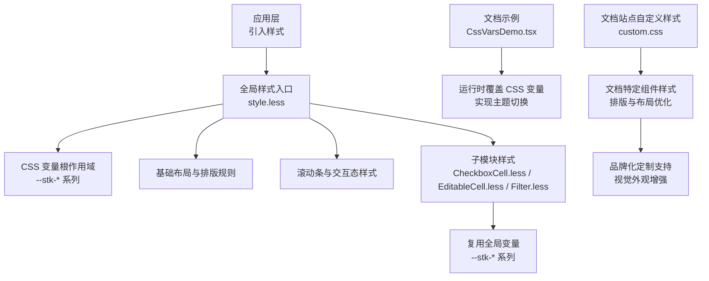
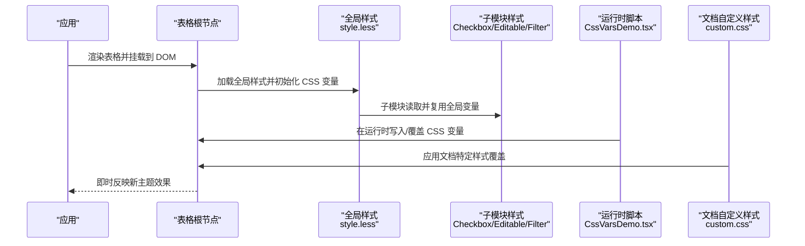
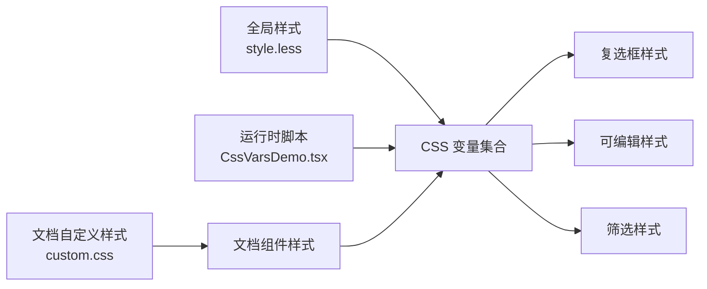

# 主题定制

<cite>
**本文引用的文件**   
- [src/StkTable/style.less](file://src/StkTable/style.less)
- [src/StkTable/custom-cells/CheckboxCell/CheckboxCell.less](file://src/StkTable/custom-cells/CheckboxCell/CheckboxCell.less)
- [src/StkTable/custom-cells/EditableCell/EditableCell.less](file://src/StkTable/custom-cells/EditableCell/EditableCell.less)
- [src/StkTable/custom-cells/FilterCell/Filter.less](file://src/StkTable/custom-cells/FilterCell/Filter.less)
- [docs-demo/basic/theme/CssVarsDemo.tsx](file://docs-demo/basic/theme/CssVarsDemo.tsx)
- [lib/style.css](file://lib/style.css)
</cite>

## 更新摘要
**变更内容**   
- 新增文档站点自定义 CSS 样式模块，增强视觉外观、排版和布局调整
- 扩展主题定制能力，支持更丰富的组件样式覆盖
- 完善文档站点的品牌化定制支持

## 目录
1. [简介](#简介)
2. [项目结构](#项目结构)
3. [核心组件](#核心组件)
4. [架构总览](#架构总览)
5. [详细组件分析](#详细组件分析)
6. [依赖分析](#依赖分析)
7. [性能考虑](#性能考虑)
8. [故障排查指南](#故障排查指南)
9. [结论](#结论)
10. [附录](#附录)

## 简介
本章节面向希望深度定制 StkTable 外观与行为的开发者，围绕 CSS 变量系统、颜色体系、尺寸与字体设置、响应式与暗黑模式支持、动态主题切换等能力展开。文档提供从设计令牌管理到样式模块化、浏览器兼容性处理的全流程指南，并通过实际案例展示如何实现品牌化定制与个性化主题，帮助开发者轻松实现符合设计规范的一致表格外观。

**更新** 新增了文档站点专用的自定义 CSS 样式模块，提供更丰富的视觉定制能力和组件样式覆盖选项。

## 项目结构
StkTable 的主题相关样式主要集中于以下位置：
- 全局样式入口与基础变量定义位于组件库源码的样式文件中
- 内置自定义单元格（复选框、可编辑、筛选）拥有独立的样式模块
- 文档示例中提供了基于 CSS 变量的主题演示入口
- **新增** 文档站点自定义 CSS 样式模块，专门针对 stk-table-react 文档需求进行优化

**图表来源**
- [src/StkTable/style.less](file://src/StkTable/style.less)
- [src/StkTable/custom-cells/CheckboxCell/CheckboxCell.less](file://src/StkTable/custom-cells/CheckboxCell/CheckboxCell.less)
- [src/StkTable/custom-cells/EditableCell/EditableCell.less](file://src/StkTable/custom-cells/EditableCell/EditableCell.less)
- [src/StkTable/custom-cells/FilterCell/Filter.less](file://src/StkTable/custom-cells/FilterCell/Filter.less)
- [docs-demo/basic/theme/CssVarsDemo.tsx](file://docs-demo/basic/theme/CssVarsDemo.tsx)

**章节来源**
- [src/StkTable/style.less](file://src/StkTable/style.less)
- [src/StkTable/custom-cells/CheckboxCell/CheckboxCell.less](file://src/StkTable/custom-cells/CheckboxCell/CheckboxCell.less)
- [src/StkTable/custom-cells/EditableCell/EditableCell.less](file://src/StkTable/custom-cells/EditableCell/EditableCell.less)
- [src/StkTable/custom-cells/FilterCell/Filter.less](file://src/StkTable/custom-cells/FilterCell/Filter.less)
- [docs-demo/basic/theme/CssVarsDemo.tsx](file://docs-demo/basic/theme/CssVarsDemo.tsx)

## 核心组件
本节聚焦主题定制的核心机制：CSS 变量系统与样式覆盖策略。

- 变量命名空间与作用域
  - 使用统一的变量前缀组织主题令牌，便于在组件树内就近覆盖
  - 通过根级容器注入变量，确保局部主题生效且不影响全局其他表格实例
- 颜色系统
  - 语义化色板：背景、文本、边框、强调、状态（成功/警告/错误）、禁用态等
  - 明度层级：通过统一明度阶梯保证对比度与可读性
- 尺寸与间距
  - 行高、列宽、单元格内边距、圆角、阴影等维度变量
- 字体与排版
  - 字族、字号、行高、字重、字间距等变量
- 交互与动效
  - 悬停、选中、激活、禁用态的颜色与过渡时长
- 滚动条与溢出
  - 滚动条轨道、滑块、箭头等视觉变量
- 响应式与暗黑模式
  - 媒体查询与 prefers-color-scheme 结合变量切换
  - 运行时通过 JS 更新 CSS 变量实现动态主题
- **新增** 文档站点专用样式
  - 针对文档内容的排版优化和视觉增强
  - 组件特定的样式覆盖和品牌化定制支持

**章节来源**
- [src/StkTable/style.less](file://src/StkTable/style.less)
- [src/StkTable/custom-cells/CheckboxCell/CheckboxCell.less](file://src/StkTable/custom-cells/CheckboxCell/CheckboxCell.less)
- [src/StkTable/custom-cells/EditableCell/EditableCell.less](file://src/StkTable/custom-cells/EditableCell/EditableCell.less)
- [src/StkTable/custom-cells/FilterCell/Filter.less](file://src/StkTable/custom-cells/FilterCell/Filter.less)

## 架构总览
下图展示了主题变量在渲染链路中的传播路径与覆盖方式。

**图表来源**
- [src/StkTable/style.less](file://src/StkTable/style.less)
- [src/StkTable/custom-cells/CheckboxCell/CheckboxCell.less](file://src/StkTable/custom-cells/CheckboxCell/CheckboxCell.less)
- [src/StkTable/custom-cells/EditableCell/EditableCell.less](file://src/StkTable/custom-cells/EditableCell/EditableCell.less)
- [src/StkTable/custom-cells/FilterCell/Filter.less](file://src/StkTable/custom-cells/FilterCell/Filter.less)
- [docs-demo/basic/theme/CssVarsDemo.tsx](file://docs-demo/basic/theme/CssVarsDemo.tsx)

## 详细组件分析

### 全局样式与变量体系
- 变量组织原则
  - 采用"语义化 + 层级化"的命名约定，将颜色、尺寸、字体、动效等分门别类
  - 通过根容器限定变量作用域，避免跨组件污染
- 关键类别
  - 颜色：主色、中性色、功能色、状态色、透明度层级
  - 尺寸：行高、单元格内边距、圆角、阴影、分割线宽度
  - 字体：字族、字号、行高、字重、字间距
  - 交互：悬停、选中、禁用、焦点态
  - 滚动条：轨道、滑块、箭头、悬浮态
- 覆盖策略
  - 在应用层或表格根节点上重新声明同名变量即可覆盖默认值
  - 建议按"最小必要覆盖"的原则进行定制，减少维护成本

**章节来源**
- [src/StkTable/style.less](file://src/StkTable/style.less)

### 内置自定义单元格样式
- 复选框单元格
  - 复用全局颜色与尺寸变量，保持与表格整体一致
  - 可通过覆盖变量调整选中态颜色、尺寸与对齐
- 可编辑单元格
  - 输入框、占位符、校验态均基于变量驱动
  - 支持通过变量统一修改边框、圆角、阴影与过渡
- 筛选单元格
  - 下拉面板、分隔线、高亮项等样式由变量控制
  - 支持通过变量适配不同品牌风格

**章节来源**
- [src/StkTable/custom-cells/CheckboxCell/CheckboxCell.less](file://src/StkTable/custom-cells/CheckboxCell/CheckboxCell.less)
- [src/StkTable/custom-cells/EditableCell/EditableCell.less](file://src/StkTable/custom-cells/EditableCell/EditableCell.less)
- [src/StkTable/custom-cells/FilterCell/Filter.less](file://src/StkTable/custom-cells/FilterCell/Filter.less)

### 主题切换与运行时更新
- 静态覆盖
  - 在页面或组件根节点上直接声明变量，实现一次性主题替换
- 动态切换
  - 通过 JavaScript 在运行时读写 CSS 变量，实现无刷新主题切换
  - 可结合用户偏好、系统主题或业务配置进行自动切换
- 示例参考
  - 文档示例演示了如何在运行时更新变量以切换主题

**章节来源**
- [docs-demo/basic/theme/CssVarsDemo.tsx](file://docs-demo/basic/theme/CssVarsDemo.tsx)

### 暗黑模式与响应式主题
- 暗黑模式
  - 利用 prefers-color-scheme 媒体查询为深色环境提供默认变量集
  - 可在运行时覆盖变量以强制启用或禁用暗黑模式
- 响应式
  - 针对不同视口调整行高、字号、内边距等变量，提升小屏体验
  - 结合断点变量与媒体查询实现自适应布局

**章节来源**
- [src/StkTable/style.less](file://src/StkTable/style.less)

### 构建产物与样式引入
- 发布包样式
  - 构建产物包含编译后的样式文件，可直接在应用中引入
- 引入建议
  - 优先引入构建产物样式，再按需覆盖变量
  - 若需二次开发，可从源码样式入手，统一管理变量

**章节来源**
- [lib/style.css](file://lib/style.css)

### 文档站点自定义样式模块
**新增** 文档站点专用的自定义 CSS 样式模块，提供以下增强功能：

- 视觉外观优化
  - 改进文档内容的整体视觉效果和可读性
  - 优化标题、段落、代码块等元素的排版
- 布局调整
  - 针对文档页面的特殊布局需求进行调整
  - 优化侧边栏、主内容区域的显示效果
- 组件样式覆盖
  - 针对 stk-table-react 文档特有的组件进行样式定制
  - 提供品牌化的视觉风格支持
- 响应式适配
  - 确保在不同设备上都有良好的显示效果
  - 优化移动端阅读体验

**章节来源**
- [docs-src/.vitepress/src/custom.css](file://docs-src/.vitepress/src/custom.css)

## 依赖分析
主题系统的依赖关系清晰且低耦合：
- 全局样式作为单一事实源，集中定义变量与基础规则
- 子模块样式仅依赖全局变量，不直接相互引用，降低耦合
- 运行时脚本通过 DOM API 操作 CSS 变量，无需侵入组件逻辑
- **新增** 文档自定义样式独立于核心主题系统，通过选择器覆盖实现

**图表来源**
- [src/StkTable/style.less](file://src/StkTable/style.less)
- [src/StkTable/custom-cells/CheckboxCell/CheckboxCell.less](file://src/StkTable/custom-cells/CheckboxCell/CheckboxCell.less)
- [src/StkTable/custom-cells/EditableCell/EditableCell.less](file://src/StkTable/custom-cells/EditableCell/EditableCell.less)
- [src/StkTable/custom-cells/FilterCell/Filter.less](file://src/StkTable/custom-cells/FilterCell/Filter.less)
- [docs-demo/basic/theme/CssVarsDemo.tsx](file://docs-demo/basic/theme/CssVarsDemo.tsx)

**章节来源**
- [src/StkTable/style.less](file://src/StkTable/style.less)
- [src/StkTable/custom-cells/CheckboxCell/CheckboxCell.less](file://src/StkTable/custom-cells/CheckboxCell/CheckboxCell.less)
- [src/StkTable/custom-cells/EditableCell/EditableCell.less](file://src/StkTable/custom-cells/EditableCell/EditableCell.less)
- [src/StkTable/custom-cells/FilterCell/Filter.less](file://src/StkTable/custom-cells/FilterCell/Filter.less)
- [docs-demo/basic/theme/CssVarsDemo.tsx](file://docs-demo/basic/theme/CssVarsDemo.tsx)

## 性能考虑
- 变量覆盖开销极低，建议在根节点集中管理，避免频繁变更
- 大量变量时建议使用构建工具进行压缩与去重
- 动画与过渡属性应谨慎使用，避免在大数据量场景造成抖动
- 滚动条与阴影等视觉效果可根据设备性能降级
- **新增** 文档自定义样式应保持轻量，避免影响页面加载性能

## 故障排查指南
- 变量未生效
  - 检查变量是否被正确声明在目标作用域内
  - 确认样式加载顺序，确保覆盖样式晚于默认样式
- 主题切换闪烁
  - 避免在首屏后频繁触发重排，尽量批量更新变量
  - 对复杂主题切换使用 CSS 类名切换而非逐条变量更新
- 暗黑模式冲突
  - 明确 prefers-color-scheme 与运行时覆盖的优先级
  - 在必要时使用 !important 或更高特异性选择器进行兜底
- 滚动条样式异常
  - 检查浏览器兼容性与厂商前缀
  - 针对特定平台（如 macOS）做差异化处理
- **新增** 文档样式覆盖问题
  - 检查自定义样式的选择器特异性
  - 确认样式文件的加载顺序和优先级

## 结论
通过统一的 CSS 变量体系与清晰的覆盖策略，StkTable 提供了灵活而强大的主题定制能力。开发者可以基于设计令牌快速实现品牌化与个性化主题，同时借助运行时更新与媒体查询实现响应式与暗黑模式支持。**新增的文档站点自定义样式模块**进一步增强了品牌化定制能力，使文档展示更加美观和专业。遵循最小覆盖原则与模块化组织方式，能够在保证一致性的前提下高效维护多套主题。

## 附录

### 主题开发最佳实践
- 设计令牌管理
  - 建立颜色、尺寸、字体、动效四类令牌字典
  - 为每个令牌提供明度/深浅版本，便于暗黑模式扩展
- 样式模块化
  - 将变量与基础规则集中在一个入口，子模块仅消费变量
  - 使用命名空间隔离不同业务线的主题
- 浏览器兼容性
  - 对 CSS 变量与媒体查询进行必要的前缀与降级处理
  - 在老旧环境中回退到固定样式或类名切换方案
- 测试与验收
  - 为关键主题路径编写回归用例，确保升级不破坏既有外观
  - 在不同分辨率与设备上验证可读性与对比度
- **新增** 文档站点定制
  - 保持自定义样式与核心主题的解耦
  - 定期审查样式覆盖的必要性，避免过度定制

### 常用变量分类清单（概念性说明）
- 颜色系统
  - 主色、辅助色、中性色、功能色、状态色、透明度层级
- 尺寸与间距
  - 行高、单元格内边距、圆角、阴影、分割线宽度
- 字体与排版
  - 字族、字号、行高、字重、字间距
- 交互与动效
  - 悬停、选中、禁用、焦点态；过渡时长与缓动函数
- 滚动条与溢出
  - 轨道、滑块、箭头、悬浮态

[本节为概念性内容，不直接分析具体文件]