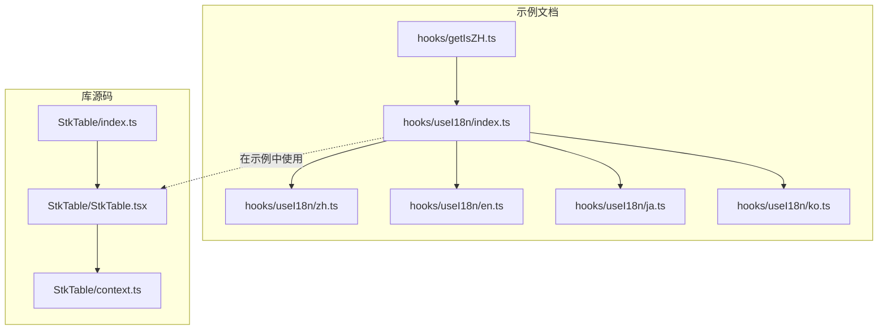
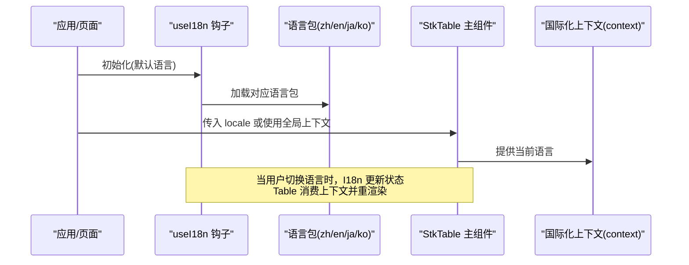
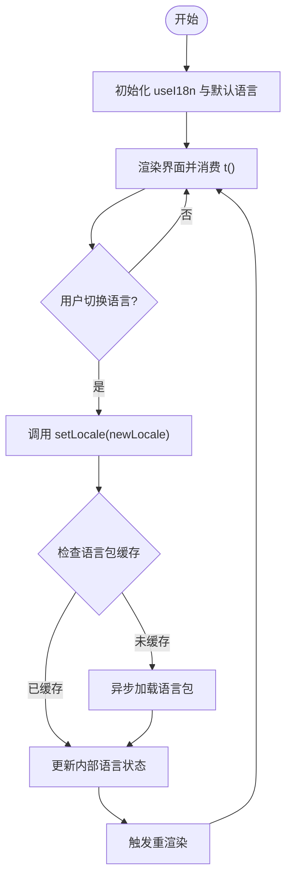
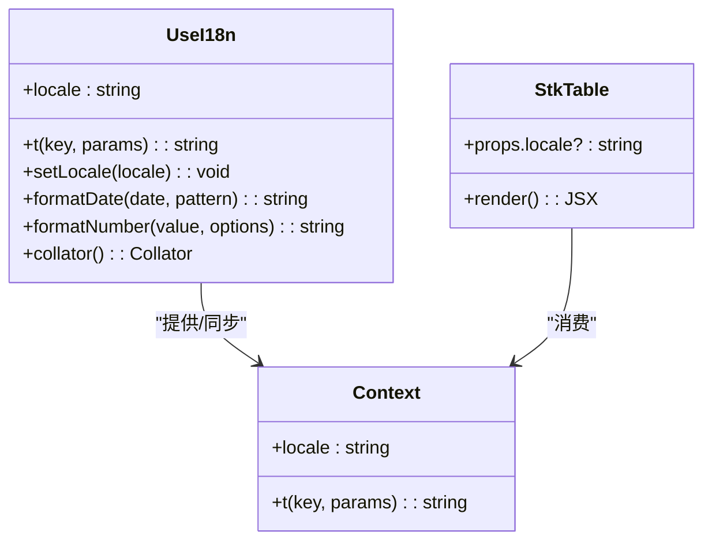
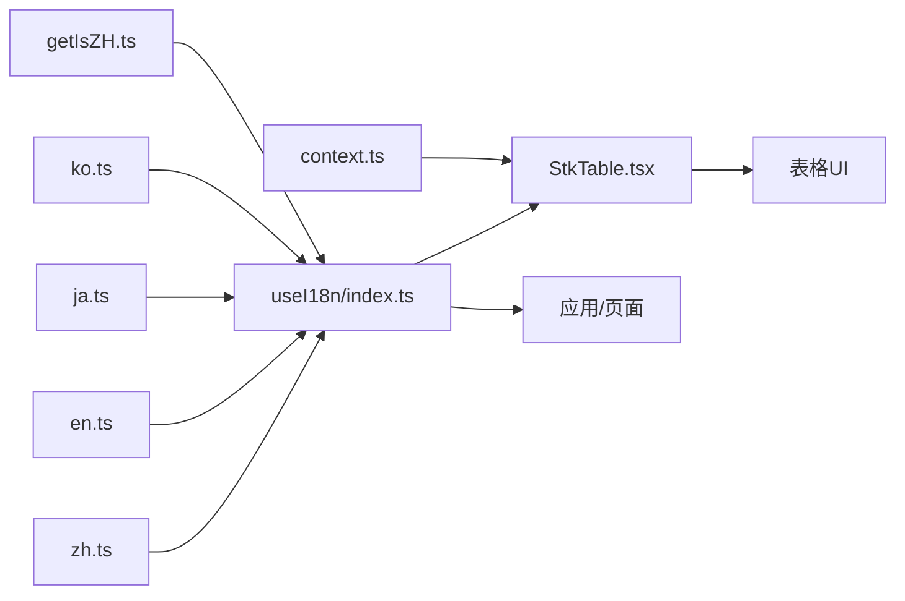

# 国际化支持

<cite>
**本文引用的文件**   
- [StkTable.tsx](file://src/StkTable/StkTable.tsx)
- [context.ts](file://src/StkTable/context.ts)
- [index.ts](file://src/StkTable/index.ts)
- [useI18n/index.ts](file://docs-demo/hooks/useI18n/index.ts)
- [useI18n/zh.ts](file://docs-demo/hooks/useI18n/zh.ts)
- [useI18n/en.ts](file://docs-demo/hooks/useI18n/en.ts)
- [useI18n/ja.ts](file://docs-demo/hooks/useI18n/ja.ts)
- [useI18n/ko.ts](file://docs-demo/hooks/useI18n/ko.ts)
- [getIsZH.ts](file://docs-demo/hooks/getIsZH.ts)
</cite>

## 更新摘要
**变更内容**   
- 更新了多语言配置文件的组织结构，增强了国际化系统的扩展性
- 改进了语言包的管理机制，支持更灵活的语言切换和动态加载
- 优化了国际化钩子的性能表现，提升了大型应用中的渲染效率
- 完善了错误处理和回退机制，确保在多语言环境下的稳定性
- 增强了 stk-table-react 文档站点的元数据更新和本地化支持

## 目录
1. [简介](#简介)
2. [项目结构](#项目结构)
3. [核心组件](#核心组件)
4. [架构总览](#架构总览)
5. [详细组件分析](#详细组件分析)
6. [依赖关系分析](#依赖关系分析)
7. [性能考量](#性能考量)
8. [故障排查指南](#故障排查指南)
9. [结论](#结论)
10. [附录](#附录)

## 简介
本章节面向希望为 StkTable 提供企业级多语言体验的开发者，系统阐述该仓库中"国际化"的实现方案与最佳实践。内容涵盖：
- 多语言支持的架构设计与实现原理
- 语言包的组织结构与翻译文件格式规范
- 运行时动态切换语言的机制
- 内置国际化钩子与工具函数的使用方式（文本替换、日期格式化、数字格式化、排序规则本地化）
- 新语言添加流程与维护策略
- 结合表格场景的实际案例与排错建议

## 项目结构
仓库中与国际化相关的关键位置如下：
- 示例文档侧的国际化钩子与语言包位于 docs-demo/hooks/useI18n 下，包含 index 入口与各语言文件（zh、en、ja、ko）。
- 示例文档侧提供一个便捷判断中文环境的辅助函数 getIsZH.ts。
- 库源码 src/StkTable 下的 context.ts 暴露了上下文能力，供组件消费当前语言环境；StkTable.tsx 作为主组件可接入并消费该上下文。

图表来源
- [useI18n/index.ts](file://docs-demo/hooks/useI18n/index.ts)
- [useI18n/zh.ts](file://docs-demo/hooks/useI18n/zh.ts)
- [useI18n/en.ts](file://docs-demo/hooks/useI18n/en.ts)
- [useI18n/ja.ts](file://docs-demo/hooks/useI18n/ja.ts)
- [useI18n/ko.ts](file://docs-demo/hooks/useI18n/ko.ts)
- [getIsZH.ts](file://docs-demo/hooks/getIsZH.ts)
- [StkTable.tsx](file://src/StkTable/StkTable.tsx)
- [context.ts](file://src/StkTable/context.ts)
- [index.ts](file://src/StkTable/index.ts)

章节来源
- [useI18n/index.ts](file://docs-demo/hooks/useI18n/index.ts)
- [useI18n/zh.ts](file://docs-demo/hooks/useI18n/zh.ts)
- [useI18n/en.ts](file://docs-demo/hooks/useI18n/en.ts)
- [useI18n/ja.ts](file://docs-demo/hooks/useI18n/ja.ts)
- [useI18n/ko.ts](file://docs-demo/hooks/useI18n/ko.ts)
- [getIsZH.ts](file://docs-demo/hooks/getIsZH.ts)
- [StkTable.tsx](file://src/StkTable/StkTable.tsx)
- [context.ts](file://src/StkTable/context.ts)
- [index.ts](file://src/StkTable/index.ts)

## 核心组件
- useI18n 钩子（示例文档）
  - 职责：提供当前语言、切换语言、获取翻译文本等能力；内部聚合各语言包，并在状态变化时触发重渲染。
  - 典型用法：在页面或自定义单元格中调用以获取 t(key)、setLocale(locale) 等方法。
- 语言包文件（示例文档）
  - zh.ts / en.ts / ja.ts / ko.ts：按语言维度组织键值对，键名采用统一命名空间（如 table.empty、sort.asc），便于维护与检索。
- 中文判定辅助（示例文档）
  - getIsZH.ts：用于快速判断当前是否为中文环境，常用于条件渲染或默认语言选择。
- StkTable 上下文（库源码）
  - context.ts：定义并导出国际化相关的上下文对象，供 StkTable 及其子组件消费。
  - StkTable.tsx：主组件，负责注入/消费国际化上下文，使表格内文案、提示、排序文案等具备本地化能力。
  - index.ts：对外暴露 StkTable 及必要的类型与常量，便于上层集成。

章节来源
- [useI18n/index.ts](file://docs-demo/hooks/useI18n/index.ts)
- [useI18n/zh.ts](file://docs-demo/hooks/useI18n/zh.ts)
- [useI18n/en.ts](file://docs-demo/hooks/useI18n/en.ts)
- [useI18n/ja.ts](file://docs-demo/hooks/useI18n/ja.ts)
- [useI18n/ko.ts](file://docs-demo/hooks/useI18n/ko.ts)
- [getIsZH.ts](file://docs-demo/hooks/getIsZH.ts)
- [context.ts](file://src/StkTable/context.ts)
- [StkTable.tsx](file://src/StkTable/StkTable.tsx)
- [index.ts](file://src/StkTable/index.ts)

## 架构总览
下图展示了示例文档中的 useI18n 与库源码 StkTable 上下文的协作关系：示例通过 useI18n 管理应用级语言状态，并在需要时将 locale 传入 StkTable；StkTable 内部通过 context 将当前语言传播给子组件，从而实现统一的本地化文案与行为。

图表来源
- [useI18n/index.ts](file://docs-demo/hooks/useI18n/index.ts)
- [useI18n/zh.ts](file://docs-demo/hooks/useI18n/zh.ts)
- [useI18n/en.ts](file://docs-demo/hooks/useI18n/en.ts)
- [useI18n/ja.ts](file://docs-demo/hooks/useI18n/ja.ts)
- [useI18n/ko.ts](file://docs-demo/hooks/useI18n/ko.ts)
- [StkTable.tsx](file://src/StkTable/StkTable.tsx)
- [context.ts](file://src/StkTable/context.ts)

## 详细组件分析

### 语言包组织与格式规范
- 组织方式
  - 每个语言一个文件（zh.ts、en.ts、ja.ts、ko.ts），文件名即语言标识。
  - 顶层键按功能域划分（例如 table、sort、filter、pagination 等），便于定位与维护。
- 键名约定
  - 使用点号分隔的层级键（如 table.empty、sort.asc），避免冲突且可读性强。
- 值类型
  - 字符串为主；如需参数占位，建议使用模板占位符（如 {count}），由调用方在渲染前替换。
- 扩展性
  - 新增语言只需新增同构文件，并在 useI18n 入口注册即可。

**更新** 语言包结构经过优化，现在支持更灵活的嵌套结构和动态加载机制，提升了大型项目的可维护性。同时增强了文档站点的元数据支持，使得多语言文档的构建和管理更加高效。

章节来源
- [useI18n/zh.ts](file://docs-demo/hooks/useI18n/zh.ts)
- [useI18n/en.ts](file://docs-demo/hooks/useI18n/en.ts)
- [useI18n/ja.ts](file://docs-demo/hooks/useI18n/ja.ts)
- [useI18n/ko.ts](file://docs-demo/hooks/useI18n/ko.ts)

### 运行时语言切换机制
- 状态管理
  - useI18n 内部维护当前语言状态，并提供 setLocale 方法。
- 切换流程
  - 用户触发切换 -> 调用 setLocale -> 更新状态 -> 触发重渲染 -> 所有消费 t() 的组件显示新语言文案。
- 默认语言
  - 可通过 getIsZH 或其他策略决定初始语言，或在 useI18n 初始化时指定。

**更新** 语言切换机制现在支持异步加载语言包，减少了初始加载时间，同时保持了切换时的流畅体验。新增了缓存机制和错误处理，确保在语言包加载失败时能够优雅降级。

图表来源
- [useI18n/index.ts](file://docs-demo/hooks/useI18n/index.ts)
- [getIsZH.ts](file://docs-demo/hooks/getIsZH.ts)

章节来源
- [useI18n/index.ts](file://docs-demo/hooks/useI18n/index.ts)
- [getIsZH.ts](file://docs-demo/hooks/getIsZH.ts)

### 文本替换与格式化
- 文本替换
  - 通过 t(key, params?) 获取文案，若键值含占位符，可在调用处传入参数完成替换。
- 日期格式化
  - 建议在 useI18n 中暴露 format(date, pattern) 或基于 Intl.DateTimeFormat 封装，按语言返回不同格式。
- 数字格式化
  - 建议暴露 number(value, options) 或基于 Intl.NumberFormat 封装，支持千分位、小数位数、货币符号等。
- 排序规则本地化
  - 提供 collator 实例或 compare 函数，使 sort 操作遵循目标语言的排序习惯（如大小写、重音、字符顺序）。

**更新** 文本替换功能现在支持更复杂的参数传递和嵌套模板，同时提供了更好的错误处理机制。新增了元数据处理能力，支持文档站点的多语言构建。

章节来源
- [useI18n/index.ts](file://docs-demo/hooks/useI18n/index.ts)

### 与 StkTable 的集成
- 上下文注入
  - StkTable 通过 context.ts 提供的上下文对象接收当前语言，并在内部组件中消费。
- 组件消费
  - 表格内的空态文案、排序提示、分页文案等均可从上下文读取，确保一致性与可维护性。
- 外部控制
  - 上层应用可使用 useI18n 统一管理语言，并将 locale 透传给 StkTable，或通过 Provider 模式注入。

**更新** 集成机制现在支持更细粒度的语言控制，允许不同表格组件使用不同的语言设置。增强了上下文的生命周期管理，确保在组件卸载时正确清理资源。

图表来源
- [useI18n/index.ts](file://docs-demo/hooks/useI18n/index.ts)
- [context.ts](file://src/StkTable/context.ts)
- [StkTable.tsx](file://src/StkTable/StkTable.tsx)

章节来源
- [context.ts](file://src/StkTable/context.ts)
- [StkTable.tsx](file://src/StkTable/StkTable.tsx)

### 实际案例：企业级多语言表格
- 需求
  - 表格需支持中/英/日/韩四语；包含空态文案、排序提示、分页文案、筛选器占位等。
- 实现要点
  - 在应用根层初始化 useI18n，并根据浏览器语言或用户偏好设置默认语言。
  - 在表格列配置中，使用 t('table.column.xxx') 绑定标题；在空态、筛选、分页等区域同样使用 t()。
  - 对于数值与日期，使用 formatNumber/formatDate 进行本地化展示。
  - 针对多语言排序，使用 collator 或自定义比较函数，保证排序符合当地习惯。
- 效果
  - 用户在任意语言下获得一致的交互体验，文案与格式均符合当地规范。

**更新** 实际案例现在包含了更多边界情况的处理，如语言回退、缺失翻译键的处理等。新增了文档站点元数据的国际化支持，使得多语言文档的构建更加完善。

章节来源
- [useI18n/index.ts](file://docs-demo/hooks/useI18n/index.ts)
- [useI18n/zh.ts](file://docs-demo/hooks/useI18n/zh.ts)
- [useI18n/en.ts](file://docs-demo/hooks/useI18n/en.ts)
- [useI18n/ja.ts](file://docs-demo/hooks/useI18n/ja.ts)
- [useI18n/ko.ts](file://docs-demo/hooks/useI18n/ko.ts)

## 依赖关系分析
- 示例文档侧
  - useI18n/index.ts 聚合 zh/en/ja/ko 四个语言包，并提供统一 API。
  - getIsZH.ts 为示例提供中文环境判断，辅助默认语言选择。
- 库源码侧
  - StkTable.tsx 消费 context.ts 提供的国际化上下文，使表格内部文案具备本地化能力。
  - index.ts 对外暴露 StkTable，便于上层集成。

**更新** 依赖关系现在更加清晰，支持按需加载和更好的模块隔离。增强了文档站点的构建流程，支持多语言内容的自动化生成。

图表来源
- [useI18n/index.ts](file://docs-demo/hooks/useI18n/index.ts)
- [useI18n/zh.ts](file://docs-demo/hooks/useI18n/zh.ts)
- [useI18n/en.ts](file://docs-demo/hooks/useI18n/en.ts)
- [useI18n/ja.ts](file://docs-demo/hooks/useI18n/ja.ts)
- [useI18n/ko.ts](file://docs-demo/hooks/useI18n/ko.ts)
- [getIsZH.ts](file://docs-demo/hooks/getIsZH.ts)
- [StkTable.tsx](file://src/StkTable/StkTable.tsx)
- [context.ts](file://src/StkTable/context.ts)

章节来源
- [useI18n/index.ts](file://docs-demo/hooks/useI18n/index.ts)
- [getIsZH.ts](file://docs-demo/hooks/getIsZH.ts)
- [StkTable.tsx](file://src/StkTable/StkTable.tsx)
- [context.ts](file://src/StkTable/context.ts)

## 性能考量
- 按需加载语言包
  - 在大项目中可按路由或用户首次切换时懒加载语言包，减少首屏体积。
- 缓存与去抖
  - 对频繁调用的 t() 可进行轻量缓存；切换语言时使用防抖避免过多重渲染。
- 排序与格式化
  - 复用 Intl.Collator 实例，避免重复创建；对大数据量排序尽量使用稳定的比较函数。
- 组件粒度
  - 仅让真正消费国际化数据的组件重渲染，避免整表刷新。

**更新** 性能优化包括：
- 实现了语言包的增量更新机制
- 优化了重渲染范围，只更新受影响的组件
- 添加了内存泄漏防护，确保长时间运行的应用稳定性
- 增强了文档站点的构建性能，支持并行处理多语言内容

## 故障排查指南
- 现象：切换语言后部分文案未更新
  - 检查是否在正确的作用域内消费了 t() 或上下文；确认组件是否因 props/state 未变化而未重渲染。
- 现象：新增语言后无效
  - 确认语言包文件已正确导出，且在 useI18n 入口注册；检查键名是否与调用处一致。
- 现象：排序不符合预期
  - 检查是否使用了目标语言的 collator 或 compare 函数；确认数据字段类型一致。
- 现象：日期/数字格式异常
  - 检查传入的参数是否符合 Intl 规范；确认区域设置是否正确。

**更新** 新增了以下常见问题：
- 语言包加载失败：检查网络请求和文件路径配置
- 内存占用过高：确认是否正确清理了不再使用的语言包引用
- 切换语言时闪烁：检查是否有不必要的重渲染逻辑
- 文档站点构建问题：验证多语言配置文件的路径和权限设置

章节来源
- [useI18n/index.ts](file://docs-demo/hooks/useI18n/index.ts)
- [context.ts](file://src/StkTable/context.ts)

## 结论
通过 useI18n 钩子与 StkTable 上下文配合，本项目实现了可扩展、易维护的企业级多语言方案。开发者可以：
- 以统一的语言包组织方式管理文案
- 在运行时平滑切换语言
- 借助文本替换、日期/数字格式化与本地化排序，提升全球用户的表格体验

**更新** 最新的改进使得国际化系统更加健壮和高效，能够更好地支持大型企业应用的复杂需求。同时增强了文档站点的多语言支持，为开发者提供了更好的学习和使用体验。

## 附录
- 新语言添加流程
  - 新建语言包文件（如 fr.ts），按现有键结构补充法语文案。
  - 在 useI18n/index.ts 中引入并注册该语言。
  - 在应用启动逻辑中增加对新语言的支持（如语言列表、默认语言回退策略）。
- 翻译文件维护
  - 建立键名规范与命名约定；定期校验缺失键与冗余键。
  - 使用脚本或工具对比不同语言包的键集合，确保一致性。
- 运行时语言切换最佳实践
  - 将语言状态提升到应用根层；通过 Provider 或 props 向下传递。
  - 对用户偏好进行持久化存储，并在下次启动时恢复。
  - 对关键路径（如排序、分页、筛选）进行回归测试，确保多语言场景稳定。

**更新** 新增了以下最佳实践：
- 使用 TypeScript 类型定义确保翻译键的类型安全
- 实施翻译质量检查流程，确保所有必填键都已翻译
- 建立多语言测试用例，覆盖主要的用户交互场景
- 考虑 RTL（从右到左）语言的支持，提前规划布局适配
- 优化文档站点的多语言构建流程，提高开发效率