# 插槽系统

<cite>
**本文引用的文件**   
- [StkTable.tsx](file://src/StkTable/StkTable.tsx)
- [index.tsx](file://src/StkTable/components/index.tsx)
- [types/index.ts](file://src/StkTable/types/index.ts)
- [context.ts](file://src/StkTable/context.ts)
- [const.ts](file://src/StkTable/const.ts)
- [slots.md](file://docs-src/main/api/slots.md)
- [CustomBottom.tsx](file://docs-demo/api/slots/CustomBottom.tsx)
- [Headless.tsx](file://docs-demo/basic/headless/Headless.tsx)
- [EmptySlot.tsx](file://docs-demo/basic/empty/Slot.tsx)
- [Footer.tsx](file://docs-demo/basic/footer/Footer.tsx)
- [MultiHeader.tsx](file://docs-demo/basic/multi-header/MultiHeader.tsx)
- [RowDrag.tsx](file://docs-demo/advanced/row-drag/RowDrag.tsx)
- [HighlightBase.tsx](file://docs-demo/advanced/highlight/HighlightBase.tsx)
</cite>

## 目录
1. [简介](#简介)
2. [项目结构](#项目结构)
3. [核心组件](#核心组件)
4. [架构总览](#架构总览)
5. [详细组件分析](#详细组件分析)
6. [依赖分析](#依赖分析)
7. [性能考虑](#性能考虑)
8. [故障排查指南](#故障排查指南)
9. [结论](#结论)
10. [附录](#附录)

## 简介
本章节面向希望完全掌控 StkTable 渲染与行为的开发者，系统性介绍其“插槽系统”。通过头部、尾部、内容、操作列等插槽，你可以：
- 自定义表头、表尾、空状态、展开行、排序图标、筛选器、滚动条等任意区域
- 在单元格中注入复杂交互（编辑、选择、富文本、图表等）
- 组合与嵌套插槽，实现高度可定制的布局与行为
- 通过作用域参数与事件机制，完成数据驱动与双向交互

## 项目结构
围绕插槽系统的核心代码位于 src/StkTable 下，文档与示例位于 docs-src 与 docs-demo。下图展示了与插槽相关的源码与示例文件的组织关系。

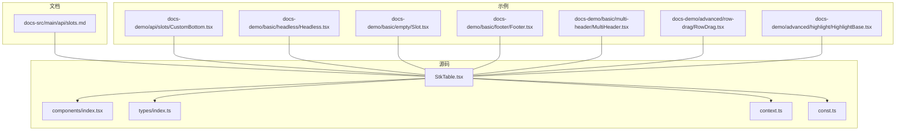

图示来源
- [StkTable.tsx](file://src/StkTable/StkTable.tsx)
- [index.tsx](file://src/StkTable/components/index.tsx)
- [types/index.ts](file://src/StkTable/types/index.ts)
- [context.ts](file://src/StkTable/context.ts)
- [const.ts](file://src/StkTable/const.ts)
- [slots.md](file://docs-src/main/api/slots.md)
- [CustomBottom.tsx](file://docs-demo/api/slots/CustomBottom.tsx)
- [Headless.tsx](file://docs-demo/basic/headless/Headless.tsx)
- [EmptySlot.tsx](file://docs-demo/basic/empty/Slot.tsx)
- [Footer.tsx](file://docs-demo/basic/footer/Footer.tsx)
- [MultiHeader.tsx](file://docs-demo/basic/multi-header/MultiHeader.tsx)
- [RowDrag.tsx](file://docs-demo/advanced/row-drag/RowDrag.tsx)
- [HighlightBase.tsx](file://docs-demo/advanced/highlight/HighlightBase.tsx)

章节来源
- [StkTable.tsx](file://src/StkTable/StkTable.tsx)
- [index.tsx](file://src/StkTable/components/index.tsx)
- [types/index.ts](file://src/StkTable/types/index.ts)
- [context.ts](file://src/StkTable/context.ts)
- [const.ts](file://src/StkTable/const.ts)
- [slots.md](file://docs-src/main/api/slots.md)

## 核心组件
本节聚焦于插槽系统在表格中的关键位置与作用范围，帮助你快速定位并理解各插槽的用途。

- 头部插槽
  - 用于替换或增强表头区域，如自定义排序图标、筛选器、分组标题等
  - 典型使用场景：多表头、动态列头、带操作的列头
- 尾部插槽
  - 用于扩展表格底部区域，如分页、统计信息、批量操作栏
  - 典型使用场景：汇总行、导出按钮、全局搜索
- 内容插槽
  - 用于定制单元格内容，支持复杂渲染与交互
  - 典型使用场景：富文本、进度条、标签、图片、表单控件
- 操作列插槽
  - 用于为每行提供操作入口，如编辑、删除、查看详情
  - 典型使用场景：行级菜单、快捷操作、权限控制
- 其他常见插槽
  - 空状态插槽：无数据时的占位提示
  - 展开行插槽：点击展开后的子内容区
  - 滚动条样式插槽：自定义滚动条外观与行为
  - 表体容器插槽：包裹整个表格主体，便于叠加遮罩或工具层

章节来源
- [StkTable.tsx](file://src/StkTable/StkTable.tsx)
- [slots.md](file://docs-src/main/api/slots.md)

## 架构总览
下图从组件层次展示插槽系统与表格主体的协作方式。StkTable 作为根组件，负责解析 props 与上下文，将插槽分发到对应渲染节点；各局部组件按需消费插槽，并通过 context 共享表格状态与方法。

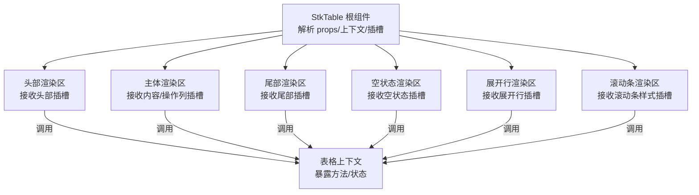

图示来源
- [StkTable.tsx](file://src/StkTable/StkTable.tsx)
- [context.ts](file://src/StkTable/context.ts)

## 详细组件分析

### 头部插槽
- 作用域与参数
  - 通常包含列定义、排序状态、筛选状态、列宽等信息，以便在表头内实现排序切换、筛选面板、列拖拽等功能
- 事件绑定
  - 可通过上下文提供的排序、筛选等方法触发更新
- 典型用法
  - 自定义排序图标与多列排序
  - 在列头嵌入筛选器下拉框
  - 结合多表头进行分组显示

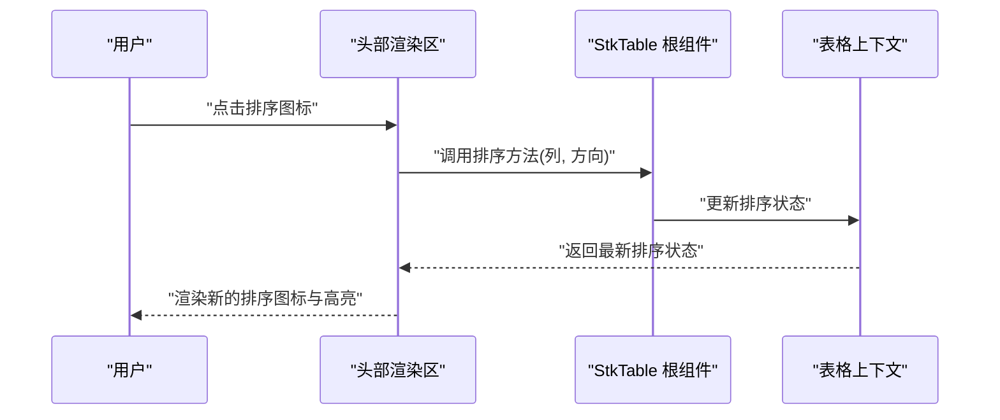

图示来源
- [StkTable.tsx](file://src/StkTable/StkTable.tsx)
- [context.ts](file://src/StkTable/context.ts)

章节来源
- [MultiHeader.tsx](file://docs-demo/basic/multi-header/MultiHeader.tsx)
- [slots.md](file://docs-src/main/api/slots.md)

### 尾部插槽
- 作用域与参数
  - 通常包含分页信息、选中项数量、合计值等，便于在底部展示统计与操作
- 事件绑定
  - 可触发分页跳转、批量操作、导出等
- 典型用法
  - 分页控件、全选/反选、批量删除、导出报表

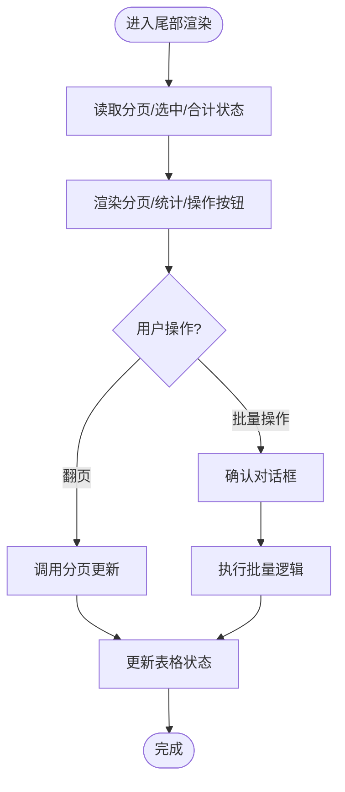

图示来源
- [StkTable.tsx](file://src/StkTable/StkTable.tsx)
- [context.ts](file://src/StkTable/context.ts)

章节来源
- [Footer.tsx](file://docs-demo/basic/footer/Footer.tsx)
- [slots.md](file://docs-src/main/api/slots.md)

### 内容插槽
- 作用域与参数
  - 包含当前行数据、列定义、行索引、选中状态、排序/筛选上下文等
- 事件绑定
  - 可在单元格内处理点击、输入、拖拽等事件，并通过上下文更新表格状态
- 典型用法
  - 编辑单元格、复选框、进度条、标签、图片预览、富文本编辑器

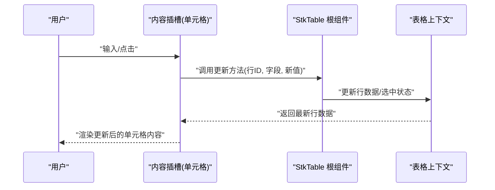

图示来源
- [StkTable.tsx](file://src/StkTable/StkTable.tsx)
- [context.ts](file://src/StkTable/context.ts)

章节来源
- [Headless.tsx](file://docs-demo/basic/headless/Headless.tsx)
- [slots.md](file://docs-src/main/api/slots.md)

### 操作列插槽
- 作用域与参数
  - 包含行数据、行索引、选中状态、是否禁用等
- 事件绑定
  - 可触发编辑、删除、查看详情等操作，必要时弹出确认框
- 典型用法
  - 行级菜单、权限控制下的显隐、二次确认

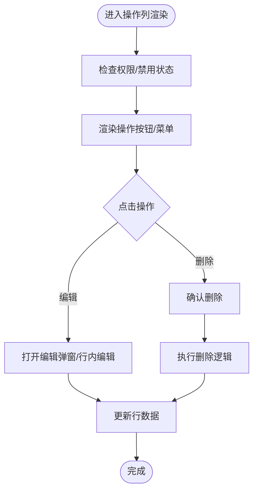

图示来源
- [StkTable.tsx](file://src/StkTable/StkTable.tsx)
- [context.ts](file://src/StkTable/context.ts)

章节来源
- [RowDrag.tsx](file://docs-demo/advanced/row-drag/RowDrag.tsx)
- [slots.md](file://docs-src/main/api/slots.md)

### 空状态插槽
- 作用域与参数
  - 包含空状态文案、重试函数等
- 事件绑定
  - 可触发刷新、重新加载数据
- 典型用法
  - 网络错误提示、引导文案、重试按钮

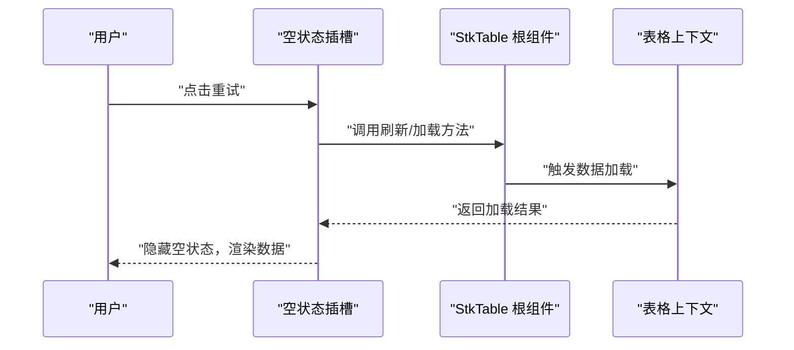

图示来源
- [StkTable.tsx](file://src/StkTable/StkTable.tsx)
- [context.ts](file://src/StkTable/context.ts)

章节来源
- [EmptySlot.tsx](file://docs-demo/basic/empty/Slot.tsx)
- [slots.md](file://docs-src/main/api/slots.md)

### 展开行插槽
- 作用域与参数
  - 包含父行数据、展开状态、层级信息等
- 事件绑定
  - 可触发子数据的加载、折叠/展开切换
- 典型用法
  - 树形表格的子节点内容、详情面板

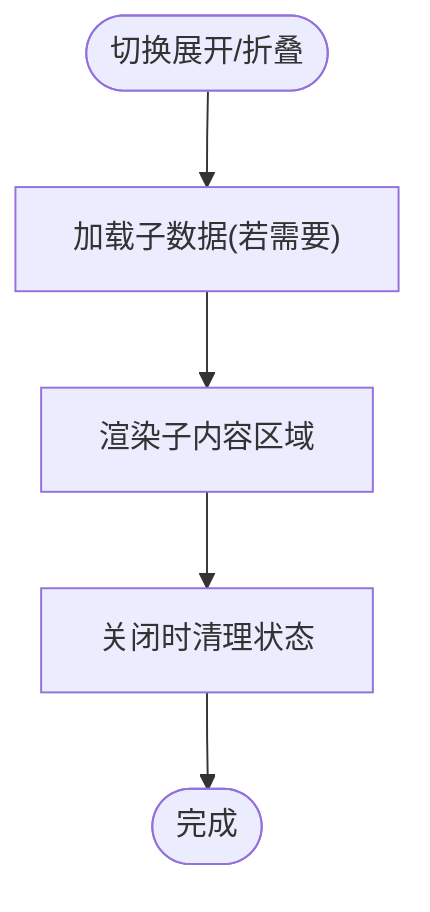

图示来源
- [StkTable.tsx](file://src/StkTable/StkTable.tsx)
- [context.ts](file://src/StkTable/context.ts)

章节来源
- [slots.md](file://docs-src/main/api/slots.md)

### 滚动条样式插槽
- 作用域与参数
  - 包含滚动方向、可视区域尺寸、滚动位置等
- 事件绑定
  - 可监听滚动事件，实现懒加载、吸附、虚拟列表联动
- 典型用法
  - 自定义滚动条外观、滚动进度指示

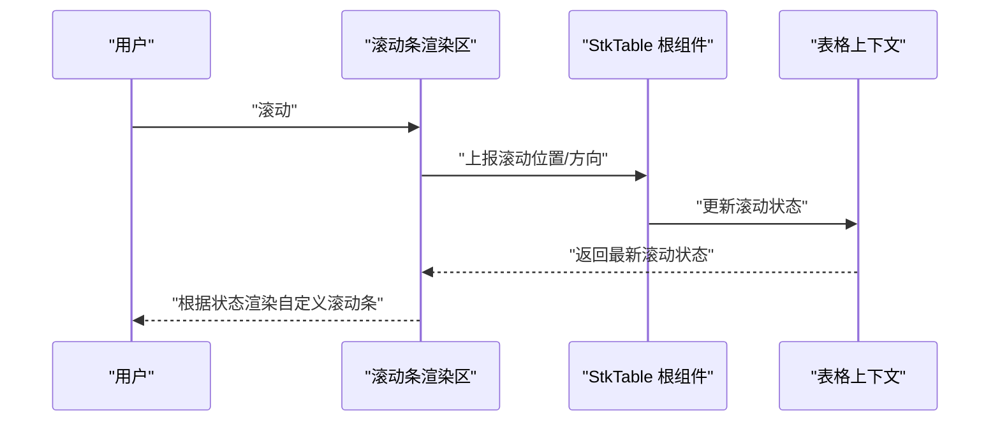

图示来源
- [StkTable.tsx](file://src/StkTable/StkTable.tsx)
- [context.ts](file://src/StkTable/context.ts)

章节来源
- [slots.md](file://docs-src/main/api/slots.md)

### 组合使用模式与嵌套插槽
- 组合模式
  - 头部 + 尾部：在表头添加筛选器，在表尾展示筛选结果统计
  - 内容 + 操作列：在单元格内编辑，同时在操作列提供保存/取消
  - 空状态 + 尾部：空状态下显示重试与帮助链接
- 嵌套方案
  - 在内容插槽内再插入子表格或面板，形成多级嵌套
  - 在展开行插槽内嵌入复杂表单或图表
- 注意事项
  - 避免过度嵌套导致渲染性能下降
  - 合理使用 key 与稳定引用，减少不必要的重渲染

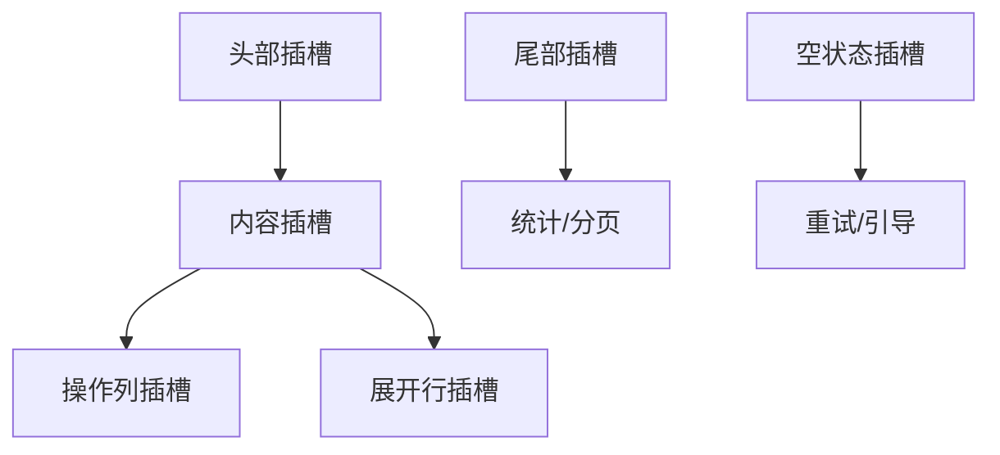

图示来源
- [StkTable.tsx](file://src/StkTable/StkTable.tsx)
- [context.ts](file://src/StkTable/context.ts)

章节来源
- [CustomBottom.tsx](file://docs-demo/api/slots/CustomBottom.tsx)
- [HighlightBase.tsx](file://docs-demo/advanced/highlight/HighlightBase.tsx)
- [slots.md](file://docs-src/main/api/slots.md)

## 依赖分析
插槽系统与表格核心模块的依赖关系如下：StkTable 作为根组件，依赖类型定义、常量与上下文；各插槽渲染区通过上下文访问表格状态与方法；示例文件演示了不同插槽的实际用法。

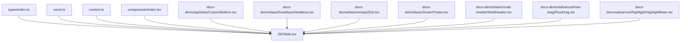

图示来源
- [StkTable.tsx](file://src/StkTable/StkTable.tsx)
- [index.tsx](file://src/StkTable/components/index.tsx)
- [types/index.ts](file://src/StkTable/types/index.ts)
- [context.ts](file://src/StkTable/context.ts)
- [const.ts](file://src/StkTable/const.ts)
- [CustomBottom.tsx](file://docs-demo/api/slots/CustomBottom.tsx)
- [Headless.tsx](file://docs-demo/basic/headless/Headless.tsx)
- [EmptySlot.tsx](file://docs-demo/basic/empty/Slot.tsx)
- [Footer.tsx](file://docs-demo/basic/footer/Footer.tsx)
- [MultiHeader.tsx](file://docs-demo/basic/multi-header/MultiHeader.tsx)
- [RowDrag.tsx](file://docs-demo/advanced/row-drag/RowDrag.tsx)
- [HighlightBase.tsx](file://docs-demo/advanced/highlight/HighlightBase.tsx)

章节来源
- [StkTable.tsx](file://src/StkTable/StkTable.tsx)
- [index.tsx](file://src/StkTable/components/index.tsx)
- [types/index.ts](file://src/StkTable/types/index.ts)
- [context.ts](file://src/StkTable/context.ts)
- [const.ts](file://src/StkTable/const.ts)

## 性能考虑
- 合理拆分插槽组件，避免在内容插槽中执行昂贵计算
- 使用稳定的 key 与引用，减少重渲染
- 对大数据量场景，优先使用虚拟滚动并结合插槽优化渲染路径
- 谨慎嵌套插槽，必要时采用懒加载与缓存策略

[本节为通用指导，不直接分析具体文件]

## 故障排查指南
- 插槽未生效
  - 检查插槽名称是否正确，是否与文档一致
  - 确认是否在正确的渲染区传入插槽
- 作用域参数为空
  - 检查列定义与行数据结构是否匹配
  - 确认上下文方法是否被正确调用
- 事件不触发
  - 检查事件冒泡与阻止默认行为
  - 确认权限与禁用状态是否影响交互
- 性能问题
  - 排查插槽内是否存在频繁状态更新
  - 评估嵌套深度与渲染成本

章节来源
- [slots.md](file://docs-src/main/api/slots.md)

## 结论
通过 StkTable 的插槽系统，你可以对表格的每个可见区域与交互点进行精细化控制。掌握插槽的作用域、参数传递与事件绑定机制，结合组合与嵌套模式，能够构建出高度定制化且性能优良的表格体验。建议在实际项目中遵循最小化重渲染、合理拆分组件、审慎嵌套的原则，以获得最佳的用户体验与维护性。

[本节为总结性内容，不直接分析具体文件]

## 附录
- 参考文档
  - 插槽 API 说明：[slots.md](file://docs-src/main/api/slots.md)
- 示例文件
  - 自定义底部：[CustomBottom.tsx](file://docs-demo/api/slots/CustomBottom.tsx)
  - 无头模式：[Headless.tsx](file://docs-demo/basic/headless/Headless.tsx)
  - 空状态插槽：[EmptySlot.tsx](file://docs-demo/basic/empty/Slot.tsx)
  - 底部页脚：[Footer.tsx](file://docs-demo/basic/footer/Footer.tsx)
  - 多表头：[MultiHeader.tsx](file://docs-demo/basic/multi-header/MultiHeader.tsx)
  - 行拖拽：[RowDrag.tsx](file://docs-demo/advanced/row-drag/RowDrag.tsx)
  - 高亮基础：[HighlightBase.tsx](file://docs-demo/advanced/highlight/HighlightBase.tsx)