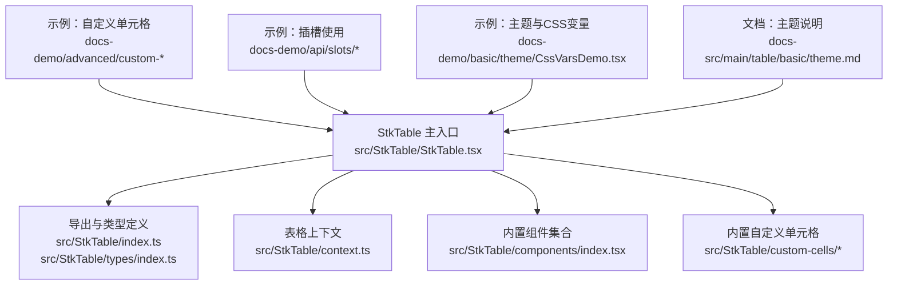
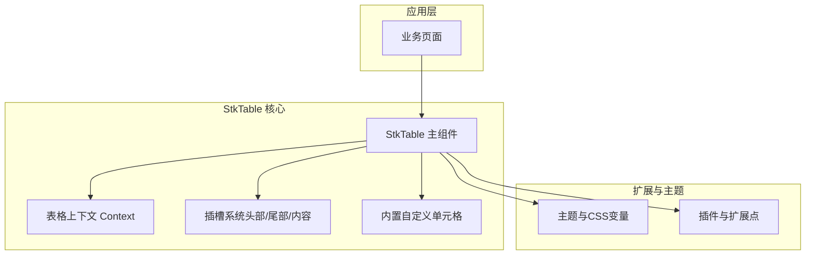
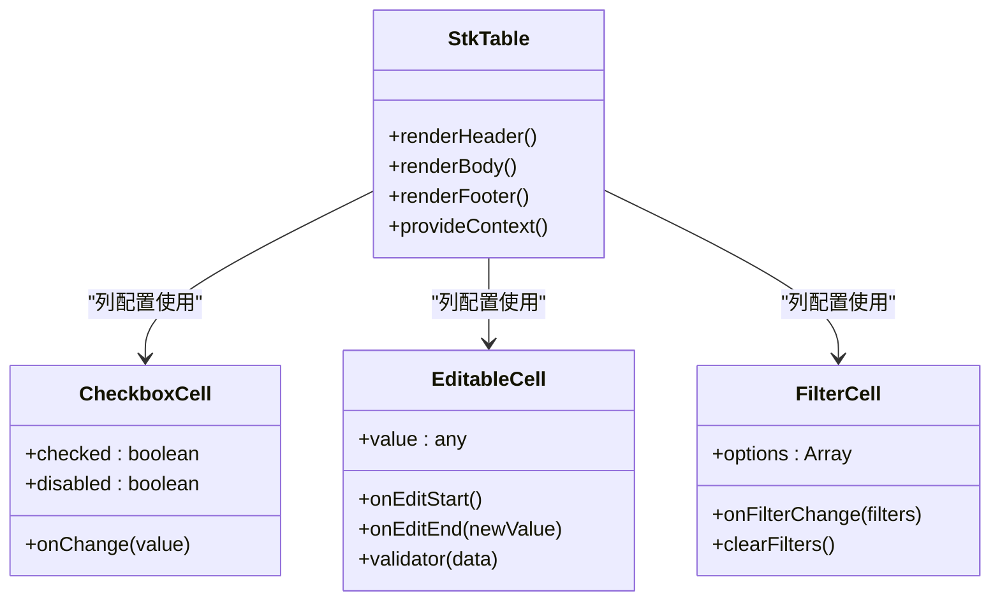
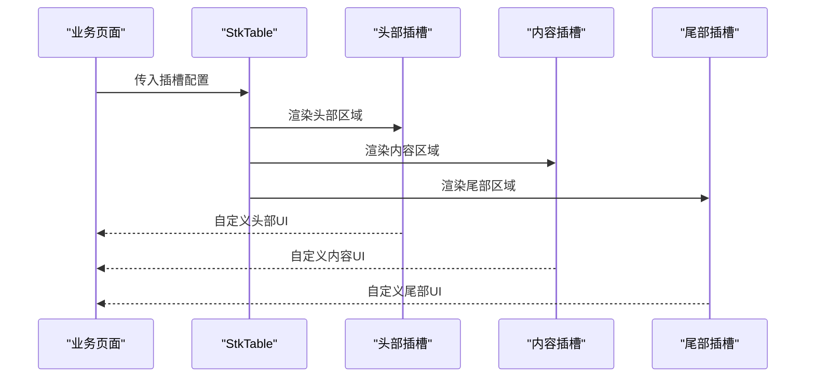
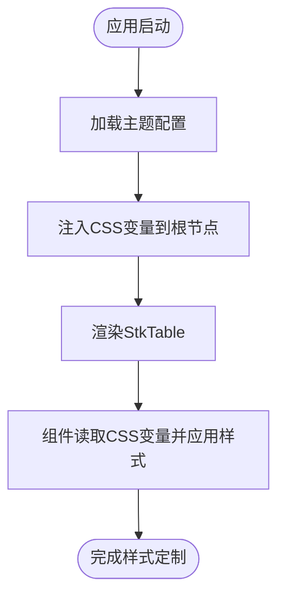
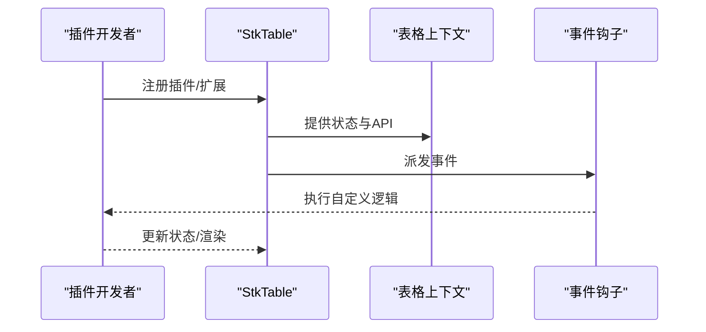
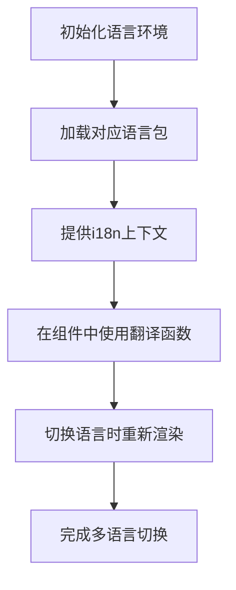
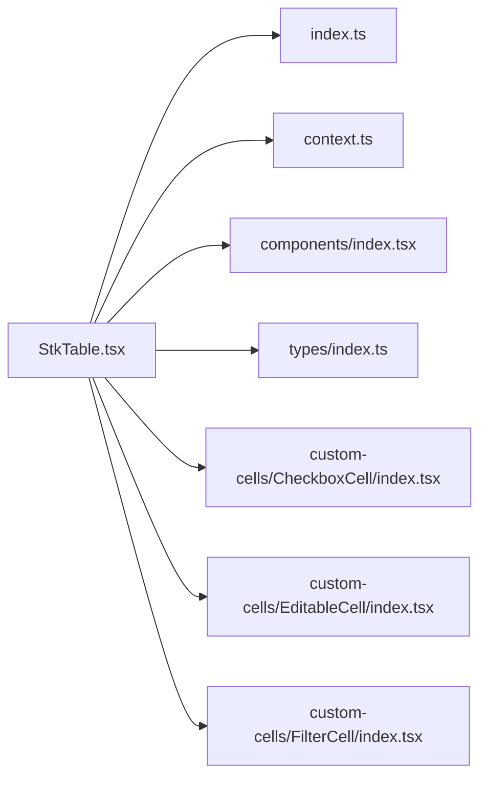

# 自定义与扩展

<cite>
**本文引用的文件**   
- [src/StkTable/StkTable.tsx](file://src/StkTable/StkTable.tsx)
- [src/StkTable/index.ts](file://src/StkTable/index.ts)
- [src/StkTable/context.ts](file://src/StkTable/context.ts)
- [src/StkTable/types/index.ts](file://src/StkTable/types/index.ts)
- [src/StkTable/components/index.tsx](file://src/StkTable/components/index.tsx)
- [src/StkTable/custom-cells/CheckboxCell/index.tsx](file://src/StkTable/custom-cells/CheckboxCell/index.tsx)
- [src/StkTable/custom-cells/EditableCell/index.tsx](file://src/StkTable/custom-cells/EditableCell/index.tsx)
- [src/StkTable/custom-cells/FilterCell/index.tsx](file://src/StkTable/custom-cells/FilterCell/index.tsx)
- [src/StkTable/custom-cells/FilterCell/Dropdown.tsx](file://src/StkTable/custom-cells/FilterCell/Dropdown.tsx)
- [src/StkTable/custom-cells/FilterCell/types.ts](file://src/StkTable/custom-cells/FilterCell/types.ts)
- [docs-demo/advanced/custom-cell/CustomCell/YieldCell.tsx](file://docs-demo/advanced/custom-cell/CustomCell/YieldCell.tsx)
- [docs-demo/advanced/custom-cell/CustomCell/index.tsx](file://docs-demo/advanced/custom-cell/CustomCell/index.tsx)
- [docs-demo/advanced/custom-cell/CustomCell/types.ts](file://docs-demo/advanced/custom-cell/CustomCell/types.ts)
- [docs-demo/advanced/custom-cells/CheckboxCell/index.tsx](file://docs-demo/advanced/custom-cells/CheckboxCell/index.tsx)
- [docs-demo/advanced/custom-cells/CheckboxCell/CheckboxComponentCell.tsx](file://docs-demo/advanced/custom-cells/CheckboxCell/CheckboxComponentCell.tsx)
- [docs-demo/advanced/custom-cells/EditableCell/index.tsx](file://docs-demo/advanced/custom-cells/EditableCell/index.tsx)
- [docs-demo/advanced/custom-cells/FilterCell/index.tsx](file://docs-demo/advanced/custom-cells/FilterCell/index.tsx)
- [docs-demo/advanced/custom-cells/FilterCell/CustomFilter.tsx](file://docs-demo/advanced/custom-cells/FilterCell/CustomFilter.tsx)
- [docs-demo/api/slots/CustomBottom.tsx](file://docs-demo/api/slots/CustomBottom.tsx)
- [docs-demo/hooks/useI18n/index.ts](file://docs-demo/hooks/useI18n/index.ts)
- [docs-demo/hooks/useI18n/zh.ts](file://docs-demo/hooks/useI18n/zh.ts)
- [docs-demo/hooks/useI18n/en.ts](file://docs-demo/hooks/useI18n/en.ts)
- [docs-demo/hooks/useI18n/ja.ts](file://docs-demo/hooks/useI18n/ja.ts)
- [docs-demo/hooks/useI18n/ko.ts](file://docs-demo/hooks/useI18n/ko.ts)
- [docs-src/main/table/basic/theme.md](file://docs-src/main/table/basic/theme.md)
- [lib/style.css](file://lib/style.css)
</cite>

## 目录
1. [简介](#简介)
2. [项目结构](#项目结构)
3. [核心组件](#核心组件)
4. [架构总览](#架构总览)
5. [详细组件分析](#详细组件分析)
6. [依赖关系分析](#依赖关系分析)
7. [性能考量](#性能考量)
8. [故障排查指南](#故障排查指南)
9. [结论](#结论)
10. [附录](#附录)

## 简介
本章节聚焦 StkTable 的自定义与扩展能力，覆盖以下关键主题：
- 自定义单元格：内置复选框、可编辑、筛选单元格的用法与扩展方式
- 插槽系统：头部、尾部、内容等插槽的定制方法
- 主题系统与 CSS 变量：通过变量覆盖实现灵活样式定制
- 插件开发与扩展点：如何基于表格上下文与事件进行二次开发
- 国际化支持：多语言配置与切换方案
- 实战案例：结合业务场景的深度定制路径

## 项目结构
StkTable 的核心源码位于 src/StkTable，示例与文档位于 docs-demo 与 docs-src。自定义单元格在 custom-cells 目录下提供，插槽与主题相关示例在 docs-demo 中集中展示。

图表来源
- [src/StkTable/StkTable.tsx](file://src/StkTable/StkTable.tsx)
- [src/StkTable/index.ts](file://src/StkTable/index.ts)
- [src/StkTable/context.ts](file://src/StkTable/context.ts)
- [src/StkTable/components/index.tsx](file://src/StkTable/components/index.tsx)
- [src/StkTable/custom-cells/CheckboxCell/index.tsx](file://src/StkTable/custom-cells/CheckboxCell/index.tsx)
- [src/StkTable/custom-cells/EditableCell/index.tsx](file://src/StkTable/custom-cells/EditableCell/index.tsx)
- [src/StkTable/custom-cells/FilterCell/index.tsx](file://src/StkTable/custom-cells/FilterCell/index.tsx)
- [docs-demo/advanced/custom-cell/CustomCell/index.tsx](file://docs-demo/advanced/custom-cell/CustomCell/index.tsx)
- [docs-demo/api/slots/CustomBottom.tsx](file://docs-demo/api/slots/CustomBottom.tsx)
- [docs-src/main/table/basic/theme.md](file://docs-src/main/table/basic/theme.md)

章节来源
- [src/StkTable/StkTable.tsx](file://src/StkTable/StkTable.tsx)
- [src/StkTable/index.ts](file://src/StkTable/index.ts)
- [src/StkTable/context.ts](file://src/StkTable/context.ts)
- [src/StkTable/components/index.tsx](file://src/StkTable/components/index.tsx)
- [src/StkTable/custom-cells/CheckboxCell/index.tsx](file://src/StkTable/custom-cells/CheckboxCell/index.tsx)
- [src/StkTable/custom-cells/EditableCell/index.tsx](file://src/StkTable/custom-cells/EditableCell/index.tsx)
- [src/StkTable/custom-cells/FilterCell/index.tsx](file://src/StkTable/custom-cells/FilterCell/index.tsx)
- [docs-demo/advanced/custom-cell/CustomCell/index.tsx](file://docs-demo/advanced/custom-cell/CustomCell/index.tsx)
- [docs-demo/api/slots/CustomBottom.tsx](file://docs-demo/api/slots/CustomBottom.tsx)
- [docs-src/main/table/basic/theme.md](file://docs-src/main/table/basic/theme.md)

## 核心组件
- StkTable 主组件：负责渲染表头、表体、分页、工具栏等区域，并提供插槽、事件与上下文。
- 内置自定义单元格：
  - CheckboxCell：复选框单元格，用于行选择或状态标记。
  - EditableCell：可编辑单元格，支持输入、校验与数据回写。
  - FilterCell：筛选单元格，提供下拉筛选与过滤逻辑集成。
- 插槽系统：暴露头部、尾部、内容等插槽，允许替换默认渲染逻辑。
- 主题与样式：通过 CSS 变量与主题机制覆盖默认外观。

章节来源
- [src/StkTable/StkTable.tsx](file://src/StkTable/StkTable.tsx)
- [src/StkTable/custom-cells/CheckboxCell/index.tsx](file://src/StkTable/custom-cells/CheckboxCell/index.tsx)
- [src/StkTable/custom-cells/EditableCell/index.tsx](file://src/StkTable/custom-cells/EditableCell/index.tsx)
- [src/StkTable/custom-cells/FilterCell/index.tsx](file://src/StkTable/custom-cells/FilterCell/index.tsx)

## 架构总览
下图展示了 StkTable 的整体架构与扩展点：主组件通过上下文共享状态，内置单元格与插槽共同构成渲染管线；主题与样式通过 CSS 变量注入到组件树。

图表来源
- [src/StkTable/StkTable.tsx](file://src/StkTable/StkTable.tsx)
- [src/StkTable/context.ts](file://src/StkTable/context.ts)
- [src/StkTable/components/index.tsx](file://src/StkTable/components/index.tsx)
- [src/StkTable/custom-cells/CheckboxCell/index.tsx](file://src/StkTable/custom-cells/CheckboxCell/index.tsx)
- [src/StkTable/custom-cells/EditableCell/index.tsx](file://src/StkTable/custom-cells/EditableCell/index.tsx)
- [src/StkTable/custom-cells/FilterCell/index.tsx](file://src/StkTable/custom-cells/FilterCell/index.tsx)

## 详细组件分析

### 自定义单元格体系
StkTable 提供三类内置自定义单元格，并开放了完整的扩展接口，便于开发者根据业务需求创建更复杂的单元格。

- 复选框单元格（CheckboxCell）
  - 用途：行选择、批量操作、状态标记。
  - 行为：选中态切换、禁用态、联动全选。
  - 扩展点：可通过列配置指定单元格类型，或在自定义单元格中复用其交互模式。
  
- 可编辑单元格（EditableCell）
  - 用途：行内编辑、表单化数据录入。
  - 行为：进入编辑态、输入校验、失焦保存、撤销/确认。
  - 扩展点：自定义编辑器组件、校验规则、提交回调。

- 筛选单元格（FilterCell）
  - 用途：列级快速筛选。
  - 行为：打开下拉面板、选择条件、触发过滤、清空筛选。
  - 扩展点：自定义筛选器组件、远程筛选、组合条件。

图表来源
- [src/StkTable/StkTable.tsx](file://src/StkTable/StkTable.tsx)
- [src/StkTable/custom-cells/CheckboxCell/index.tsx](file://src/StkTable/custom-cells/CheckboxCell/index.tsx)
- [src/StkTable/custom-cells/EditableCell/index.tsx](file://src/StkTable/custom-cells/EditableCell/index.tsx)
- [src/StkTable/custom-cells/FilterCell/index.tsx](file://src/StkTable/custom-cells/FilterCell/index.tsx)

章节来源
- [src/StkTable/custom-cells/CheckboxCell/index.tsx](file://src/StkTable/custom-cells/CheckboxCell/index.tsx)
- [src/StkTable/custom-cells/EditableCell/index.tsx](file://src/StkTable/custom-cells/EditableCell/index.tsx)
- [src/StkTable/custom-cells/FilterCell/index.tsx](file://src/StkTable/custom-cells/FilterCell/index.tsx)
- [src/StkTable/custom-cells/FilterCell/Dropdown.tsx](file://src/StkTable/custom-cells/FilterCell/Dropdown.tsx)
- [src/StkTable/custom-cells/FilterCell/types.ts](file://src/StkTable/custom-cells/FilterCell/types.ts)

#### 复选框单元格使用要点
- 在列配置中指定类型为复选框单元格，即可启用行选择或状态标记。
- 支持禁用态与联动全选，适合批量操作场景。
- 如需复杂交互，可在自定义单元格中复用其选中态与事件模型。

章节来源
- [docs-demo/advanced/custom-cells/CheckboxCell/index.tsx](file://docs-demo/advanced/custom-cells/CheckboxCell/index.tsx)
- [docs-demo/advanced/custom-cells/CheckboxCell/CheckboxComponentCell.tsx](file://docs-demo/advanced/custom-cells/CheckboxCell/CheckboxComponentCell.tsx)
- [src/StkTable/custom-cells/CheckboxCell/index.tsx](file://src/StkTable/custom-cells/CheckboxCell/index.tsx)

#### 可编辑单元格使用要点
- 在列配置中指定类型为可编辑单元格，即可启用行内编辑。
- 支持输入校验与保存回调，适合表单化数据录入。
- 可自定义编辑器组件与校验规则，满足复杂业务场景。

章节来源
- [docs-demo/advanced/custom-cells/EditableCell/index.tsx](file://docs-demo/advanced/custom-cells/EditableCell/index.tsx)
- [src/StkTable/custom-cells/EditableCell/index.tsx](file://src/StkTable/custom-cells/EditableCell/index.tsx)

#### 筛选单元格使用要点
- 在列配置中指定类型为筛选单元格，即可启用列级筛选。
- 支持下拉面板、条件选择与过滤触发。
- 可自定义筛选器组件，实现远程筛选与组合条件。

章节来源
- [docs-demo/advanced/custom-cells/FilterCell/index.tsx](file://docs-demo/advanced/custom-cells/FilterCell/index.tsx)
- [docs-demo/advanced/custom-cells/FilterCell/CustomFilter.tsx](file://docs-demo/advanced/custom-cells/FilterCell/CustomFilter.tsx)
- [src/StkTable/custom-cells/FilterCell/index.tsx](file://src/StkTable/custom-cells/FilterCell/index.tsx)
- [src/StkTable/custom-cells/FilterCell/Dropdown.tsx](file://src/StkTable/custom-cells/FilterCell/Dropdown.tsx)
- [src/StkTable/custom-cells/FilterCell/types.ts](file://src/StkTable/custom-cells/FilterCell/types.ts)

### 插槽系统
StkTable 提供多个插槽以替换默认渲染逻辑，包括头部、尾部、内容等。通过插槽，开发者可以完全控制表格各区域的显示与交互。

图表来源
- [src/StkTable/StkTable.tsx](file://src/StkTable/StkTable.tsx)
- [docs-demo/api/slots/CustomBottom.tsx](file://docs-demo/api/slots/CustomBottom.tsx)

章节来源
- [docs-demo/api/slots/CustomBottom.tsx](file://docs-demo/api/slots/CustomBottom.tsx)
- [src/StkTable/StkTable.tsx](file://src/StkTable/StkTable.tsx)

### 主题系统与 CSS 变量
StkTable 支持通过主题与 CSS 变量覆盖默认样式，实现灵活的视觉定制。开发者可以在全局或局部覆盖变量，达到统一风格的目的。

图表来源
- [docs-src/main/table/basic/theme.md](file://docs-src/main/table/basic/theme.md)
- [lib/style.css](file://lib/style.css)

章节来源
- [docs-src/main/table/basic/theme.md](file://docs-src/main/table/basic/theme.md)
- [lib/style.css](file://lib/style.css)

### 插件开发与扩展点
StkTable 通过上下文与事件机制提供扩展点，开发者可以基于这些点进行插件式开发：
- 上下文：共享表格状态、列配置、事件回调等。
- 事件：行点击、排序、筛选、分页等事件钩子。
- 插槽：替换默认渲染逻辑，注入自定义 UI。
- 自定义单元格：复用内置单元格的行为模型，构建更复杂的交互。

图表来源
- [src/StkTable/context.ts](file://src/StkTable/context.ts)
- [src/StkTable/StkTable.tsx](file://src/StkTable/StkTable.tsx)

章节来源
- [src/StkTable/context.ts](file://src/StkTable/context.ts)
- [src/StkTable/StkTable.tsx](file://src/StkTable/StkTable.tsx)

### 国际化支持与多语言实现
StkTable 本身不绑定特定语言包，但可通过上层应用实现多语言方案。示例中使用 useI18n 钩子管理语言资源，并在组件中按需切换。

图表来源
- [docs-demo/hooks/useI18n/index.ts](file://docs-demo/hooks/useI18n/index.ts)
- [docs-demo/hooks/useI18n/zh.ts](file://docs-demo/hooks/useI18n/zh.ts)
- [docs-demo/hooks/useI18n/en.ts](file://docs-demo/hooks/useI18n/en.ts)
- [docs-demo/hooks/useI18n/ja.ts](file://docs-demo/hooks/useI18n/ja.ts)
- [docs-demo/hooks/useI18n/ko.ts](file://docs-demo/hooks/useI18n/ko.ts)

章节来源
- [docs-demo/hooks/useI18n/index.ts](file://docs-demo/hooks/useI18n/index.ts)
- [docs-demo/hooks/useI18n/zh.ts](file://docs-demo/hooks/useI18n/zh.ts)
- [docs-demo/hooks/useI18n/en.ts](file://docs-demo/hooks/useI18n/en.ts)
- [docs-demo/hooks/useI18n/ja.ts](file://docs-demo/hooks/useI18n/ja.ts)
- [docs-demo/hooks/useI18n/ko.ts](file://docs-demo/hooks/useI18n/ko.ts)

### 实战案例：深度定制
- 自定义单元格：基于内置单元格的行为模型，扩展为带校验、异步保存的复杂编辑器。
- 插槽定制：在头部插入搜索框，在尾部插入统计信息，在内容区嵌入富文本预览。
- 主题覆盖：通过 CSS 变量统一品牌色、字号、间距，适配不同产品线。
- 插件化：封装通用筛选器、导出功能、权限控制等插件，按需注入。

章节来源
- [docs-demo/advanced/custom-cell/CustomCell/index.tsx](file://docs-demo/advanced/custom-cell/CustomCell/index.tsx)
- [docs-demo/advanced/custom-cell/CustomCell/YieldCell.tsx](file://docs-demo/advanced/custom-cell/CustomCell/YieldCell.tsx)
- [docs-demo/advanced/custom-cell/CustomCell/types.ts](file://docs-demo/advanced/custom-cell/CustomCell/types.ts)

## 依赖关系分析
StkTable 内部模块职责清晰，耦合度低，便于扩展与维护。

图表来源
- [src/StkTable/StkTable.tsx](file://src/StkTable/StkTable.tsx)
- [src/StkTable/index.ts](file://src/StkTable/index.ts)
- [src/StkTable/context.ts](file://src/StkTable/context.ts)
- [src/StkTable/components/index.tsx](file://src/StkTable/components/index.tsx)
- [src/StkTable/types/index.ts](file://src/StkTable/types/index.ts)
- [src/StkTable/custom-cells/CheckboxCell/index.tsx](file://src/StkTable/custom-cells/CheckboxCell/index.tsx)
- [src/StkTable/custom-cells/EditableCell/index.tsx](file://src/StkTable/custom-cells/EditableCell/index.tsx)
- [src/StkTable/custom-cells/FilterCell/index.tsx](file://src/StkTable/custom-cells/FilterCell/index.tsx)

章节来源
- [src/StkTable/StkTable.tsx](file://src/StkTable/StkTable.tsx)
- [src/StkTable/index.ts](file://src/StkTable/index.ts)
- [src/StkTable/context.ts](file://src/StkTable/context.ts)
- [src/StkTable/components/index.tsx](file://src/StkTable/components/index.tsx)
- [src/StkTable/types/index.ts](file://src/StkTable/types/index.ts)

## 性能考量
- 虚拟滚动：大数据量场景建议开启虚拟滚动以减少 DOM 节点数量。
- 懒加载：按需加载列或行内容，降低首屏渲染压力。
- 事件节流：对高频事件（如滚动、输入）进行节流或防抖处理。
- 样式优化：合理使用 CSS 变量与主题，避免频繁重排与重绘。

[本节为通用指导，无需具体文件引用]

## 故障排查指南
- 插槽未生效：检查插槽名称是否正确、层级是否匹配、是否存在同名冲突。
- 自定义单元格无响应：确认列配置是否正确、事件回调是否绑定、状态是否受控。
- 主题变量未覆盖：确认 CSS 变量作用域、优先级与加载顺序。
- 国际化未切换：检查语言包是否加载成功、上下文是否提供、组件是否订阅变化。

章节来源
- [src/StkTable/StkTable.tsx](file://src/StkTable/StkTable.tsx)
- [src/StkTable/context.ts](file://src/StkTable/context.ts)
- [docs-src/main/table/basic/theme.md](file://docs-src/main/table/basic/theme.md)

## 结论
通过内置自定义单元格、插槽系统、主题与 CSS 变量、以及上下文与事件扩展点，StkTable 提供了强大的自定义与扩展能力。结合国际化方案与实战案例，开发者能够完全掌控表格的外观与行为，满足不同业务场景的深度定制需求。

[本节为总结性内容，无需具体文件引用]

## 附录
- 更多示例与文档请参考 docs-demo 与 docs-src 下的对应页面。
- 如需进一步扩展，建议从 context 与事件钩子入手，逐步构建插件生态。

[本节为补充说明，无需具体文件引用]