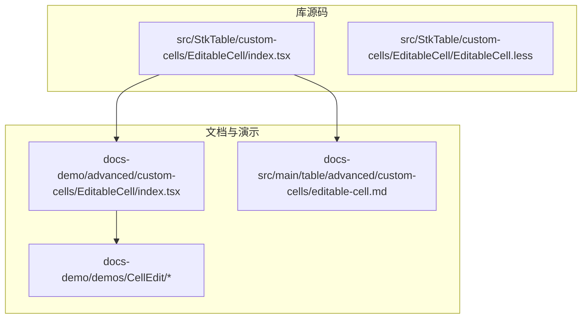
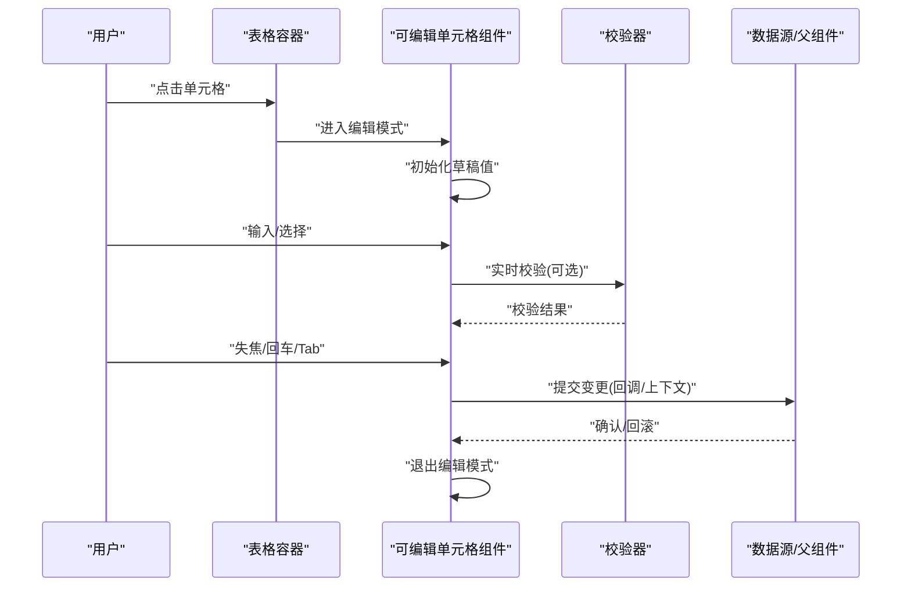
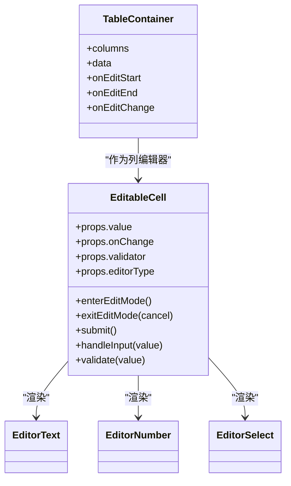
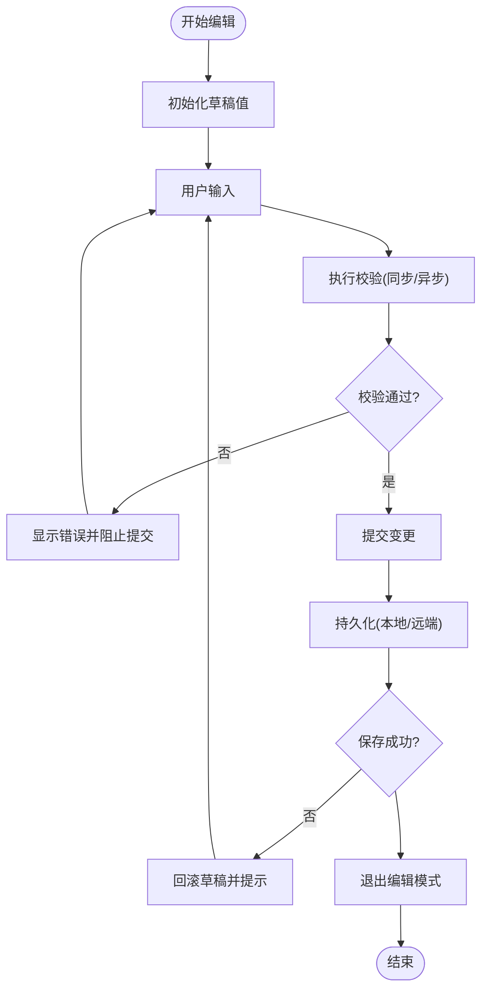
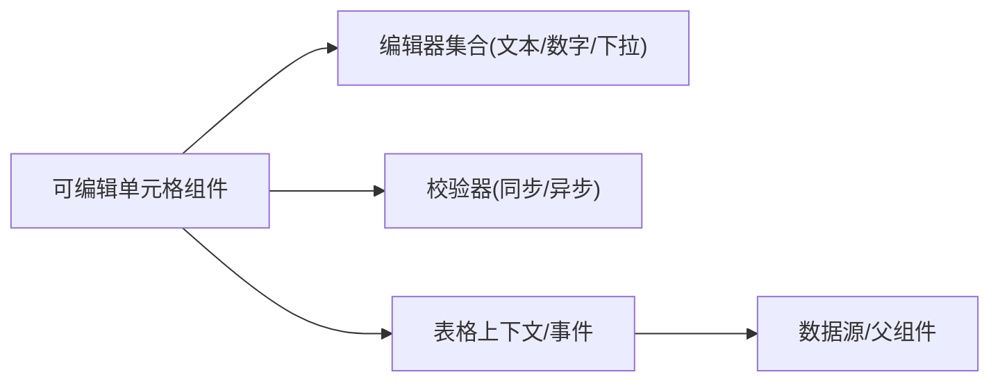

# 可编辑单元格

<cite>
**本文引用的文件**   
- [src/StkTable/custom-cells/EditableCell/index.tsx](file://src/StkTable/custom-cells/EditableCell/index.tsx)
- [src/StkTable/custom-cells/EditableCell/EditableCell.less](file://src/StkTable/custom-cells/EditableCell/EditableCell.less)
- [docs-demo/advanced/custom-cells/EditableCell/index.tsx](file://docs-demo/advanced/custom-cells/EditableCell/index.tsx)
- [docs-src/main/table/advanced/custom-cells/editable-cell.md](file://docs-src/main/table/advanced/custom-cells/editable-cell.md)
- [docs-src/en/table/advanced/custom-cells/editable-cell.md](file://docs-src/en/table/advanced/custom-cells/editable-cell.md)
- [docs-src/ja/table/advanced/custom-cells/editable-cell.md](file://docs-src/ja/table/advanced/custom-cells/editable-cell.md)
- [docs-src/ko/table/advanced/custom-cells/editable-cell.md](file://docs-src/ko/table/advanced/custom-cells/editable-cell.md)
- [docs-demo/demos/CellEdit/EditCell.tsx](file://docs-demo/demos/CellEdit/EditCell.tsx)
- [docs-demo/demos/CellEdit/context.ts](file://docs-demo/demos/CellEdit/context.ts)
- [docs-demo/demos/CellEdit/type.ts](file://docs-demo/demos/CellEdit/type.ts)
- [docs-demo/demos/CellEdit/index.tsx](file://docs-demo/demos/CellEdit/index.tsx)
- [docs-demo/demos/CellEdit/EditRowSwitch.tsx](file://docs-demo/demos/CellEdit/EditRowSwitch.tsx)
</cite>

## 目录
1. [简介](#简介)
2. [项目结构](#项目结构)
3. [核心组件](#核心组件)
4. [架构总览](#架构总览)
5. [详细组件分析](#详细组件分析)
6. [依赖分析](#依赖分析)
7. [性能考虑](#性能考虑)
8. [故障排查指南](#故障排查指南)
9. [结论](#结论)
10. [附录](#附录)

## 简介
本文件面向需要实现企业级表格“完全可编辑”能力的开发者，围绕可编辑单元格的编辑模式切换、输入验证、数据绑定与提交处理、编辑状态管理、撤销重做、键盘导航、表单校验、异步保存与并发编辑等主题进行系统化说明。文档以仓库中已实现的“可编辑单元格”示例为基础，结合演示代码与官方文档页面，提供从概念到落地的完整路径。

## 项目结构
本项目将“可编辑单元格”能力拆分为：
- 库内通用可编辑单元格组件（位于 src/StkTable/custom-cells/EditableCell）
- 文档与演示（位于 docs-demo 与 docs-src）

图表来源
- [src/StkTable/custom-cells/EditableCell/index.tsx](file://src/StkTable/custom-cells/EditableCell/index.tsx)
- [docs-demo/advanced/custom-cells/EditableCell/index.tsx](file://docs-demo/advanced/custom-cells/EditableCell/index.tsx)
- [docs-src/main/table/advanced/custom-cells/editable-cell.md](file://docs-src/main/table/advanced/custom-cells/editable-cell.md)
- [docs-demo/demos/CellEdit/index.tsx](file://docs-demo/demos/CellEdit/index.tsx)

章节来源
- [src/StkTable/custom-cells/EditableCell/index.tsx](file://src/StkTable/custom-cells/EditableCell/index.tsx)
- [docs-demo/advanced/custom-cells/EditableCell/index.tsx](file://docs-demo/advanced/custom-cells/EditableCell/index.tsx)
- [docs-src/main/table/advanced/custom-cells/editable-cell.md](file://docs-src/main/table/advanced/custom-cells/editable-cell.md)

## 核心组件
- 可编辑单元格组件：负责在“显示模式”和“编辑模式”之间切换，渲染对应编辑器（文本、数字、下拉等），并处理输入变更、校验、失焦提交、键盘导航等交互。
- 样式文件：定义编辑态聚焦边框、占位符、错误提示等视觉反馈。
- 文档页：描述属性、事件、使用方式与最佳实践。
- 演示工程：展示多种编辑场景组合与高级用法。

章节来源
- [src/StkTable/custom-cells/EditableCell/index.tsx](file://src/StkTable/custom-cells/EditableCell/index.tsx)
- [src/StkTable/custom-cells/EditableCell/EditableCell.less](file://src/StkTable/custom-cells/EditableCell/EditableCell.less)
- [docs-src/main/table/advanced/custom-cells/editable-cell.md](file://docs-src/main/table/advanced/custom-cells/editable-cell.md)

## 架构总览
下图展示了“可编辑单元格”在表格中的典型调用链与数据流：表格列配置引用可编辑单元格组件；用户交互触发编辑态；组件内部完成本地草稿、校验与提交；最终通过回调或上下文更新数据源。

图表来源
- [src/StkTable/custom-cells/EditableCell/index.tsx](file://src/StkTable/custom-cells/EditableCell/index.tsx)
- [docs-demo/demos/CellEdit/EditCell.tsx](file://docs-demo/demos/CellEdit/EditCell.tsx)
- [docs-demo/demos/CellEdit/context.ts](file://docs-demo/demos/CellEdit/context.ts)

## 详细组件分析

### 组件职责与生命周期
- 显示模式：仅渲染当前值，支持点击进入编辑。
- 编辑模式：渲染具体编辑器（文本框、数字框、下拉等），维护本地草稿值，支持实时校验与即时反馈。
- 提交时机：失焦、回车、Tab 等；支持取消（Esc）。
- 生命周期要点：
  - 进入编辑：复制当前值为草稿，清空错误。
  - 编辑中：监听输入变化，执行校验，必要时阻止提交。
  - 提交：合并草稿至数据源，触发外部回调，退出编辑。
  - 取消：丢弃草稿，恢复原值，退出编辑。

章节来源
- [src/StkTable/custom-cells/EditableCell/index.tsx](file://src/StkTable/custom-cells/EditableCell/index.tsx)

### 编辑模式切换与键盘导航
- 鼠标：点击单元格进入编辑；点击空白区域或另一个单元格时，先提交当前编辑再切换。
- 键盘：
  - Enter：提交并停留在当前单元格（或按配置移动）。
  - Tab/Shift+Tab：提交并移动到下一个/上一个单元格。
  - Esc：取消编辑，恢复原值。
  - 方向键：根据配置在相邻单元格间移动（需配合表格的焦点管理）。

章节来源
- [src/StkTable/custom-cells/EditableCell/index.tsx](file://src/StkTable/custom-cells/EditableCell/index.tsx)

### 输入验证与错误处理
- 同步校验：在输入 onChange 时执行，返回错误信息或空字符串表示通过。
- 异步校验：如唯一性检查，可在提交前发起请求，失败则阻止提交并提示。
- 错误展示：在编辑器下方或侧边显示错误文案；错误状态下禁止提交。
- 防抖策略：对高频输入（如搜索型字段）建议对异步校验进行防抖。

章节来源
- [src/StkTable/custom-cells/EditableCell/index.tsx](file://src/StkTable/custom-cells/EditableCell/index.tsx)

### 数据绑定与提交处理
- 受控模式：由父组件传入 value 与 onChange，组件只负责渲染与回调。
- 非受控模式：组件内部维护草稿，提交时一次性写入数据源。
- 提交回调：
  - 成功：刷新视图、记录日志、触发全局通知。
  - 失败：保留草稿、显示错误、允许重试。

章节来源
- [src/StkTable/custom-cells/EditableCell/index.tsx](file://src/StkTable/custom-cells/EditableCell/index.tsx)

### 撤销/重做机制
- 基于操作栈：每次提交成功后，将旧值与新值压入栈；撤销/重做时弹出栈项并回写数据源。
- 作用域：可按单元格、行或整表维度维护栈，避免相互干扰。
- 边界条件：
  - 跨页/虚拟滚动：确保历史栈与可见数据一致。
  - 并发冲突：服务端返回版本号或时间戳，客户端比较后决定覆盖或提示冲突。

章节来源
- [src/StkTable/custom-cells/EditableCell/index.tsx](file://src/StkTable/custom-cells/EditableCell/index.tsx)

### 多类型编辑器示例
- 文本输入：适用于自由文本，支持最大长度、正则校验。
- 数字输入：限制范围、小数位数、千分位格式化。
- 下拉选择：单选/多选，支持远程搜索与分页加载。
- 日期/时间：本地化格式、最小/最大日期约束。
- 富文本：按需启用，注意性能与安全性。

章节来源
- [docs-demo/advanced/custom-cells/EditableCell/index.tsx](file://docs-demo/advanced/custom-cells/EditableCell/index.tsx)
- [docs-demo/demos/CellEdit/EditCell.tsx](file://docs-demo/demos/CellEdit/EditCell.tsx)

### 表单验证与异步保存
- 表单级校验：在批量提交前聚合各单元格校验结果，统一提示。
- 异步保存：
  - 单格提交：立即发送请求，失败回滚。
  - 批量提交：收集脏数据，合并为一次请求，提升吞吐。
- 并发编辑：
  - 乐观更新：先更新 UI，失败再回滚。
  - 冲突解决：以服务端为准，提示差异并提供合并策略。

章节来源
- [docs-demo/demos/CellEdit/EditCell.tsx](file://docs-demo/demos/CellEdit/EditCell.tsx)
- [docs-demo/demos/CellEdit/context.ts](file://docs-demo/demos/CellEdit/context.ts)

### 与表格容器的集成
- 列配置：在列定义中指定 editor 类型为“可编辑单元格”，并传入校验规则、选项、格式化器等。
- 事件透传：表格捕获编辑相关事件（onEditStart/onEditEnd/onEditChange），用于统计、埋点或联动逻辑。
- 焦点管理：与表格的行列选择、虚拟滚动、固定列等特性协同，保证键盘导航体验一致。

章节来源
- [docs-src/main/table/advanced/custom-cells/editable-cell.md](file://docs-src/main/table/advanced/custom-cells/editable-cell.md)
- [docs-demo/demos/CellEdit/index.tsx](file://docs-demo/demos/CellEdit/index.tsx)

#### 类图（组件关系）

图表来源
- [src/StkTable/custom-cells/EditableCell/index.tsx](file://src/StkTable/custom-cells/EditableCell/index.tsx)
- [docs-demo/demos/CellEdit/EditCell.tsx](file://docs-demo/demos/CellEdit/EditCell.tsx)

#### 流程图（提交与校验）

图表来源
- [src/StkTable/custom-cells/EditableCell/index.tsx](file://src/StkTable/custom-cells/EditableCell/index.tsx)

## 依赖分析
- 组件内部依赖：
  - 编辑器控件：文本、数字、下拉等基础输入组件。
  - 校验工具：同步/异步校验函数。
  - 事件总线/上下文：与表格容器通信，传递编辑事件与数据变更。
- 外部依赖：
  - 国际化：如需多语言错误提示。
  - 网络层：异步保存时的请求封装。
- 耦合与内聚：
  - 编辑器与校验解耦，便于扩展新编辑器类型。
  - 提交逻辑集中，利于统一处理撤销/重做与并发冲突。

图表来源
- [src/StkTable/custom-cells/EditableCell/index.tsx](file://src/StkTable/custom-cells/EditableCell/index.tsx)
- [docs-demo/demos/CellEdit/context.ts](file://docs-demo/demos/CellEdit/context.ts)

章节来源
- [src/StkTable/custom-cells/EditableCell/index.tsx](file://src/StkTable/custom-cells/EditableCell/index.tsx)
- [docs-demo/demos/CellEdit/context.ts](file://docs-demo/demos/CellEdit/context.ts)

## 性能考虑
- 渲染优化：
  - 仅在编辑态渲染编辑器，显示态保持轻量。
  - 对长列表启用虚拟滚动，减少 DOM 节点数量。
- 计算优化：
  - 校验函数去抖/节流，避免频繁触发。
  - 大数组更新采用增量 diff，避免全量替换。
- 交互优化：
  - 键盘导航时预取相邻单元格数据，减少闪烁。
  - 异步保存失败快速回滚，避免阻塞后续操作。

[本节为通用指导，不直接分析具体文件]

## 故障排查指南
- 常见问题
  - 无法进入编辑：检查列配置是否声明了编辑器类型，以及点击事件是否被上层拦截。
  - 提交无效：确认 onChange 回调是否正确更新数据源，或上下文是否生效。
  - 校验不生效：检查 validator 返回值约定与错误提示位置。
  - 键盘导航异常：核对表格焦点管理与方向键处理逻辑。
  - 并发冲突：对比服务端版本号，决定是否覆盖或提示差异。
- 定位方法
  - 在 onEditStart/onEditEnd/onEditChange 打印关键参数。
  - 打开浏览器控制台，观察网络请求与错误堆栈。
  - 针对异步校验增加超时与重试策略，避免假死。

章节来源
- [src/StkTable/custom-cells/EditableCell/index.tsx](file://src/StkTable/custom-cells/EditableCell/index.tsx)
- [docs-demo/demos/CellEdit/EditCell.tsx](file://docs-demo/demos/CellEdit/EditCell.tsx)

## 结论
通过统一的“可编辑单元格”组件与完善的文档/演示，开发者可以快速构建企业级表格编辑能力。建议在项目中遵循以下原则：
- 明确受控与非受控边界，统一提交入口。
- 将校验与保存逻辑抽象为可插拔模块，便于扩展与测试。
- 重视键盘可达性与无障碍体验，完善撤销/重做与并发冲突处理。
- 结合虚拟滚动与增量更新，保障大数据量下的流畅度。

[本节为总结性内容，不直接分析具体文件]

## 附录
- 多语言文档参考：
  - [英文文档](file://docs-src/en/table/advanced/custom-cells/editable-cell.md)
  - [日文文档](file://docs-src/ja/table/advanced/custom-cells/editable-cell.md)
  - [韩文文档](file://docs-src/ko/table/advanced/custom-cells/editable-cell.md)
- 更多演示：
  - [行级编辑开关示例](file://docs-demo/demos/CellEdit/EditRowSwitch.tsx)
  - [CellEdit 主入口](file://docs-demo/demos/CellEdit/index.tsx)