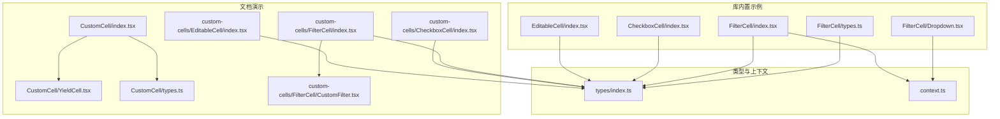
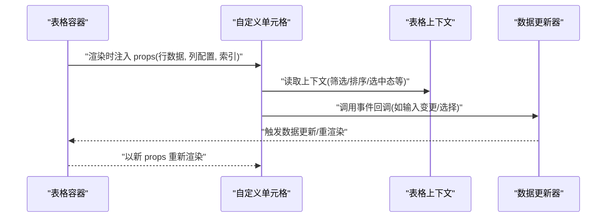
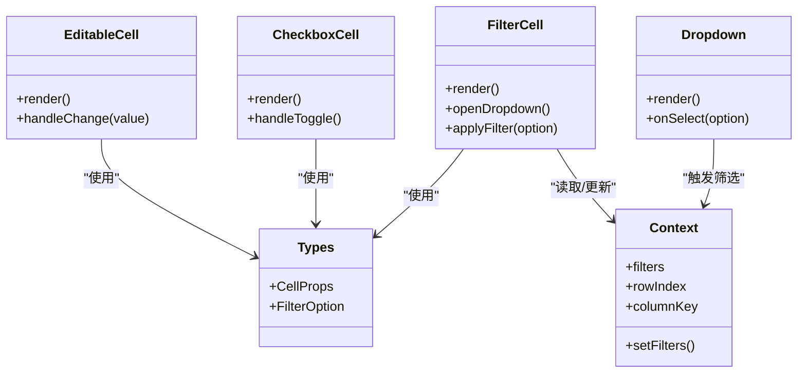
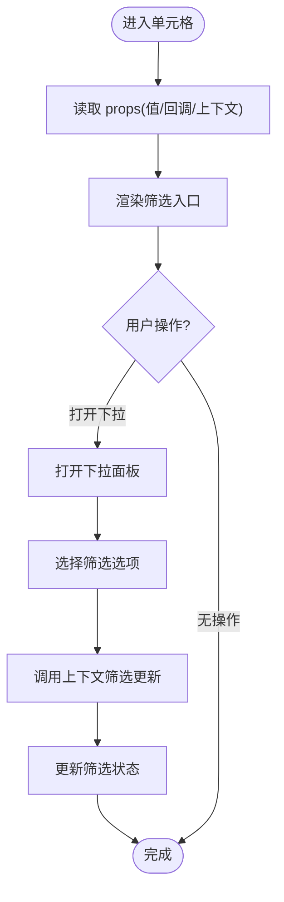
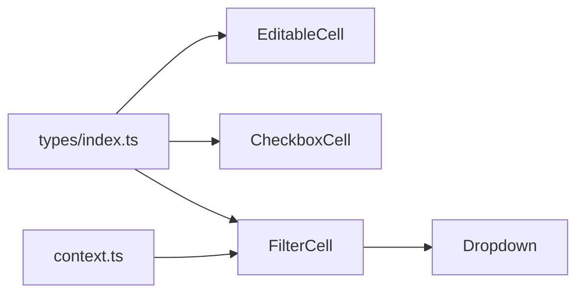

# 基础自定义单元格

<cite>
**本文引用的文件**   
- [src/StkTable/custom-cells/EditableCell/index.tsx](file://src/StkTable/custom-cells/EditableCell/index.tsx)
- [src/StkTable/custom-cells/CheckboxCell/index.tsx](file://src/StkTable/custom-cells/CheckboxCell/index.tsx)
- [src/StkTable/custom-cells/FilterCell/index.tsx](file://src/StkTable/custom-cells/FilterCell/index.tsx)
- [src/StkTable/custom-cells/FilterCell/Dropdown.tsx](file://src/StkTable/custom-cells/FilterCell/Dropdown.tsx)
- [src/StkTable/custom-cells/FilterCell/types.ts](file://src/StkTable/custom-cells/FilterCell/types.ts)
- [docs-demo/advanced/custom-cell/CustomCell/YieldCell.tsx](file://docs-demo/advanced/custom-cell/CustomCell/YieldCell.tsx)
- [docs-demo/advanced/custom-cell/CustomCell/index.tsx](file://docs-demo/advanced/custom-cell/CustomCell/index.tsx)
- [docs-demo/advanced/custom-cell/CustomCell/types.ts](file://docs-demo/advanced/custom-cell/CustomCell/types.ts)
- [docs-demo/advanced/custom-cells/EditableCell/index.tsx](file://docs-demo/advanced/custom-cells/EditableCell/index.tsx)
- [docs-demo/advanced/custom-cells/CheckboxCell/index.tsx](file://docs-demo/advanced/custom-cells/CheckboxCell/index.tsx)
- [docs-demo/advanced/custom-cells/FilterCell/index.tsx](file://docs-demo/advanced/custom-cells/FilterCell/index.tsx)
- [docs-demo/advanced/custom-cells/FilterCell/CustomFilter.tsx](file://docs-demo/advanced/custom-cells/FilterCell/CustomFilter.tsx)
- [src/StkTable/context.ts](file://src/StkTable/context.ts)
- [src/StkTable/types/index.ts](file://src/StkTable/types/index.ts)
</cite>

## 目录
1. [简介](#简介)
2. [项目结构](#项目结构)
3. [核心组件](#核心组件)
4. [架构总览](#架构总览)
5. [详细组件分析](#详细组件分析)
6. [依赖关系分析](#依赖关系分析)
7. [性能考虑](#性能考虑)
8. [故障排查指南](#故障排查指南)
9. [结论](#结论)
10. [附录](#附录)

## 简介
本章节面向希望实现“基础自定义单元格”的开发者，系统讲解如何创建与实现自定义单元格组件。内容涵盖：
- 单元格的基本结构与 Props 接口约定
- 渲染函数的使用方式
- YieldCell 的使用方法与数据传递机制（上下文信息获取、事件处理函数绑定）
- 从简单文本显示到复杂交互的渐进式示例路径
- 单元格生命周期、性能优化技巧与最佳实践

目标是帮助开发者快速掌握自定义单元格的核心概念与开发模式，并在实际项目中稳定落地。

## 项目结构
仓库中与“自定义单元格”相关的代码主要分布在以下位置：
- 库内置示例单元格：src/StkTable/custom-cells/*
- 文档演示用例：docs-demo/advanced/custom-*/*
- 类型与上下文定义：src/StkTable/types/index.ts、src/StkTable/context.ts

下图展示了与自定义单元格相关的关键文件组织关系：

图表来源
- [src/StkTable/custom-cells/EditableCell/index.tsx](file://src/StkTable/custom-cells/EditableCell/index.tsx)
- [src/StkTable/custom-cells/CheckboxCell/index.tsx](file://src/StkTable/custom-cells/CheckboxCell/index.tsx)
- [src/StkTable/custom-cells/FilterCell/index.tsx](file://src/StkTable/custom-cells/FilterCell/index.tsx)
- [src/StkTable/custom-cells/FilterCell/Dropdown.tsx](file://src/StkTable/custom-cells/FilterCell/Dropdown.tsx)
- [src/StkTable/custom-cells/FilterCell/types.ts](file://src/StkTable/custom-cells/FilterCell/types.ts)
- [docs-demo/advanced/custom-cell/CustomCell/index.tsx](file://docs-demo/advanced/custom-cell/CustomCell/index.tsx)
- [docs-demo/advanced/custom-cell/CustomCell/YieldCell.tsx](file://docs-demo/advanced/custom-cell/CustomCell/YieldCell.tsx)
- [docs-demo/advanced/custom-cell/CustomCell/types.ts](file://docs-demo/advanced/custom-cell/CustomCell/types.ts)
- [docs-demo/advanced/custom-cells/EditableCell/index.tsx](file://docs-demo/advanced/custom-cells/EditableCell/index.tsx)
- [docs-demo/advanced/custom-cells/CheckboxCell/index.tsx](file://docs-demo/advanced/custom-cells/CheckboxCell/index.tsx)
- [docs-demo/advanced/custom-cells/FilterCell/index.tsx](file://docs-demo/advanced/custom-cells/FilterCell/index.tsx)
- [docs-demo/advanced/custom-cells/FilterCell/CustomFilter.tsx](file://docs-demo/advanced/custom-cells/FilterCell/CustomFilter.tsx)
- [src/StkTable/types/index.ts](file://src/StkTable/types/index.ts)
- [src/StkTable/context.ts](file://src/StkTable/context.ts)

章节来源
- [src/StkTable/custom-cells/EditableCell/index.tsx](file://src/StkTable/custom-cells/EditableCell/index.tsx)
- [src/StkTable/custom-cells/CheckboxCell/index.tsx](file://src/StkTable/custom-cells/CheckboxCell/index.tsx)
- [src/StkTable/custom-cells/FilterCell/index.tsx](file://src/StkTable/custom-cells/FilterCell/index.tsx)
- [src/StkTable/custom-cells/FilterCell/Dropdown.tsx](file://src/StkTable/custom-cells/FilterCell/Dropdown.tsx)
- [src/StkTable/custom-cells/FilterCell/types.ts](file://src/StkTable/custom-cells/FilterCell/types.ts)
- [docs-demo/advanced/custom-cell/CustomCell/index.tsx](file://docs-demo/advanced/custom-cell/CustomCell/index.tsx)
- [docs-demo/advanced/custom-cell/CustomCell/YieldCell.tsx](file://docs-demo/advanced/custom-cell/CustomCell/YieldCell.tsx)
- [docs-demo/advanced/custom-cell/CustomCell/types.ts](file://docs-demo/advanced/custom-cell/CustomCell/types.ts)
- [docs-demo/advanced/custom-cells/EditableCell/index.tsx](file://docs-demo/advanced/custom-cells/EditableCell/index.tsx)
- [docs-demo/advanced/custom-cells/CheckboxCell/index.tsx](file://docs-demo/advanced/custom-cells/CheckboxCell/index.tsx)
- [docs-demo/advanced/custom-cells/FilterCell/index.tsx](file://docs-demo/advanced/custom-cells/FilterCell/index.tsx)
- [docs-demo/advanced/custom-cells/FilterCell/CustomFilter.tsx](file://docs-demo/advanced/custom-cells/FilterCell/CustomFilter.tsx)
- [src/StkTable/types/index.ts](file://src/StkTable/types/index.ts)
- [src/StkTable/context.ts](file://src/StkTable/context.ts)

## 核心组件
本节聚焦于“基础自定义单元格”的实现要点与通用模式。

- 基本结构
  - 自定义单元格是一个 React 组件，接收来自表格框架注入的 props，包括当前行数据、列配置、索引等上下文信息。
  - 通常通过解构 props 获取必要字段，并返回需要渲染的 UI。

- Props 接口约定
  - 常见字段包含：行数据对象、列配置、行索引、是否可编辑、值读写回调、事件处理回调等。
  - 建议将公共字段抽取为统一类型，便于复用与维护。

- 渲染函数
  - 在单元格内部根据状态或外部传入的渲染函数决定输出内容。
  - 对于复杂展示逻辑，可将渲染函数作为 prop 传入，提升灵活性。

- 事件处理
  - 通过 props 提供的事件回调进行交互（如点击、输入变更、选择等）。
  - 事件回调中应更新受控状态或调用上层提供的写入方法，保持数据流单向。

- 上下文信息
  - 可通过上下文对象获取表格级能力（如筛选、排序、选中态等），以便在单元格内触发相应行为。

章节来源
- [src/StkTable/custom-cells/EditableCell/index.tsx](file://src/StkTable/custom-cells/EditableCell/index.tsx)
- [src/StkTable/custom-cells/CheckboxCell/index.tsx](file://src/StkTable/custom-cells/CheckboxCell/index.tsx)
- [src/StkTable/custom-cells/FilterCell/index.tsx](file://src/StkTable/custom-cells/FilterCell/index.tsx)
- [src/StkTable/custom-cells/FilterCell/Dropdown.tsx](file://src/StkTable/custom-cells/FilterCell/Dropdown.tsx)
- [src/StkTable/custom-cells/FilterCell/types.ts](file://src/StkTable/custom-cells/FilterCell/types.ts)
- [src/StkTable/types/index.ts](file://src/StkTable/types/index.ts)
- [src/StkTable/context.ts](file://src/StkTable/context.ts)

## 架构总览
下图展示了“基础自定义单元格”在表格中的典型交互流程：表格容器向单元格注入上下文与回调，单元格消费这些能力完成展示与交互。

图表来源
- [src/StkTable/custom-cells/EditableCell/index.tsx](file://src/StkTable/custom-cells/EditableCell/index.tsx)
- [src/StkTable/custom-cells/CheckboxCell/index.tsx](file://src/StkTable/custom-cells/CheckboxCell/index.tsx)
- [src/StkTable/custom-cells/FilterCell/index.tsx](file://src/StkTable/custom-cells/FilterCell/index.tsx)
- [src/StkTable/context.ts](file://src/StkTable/context.ts)

## 详细组件分析

### 可编辑单元格（基础交互）
- 目标
  - 实现一个支持就地编辑的单元格，用户修改后能回写至表格数据。
- 关键实现点
  - 从 props 中读取当前值与写入回调；在输入框 onChange 中调用写入回调。
  - 可选：在失焦或回车时提交，避免频繁更新。
  - 结合上下文判断是否可编辑。
- 参考路径
  - [src/StkTable/custom-cells/EditableCell/index.tsx](file://src/StkTable/custom-cells/EditableCell/index.tsx)
  - [docs-demo/advanced/custom-cells/EditableCell/index.tsx](file://docs-demo/advanced/custom-cells/EditableCell/index.tsx)

章节来源
- [src/StkTable/custom-cells/EditableCell/index.tsx](file://src/StkTable/custom-cells/EditableCell/index.tsx)
- [docs-demo/advanced/custom-cells/EditableCell/index.tsx](file://docs-demo/advanced/custom-cells/EditableCell/index.tsx)

### 复选框单元格（布尔值交互）
- 目标
  - 展示并切换布尔值，常用于多选场景。
- 关键实现点
  - 从 props 读取布尔值与切换回调；onChange 中调用切换方法。
  - 结合上下文禁用态控制交互。
- 参考路径
  - [src/StkTable/custom-cells/CheckboxCell/index.tsx](file://src/StkTable/custom-cells/CheckboxCell/index.tsx)
  - [docs-demo/advanced/custom-cells/CheckboxCell/index.tsx](file://docs-demo/advanced/custom-cells/CheckboxCell/index.tsx)

章节来源
- [src/StkTable/custom-cells/CheckboxCell/index.tsx](file://src/StkTable/custom-cells/CheckboxCell/index.tsx)
- [docs-demo/advanced/custom-cells/CheckboxCell/index.tsx](file://docs-demo/advanced/custom-cells/CheckboxCell/index.tsx)

### 筛选单元格（下拉筛选）
- 目标
  - 在单元格内提供筛选入口，支持下拉选择并应用筛选条件。
- 关键实现点
  - 通过上下文获取筛选 API，打开下拉面板，选择后调用筛选更新。
  - 下拉组件独立封装，复用筛选逻辑。
- 参考路径
  - [src/StkTable/custom-cells/FilterCell/index.tsx](file://src/StkTable/custom-cells/FilterCell/index.tsx)
  - [src/StkTable/custom-cells/FilterCell/Dropdown.tsx](file://src/StkTable/custom-cells/FilterCell/Dropdown.tsx)
  - [src/StkTable/custom-cells/FilterCell/types.ts](file://src/StkTable/custom-cells/FilterCell/types.ts)
  - [docs-demo/advanced/custom-cells/FilterCell/index.tsx](file://docs-demo/advanced/custom-cells/FilterCell/index.tsx)
  - [docs-demo/advanced/custom-cells/FilterCell/CustomFilter.tsx](file://docs-demo/advanced/custom-cells/FilterCell/CustomFilter.tsx)

章节来源
- [src/StkTable/custom-cells/FilterCell/index.tsx](file://src/StkTable/custom-cells/FilterCell/index.tsx)
- [src/StkTable/custom-cells/FilterCell/Dropdown.tsx](file://src/StkTable/custom-cells/FilterCell/Dropdown.tsx)
- [src/StkTable/custom-cells/FilterCell/types.ts](file://src/StkTable/custom-cells/FilterCell/types.ts)
- [docs-demo/advanced/custom-cells/FilterCell/index.tsx](file://docs-demo/advanced/custom-cells/FilterCell/index.tsx)
- [docs-demo/advanced/custom-cells/FilterCell/CustomFilter.tsx](file://docs-demo/advanced/custom-cells/FilterCell/CustomFilter.tsx)

### YieldCell 使用与数据传递
- 目标
  - 理解如何使用 YieldCell 将单元格渲染逻辑与业务数据解耦，并通过上下文传递数据与事件。
- 关键点
  - 通过 props 传入渲染函数或插槽内容，YieldCell 负责在合适时机渲染。
  - 利用上下文获取行/列/索引等信息，以及事件处理函数绑定。
- 参考路径
  - [docs-demo/advanced/custom-cell/CustomCell/YieldCell.tsx](file://docs-demo/advanced/custom-cell/CustomCell/YieldCell.tsx)
  - [docs-demo/advanced/custom-cell/CustomCell/index.tsx](file://docs-demo/advanced/custom-cell/CustomCell/index.tsx)
  - [docs-demo/advanced/custom-cell/CustomCell/types.ts](file://docs-demo/advanced/custom-cell/CustomCell/types.ts)

章节来源
- [docs-demo/advanced/custom-cell/CustomCell/YieldCell.tsx](file://docs-demo/advanced/custom-cell/CustomCell/YieldCell.tsx)
- [docs-demo/advanced/custom-cell/CustomCell/index.tsx](file://docs-demo/advanced/custom-cell/CustomCell/index.tsx)
- [docs-demo/advanced/custom-cell/CustomCell/types.ts](file://docs-demo/advanced/custom-cell/CustomCell/types.ts)

### 类图：自定义单元格与上下文的关系
下图展示了自定义单元格与表格上下文、类型定义的依赖关系。

图表来源
- [src/StkTable/custom-cells/EditableCell/index.tsx](file://src/StkTable/custom-cells/EditableCell/index.tsx)
- [src/StkTable/custom-cells/CheckboxCell/index.tsx](file://src/StkTable/custom-cells/CheckboxCell/index.tsx)
- [src/StkTable/custom-cells/FilterCell/index.tsx](file://src/StkTable/custom-cells/FilterCell/index.tsx)
- [src/StkTable/custom-cells/FilterCell/Dropdown.tsx](file://src/StkTable/custom-cells/FilterCell/Dropdown.tsx)
- [src/StkTable/custom-cells/FilterCell/types.ts](file://src/StkTable/custom-cells/FilterCell/types.ts)
- [src/StkTable/types/index.ts](file://src/StkTable/types/index.ts)
- [src/StkTable/context.ts](file://src/StkTable/context.ts)

### 流程图：筛选单元格的数据流

图表来源
- [src/StkTable/custom-cells/FilterCell/index.tsx](file://src/StkTable/custom-cells/FilterCell/index.tsx)
- [src/StkTable/custom-cells/FilterCell/Dropdown.tsx](file://src/StkTable/custom-cells/FilterCell/Dropdown.tsx)
- [src/StkTable/context.ts](file://src/StkTable/context.ts)

## 依赖关系分析
- 组件耦合
  - 可编辑/复选框/筛选单元格均依赖统一的类型定义，降低耦合度。
  - 筛选单元格额外依赖表格上下文，用于读写筛选状态。
- 外部依赖
  - 通过 context 暴露表格能力，避免直接引用具体实现。
- 潜在循环依赖
  - 当前结构清晰，未见循环导入；若扩展需确保仅单向依赖 types/context。

图表来源
- [src/StkTable/types/index.ts](file://src/StkTable/types/index.ts)
- [src/StkTable/context.ts](file://src/StkTable/context.ts)
- [src/StkTable/custom-cells/EditableCell/index.tsx](file://src/StkTable/custom-cells/EditableCell/index.tsx)
- [src/StkTable/custom-cells/CheckboxCell/index.tsx](file://src/StkTable/custom-cells/CheckboxCell/index.tsx)
- [src/StkTable/custom-cells/FilterCell/index.tsx](file://src/StkTable/custom-cells/FilterCell/index.tsx)
- [src/StkTable/custom-cells/FilterCell/Dropdown.tsx](file://src/StkTable/custom-cells/FilterCell/Dropdown.tsx)

章节来源
- [src/StkTable/types/index.ts](file://src/StkTable/types/index.ts)
- [src/StkTable/context.ts](file://src/StkTable/context.ts)
- [src/StkTable/custom-cells/EditableCell/index.tsx](file://src/StkTable/custom-cells/EditableCell/index.tsx)
- [src/StkTable/custom-cells/CheckboxCell/index.tsx](file://src/StkTable/custom-cells/CheckboxCell/index.tsx)
- [src/StkTable/custom-cells/FilterCell/index.tsx](file://src/StkTable/custom-cells/FilterCell/index.tsx)
- [src/StkTable/custom-cells/FilterCell/Dropdown.tsx](file://src/StkTable/custom-cells/FilterCell/Dropdown.tsx)

## 性能考虑
- 最小化重渲染
  - 仅在必要时更新状态；对输入变更采用防抖/节流策略。
  - 使用稳定的回调与 memo 包裹子组件，减少不必要的渲染。
- 大数据量
  - 结合虚拟滚动与按需加载，避免一次性渲染大量单元格。
- 事件合并
  - 批量更新筛选条件，避免多次触发重排。
- 样式与布局
  - 避免在渲染路径中进行昂贵计算；将计算结果缓存或使用 useMemo。

[本节为通用指导，不直接分析具体文件]

## 故障排查指南
- 常见问题
  - 输入无法回写：检查是否正确调用写入回调，确认受控状态同步。
  - 筛选无效：确认上下文筛选 API 的调用参数与返回值是否符合预期。
  - 事件未触发：检查事件绑定是否在正确的元素上，是否存在冒泡阻止。
- 定位步骤
  - 打印 props 与上下文，确认数据流链路。
  - 逐步注释渲染逻辑，缩小问题范围。
  - 使用浏览器调试工具观察状态变化与重渲染次数。

[本节为通用指导，不直接分析具体文件]

## 结论
通过本指南，开发者可以：
- 掌握自定义单元格的基础结构与 Props 约定
- 熟练使用渲染函数与上下文进行数据传递与事件绑定
- 基于可编辑、复选框、筛选等示例，构建从简单到复杂的交互
- 遵循性能优化与最佳实践，保证大规模数据下的流畅体验

[本节为总结性内容，不直接分析具体文件]

## 附录
- 渐进式示例路径（按复杂度递增）
  - 简单文本显示：参考 [docs-demo/advanced/custom-cell/CustomCell/index.tsx](file://docs-demo/advanced/custom-cell/CustomCell/index.tsx)
  - 可编辑文本：参考 [src/StkTable/custom-cells/EditableCell/index.tsx](file://src/StkTable/custom-cells/EditableCell/index.tsx)
  - 复选框选择：参考 [src/StkTable/custom-cells/CheckboxCell/index.tsx](file://src/StkTable/custom-cells/CheckboxCell/index.tsx)
  - 下拉筛选：参考 [src/StkTable/custom-cells/FilterCell/index.tsx](file://src/StkTable/custom-cells/FilterCell/index.tsx)
- 关键类型与上下文
  - 类型定义：[src/StkTable/types/index.ts](file://src/StkTable/types/index.ts)
  - 上下文接口：[src/StkTable/context.ts](file://src/StkTable/context.ts)