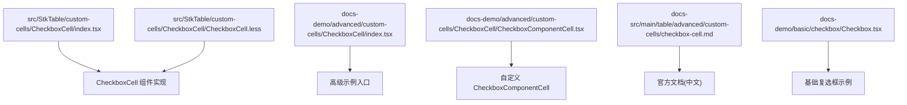
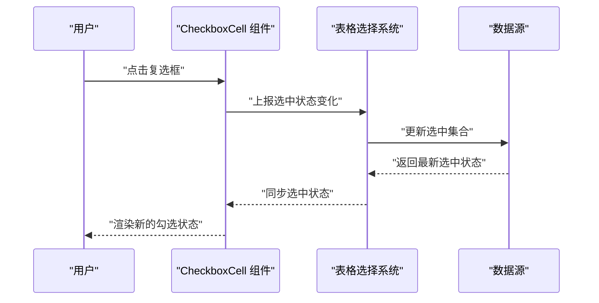
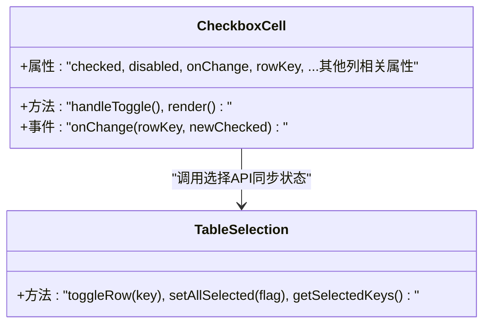
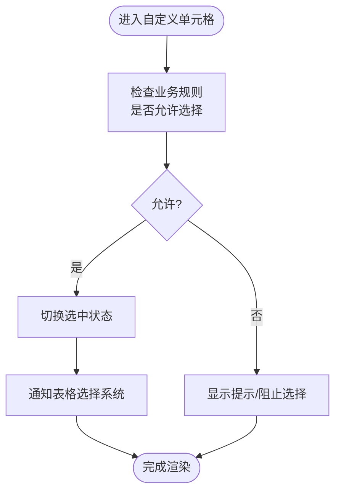
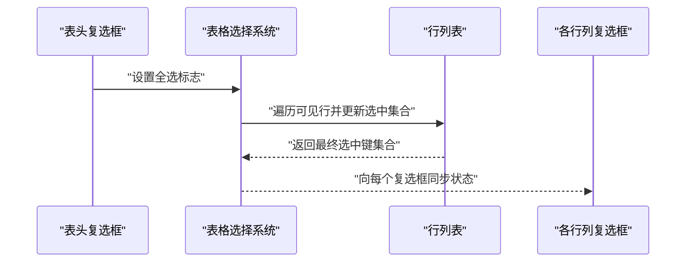
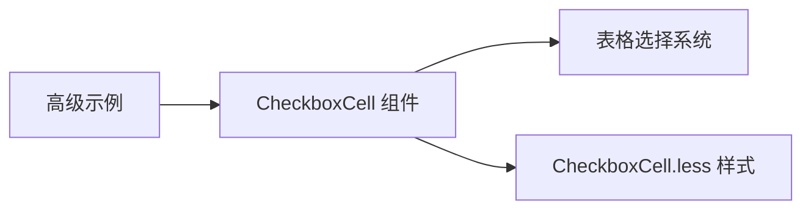

# 复选框单元格

<cite>
**本文引用的文件**   
- [src/StkTable/custom-cells/CheckboxCell/index.tsx](file://src/StkTable/custom-cells/CheckboxCell/index.tsx)
- [src/StkTable/custom-cells/CheckboxCell/CheckboxCell.less](file://src/StkTable/custom-cells/CheckboxCell/CheckboxCell.less)
- [docs-demo/advanced/custom-cells/CheckboxCell/index.tsx](file://docs-demo/advanced/custom-cells/CheckboxCell/index.tsx)
- [docs-demo/advanced/custom-cells/CheckboxCell/CheckboxComponentCell.tsx](file://docs-demo/advanced/custom-cells/CheckboxCell/CheckboxComponentCell.tsx)
- [docs-src/main/table/advanced/custom-cells/checkbox-cell.md](file://docs-src/main/table/advanced/custom-cells/checkbox-cell.md)
- [docs-src/en/table/advanced/custom-cells/checkbox-cell.md](file://docs-src/en/table/advanced/custom-cells/checkbox-cell.md)
- [docs-src/ja/table/advanced/custom-cells/checkbox-cell.md](file://docs-src/ja/table/advanced/custom-cells/checkbox-cell.md)
- [docs-src/ko/table/advanced/custom-cells/checkbox-cell.md](file://docs-src/ko/table/advanced/custom-cells/checkbox-cell.md)
- [docs-demo/basic/checkbox/Checkbox.tsx](file://docs-demo/basic/checkbox/Checkbox.tsx)
</cite>

## 目录
1. [简介](#简介)
2. [项目结构](#项目结构)
3. [核心组件](#核心组件)
4. [架构总览](#架构总览)
5. [详细组件分析](#详细组件分析)
6. [依赖分析](#依赖分析)
7. [性能考虑](#性能考虑)
8. [故障排查指南](#故障排查指南)
9. [结论](#结论)
10. [附录](#附录)

## 简介
本章节面向需要在表格中展示与操作复选框的开发者，系统讲解内置复选框单元格的用法、状态管理、批量操作、样式定制、事件处理以及与表格选择的集成方式。文档同时提供单选、多选、全选的完整使用示例路径，并解释状态同步机制、性能注意事项与常见问题解决方案，帮助你在不同业务场景下灵活扩展与落地复选框功能。

## 项目结构
围绕“复选框单元格”的相关代码与文档分布如下：
- 源码实现：位于 src/StkTable/custom-cells/CheckboxCell 目录下，包含组件逻辑与样式。
- 演示与示例：位于 docs-demo/advanced/custom-cells/CheckboxCell 与 docs-demo/basic/checkbox 目录，覆盖高级自定义与基础用法。
- 文档说明：位于 docs-src/main/table/advanced/custom-cells/checkbox-cell.md（含多语言版本）。

图表来源
- [src/StkTable/custom-cells/CheckboxCell/index.tsx](file://src/StkTable/custom-cells/CheckboxCell/index.tsx)
- [src/StkTable/custom-cells/CheckboxCell/CheckboxCell.less](file://src/StkTable/custom-cells/CheckboxCell/CheckboxCell.less)
- [docs-demo/advanced/custom-cells/CheckboxCell/index.tsx](file://docs-demo/advanced/custom-cells/CheckboxCell/index.tsx)
- [docs-demo/advanced/custom-cells/CheckboxCell/CheckboxComponentCell.tsx](file://docs-demo/advanced/custom-cells/CheckboxCell/CheckboxComponentCell.tsx)
- [docs-src/main/table/advanced/custom-cells/checkbox-cell.md](file://docs-src/main/table/advanced/custom-cells/checkbox-cell.md)
- [docs-demo/basic/checkbox/Checkbox.tsx](file://docs-demo/basic/checkbox/Checkbox.tsx)

章节来源
- [src/StkTable/custom-cells/CheckboxCell/index.tsx](file://src/StkTable/custom-cells/CheckboxCell/index.tsx)
- [src/StkTable/custom-cells/CheckboxCell/CheckboxCell.less](file://src/StkTable/custom-cells/CheckboxCell/CheckboxCell.less)
- [docs-demo/advanced/custom-cells/CheckboxCell/index.tsx](file://docs-demo/advanced/custom-cells/CheckboxCell/index.tsx)
- [docs-demo/advanced/custom-cells/CheckboxCell/CheckboxComponentCell.tsx](file://docs-demo/advanced/custom-cells/CheckboxCell/CheckboxComponentCell.tsx)
- [docs-src/main/table/advanced/custom-cells/checkbox-cell.md](file://docs-src/main/table/advanced/custom-cells/checkbox-cell.md)
- [docs-demo/basic/checkbox/Checkbox.tsx](file://docs-demo/basic/checkbox/Checkbox.tsx)

## 核心组件
- CheckboxCell 组件：提供行级复选框渲染与交互能力，支持受控与非受控模式、禁用态、选中状态变更回调等。
- 样式文件：通过独立的样式文件对复选框外观进行主题化与定制。
- 高级示例：在 docs-demo 中提供了基于 CheckboxComponentCell 的自定义实现，展示如何扩展默认行为。

章节来源
- [src/StkTable/custom-cells/CheckboxCell/index.tsx](file://src/StkTable/custom-cells/CheckboxCell/index.tsx)
- [src/StkTable/custom-cells/CheckboxCell/CheckboxCell.less](file://src/StkTable/custom-cells/CheckboxCell/CheckboxCell.less)
- [docs-demo/advanced/custom-cells/CheckboxCell/CheckboxComponentCell.tsx](file://docs-demo/advanced/custom-cells/CheckboxCell/CheckboxComponentCell.tsx)

## 架构总览
下图展示了复选框单元格在表格中的位置与交互流程：用户点击复选框触发事件，组件更新选中状态，并通过回调或上下文与表格选择系统进行同步。

图表来源
- [src/StkTable/custom-cells/CheckboxCell/index.tsx](file://src/StkTable/custom-cells/CheckboxCell/index.tsx)

## 详细组件分析

### CheckboxCell 组件分析
- 职责与边界
  - 负责单行复选框的渲染与交互。
  - 与表格选择系统集成，维护当前行的选中状态。
  - 暴露必要的配置项以适配不同业务需求（如禁用、只读、自定义文案等）。
- 关键概念
  - 受控模式：由外部传入 checked 值，组件仅负责渲染与回调。
  - 非受控模式：组件内部维护本地状态，适合简单场景。
  - 事件处理：onChange 回调用于将选中状态变化通知到上层或表格选择系统。
- 扩展点
  - 通过自定义 CheckboxComponentCell 替换默认实现，增加额外逻辑（如联动、二次确认等）。
  - 通过样式文件覆盖默认样式，实现主题定制。

图表来源
- [src/StkTable/custom-cells/CheckboxCell/index.tsx](file://src/StkTable/custom-cells/CheckboxCell/index.tsx)

章节来源
- [src/StkTable/custom-cells/CheckboxCell/index.tsx](file://src/StkTable/custom-cells/CheckboxCell/index.tsx)

### 自定义 CheckboxComponentCell 分析
- 目标
  - 在不修改核心组件的前提下，通过自定义单元格实现更复杂的业务逻辑。
- 典型能力
  - 在选中前进行校验或提示。
  - 根据业务规则限制某些行不可选。
  - 与表单或其他控件联动。
- 集成方式
  - 在列定义中使用自定义单元格类型，替代默认的 CheckboxCell。
  - 保持与表格选择系统的接口一致，确保全选/反选/批量操作正常工作。

图表来源
- [docs-demo/advanced/custom-cells/CheckboxCell/CheckboxComponentCell.tsx](file://docs-demo/advanced/custom-cells/CheckboxCell/CheckboxComponentCell.tsx)

章节来源
- [docs-demo/advanced/custom-cells/CheckboxCell/CheckboxComponentCell.tsx](file://docs-demo/advanced/custom-cells/CheckboxCell/CheckboxComponentCell.tsx)

### 样式定制
- 样式文件位置：CheckboxCell.less
- 定制建议
  - 通过覆盖默认类名或 CSS 变量实现主题化。
  - 针对禁用态、悬停态、焦点态分别定义样式。
  - 在大型项目中建议使用 CSS Modules 或 CSS-in-JS 方案统一管理样式。

章节来源
- [src/StkTable/custom-cells/CheckboxCell/CheckboxCell.less](file://src/StkTable/custom-cells/CheckboxCell/CheckboxCell.less)

### 与表格选择的集成
- 行级选择
  - 点击复选框后，调用表格选择 API 更新当前行选中状态。
- 全选/反选
  - 表头复选框控制所有可见行的选中状态，需结合分页与筛选结果计算实际影响范围。
- 批量操作
  - 基于选中集合执行批量删除、导出等操作。

图表来源
- [src/StkTable/custom-cells/CheckboxCell/index.tsx](file://src/StkTable/custom-cells/CheckboxCell/index.tsx)

章节来源
- [src/StkTable/custom-cells/CheckboxCell/index.tsx](file://src/StkTable/custom-cells/CheckboxCell/index.tsx)

### 使用示例与最佳实践
- 基本用法
  - 参考基础示例路径：[docs-demo/basic/checkbox/Checkbox.tsx](file://docs-demo/basic/checkbox/Checkbox.tsx)
- 高级自定义
  - 参考高级示例入口与自定义单元格实现：
    - [docs-demo/advanced/custom-cells/CheckboxCell/index.tsx](file://docs-demo/advanced/custom-cells/CheckboxCell/index.tsx)
    - [docs-demo/advanced/custom-cells/CheckboxCell/CheckboxComponentCell.tsx](file://docs-demo/advanced/custom-cells/CheckboxCell/CheckboxComponentCell.tsx)
- 官方文档
  - 中文文档：[docs-src/main/table/advanced/custom-cells/checkbox-cell.md](file://docs-src/main/table/advanced/custom-cells/checkbox-cell.md)
  - 英文文档：[docs-src/en/table/advanced/custom-cells/checkbox-cell.md](file://docs-src/en/table/advanced/custom-cells/checkbox-cell.md)
  - 日文文档：[docs-src/ja/table/advanced/custom-cells/checkbox-cell.md](file://docs-src/ja/table/advanced/custom-cells/checkbox-cell.md)
  - 韩文文档：[docs-src/ko/table/advanced/custom-cells/checkbox-cell.md](file://docs-src/ko/table/advanced/custom-cells/checkbox-cell.md)

章节来源
- [docs-demo/basic/checkbox/Checkbox.tsx](file://docs-demo/basic/checkbox/Checkbox.tsx)
- [docs-demo/advanced/custom-cells/CheckboxCell/index.tsx](file://docs-demo/advanced/custom-cells/CheckboxCell/index.tsx)
- [docs-demo/advanced/custom-cells/CheckboxCell/CheckboxComponentCell.tsx](file://docs-demo/advanced/custom-cells/CheckboxCell/CheckboxComponentCell.tsx)
- [docs-src/main/table/advanced/custom-cells/checkbox-cell.md](file://docs-src/main/table/advanced/custom-cells/checkbox-cell.md)
- [docs-src/en/table/advanced/custom-cells/checkbox-cell.md](file://docs-src/en/table/advanced/custom-cells/checkbox-cell.md)
- [docs-src/ja/table/advanced/custom-cells/checkbox-cell.md](file://docs-src/ja/table/advanced/custom-cells/checkbox-cell.md)
- [docs-src/ko/table/advanced/custom-cells/checkbox-cell.md](file://docs-src/ko/table/advanced/custom-cells/checkbox-cell.md)

## 依赖分析
- 组件内依赖
  - CheckboxCell 依赖表格选择系统提供的 API 进行状态同步。
  - 样式文件独立于逻辑，便于主题化与按需引入。
- 外部依赖
  - 若使用第三方 UI 库的复选框控件，需在自定义单元格中进行桥接。
- 耦合与内聚
  - 组件职责单一，内聚性高；与选择系统通过明确接口解耦，便于替换与测试。

图表来源
- [src/StkTable/custom-cells/CheckboxCell/index.tsx](file://src/StkTable/custom-cells/CheckboxCell/index.tsx)
- [src/StkTable/custom-cells/CheckboxCell/CheckboxCell.less](file://src/StkTable/custom-cells/CheckboxCell/CheckboxCell.less)
- [docs-demo/advanced/custom-cells/CheckboxCell/index.tsx](file://docs-demo/advanced/custom-cells/CheckboxCell/index.tsx)

章节来源
- [src/StkTable/custom-cells/CheckboxCell/index.tsx](file://src/StkTable/custom-cells/CheckboxCell/index.tsx)
- [src/StkTable/custom-cells/CheckboxCell/CheckboxCell.less](file://src/StkTable/custom-cells/CheckboxCell/CheckboxCell.less)
- [docs-demo/advanced/custom-cells/CheckboxCell/index.tsx](file://docs-demo/advanced/custom-cells/CheckboxCell/index.tsx)

## 性能考虑
- 大数据量场景
  - 使用虚拟滚动时，确保复选框状态与虚拟列表索引正确映射，避免错位。
  - 尽量使用稳定的 key（如唯一 id）作为行标识，减少不必要的重渲染。
- 状态同步
  - 批量操作时合并多次状态更新，减少渲染次数。
  - 对于远程分页/筛选，仅在必要时机刷新选中集合。
- 事件优化
  - 避免在 onChange 中执行昂贵计算，必要时使用防抖或异步批处理。

## 故障排查指南
- 常见现象
  - 复选框状态与数据不一致：检查 key 的唯一性与稳定性。
  - 全选无效：确认表头全选逻辑是否正确计算可见行与筛选结果。
  - 自定义单元格不生效：确认列定义中是否正确引用自定义单元格类型。
- 定位步骤
  - 打印选中集合与行 key，核对映射关系。
  - 在 onChange 回调中记录入参与返回值，验证状态流转。
  - 检查样式覆盖是否被更高优先级规则覆盖。
- 参考文档
  - 官方文档中关于复选框单元格的使用说明与示例路径。

章节来源
- [docs-src/main/table/advanced/custom-cells/checkbox-cell.md](file://docs-src/main/table/advanced/custom-cells/checkbox-cell.md)

## 结论
通过内置复选框单元格与自定义扩展点，你可以在表格中轻松实现单选、多选、全选以及复杂业务规则下的选择逻辑。配合清晰的样式定制与事件处理机制，能够高效满足多样化的业务需求。建议在大数据量与远程数据场景下关注状态同步与渲染性能，确保用户体验稳定流畅。

## 附录
- 快速导航
  - 基础示例：[docs-demo/basic/checkbox/Checkbox.tsx](file://docs-demo/basic/checkbox/Checkbox.tsx)
  - 高级示例入口：[docs-demo/advanced/custom-cells/CheckboxCell/index.tsx](file://docs-demo/advanced/custom-cells/CheckboxCell/index.tsx)
  - 自定义单元格实现：[docs-demo/advanced/custom-cells/CheckboxCell/CheckboxComponentCell.tsx](file://docs-demo/advanced/custom-cells/CheckboxCell/CheckboxComponentCell.tsx)
  - 官方文档（中文）：[docs-src/main/table/advanced/custom-cells/checkbox-cell.md](file://docs-src/main/table/advanced/custom-cells/checkbox-cell.md)