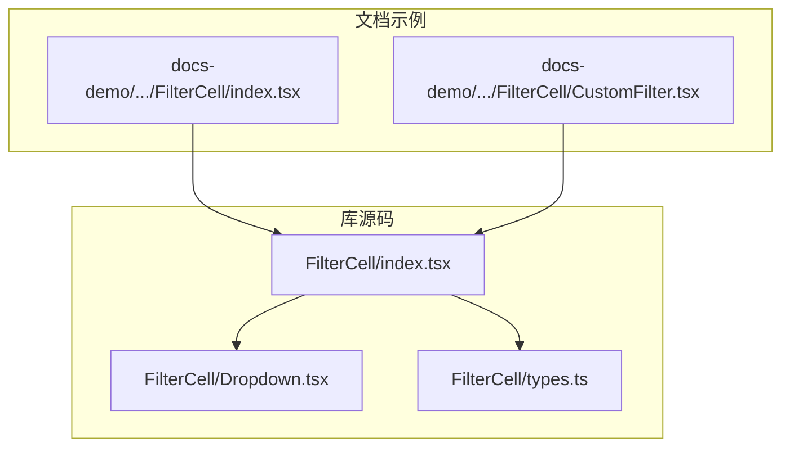
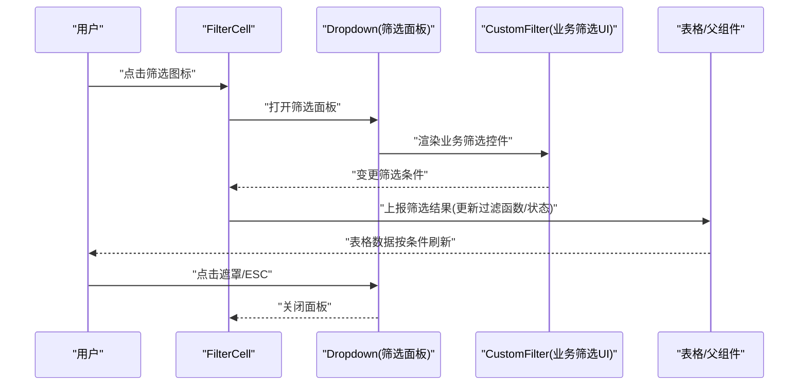
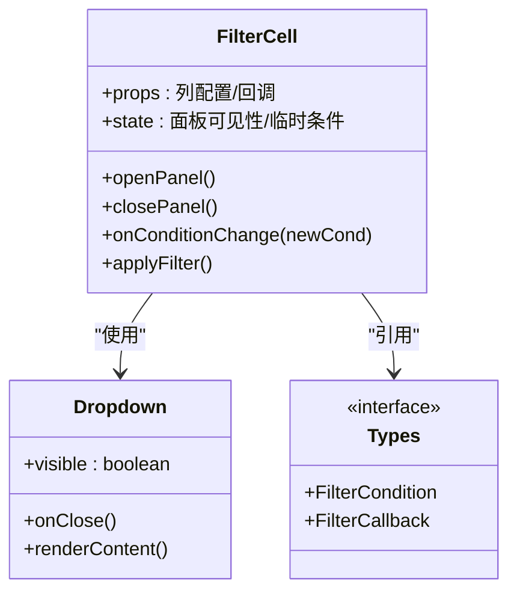
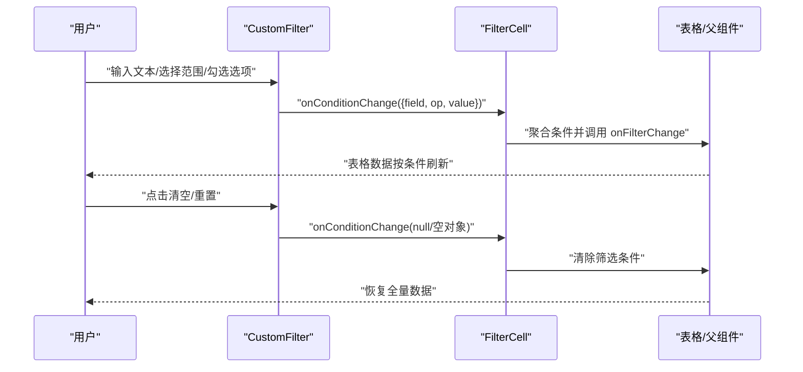
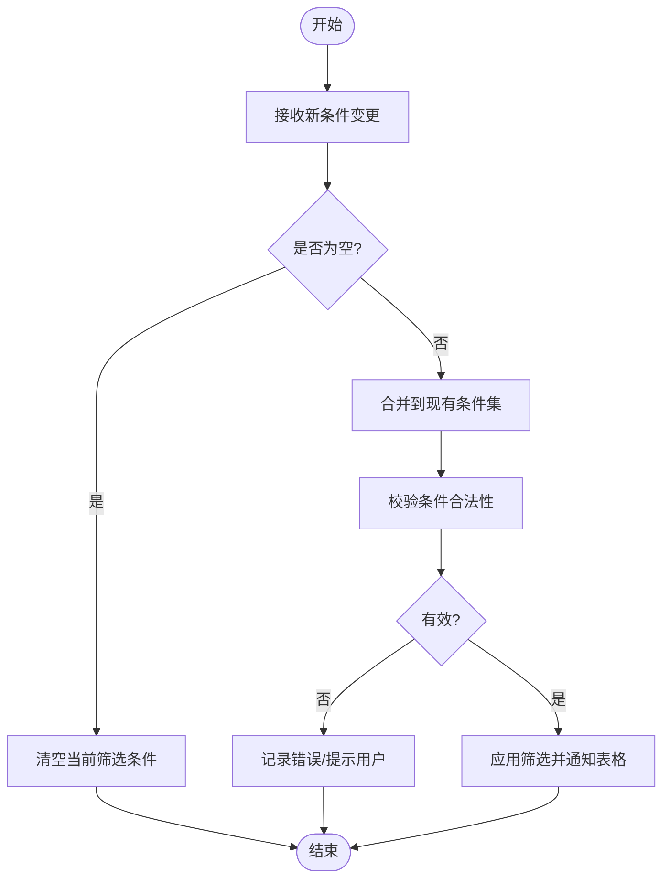
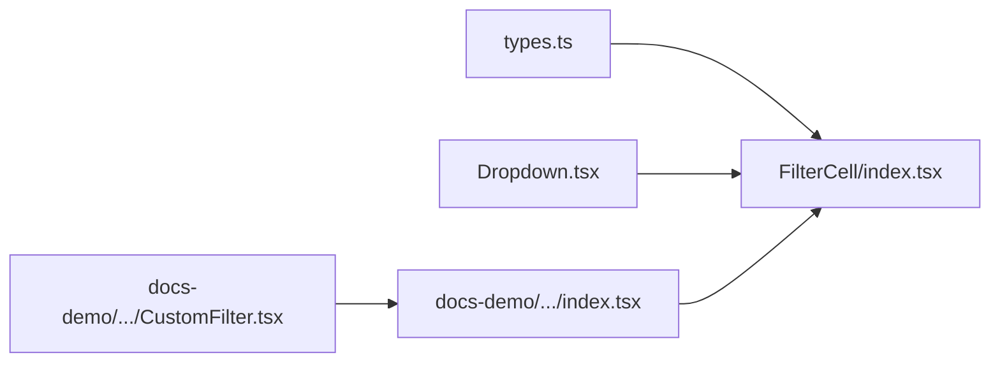

# 筛选单元格

<cite>
**本文引用的文件**   
- [src/StkTable/custom-cells/FilterCell/index.tsx](file://src/StkTable/custom-cells/FilterCell/index.tsx)
- [src/StkTable/custom-cells/FilterCell/Dropdown.tsx](file://src/StkTable/custom-cells/FilterCell/Dropdown.tsx)
- [src/StkTable/custom-cells/FilterCell/types.ts](file://src/StkTable/custom-cells/FilterCell/types.ts)
- [docs-demo/advanced/custom-cells/FilterCell/index.tsx](file://docs-demo/advanced/custom-cells/FilterCell/index.tsx)
- [docs-demo/advanced/custom-cells/FilterCell/CustomFilter.tsx](file://docs-demo/advanced/custom-cells/FilterCell/CustomFilter.tsx)
</cite>

## 目录
1. [简介](#简介)
2. [项目结构](#项目结构)
3. [核心组件](#核心组件)
4. [架构总览](#架构总览)
5. [详细组件分析](#详细组件分析)
6. [依赖关系分析](#依赖关系分析)
7. [性能考虑](#性能考虑)
8. [故障排查指南](#故障排查指南)
9. [结论](#结论)
10. [附录](#附录)

## 简介
本文件面向需要在表格中实现“自定义筛选”的开发者，围绕 FilterCell 筛选单元格的实现与扩展进行系统化说明。内容涵盖：
- 筛选条件的定义与数据结构
- 筛选面板的展开/收起交互
- 筛选结果的实时更新机制
- CustomFilter 组件的实现方式与扩展方法
- 多种筛选类型支持（文本搜索、范围筛选、多选筛选）
- 复杂筛选逻辑示例（多条件组合、状态持久化）
- 性能优化策略（大数据量处理、筛选缓存等）

目标是帮助开发者快速构建灵活、高性能且可维护的表格筛选功能。

## 项目结构
与筛选单元格相关的代码主要分布在以下位置：
- 库源码：src/StkTable/custom-cells/FilterCell
- 文档示例：docs-demo/advanced/custom-cells/FilterCell

图表来源
- [src/StkTable/custom-cells/FilterCell/index.tsx](file://src/StkTable/custom-cells/FilterCell/index.tsx)
- [src/StkTable/custom-cells/FilterCell/Dropdown.tsx](file://src/StkTable/custom-cells/FilterCell/Dropdown.tsx)
- [src/StkTable/custom-cells/FilterCell/types.ts](file://src/StkTable/custom-cells/FilterCell/types.ts)
- [docs-demo/advanced/custom-cells/FilterCell/index.tsx](file://docs-demo/advanced/custom-cells/FilterCell/index.tsx)
- [docs-demo/advanced/custom-cells/FilterCell/CustomFilter.tsx](file://docs-demo/advanced/custom-cells/FilterCell/CustomFilter.tsx)

章节来源
- [src/StkTable/custom-cells/FilterCell/index.tsx](file://src/StkTable/custom-cells/FilterCell/index.tsx)
- [src/StkTable/custom-cells/FilterCell/Dropdown.tsx](file://src/StkTable/custom-cells/FilterCell/Dropdown.tsx)
- [src/StkTable/custom-cells/FilterCell/types.ts](file://src/StkTable/custom-cells/FilterCell/types.ts)
- [docs-demo/advanced/custom-cells/FilterCell/index.tsx](file://docs-demo/advanced/custom-cells/FilterCell/index.tsx)
- [docs-demo/advanced/custom-cells/FilterCell/CustomFilter.tsx](file://docs-demo/advanced/custom-cells/FilterCell/CustomFilter.tsx)

## 核心组件
- FilterCell 主入口：负责渲染筛选触发器、管理筛选面板展开/收起、接收并转发筛选结果到表格上下文或父级。
- Dropdown 下拉面板：封装筛选面板的弹出定位、遮罩点击关闭、键盘导航等通用行为。
- types 类型定义：统一筛选条件结构、事件回调签名、面板配置项等类型约束。
- 文档示例中的 index.tsx：演示如何在列定义中使用 FilterCell，并绑定自定义筛选逻辑。
- CustomFilter 组件：在示例中展示如何基于 FilterCell 提供的能力实现具体业务筛选 UI（如文本搜索、范围选择、多选）。

章节来源
- [src/StkTable/custom-cells/FilterCell/index.tsx](file://src/StkTable/custom-cells/FilterCell/index.tsx)
- [src/StkTable/custom-cells/FilterCell/Dropdown.tsx](file://src/StkTable/custom-cells/FilterCell/Dropdown.tsx)
- [src/StkTable/custom-cells/FilterCell/types.ts](file://src/StkTable/custom-cells/FilterCell/types.ts)
- [docs-demo/advanced/custom-cells/FilterCell/index.tsx](file://docs-demo/advanced/custom-cells/FilterCell/index.tsx)
- [docs-demo/advanced/custom-cells/FilterCell/CustomFilter.tsx](file://docs-demo/advanced/custom-cells/FilterCell/CustomFilter.tsx)

## 架构总览
下图展示了 FilterCell 与外部组件及数据流的关系：

图表来源
- [src/StkTable/custom-cells/FilterCell/index.tsx](file://src/StkTable/custom-cells/FilterCell/index.tsx)
- [src/StkTable/custom-cells/FilterCell/Dropdown.tsx](file://src/StkTable/custom-cells/FilterCell/Dropdown.tsx)
- [docs-demo/advanced/custom-cells/FilterCell/index.tsx](file://docs-demo/advanced/custom-cells/FilterCell/index.tsx)
- [docs-demo/advanced/custom-cells/FilterCell/CustomFilter.tsx](file://docs-demo/advanced/custom-cells/FilterCell/CustomFilter.tsx)

## 详细组件分析

### FilterCell 主入口
职责要点
- 渲染筛选触发器（如表头操作区），控制筛选面板的显示与隐藏。
- 接收来自业务筛选 UI 的条件变更，合并为最终筛选条件。
- 将筛选条件同步给表格层（例如通过 props 回调或上下文），驱动数据刷新。
- 提供默认样式与无障碍基础能力（如焦点管理、键盘事件）。

关键流程
- 初始化：读取列配置，确定是否启用筛选、默认条件等。
- 交互：点击触发器打开面板；面板内输入变更时实时计算并上报；确认/取消后关闭面板。
- 清理：面板关闭时释放资源、重置临时状态。

章节来源
- [src/StkTable/custom-cells/FilterCell/index.tsx](file://src/StkTable/custom-cells/FilterCell/index.tsx)

#### 类图（概念映射）

图表来源
- [src/StkTable/custom-cells/FilterCell/index.tsx](file://src/StkTable/custom-cells/FilterCell/index.tsx)
- [src/StkTable/custom-cells/FilterCell/Dropdown.tsx](file://src/StkTable/custom-cells/FilterCell/Dropdown.tsx)
- [src/StkTable/custom-cells/FilterCell/types.ts](file://src/StkTable/custom-cells/FilterCell/types.ts)

### Dropdown 筛选面板
职责要点
- 管理面板的显示/隐藏、定位与遮罩。
- 处理点击外部区域关闭、ESC 关闭等交互。
- 透传内容区域给上层（通常是业务筛选 UI）。

章节来源
- [src/StkTable/custom-cells/FilterCell/Dropdown.tsx](file://src/StkTable/custom-cells/FilterCell/Dropdown.tsx)

### types 类型定义
职责要点
- 定义统一的筛选条件结构（字段名、操作符、值等）。
- 定义回调签名（如 onFilterChange、onApply、onCancel）。
- 定义面板配置（如默认展开、最大宽度、遮罩文案等）。

章节来源
- [src/StkTable/custom-cells/FilterCell/types.ts](file://src/StkTable/custom-cells/FilterCell/types.ts)

### 文档示例：FilterCell 集成与 CustomFilter
- 示例入口 index.tsx：演示在列定义中引入 FilterCell，并传入自定义筛选组件与回调。
- CustomFilter 组件：在面板中实现具体筛选 UI，包括：
  - 文本搜索：输入框即时匹配
  - 范围筛选：起止值区间选择
  - 多选筛选：复选框列表选择
- 示例还展示了如何将多个条件组合，并在输入变化时实时更新表格数据。

章节来源
- [docs-demo/advanced/custom-cells/FilterCell/index.tsx](file://docs-demo/advanced/custom-cells/FilterCell/index.tsx)
- [docs-demo/advanced/custom-cells/FilterCell/CustomFilter.tsx](file://docs-demo/advanced/custom-cells/FilterCell/CustomFilter.tsx)

#### 序列图：多条件组合筛选流程

图表来源
- [docs-demo/advanced/custom-cells/FilterCell/index.tsx](file://docs-demo/advanced/custom-cells/FilterCell/index.tsx)
- [docs-demo/advanced/custom-cells/FilterCell/CustomFilter.tsx](file://docs-demo/advanced/custom-cells/FilterCell/CustomFilter.tsx)
- [src/StkTable/custom-cells/FilterCell/index.tsx](file://src/StkTable/custom-cells/FilterCell/index.tsx)

#### 流程图：筛选条件合并与更新

图表来源
- [src/StkTable/custom-cells/FilterCell/index.tsx](file://src/StkTable/custom-cells/FilterCell/index.tsx)
- [docs-demo/advanced/custom-cells/FilterCell/CustomFilter.tsx](file://docs-demo/advanced/custom-cells/FilterCell/CustomFilter.tsx)

## 依赖关系分析
- FilterCell 依赖 Dropdown 完成面板交互，依赖 types 保证类型安全。
- 示例中的 index.tsx 依赖 FilterCell 与 CustomFilter，用于演示完整工作流。
- 整体耦合度低：FilterCell 仅关注面板与条件上报，业务筛选 UI 由 CustomFilter 承载，便于替换与扩展。

图表来源
- [src/StkTable/custom-cells/FilterCell/types.ts](file://src/StkTable/custom-cells/FilterCell/types.ts)
- [src/StkTable/custom-cells/FilterCell/index.tsx](file://src/StkTable/custom-cells/FilterCell/index.tsx)
- [src/StkTable/custom-cells/FilterCell/Dropdown.tsx](file://src/StkTable/custom-cells/FilterCell/Dropdown.tsx)
- [docs-demo/advanced/custom-cells/FilterCell/index.tsx](file://docs-demo/advanced/custom-cells/FilterCell/index.tsx)
- [docs-demo/advanced/custom-cells/FilterCell/CustomFilter.tsx](file://docs-demo/advanced/custom-cells/FilterCell/CustomFilter.tsx)

章节来源
- [src/StkTable/custom-cells/FilterCell/index.tsx](file://src/StkTable/custom-cells/FilterCell/index.tsx)
- [src/StkTable/custom-cells/FilterCell/Dropdown.tsx](file://src/StkTable/custom-cells/FilterCell/Dropdown.tsx)
- [src/StkTable/custom-cells/FilterCell/types.ts](file://src/StkTable/custom-cells/FilterCell/types.ts)
- [docs-demo/advanced/custom-cells/FilterCell/index.tsx](file://docs-demo/advanced/custom-cells/FilterCell/index.tsx)
- [docs-demo/advanced/custom-cells/FilterCell/CustomFilter.tsx](file://docs-demo/advanced/custom-cells/FilterCell/CustomFilter.tsx)

## 性能考虑
- 防抖与节流
  - 对高频输入（如文本搜索）采用防抖，减少频繁筛选计算。
  - 对拖拽范围选择等交互可采用节流，平衡响应与性能。
- 增量筛选与短路
  - 优先使用索引或预计算字段进行快速匹配。
  - 当某条件结果为空集时，短路后续条件计算。
- 筛选缓存
  - 对相同条件键值（如 field+op+value）缓存结果，避免重复计算。
  - 缓存失效策略：数据源更新、列配置变更、分页切换时失效。
- 大数据量处理
  - 服务端筛选：将条件发送至后端，返回过滤后的数据集。
  - 客户端筛选：对超大数据集采用虚拟滚动、分片计算、Web Worker 异步计算。
- 渲染优化
  - 面板内长列表使用虚拟滚动。
  - 避免在每次输入时重建大型 DOM，复用组件实例。

[本节为通用指导，不直接分析具体文件]

## 故障排查指南
常见问题与定位建议
- 面板无法关闭
  - 检查遮罩点击与 ESC 事件是否正确绑定。
  - 确认 Dropdown 的 visible 状态是否与 FilterCell 同步。
- 筛选结果未更新
  - 核对 onFilterChange 回调是否被正确调用。
  - 检查条件结构是否符合 types 定义。
- 性能卡顿
  - 确认是否存在高频重渲染，必要时加入防抖/节流。
  - 评估是否在每次输入都执行全量数据扫描。
- 条件冲突
  - 对互斥条件做前置校验，避免无效计算。
- 状态丢失
  - 若需要持久化，确保将筛选条件写入本地存储或 URL 参数，并在组件挂载时恢复。

章节来源
- [src/StkTable/custom-cells/FilterCell/index.tsx](file://src/StkTable/custom-cells/FilterCell/index.tsx)
- [src/StkTable/custom-cells/FilterCell/Dropdown.tsx](file://src/StkTable/custom-cells/FilterCell/Dropdown.tsx)
- [src/StkTable/custom-cells/FilterCell/types.ts](file://src/StkTable/custom-cells/FilterCell/types.ts)
- [docs-demo/advanced/custom-cells/FilterCell/index.tsx](file://docs-demo/advanced/custom-cells/FilterCell/index.tsx)
- [docs-demo/advanced/custom-cells/FilterCell/CustomFilter.tsx](file://docs-demo/advanced/custom-cells/FilterCell/CustomFilter.tsx)

## 结论
通过 FilterCell 与 CustomFilter 的组合，可以在表格中快速实现灵活的自定义筛选功能。借助统一的条件结构与清晰的交互分层，既能满足文本搜索、范围筛选、多选筛选等常见场景，也能支撑复杂的多条件组合与持久化需求。结合防抖、缓存、服务端筛选与虚拟滚动等策略，可在大数据量下保持良好性能与用户体验。

[本节为总结性内容，不直接分析具体文件]

## 附录
- 最佳实践清单
  - 明确条件结构，遵循 types 定义。
  - 使用防抖/节流降低计算频率。
  - 对复杂筛选提供“重置/清空”入口。
  - 将筛选条件纳入路由或本地存储以实现持久化。
  - 大数据场景优先服务端筛选，必要时配合虚拟滚动与 Web Worker。
- 参考路径
  - 示例入口：[docs-demo/advanced/custom-cells/FilterCell/index.tsx](file://docs-demo/advanced/custom-cells/FilterCell/index.tsx)
  - 自定义筛选 UI：[docs-demo/advanced/custom-cells/FilterCell/CustomFilter.tsx](file://docs-demo/advanced/custom-cells/FilterCell/CustomFilter.tsx)
  - 筛选面板与主入口：[src/StkTable/custom-cells/FilterCell/index.tsx](file://src/StkTable/custom-cells/FilterCell/index.tsx)、[src/StkTable/custom-cells/FilterCell/Dropdown.tsx](file://src/StkTable/custom-cells/FilterCell/Dropdown.tsx)
  - 类型定义：[src/StkTable/custom-cells/FilterCell/types.ts](file://src/StkTable/custom-cells/FilterCell/types.ts)