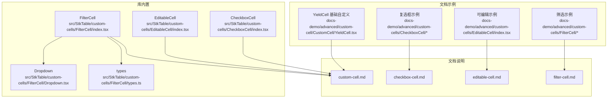
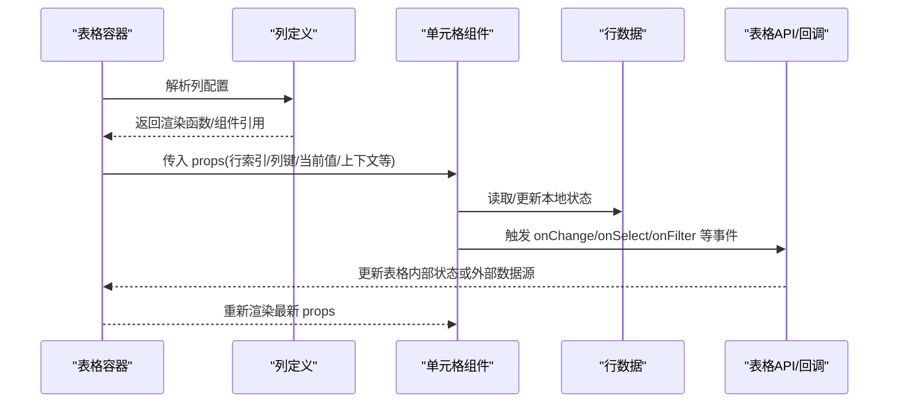
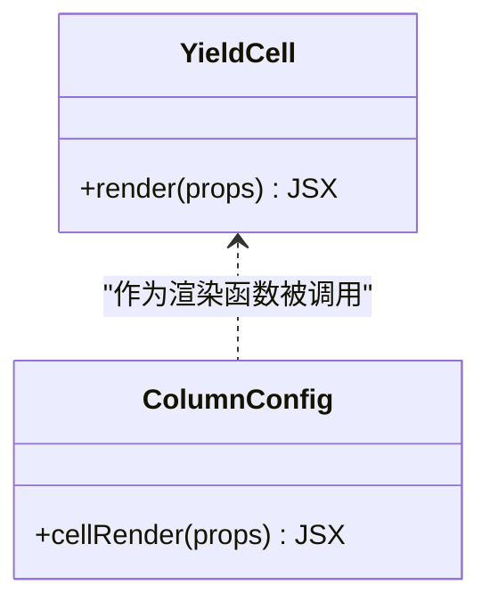
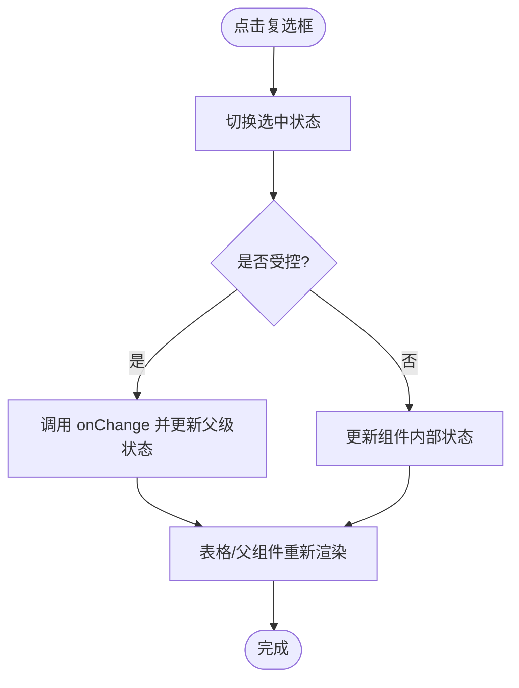
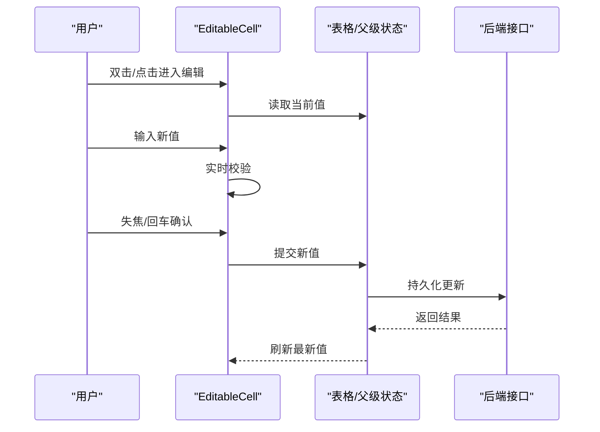
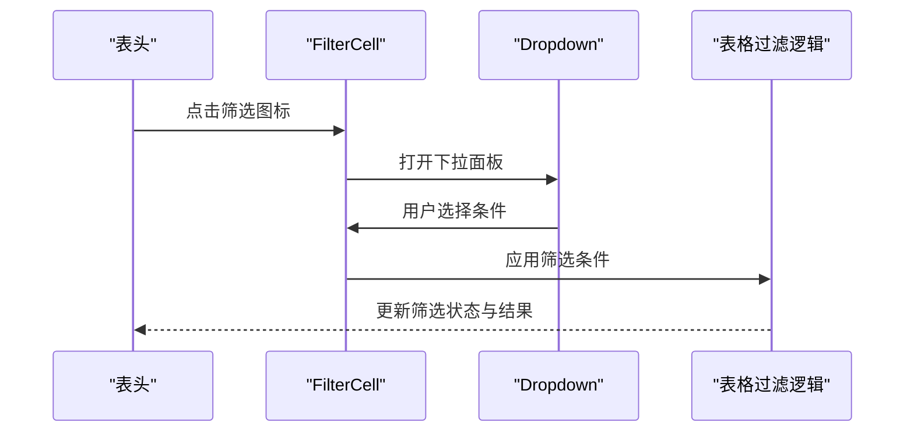
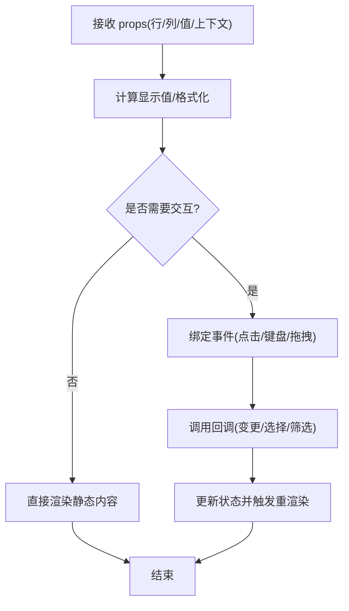
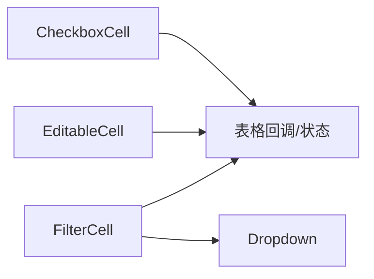

# 自定义单元格

<cite>
**本文引用的文件**   
- [src/StkTable/custom-cells/CheckboxCell/index.tsx](file://src/StkTable/custom-cells/CheckboxCell/index.tsx)
- [src/StkTable/custom-cells/EditableCell/index.tsx](file://src/StkTable/custom-cells/EditableCell/index.tsx)
- [src/StkTable/custom-cells/FilterCell/index.tsx](file://src/StkTable/custom-cells/FilterCell/index.tsx)
- [src/StkTable/custom-cells/FilterCell/Dropdown.tsx](file://src/StkTable/custom-cells/FilterCell/Dropdown.tsx)
- [src/StkTable/custom-cells/FilterCell/types.ts](file://src/StkTable/custom-cells/FilterCell/types.ts)
- [docs-demo/advanced/custom-cell/CustomCell/YieldCell.tsx](file://docs-demo/advanced/custom-cell/CustomCell/YieldCell.tsx)
- [docs-demo/advanced/custom-cell/CustomCell/index.tsx](file://docs-demo/advanced/custom-cell/CustomCell/index.tsx)
- [docs-demo/advanced/custom-cell/CustomCell/types.ts](file://docs-demo/advanced/custom-cell/CustomCell/types.ts)
- [docs-demo/advanced/custom-cells/CheckboxCell/CheckboxComponentCell.tsx](file://docs-demo/advanced/custom-cells/CheckboxCell/CheckboxComponentCell.tsx)
- [docs-demo/advanced/custom-cells/CheckboxCell/index.tsx](file://docs-demo/advanced/custom-cells/CheckboxCell/index.tsx)
- [docs-demo/advanced/custom-cells/EditableCell/index.tsx](file://docs-demo/advanced/custom-cells/EditableCell/index.tsx)
- [docs-demo/advanced/custom-cells/FilterCell/CustomFilter.tsx](file://docs-demo/advanced/custom-cells/FilterCell/CustomFilter.tsx)
- [docs-demo/advanced/custom-cells/FilterCell/index.tsx](file://docs-demo/advanced/custom-cells/FilterCell/index.tsx)
- [docs-src/main/table/advanced/custom-cells/checkbox-cell.md](file://docs-src/main/table/advanced/custom-cells/checkbox-cell.md)
- [docs-src/main/table/advanced/custom-cells/editable-cell.md](file://docs-src/main/table/advanced/custom-cells/editable-cell.md)
- [docs-src/main/table/advanced/custom-cells/filter-cell.md](file://docs-src/main/table/advanced/custom-cells/filter-cell.md)
- [docs-src/main/table/advanced/custom-cell.md](file://docs-src/main/table/advanced/custom-cell.md)
</cite>

## 目录
1. [简介](#简介)
2. [项目结构](#项目结构)
3. [核心组件](#核心组件)
4. [架构总览](#架构总览)
5. [详细组件分析](#详细组件分析)
6. [依赖关系分析](#依赖关系分析)
7. [性能考虑](#性能考虑)
8. [故障排查指南](#故障排查指南)
9. [结论](#结论)
10. [附录](#附录)

## 简介
本章节面向需要扩展表格显示与交互的开发者，系统讲解如何基于 stk-table-react 创建和实现自定义单元格。内容覆盖：
- 基础自定义单元格的开发模式与渲染机制
- 内置复选框单元格的使用方法与配置选项
- 可编辑单元格的完整实现方案（数据绑定、验证、提交处理）
- 筛选单元格的定制方法
- 事件处理与状态管理最佳实践
- 性能优化建议与常见问题解决方案

## 项目结构
仓库中与“自定义单元格”相关的代码主要分布在以下位置：
- 库内内置单元格实现：src/StkTable/custom-cells/{CheckboxCell, EditableCell, FilterCell}
- 文档示例：docs-demo/advanced/custom-cells 与 docs-demo/advanced/custom-cell
- 文档说明：docs-src/main/table/advanced/custom-cells/*.md 与 custom-cell.md

图表来源
- [src/StkTable/custom-cells/CheckboxCell/index.tsx](file://src/StkTable/custom-cells/CheckboxCell/index.tsx)
- [src/StkTable/custom-cells/EditableCell/index.tsx](file://src/StkTable/custom-cells/EditableCell/index.tsx)
- [src/StkTable/custom-cells/FilterCell/index.tsx](file://src/StkTable/custom-cells/FilterCell/index.tsx)
- [src/StkTable/custom-cells/FilterCell/Dropdown.tsx](file://src/StkTable/custom-cells/FilterCell/Dropdown.tsx)
- [src/StkTable/custom-cells/FilterCell/types.ts](file://src/StkTable/custom-cells/FilterCell/types.ts)
- [docs-demo/advanced/custom-cell/CustomCell/YieldCell.tsx](file://docs-demo/advanced/custom-cell/CustomCell/YieldCell.tsx)
- [docs-demo/advanced/custom-cells/CheckboxCell/CheckboxComponentCell.tsx](file://docs-demo/advanced/custom-cells/CheckboxCell/CheckboxComponentCell.tsx)
- [docs-demo/advanced/custom-cells/EditableCell/index.tsx](file://docs-demo/advanced/custom-cells/EditableCell/index.tsx)
- [docs-demo/advanced/custom-cells/FilterCell/CustomFilter.tsx](file://docs-demo/advanced/custom-cells/FilterCell/CustomFilter.tsx)
- [docs-src/main/table/advanced/custom-cell.md](file://docs-src/main/table/advanced/custom-cell.md)
- [docs-src/main/table/advanced/custom-cells/checkbox-cell.md](file://docs-src/main/table/advanced/custom-cells/checkbox-cell.md)
- [docs-src/main/table/advanced/custom-cells/editable-cell.md](file://docs-src/main/table/advanced/custom-cells/editable-cell.md)
- [docs-src/main/table/advanced/custom-cells/filter-cell.md](file://docs-src/main/table/advanced/custom-cells/filter-cell.md)

章节来源
- [docs-src/main/table/advanced/custom-cell.md](file://docs-src/main/table/advanced/custom-cell.md)

## 核心组件
本节聚焦三类常用单元格：复选框、可编辑、筛选。它们分别对应不同的业务场景与交互模式。

- 复选框单元格
  - 用途：行选择、批量操作、开关类字段展示
  - 能力：选中态同步、受控/非受控、禁用态、尺寸与样式
  - 参考路径：[CheckboxCell 实现](file://src/StkTable/custom-cells/CheckboxCell/index.tsx)、[复选框示例入口](file://docs-demo/advanced/custom-cells/CheckboxCell/index.tsx)、[复选框组件示例](file://docs-demo/advanced/custom-cells/CheckboxCell/CheckboxComponentCell.tsx)、[文档说明](file://docs-src/main/table/advanced/custom-cells/checkbox-cell.md)

- 可编辑单元格
  - 用途：行内编辑、表单校验、即时保存或批量提交
  - 能力：输入控件集成、值变更回调、校验规则、失焦/回车提交、取消编辑
  - 参考路径：[EditableCell 实现](file://src/StkTable/custom-cells/EditableCell/index.tsx)、[可编辑示例](file://docs-demo/advanced/custom-cells/EditableCell/index.tsx)、[文档说明](file://docs-src/main/table/advanced/custom-cells/editable-cell.md)

- 筛选单元格
  - 用途：列级过滤、条件组合、下拉面板
  - 能力：筛选面板挂载、值变化回调、清空/确认、多值与范围
  - 参考路径：[FilterCell 实现](file://src/StkTable/custom-cells/FilterCell/index.tsx)、[Dropdown 子组件](file://src/StkTable/custom-cells/FilterCell/Dropdown.tsx)、[类型定义](file://src/StkTable/custom-cells/FilterCell/types.ts)、[筛选示例入口](file://docs-demo/advanced/custom-cells/FilterCell/index.tsx)、[自定义筛选器](file://docs-demo/advanced/custom-cells/FilterCell/CustomFilter.tsx)、[文档说明](file://docs-src/main/table/advanced/custom-cells/filter-cell.md)

章节来源
- [src/StkTable/custom-cells/CheckboxCell/index.tsx](file://src/StkTable/custom-cells/CheckboxCell/index.tsx)
- [src/StkTable/custom-cells/EditableCell/index.tsx](file://src/StkTable/custom-cells/EditableCell/index.tsx)
- [src/StkTable/custom-cells/FilterCell/index.tsx](file://src/StkTable/custom-cells/FilterCell/index.tsx)
- [src/StkTable/custom-cells/FilterCell/Dropdown.tsx](file://src/StkTable/custom-cells/FilterCell/Dropdown.tsx)
- [src/StkTable/custom-cells/FilterCell/types.ts](file://src/StkTable/custom-cells/FilterCell/types.ts)
- [docs-demo/advanced/custom-cells/CheckboxCell/index.tsx](file://docs-demo/advanced/custom-cells/CheckboxCell/index.tsx)
- [docs-demo/advanced/custom-cells/CheckboxCell/CheckboxComponentCell.tsx](file://docs-demo/advanced/custom-cells/CheckboxCell/CheckboxComponentCell.tsx)
- [docs-demo/advanced/custom-cells/EditableCell/index.tsx](file://docs-demo/advanced/custom-cells/EditableCell/index.tsx)
- [docs-demo/advanced/custom-cells/FilterCell/index.tsx](file://docs-demo/advanced/custom-cells/FilterCell/index.tsx)
- [docs-demo/advanced/custom-cells/FilterCell/CustomFilter.tsx](file://docs-demo/advanced/custom-cells/FilterCell/CustomFilter.tsx)
- [docs-src/main/table/advanced/custom-cells/checkbox-cell.md](file://docs-src/main/table/advanced/custom-cells/checkbox-cell.md)
- [docs-src/main/table/advanced/custom-cells/editable-cell.md](file://docs-src/main/table/advanced/custom-cells/editable-cell.md)
- [docs-src/main/table/advanced/custom-cells/filter-cell.md](file://docs-src/main/table/advanced/custom-cells/filter-cell.md)

## 架构总览
自定义单元格在表格中的渲染与交互流程如下：

图表来源
- [src/StkTable/custom-cells/CheckboxCell/index.tsx](file://src/StkTable/custom-cells/CheckboxCell/index.tsx)
- [src/StkTable/custom-cells/EditableCell/index.tsx](file://src/StkTable/custom-cells/EditableCell/index.tsx)
- [src/StkTable/custom-cells/FilterCell/index.tsx](file://src/StkTable/custom-cells/FilterCell/index.tsx)

## 详细组件分析

### 基础自定义单元格（YieldCell）
目标：通过“插槽式”渲染函数将任意 React 节点注入到单元格中，便于快速复用复杂 UI。

- 关键要点
  - 使用渲染函数接收单元格上下文（如行数据、列信息、索引等），返回 JSX
  - 保持无副作用与纯渲染，避免在渲染阶段执行昂贵计算
  - 结合 memo 或 React.memo 减少重渲染
  - 与表格的事件回调解耦，通过回调向上层传递用户操作

图表来源
- [docs-demo/advanced/custom-cell/CustomCell/YieldCell.tsx](file://docs-demo/advanced/custom-cell/CustomCell/YieldCell.tsx)
- [docs-demo/advanced/custom-cell/CustomCell/index.tsx](file://docs-demo/advanced/custom-cell/CustomCell/index.tsx)
- [docs-demo/advanced/custom-cell/CustomCell/types.ts](file://docs-demo/advanced/custom-cell/CustomCell/types.ts)
- [docs-src/main/table/advanced/custom-cell.md](file://docs-src/main/table/advanced/custom-cell.md)

章节来源
- [docs-demo/advanced/custom-cell/CustomCell/YieldCell.tsx](file://docs-demo/advanced/custom-cell/CustomCell/YieldCell.tsx)
- [docs-demo/advanced/custom-cell/CustomCell/index.tsx](file://docs-demo/advanced/custom-cell/CustomCell/index.tsx)
- [docs-demo/advanced/custom-cell/CustomCell/types.ts](file://docs-demo/advanced/custom-cell/CustomCell/types.ts)
- [docs-src/main/table/advanced/custom-cell.md](file://docs-src/main/table/advanced/custom-cell.md)

### 内置复选框单元格（CheckboxCell）
目标：提供开箱即用的行选择/开关能力，支持受控与非受控两种模式。

- 使用方式
  - 在列配置中指定单元格类型为复选框
  - 通过受控属性绑定选中状态，或通过默认选中属性初始化
  - 监听选中变化回调以同步到上层数据源
- 配置项（概念性说明）
  - 是否禁用、尺寸、颜色主题、对齐方式、是否允许半选等
- 事件与状态
  - 选中态变化时触发回调；支持批量选中联动
  - 与表格的行选择状态保持一致

图表来源
- [src/StkTable/custom-cells/CheckboxCell/index.tsx](file://src/StkTable/custom-cells/CheckboxCell/index.tsx)
- [docs-demo/advanced/custom-cells/CheckboxCell/index.tsx](file://docs-demo/advanced/custom-cells/CheckboxCell/index.tsx)
- [docs-demo/advanced/custom-cells/CheckboxCell/CheckboxComponentCell.tsx](file://docs-demo/advanced/custom-cells/CheckboxCell/CheckboxComponentCell.tsx)
- [docs-src/main/table/advanced/custom-cells/checkbox-cell.md](file://docs-src/main/table/advanced/custom-cells/checkbox-cell.md)

章节来源
- [src/StkTable/custom-cells/CheckboxCell/index.tsx](file://src/StkTable/custom-cells/CheckboxCell/index.tsx)
- [docs-demo/advanced/custom-cells/CheckboxCell/index.tsx](file://docs-demo/advanced/custom-cells/CheckboxCell/index.tsx)
- [docs-demo/advanced/custom-cells/CheckboxCell/CheckboxComponentCell.tsx](file://docs-demo/advanced/custom-cells/CheckboxCell/CheckboxComponentCell.tsx)
- [docs-src/main/table/advanced/custom-cells/checkbox-cell.md](file://docs-src/main/table/advanced/custom-cells/checkbox-cell.md)

### 可编辑单元格（EditableCell）
目标：实现行内编辑，包含数据绑定、校验与提交处理。

- 数据绑定
  - 从 props 获取当前值，维护本地编辑态
  - 失焦或确认后，将新值回写至表格数据源
- 验证
  - 支持必填、格式、范围等规则
  - 错误提示与高亮反馈
- 提交处理
  - 支持单行即时提交或批量提交
  - 失败重试与撤销机制
- 交互细节
  - 回车确认、Esc 取消、Tab 跳转下一格
  - 防抖与节流避免频繁请求

图表来源
- [src/StkTable/custom-cells/EditableCell/index.tsx](file://src/StkTable/custom-cells/EditableCell/index.tsx)
- [docs-demo/advanced/custom-cells/EditableCell/index.tsx](file://docs-demo/advanced/custom-cells/EditableCell/index.tsx)
- [docs-src/main/table/advanced/custom-cells/editable-cell.md](file://docs-src/main/table/advanced/custom-cells/editable-cell.md)

章节来源
- [src/StkTable/custom-cells/EditableCell/index.tsx](file://src/StkTable/custom-cells/EditableCell/index.tsx)
- [docs-demo/advanced/custom-cells/EditableCell/index.tsx](file://docs-demo/advanced/custom-cells/EditableCell/index.tsx)
- [docs-src/main/table/advanced/custom-cells/editable-cell.md](file://docs-src/main/table/advanced/custom-cells/editable-cell.md)

### 筛选单元格（FilterCell）
目标：为列提供灵活的筛选能力，支持下拉面板、多值与范围筛选。

- 核心流程
  - 点击表头筛选图标打开下拉面板
  - 在面板中选择条件并应用
  - 将筛选条件传递给表格进行数据过滤
- 子组件
  - Dropdown：负责面板挂载、定位与关闭逻辑
  - types：定义筛选参数与回调契约
- 自定义筛选器
  - 通过插槽或自定义组件替换默认筛选 UI

图表来源
- [src/StkTable/custom-cells/FilterCell/index.tsx](file://src/StkTable/custom-cells/FilterCell/index.tsx)
- [src/StkTable/custom-cells/FilterCell/Dropdown.tsx](file://src/StkTable/custom-cells/FilterCell/Dropdown.tsx)
- [src/StkTable/custom-cells/FilterCell/types.ts](file://src/StkTable/custom-cells/FilterCell/types.ts)
- [docs-demo/advanced/custom-cells/FilterCell/index.tsx](file://docs-demo/advanced/custom-cells/FilterCell/index.tsx)
- [docs-demo/advanced/custom-cells/FilterCell/CustomFilter.tsx](file://docs-demo/advanced/custom-cells/FilterCell/CustomFilter.tsx)
- [docs-src/main/table/advanced/custom-cells/filter-cell.md](file://docs-src/main/table/advanced/custom-cells/filter-cell.md)

章节来源
- [src/StkTable/custom-cells/FilterCell/index.tsx](file://src/StkTable/custom-cells/FilterCell/index.tsx)
- [src/StkTable/custom-cells/FilterCell/Dropdown.tsx](file://src/StkTable/custom-cells/FilterCell/Dropdown.tsx)
- [src/StkTable/custom-cells/FilterCell/types.ts](file://src/StkTable/custom-cells/FilterCell/types.ts)
- [docs-demo/advanced/custom-cells/FilterCell/index.tsx](file://docs-demo/advanced/custom-cells/FilterCell/index.tsx)
- [docs-demo/advanced/custom-cells/FilterCell/CustomFilter.tsx](file://docs-demo/advanced/custom-cells/FilterCell/CustomFilter.tsx)
- [docs-src/main/table/advanced/custom-cells/filter-cell.md](file://docs-src/main/table/advanced/custom-cells/filter-cell.md)

### 概念性概览
下图展示了通用自定义单元格的抽象工作流，适用于任何复杂单元格形态（如图标、进度条、富文本等）。

[此图为概念流程图，不直接映射具体源码文件]

## 依赖关系分析
- 组件耦合
  - CheckboxCell/EditableCell/FilterCell 均依赖表格提供的统一 props 约定（行索引、列键、当前值、回调等）
  - FilterCell 进一步依赖 Dropdown 进行面板挂载与定位
- 外部依赖
  - 第三方 UI 库（如表单控件、下拉菜单）可按需引入
- 潜在循环依赖
  - 建议在单元格中避免反向引用表格实例，优先通过回调与 props 通信

图表来源
- [src/StkTable/custom-cells/CheckboxCell/index.tsx](file://src/StkTable/custom-cells/CheckboxCell/index.tsx)
- [src/StkTable/custom-cells/EditableCell/index.tsx](file://src/StkTable/custom-cells/EditableCell/index.tsx)
- [src/StkTable/custom-cells/FilterCell/index.tsx](file://src/StkTable/custom-cells/FilterCell/index.tsx)
- [src/StkTable/custom-cells/FilterCell/Dropdown.tsx](file://src/StkTable/custom-cells/FilterCell/Dropdown.tsx)

章节来源
- [src/StkTable/custom-cells/CheckboxCell/index.tsx](file://src/StkTable/custom-cells/CheckboxCell/index.tsx)
- [src/StkTable/custom-cells/EditableCell/index.tsx](file://src/StkTable/custom-cells/EditableCell/index.tsx)
- [src/StkTable/custom-cells/FilterCell/index.tsx](file://src/StkTable/custom-cells/FilterCell/index.tsx)
- [src/StkTable/custom-cells/FilterCell/Dropdown.tsx](file://src/StkTable/custom-cells/FilterCell/Dropdown.tsx)

## 性能考虑
- 渲染优化
  - 对复杂单元格使用 React.memo 包裹，避免不必要的重渲染
  - 将昂贵的计算放入 useMemo/useCallback，并以稳定依赖
- 事件与状态
  - 使用防抖/节流降低高频事件带来的开销（如输入、滚动）
  - 尽量采用受控模式，由上层集中管理状态，减少分支判断
- 大数据场景
  - 结合虚拟滚动与按需加载，减少首屏渲染压力
  - 对筛选与排序结果做缓存，避免重复计算
- 内存与资源
  - 及时清理定时器、事件监听与弹窗挂载
  - 图片等资源懒加载，避免阻塞主线程

[本节为通用指导，无需特定源码引用]

## 故障排查指南
- 复选框
  - 现象：选中态不同步
    - 检查是否正确使用受控模式，确保 onChange 回调更新了父级状态
    - 核对 key 与行标识是否稳定
  - 现象：批量选择无效
    - 确认全选/反选的联动逻辑是否正确传播到每行
- 可编辑单元格
  - 现象：输入后未保存
    - 检查失焦/回车事件是否触发提交
    - 校验失败时是否阻止了提交
  - 现象：并发修改冲突
    - 引入乐观更新与回滚策略，或在提交前锁定行
- 筛选单元格
  - 现象：筛选不生效
    - 确认筛选条件结构与表格过滤逻辑一致
    - 检查下拉面板的值变化是否触发了应用筛选
  - 现象：面板遮挡或定位异常
    - 调整 Dropdown 的定位策略与层级

章节来源
- [src/StkTable/custom-cells/CheckboxCell/index.tsx](file://src/StkTable/custom-cells/CheckboxCell/index.tsx)
- [src/StkTable/custom-cells/EditableCell/index.tsx](file://src/StkTable/custom-cells/EditableCell/index.tsx)
- [src/StkTable/custom-cells/FilterCell/index.tsx](file://src/StkTable/custom-cells/FilterCell/index.tsx)
- [src/StkTable/custom-cells/FilterCell/Dropdown.tsx](file://src/StkTable/custom-cells/FilterCell/Dropdown.tsx)

## 结论
通过上述三种典型单元格（复选框、可编辑、筛选）的实现与示例，可以构建出高度可定制的表格体验。遵循“纯渲染、明确回调、集中状态、谨慎优化”的原则，能够在保证可维护性的同时获得良好的性能表现。

[本节为总结性内容，无需特定源码引用]

## 附录
- 相关文档入口
  - 自定义单元格总览：[custom-cell.md](file://docs-src/main/table/advanced/custom-cell.md)
  - 复选框单元格：[checkbox-cell.md](file://docs-src/main/table/advanced/custom-cells/checkbox-cell.md)
  - 可编辑单元格：[editable-cell.md](file://docs-src/main/table/advanced/custom-cells/editable-cell.md)
  - 筛选单元格：[filter-cell.md](file://docs-src/main/table/advanced/custom-cells/filter-cell.md)