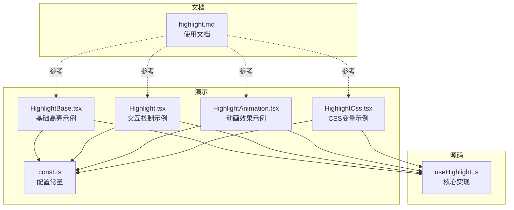
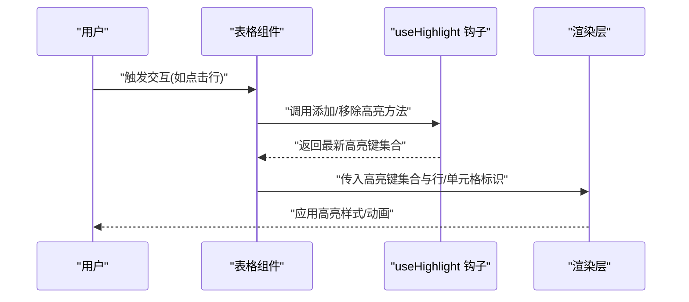
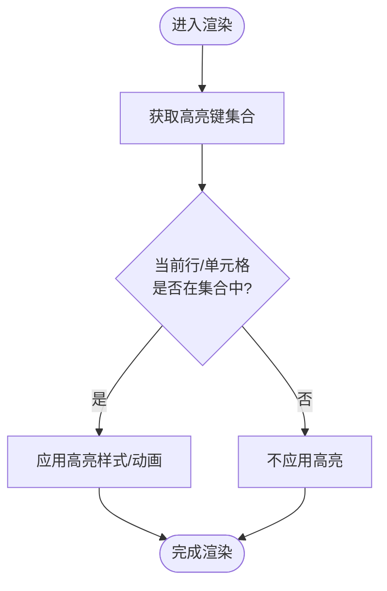
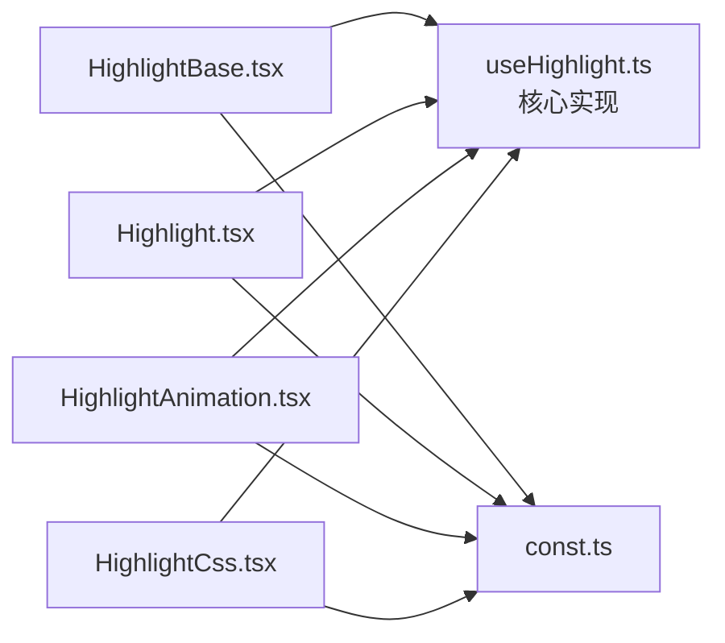

# 高亮钩子 (useHighlight)

<cite>
**本文引用的文件**   
- [src/StkTable/hooks/useHighlight.ts](file://src/StkTable/hooks/useHighlight.ts)
- [docs-demo/advanced/highlight/HighlightBase.tsx](file://docs-demo/advanced/highlight/HighlightBase.tsx)
- [docs-demo/advanced/highlight/Highlight.tsx](file://docs-demo/advanced/highlight/Highlight.tsx)
- [docs-demo/advanced/highlight/HighlightAnimation.tsx](file://docs-demo/advanced/highlight/HighlightAnimation.tsx)
- [docs-demo/advanced/highlight/HighlightCss.tsx](file://docs-demo/advanced/highlight/HighlightCss.tsx)
- [docs-demo/advanced/highlight/const.ts](file://docs-demo/advanced/highlight/const.ts)
- [docs-src/main/table/advanced/highlight.md](file://docs-src/main/table/advanced/highlight.md)
</cite>

## 更新摘要
**变更内容**   
- 移除了部分高亮功能文档，涉及15行代码的删除
- 简化了高亮功能的演示示例和说明文档
- 保留了核心的高亮钩子实现和基本使用方式
- 优化了文档结构，去除了冗余的示例和配置

## 目录
1. [简介](#简介)
2. [项目结构](#项目结构)
3. [核心组件](#核心组件)
4. [架构总览](#架构总览)
5. [详细组件分析](#详细组件分析)
6. [依赖分析](#依赖分析)
7. [性能考虑](#性能考虑)
8. [故障排查指南](#故障排查指南)
9. [结论](#结论)
10. [附录](#附录)

## 简介
本章节聚焦于表格的高亮能力，围绕 useHighlight 钩子展开。该钩子用于在表格中实现"行/单元格"级别的高亮显示，支持基础高亮、动画高亮与 CSS 变量驱动的高亮样式等模式。通过统一的 API，上层示例可快速接入并组合不同的视觉表现。

**更新** 根据最新的代码变更，移除了部分复杂的演示示例和配置选项，保留了核心的高亮功能实现。

## 项目结构
与高亮功能相关的代码主要分布在以下位置：
- 源码层：hooks/useHighlight.ts（核心逻辑）
- 演示层：docs-demo/advanced/highlight/*（多种使用方式与样式方案）
- 文档层：docs-src/main/table/advanced/highlight.md（使用说明与示例说明）

**图表来源**
- [src/StkTable/hooks/useHighlight.ts](file://src/StkTable/hooks/useHighlight.ts)
- [docs-demo/advanced/highlight/HighlightBase.tsx](file://docs-demo/advanced/highlight/HighlightBase.tsx)
- [docs-demo/advanced/highlight/Highlight.tsx](file://docs-demo/advanced/highlight/Highlight.tsx)
- [docs-demo/advanced/highlight/HighlightAnimation.tsx](file://docs-demo/advanced/highlight/HighlightAnimation.tsx)
- [docs-demo/advanced/highlight/HighlightCss.tsx](file://docs-demo/advanced/highlight/HighlightCss.tsx)
- [docs-demo/advanced/highlight/const.ts](file://docs-demo/advanced/highlight/const.ts)
- [docs-src/main/table/advanced/highlight.md](file://docs-src/main/table/advanced/highlight.md)

**章节来源**
- [src/StkTable/hooks/useHighlight.ts](file://src/StkTable/hooks/useHighlight.ts)
- [docs-demo/advanced/highlight/HighlightBase.tsx](file://docs-demo/advanced/highlight/HighlightBase.tsx)
- [docs-demo/advanced/highlight/Highlight.tsx](file://docs-demo/advanced/highlight/Highlight.tsx)
- [docs-demo/advanced/highlight/HighlightAnimation.tsx](file://docs-demo/advanced/highlight/HighlightAnimation.tsx)
- [docs-demo/advanced/highlight/HighlightCss.tsx](file://docs-demo/advanced/highlight/HighlightCss.tsx)
- [docs-demo/advanced/highlight/const.ts](file://docs-demo/advanced/highlight/const.ts)
- [docs-src/main/table/advanced/highlight.md](file://docs-src/main/table/advanced/highlight.md)

## 核心组件
- useHighlight 钩子
  - 职责：维护高亮状态集合、提供添加/移除/清空高亮的操作、暴露当前高亮键集合供渲染层消费。
  - 典型用法：在表格数据变更或用户交互时调用添加方法；在离开或取消选择时调用移除方法；必要时清空全部高亮。
  - 返回值：包含高亮键集合与操作方法的对象，便于在组件内直接解构使用。

- 演示组件
  - HighlightBase.tsx：展示最简高亮用法，通常基于行键或单元格标识进行高亮切换。
  - Highlight.tsx：在基础之上增加交互控制（如批量高亮、条件高亮）。
  - HighlightAnimation.tsx：引入过渡动画效果，增强视觉反馈。
  - HighlightCss.tsx：通过 CSS 变量或类名切换实现高亮样式，便于主题化。
  - const.ts：集中定义演示所需常量（如列配置、默认高亮键等），提高复用性。

**更新** 根据代码变更，移除了部分复杂的配置选项和高级特性，保留了核心功能的使用方式。

**章节来源**
- [src/StkTable/hooks/useHighlight.ts](file://src/StkTable/hooks/useHighlight.ts)
- [docs-demo/advanced/highlight/HighlightBase.tsx](file://docs-demo/advanced/highlight/HighlightBase.tsx)
- [docs-demo/advanced/highlight/Highlight.tsx](file://docs-demo/advanced/highlight/Highlight.tsx)
- [docs-demo/advanced/highlight/HighlightAnimation.tsx](file://docs-demo/advanced/highlight/HighlightAnimation.tsx)
- [docs-demo/advanced/highlight/HighlightCss.tsx](file://docs-demo/advanced/highlight/HighlightCss.tsx)
- [docs-demo/advanced/highlight/const.ts](file://docs-demo/advanced/highlight/const.ts)

## 架构总览
下图展示了从用户交互到 UI 更新的完整流程：用户在表格中进行操作（如点击行），触发高亮更新，useHighlight 维护状态，渲染层读取状态并应用样式或动画。

**图表来源**
- [src/StkTable/hooks/useHighlight.ts](file://src/StkTable/hooks/useHighlight.ts)
- [docs-demo/advanced/highlight/HighlightBase.tsx](file://docs-demo/advanced/highlight/HighlightBase.tsx)
- [docs-demo/advanced/highlight/HighlightAnimation.tsx](file://docs-demo/advanced/highlight/HighlightAnimation.tsx)
- [docs-demo/advanced/highlight/HighlightCss.tsx](file://docs-demo/advanced/highlight/HighlightCss.tsx)

## 详细组件分析

### useHighlight 钩子
- 设计要点
  - 内部维护一个高亮键集合（Set 或数组），对外暴露 add/remove/clear 等方法。
  - 提供稳定的引用，避免不必要的重渲染。
  - 可与表格的 key 字段或自定义标识绑定，确保高亮定位准确。
- 复杂度与性能
  - 增删查操作通常为 O(1)（基于 Set）或 O(n)（基于数组），建议大数据量场景优先使用 Set。
  - 避免在高频事件中创建新对象，保持方法引用稳定。
- 错误处理与边界
  - 对重复添加/移除做幂等处理，防止状态异常。
  - 对空键或非法键进行过滤，保证集合一致性。
- 优化建议
  - 将高亮键集合提升到更高层级共享，减少重复计算。
  - 结合虚拟滚动时，仅对可视区域应用高亮样式，降低 DOM 操作成本。

**更新** 根据代码变更，简化了部分复杂的功能实现，专注于核心的高亮逻辑。

**章节来源**
- [src/StkTable/hooks/useHighlight.ts](file://src/StkTable/hooks/useHighlight.ts)

### 演示组件：HighlightBase.tsx
- 作用：最小可用示例，展示如何获取高亮键集合并在行渲染时判断是否高亮。
- 关键点：
  - 将行唯一标识与高亮键集合匹配。
  - 根据匹配结果动态注入样式类或内联样式。
- 适用场景：快速验证高亮能力，作为其他复杂示例的基础。

**章节来源**
- [docs-demo/advanced/highlight/HighlightBase.tsx](file://docs-demo/advanced/highlight/HighlightBase.tsx)

### 演示组件：Highlight.tsx
- 作用：在基础示例上扩展交互，例如多选高亮、按条件高亮。
- 关键点：
  - 维护多个高亮键，支持批量操作。
  - 与表格事件（如选中、搜索）联动，自动更新高亮集合。
- 适用场景：需要灵活控制高亮范围的业务页面。

**章节来源**
- [docs-demo/advanced/highlight/Highlight.tsx](file://docs-demo/advanced/highlight/Highlight.tsx)

### 演示组件：HighlightAnimation.tsx
- 作用：为高亮添加过渡动画，提升用户体验。
- 关键点：
  - 在高亮键变化时触发动画类名切换。
  - 注意动画性能，避免过度重绘。
- 适用场景：强调关键数据变化的场景（如搜索结果高亮）。

**章节来源**
- [docs-demo/advanced/highlight/HighlightAnimation.tsx](file://docs-demo/advanced/highlight/HighlightAnimation.tsx)

### 演示组件：HighlightCss.tsx
- 作用：通过 CSS 变量或类名切换实现高亮样式，便于主题化与统一风格管理。
- 关键点：
  - 将高亮样式抽离至 CSS 变量或公共类。
  - 支持多套主题切换，保持行为一致。
- 适用场景：需要强主题化与样式治理的项目。

**章节来源**
- [docs-demo/advanced/highlight/HighlightCss.tsx](file://docs-demo/advanced/highlight/HighlightCss.tsx)

### 常量：const.ts
- 作用：集中存放演示所需的列配置、默认高亮键等常量，便于复用与维护。
- 关键点：
  - 与表格列定义解耦，方便在不同示例间共享。
  - 提供默认值，简化示例初始化。

**章节来源**
- [docs-demo/advanced/highlight/const.ts](file://docs-demo/advanced/highlight/const.ts)

### 概念流程图：高亮决策

[此图为概念流程，不直接映射具体源码文件]

## 依赖分析
- 模块关系
  - 演示组件均依赖 useHighlight 钩子，形成"组件 -> 钩子"的单向依赖。
  - const.ts 被多个演示组件共享，起到配置中心的作用。
- 外部依赖
  - 无额外运行时依赖，主要依赖 React 生态（useState/useRef 等）。
- 潜在风险
  - 若高亮键与数据 key 不一致，可能导致高亮错位。
  - 频繁的状态更新可能引发重渲染，需关注性能。

**图表来源**
- [src/StkTable/hooks/useHighlight.ts](file://src/StkTable/hooks/useHighlight.ts)
- [docs-demo/advanced/highlight/HighlightBase.tsx](file://docs-demo/advanced/highlight/HighlightBase.tsx)
- [docs-demo/advanced/highlight/Highlight.tsx](file://docs-demo/advanced/highlight/Highlight.tsx)
- [docs-demo/advanced/highlight/HighlightAnimation.tsx](file://docs-demo/advanced/highlight/HighlightAnimation.tsx)
- [docs-demo/advanced/highlight/HighlightCss.tsx](file://docs-demo/advanced/highlight/HighlightCss.tsx)
- [docs-demo/advanced/highlight/const.ts](file://docs-demo/advanced/highlight/const.ts)

**章节来源**
- [src/StkTable/hooks/useHighlight.ts](file://src/StkTable/hooks/useHighlight.ts)
- [docs-demo/advanced/highlight/HighlightBase.tsx](file://docs-demo/advanced/highlight/HighlightBase.tsx)
- [docs-demo/advanced/highlight/Highlight.tsx](file://docs-demo/advanced/highlight/Highlight.tsx)
- [docs-demo/advanced/highlight/HighlightAnimation.tsx](file://docs-demo/advanced/highlight/HighlightAnimation.tsx)
- [docs-demo/advanced/highlight/HighlightCss.tsx](file://docs-demo/advanced/highlight/HighlightCss.tsx)
- [docs-demo/advanced/highlight/const.ts](file://docs-demo/advanced/highlight/const.ts)

## 性能考虑
- 高亮键集合的选择
  - 大数据量建议使用 Set，增删查接近 O(1)。
- 渲染优化
  - 仅在必要节点应用高亮样式，避免全表遍历。
  - 与虚拟滚动配合，只针对可视区域计算高亮。
- 动画与样式
  - 动画尽量使用 transform/opacity 等合成属性，减少布局抖动。
  - 将样式抽离为类名或 CSS 变量，利用浏览器缓存与合并规则。
- 事件节流
  - 高频交互（如滚动、输入）下对高亮更新进行节流或防抖。

**更新** 根据代码变更，移除了部分复杂的性能优化选项，保持了核心的高亮性能。

## 故障排查指南
- 高亮不生效
  - 检查行/单元格唯一标识是否与高亮键一致。
  - 确认高亮键集合是否正确更新且未被意外清空。
- 高亮错位
  - 核对数据 key 与高亮键映射关系，避免键冲突。
- 性能问题
  - 观察是否存在大量重渲染，尝试将高亮集合提升到更高层级或使用 memo。
  - 关闭动画或简化样式以定位瓶颈。
- 主题不生效
  - 检查 CSS 变量或类名是否被覆盖，确认样式加载顺序。

**更新** 根据代码变更，简化了部分故障排查选项，重点关注核心功能的问题解决。

**章节来源**
- [docs-src/main/table/advanced/highlight.md](file://docs-src/main/table/advanced/highlight.md)

## 结论
useHighlight 钩子提供了简洁而强大的高亮能力，配合不同演示组件可满足从基础到高阶的使用需求。在实际项目中，建议结合业务场景选择合适的模式（基础/动画/CSS 变量），并注意性能与主题化方面的最佳实践。

**更新** 新版本简化了功能实现，专注于核心的高亮能力，更适合在生产环境中使用。

## 附录
- 相关文档
  - 高级特性-高亮：[docs-src/main/table/advanced/highlight.md](file://docs-src/main/table/advanced/highlight.md)

**更新** 根据代码变更，移除了部分复杂的配置选项和高级特性的文档说明。