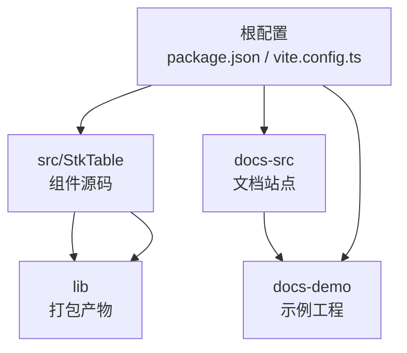
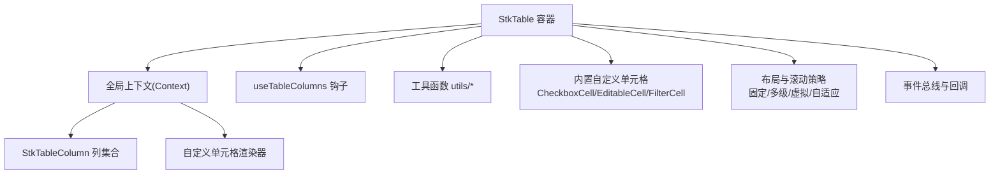
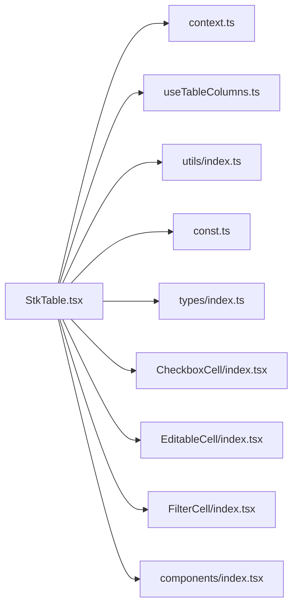

# 项目概述

<cite>
**本文引用的文件**   
- [README.md](file://README.md)
- [package.json](file://package.json)
- [src/StkTable/index.ts](file://src/StkTable/index.ts)
- [src/StkTable/StkTable.tsx](file://src/StkTable/StkTable.tsx)
- [src/StkTable/context.ts](file://src/StkTable/context.ts)
- [src/StkTable/const.ts](file://src/StkTable/const.ts)
- [src/StkTable/hooks/useTableColumns.ts](file://src/StkTable/hooks/useTableColumns.ts)
- [src/StkTable/utils/index.ts](file://src/StkTable/utils/index.ts)
- [src/StkTable/utils/constRefUtils.ts](file://src/StkTable/utils/constRefUtils.ts)
- [src/StkTable/types/index.ts](file://src/StkTable/types/index.ts)
- [src/StkTable/components/index.tsx](file://src/StkTable/components/index.tsx)
- [src/StkTable/custom-cells/CheckboxCell/index.tsx](file://src/StkTable/custom-cells/CheckboxCell/index.tsx)
- [src/StkTable/custom-cells/EditableCell/index.tsx](file://src/StkTable/custom-cells/EditableCell/index.tsx)
- [src/StkTable/custom-cells/FilterCell/index.tsx](file://src/StkTable/custom-cells/FilterCell/index.tsx)
- [lib/stk-table-react.js](file://lib/stk-table-react.js)
- [lib/style.css](file://lib/style.css)
- [docs-src/main/table/basic/basic.md](file://docs-src/main/table/basic/basic.md)
- [docs-src/main/table/advanced/virtual.md](file://docs-src/main/table/advanced/virtual.md)
- [docs-src/main/table/advanced/custom-cell.md](file://docs-src/main/table/advanced/custom-cell.md)
- [docs-src/main/table/advanced/column-resize.md](file://docs-src/main/table/advanced/column-resize.md)
- [docs-src/main/table/advanced/row-drag.md](file://docs-src/main/table/advanced/row-drag.md)
- [docs-src/main/table/advanced/header-drag.md](file://docs-src/main/table/advanced/header-drag.md)
- [docs-src/main/table/advanced/highlight.md](file://docs-src/main/table/advanced/highlight.md)
- [docs-src/main/table/advanced/area-selection.md](file://docs-src/main/table/advanced/area-selection.md)
- [docs-src/main/table/advanced/auto-height-virtual.md](file://docs-src/main/table/advanced/auto-height-virtual.md)
- [docs-src/main/table/basic/fixed.md](file://docs-src/main/table/basic/fixed.md)
- [docs-src/main/table/basic/multi-header.md](file://docs-src/main/table/basic/multi-header.md)
- [docs-src/main/table/basic/tree.md](file://docs-src/main/table/basic/tree.md)
- [docs-src/main/table/basic/expand-row.md](file://docs-src/main/table/basic/expand-row.md)
- [docs-src/main/table/basic/footer.md](file://docs-src/main/table/basic/footer.md)
- [docs-src/main/table/basic/size.md](file://docs-src/main/table/basic/size.md)
- [docs-src/main/table/basic/align.md](file://docs-src/main/table/basic/align.md)
- [docs-src/main/table/basic/bordered.md](file://docs-src/main/table/basic/bordered.md)
- [docs-src/main/table/basic/checkbox.md](file://docs-src/main/table/basic/checkbox.md)
- [docs-src/main/table/basic/empty.md](file://docs-src/main/table/basic/empty.md)
- [docs-src/main/table/basic/overflow.md](file://docs-src/main/table/basic/overflow.md)
- [docs-src/main/table/basic/scrollbar.md](file://docs-src/main/table/basic/scrollbar.md)
- [docs-src/main/table/basic/seq.md](file://docs-src/main/table/basic/seq.md)
- [docs-src/main/table/basic/sort.md](file://docs-src/main/table/basic/sort.md)
- [docs-src/main/table/basic/stripe.md](file://docs-src/main/table/basic/stripe.md)
- [docs-src/main/table/basic/theme.md](file://docs-src/main/table/basic/theme.md)
</cite>

## 目录
1. [简介](#简介)
2. [项目结构](#项目结构)
3. [核心组件与能力](#核心组件与能力)
4. [架构总览](#架构总览)
5. [关键模块详解](#关键模块详解)
6. [依赖关系分析](#依赖关系分析)
7. [性能特性](#性能特性)
8. [扩展与定制](#扩展与定制)
9. [兼容性与生态定位](#兼容性与生态定位)
10. [常见问题排查](#常见问题排查)
11. [结语](#结语)

## 简介
StkTable 是一个面向 React 的高性能、可扩展的表格组件库。它围绕“数据驱动 + 渲染优化 + 可插拔扩展”的设计目标，提供虚拟滚动、列宽调整、行/列拖拽、多选、树形、展开行、多级表头、固定列、分页/排序/筛选等常用能力，并通过自定义单元格、插槽与主题变量实现灵活的样式与行为定制。其目标是帮助开发者在复杂业务场景下快速构建高性能、可维护的数据表格。

## 项目结构
仓库采用“源码 + 文档 + 示例 + 产物”的分层组织方式：
- src/StkTable：组件源码，包含主入口、上下文、类型定义、工具函数、内置自定义单元格与基础组件。
- docs-src：VitePress 文档站点源码，覆盖 API、基础用法、高级特性与多语言。
- docs-demo：演示工程，按功能维度组织示例代码，便于本地运行与调试。
- lib：打包产物（JS/CSS/类型声明），供外部直接引用。
- 根配置：package.json、vite.config.ts、tsconfig.json、eslint/prettier 等工程化配置。

图表来源
- [src/StkTable/index.ts](file://src/StkTable/index.ts)
- [lib/stk-table-react.js](file://lib/stk-table-react.js)
- [package.json](file://package.json)

章节来源
- [package.json](file://package.json)
- [src/StkTable/index.ts](file://src/StkTable/index.ts)

## 核心组件与能力
- 核心组件
  - StkTable：表格容器，负责列解析、数据流、事件分发、渲染策略选择（含虚拟滚动）。
  - StkTableColumn：列定义，描述字段、宽度、对齐、排序、筛选、格式化等。
- 内置能力
  - 基础：尺寸、对齐、边框、斑马纹、序号、空态、溢出处理、滚动条样式。
  - 交互：多选、排序、展开行、树形、区域选择、高亮、行列拖拽、列宽调整、头部拖拽。
  - 布局：多级表头、固定列/固定模式、自适应高度、虚拟滚动（纵向/横向/自动高度）。
  - 扩展：自定义单元格、插槽、主题变量、国际化。
- 典型使用路径
  - 通过 props 配置列与数据；
  - 通过事件回调或暴露方法控制状态；
  - 通过自定义单元格与插槽扩展展示与交互；
  - 通过主题变量与 CSS 变量进行外观定制。

章节来源
- [docs-src/main/table/basic/basic.md](file://docs-src/main/table/basic/basic.md)
- [docs-src/main/table/advanced/virtual.md](file://docs-src/main/table/advanced/virtual.md)
- [docs-src/main/table/advanced/custom-cell.md](file://docs-src/main/table/advanced/custom-cell.md)
- [docs-src/main/table/advanced/column-resize.md](file://docs-src/main/table/advanced/column-resize.md)
- [docs-src/main/table/advanced/row-drag.md](file://docs-src/main/table/advanced/row-drag.md)
- [docs-src/main/table/advanced/header-drag.md](file://docs-src/main/table/advanced/header-drag.md)
- [docs-src/main/table/advanced/highlight.md](file://docs-src/main/table/advanced/highlight.md)
- [docs-src/main/table/advanced/area-selection.md](file://docs-src/main/table/advanced/area-selection.md)
- [docs-src/main/table/advanced/auto-height-virtual.md](file://docs-src/main/table/advanced/auto-height-virtual.md)
- [docs-src/main/table/basic/fixed.md](file://docs-src/main/table/basic/fixed.md)
- [docs-src/main/table/basic/multi-header.md](file://docs-src/main/table/basic/multi-header.md)
- [docs-src/main/table/basic/tree.md](file://docs-src/main/table/basic/tree.md)
- [docs-src/main/table/basic/expand-row.md](file://docs-src/main/table/basic/expand-row.md)
- [docs-src/main/table/basic/footer.md](file://docs-src/main/table/basic/footer.md)
- [docs-src/main/table/basic/size.md](file://docs-src/main/table/basic/size.md)
- [docs-src/main/table/basic/align.md](file://docs-src/main/table/basic/align.md)
- [docs-src/main/table/basic/bordered.md](file://docs-src/main/table/basic/bordered.md)
- [docs-src/main/table/basic/checkbox.md](file://docs-src/main/table/basic/checkbox.md)
- [docs-src/main/table/basic/empty.md](file://docs-src/main/table/basic/empty.md)
- [docs-src/main/table/basic/overflow.md](file://docs-src/main/table/basic/overflow.md)
- [docs-src/main/table/basic/scrollbar.md](file://docs-src/main/table/basic/scrollbar.md)
- [docs-src/main/table/basic/seq.md](file://docs-src/main/table/basic/seq.md)
- [docs-src/main/table/basic/sort.md](file://docs-src/main/table/basic/sort.md)
- [docs-src/main/table/basic/stripe.md](file://docs-src/main/table/basic/stripe.md)
- [docs-src/main/table/basic/theme.md](file://docs-src/main/table/basic/theme.md)

## 架构总览
StkTable 以“单例容器 + 上下文共享 + 钩子编排 + 插件式单元格”为核心架构。StkTable 作为唯一数据源与渲染调度中心，通过 Context 向子节点（列、单元格、工具栏等）广播状态与能力；内部钩子负责列解析、计算可见范围、事件聚合与副作用管理；内置自定义单元格作为“可插拔渲染单元”，配合插槽与主题变量完成展示与交互的解耦。

图表来源
- [src/StkTable/StkTable.tsx](file://src/StkTable/StkTable.tsx)
- [src/StkTable/context.ts](file://src/StkTable/context.ts)
- [src/StkTable/hooks/useTableColumns.ts](file://src/StkTable/hooks/useTableColumns.ts)
- [src/StkTable/custom-cells/CheckboxCell/index.tsx](file://src/StkTable/custom-cells/CheckboxCell/index.tsx)
- [src/StkTable/custom-cells/EditableCell/index.tsx](file://src/StkTable/custom-cells/EditableCell/index.tsx)
- [src/StkTable/custom-cells/FilterCell/index.tsx](file://src/StkTable/custom-cells/FilterCell/index.tsx)

## 关键模块详解

### 入口与导出
- 统一入口 index.ts 对外暴露 StkTable、StkTableColumn 及必要的常量/类型。
- 产物 stk-table-react.js 为运行时包，style.css 为默认样式。

章节来源
- [src/StkTable/index.ts](file://src/StkTable/index.ts)
- [lib/stk-table-react.js](file://lib/stk-table-react.js)
- [lib/style.css](file://lib/style.css)

### 主容器 StkTable
- 职责
  - 接收并校验 props（列、数据、尺寸、滚动、排序、筛选等）；
  - 基于 useTableColumns 解析列树，生成扁平化列模型；
  - 根据配置选择渲染策略（普通/虚拟/自适应高度）；
  - 通过 Context 注入全局状态（选中、排序、筛选、拖拽、主题等）；
  - 派发事件（如 onRowClick/onSortChange/onFilterChange 等）。
- 关键点
  - 列解析与缓存：避免重复计算，提升大数据量下的稳定性；
  - 事件合并：将分散的单元格/列事件汇聚到上层；
  - 渲染边界：对虚拟滚动区域进行精确裁剪与复用。

章节来源
- [src/StkTable/StkTable.tsx](file://src/StkTable/StkTable.tsx)
- [src/StkTable/context.ts](file://src/StkTable/context.ts)
- [src/StkTable/hooks/useTableColumns.ts](file://src/StkTable/hooks/useTableColumns.ts)

### 列解析钩子 useTableColumns
- 职责
  - 将用户传入的列配置转换为内部使用的列模型；
  - 计算列宽、层级、是否叶子节点、是否固定等元信息；
  - 支持多级表头与嵌套列的拓扑解析。
- 复杂度
  - 时间复杂度 O(n)（n 为列数），空间复杂度 O(n)。
- 优化点
  - 结果 memo 化，减少重排；
  - 增量更新：仅当列配置变化时重新计算。

章节来源
- [src/StkTable/hooks/useTableColumns.ts](file://src/StkTable/hooks/useTableColumns.ts)

### 上下文 Context
- 职责
  - 集中管理表格级状态（选中、排序、筛选、拖拽、主题、国际化等）；
  - 提供 setter 与订阅机制，保证子组件按需消费。
- 设计要点
  - 分片拆分：将不同领域状态拆分为多个 context，降低重渲染面；
  - 不可变更新：通过 action 触发局部更新，避免全量刷新。

章节来源
- [src/StkTable/context.ts](file://src/StkTable/context.ts)

### 工具与常量
- utils/index.ts：通用工具（深比较、防抖节流、坐标计算等）。
- utils/constRefUtils.ts：稳定引用与常量缓存，减少不必要的 re-render。
- const.ts：表格相关常量（事件名、类名前缀、默认值等）。
- types/index.ts：TS 类型定义，确保 API 契约与开发体验。

章节来源
- [src/StkTable/utils/index.ts](file://src/StkTable/utils/index.ts)
- [src/StkTable/utils/constRefUtils.ts](file://src/StkTable/utils/constRefUtils.ts)
- [src/StkTable/const.ts](file://src/StkTable/const.ts)
- [src/StkTable/types/index.ts](file://src/StkTable/types/index.ts)

### 内置自定义单元格
- CheckboxCell：复选框单元格，支持全选/反选联动。
- EditableCell：可编辑单元格，支持输入、失焦保存、键盘导航。
- FilterCell：筛选单元格，支持下拉筛选与条件组合。
- 设计模式
  - 每个单元格均为独立组件，通过 props 获取上下文能力（如更新行数据、触发事件）；
  - 通过插槽与主题变量实现外观与交互的可定制性。

章节来源
- [src/StkTable/custom-cells/CheckboxCell/index.tsx](file://src/StkTable/custom-cells/CheckboxCell/index.tsx)
- [src/StkTable/custom-cells/EditableCell/index.tsx](file://src/StkTable/custom-cells/EditableCell/index.tsx)
- [src/StkTable/custom-cells/FilterCell/index.tsx](file://src/StkTable/custom-cells/FilterCell/index.tsx)

### 基础组件与组合
- components/index.tsx：聚合基础 UI 片段（如表头、分页、工具栏等），供 StkTable 组合使用。

章节来源
- [src/StkTable/components/index.tsx](file://src/StkTable/components/index.tsx)

## 依赖关系分析
- 内聚与耦合
  - StkTable 与 useTableColumns 强耦合（列解析），与 Context 松耦合（状态订阅）；
  - 自定义单元格与 StkTable 通过 Context 与 props 契约解耦，具备良好可替换性。
- 外部依赖
  - React 生态（hooks、context、ref 等）；
  - 构建与文档工具链（Vite、VitePress、TypeScript、ESLint/Prettier）。

图表来源
- [src/StkTable/StkTable.tsx](file://src/StkTable/StkTable.tsx)
- [src/StkTable/context.ts](file://src/StkTable/context.ts)
- [src/StkTable/hooks/useTableColumns.ts](file://src/StkTable/hooks/useTableColumns.ts)
- [src/StkTable/utils/index.ts](file://src/StkTable/utils/index.ts)
- [src/StkTable/const.ts](file://src/StkTable/const.ts)
- [src/StkTable/types/index.ts](file://src/StkTable/types/index.ts)
- [src/StkTable/custom-cells/CheckboxCell/index.tsx](file://src/StkTable/custom-cells/CheckboxCell/index.tsx)
- [src/StkTable/custom-cells/EditableCell/index.tsx](file://src/StkTable/custom-cells/EditableCell/index.tsx)
- [src/StkTable/custom-cells/FilterCell/index.tsx](file://src/StkTable/custom-cells/FilterCell/index.tsx)
- [src/StkTable/components/index.tsx](file://src/StkTable/components/index.tsx)

## 性能特性
- 虚拟滚动
  - 纵向/横向虚拟滚动，仅渲染可视区域，显著降低 DOM 节点数量与重排成本。
  - 自适应高度虚拟列表，结合内容预估与动态测量，兼顾灵活布局与性能。
- 渲染优化
  - 列解析结果 memo 化；
  - 单元格级别 key 稳定，避免不必要重渲染；
  - 事件与副作用合并，减少多次同步更新。
- 大数据场景
  - 建议开启虚拟滚动与懒加载；
  - 合理设置行高与列宽，减少测量开销；
  - 使用服务端排序/筛选，降低前端计算压力。

章节来源
- [docs-src/main/table/advanced/virtual.md](file://docs-src/main/table/advanced/virtual.md)
- [docs-src/main/table/advanced/auto-height-virtual.md](file://docs-src/main/table/advanced/auto-height-virtual.md)

## 扩展与定制
- 自定义单元格
  - 通过自定义单元格组件替换默认渲染逻辑，实现富文本、图表、操作按钮等复杂展示。
- 插槽与模板
  - 利用插槽在表头、表尾、空态、工具栏等位置插入自定义内容。
- 主题与样式
  - 通过 CSS 变量与主题配置覆盖默认样式，适配品牌风格。
- 事件与暴露方法
  - 通过事件回调与 expose 方法实现与父组件的双向通信与控制。

章节来源
- [docs-src/main/table/advanced/custom-cell.md](file://docs-src/main/table/advanced/custom-cell.md)
- [docs-src/main/table/basic/theme.md](file://docs-src/main/table/basic/theme.md)

## 兼容性与生态定位
- 生态定位
  - 面向中大型后台系统与数据密集型应用，强调性能与可扩展性；
  - 与 React Hooks 生态深度集成，遵循现代 React 最佳实践。
- 兼容性
  - 基于 React 版本要求（参见 package.json）；
  - 浏览器端依赖现代 CSS 特性（CSS 变量、Flex/Grid 等）；
  - 移动端需关注触摸事件与滚动性能。

章节来源
- [package.json](file://package.json)

## 常见问题排查
- 列不显示或错位
  - 检查列配置是否完整（key、width、fixed 等）；
  - 确认多级表头与固定列的组合是否符合预期。
- 虚拟滚动抖动或空白
  - 检查行高是否稳定，必要时启用固定行高或预估行高；
  - 确认容器高度是否受父级影响导致测量异常。
- 自定义单元格未生效
  - 确认单元格组件是否正确注册与返回；
  - 检查 props 传递与上下文消费是否正确。
- 主题未生效
  - 确认样式引入顺序与优先级；
  - 检查 CSS 变量命名与作用域。

章节来源
- [docs-src/main/table/basic/fixed.md](file://docs-src/main/table/basic/fixed.md)
- [docs-src/main/table/basic/multi-header.md](file://docs-src/main/table/basic/multi-header.md)
- [docs-src/main/table/advanced/virtual.md](file://docs-src/main/table/advanced/virtual.md)
- [docs-src/main/table/advanced/custom-cell.md](file://docs-src/main/table/advanced/custom-cell.md)
- [docs-src/main/table/basic/theme.md](file://docs-src/main/table/basic/theme.md)

## 结语
StkTable 以“高性能 + 可扩展”为核心，围绕 React 生态提供了从基础到高级的一站式表格解决方案。通过清晰的架构与完善的文档示例，开发者可以快速上手并在复杂场景中持续演进。建议在大数据与高交互场景优先启用虚拟滚动与懒加载，并结合自定义单元格与主题定制打造一致的用户体验。