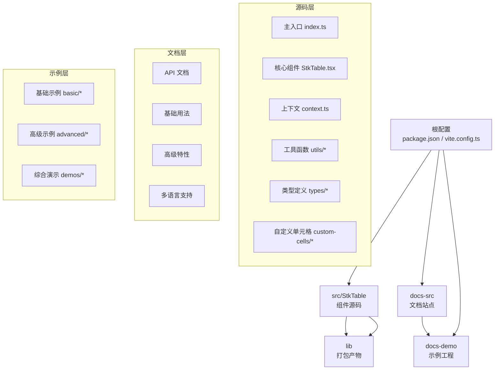
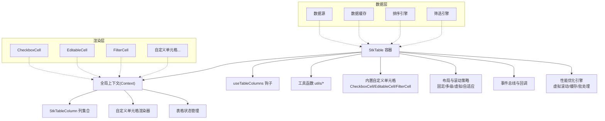
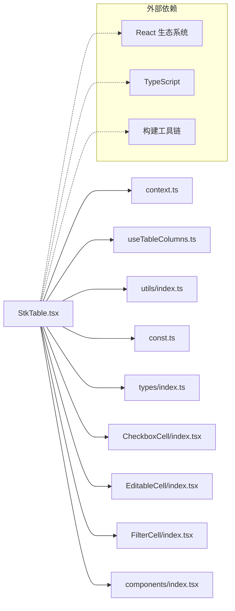

# 项目概述

<cite>
**本文引用的文件**   
- [README.md](file://README.md)
- [package.json](file://package.json)
- [src/StkTable/index.ts](file://src/StkTable/index.ts)
- [src/StkTable/StkTable.tsx](file://src/StkTable/StkTable.tsx)
- [src/StkTable/context.ts](file://src/StkTable/context.ts)
- [src/StkTable/const.ts](file://src/StkTable/const.ts)
- [src/StkTable/hooks/useTableColumns.ts](file://src/StkTable/hooks/useTableColumns.ts)
- [src/StkTable/utils/index.ts](file://src/StkTable/utils/index.ts)
- [src/StkTable/utils/constRefUtils.ts](file://src/StkTable/utils/constRefUtils.ts)
- [src/StkTable/types/index.ts](file://src/StkTable/types/index.ts)
- [src/StkTable/components/index.tsx](file://src/StkTable/components/index.tsx)
- [src/StkTable/custom-cells/CheckboxCell/index.tsx](file://src/StkTable/custom-cells/CheckboxCell/index.tsx)
- [src/StkTable/custom-cells/EditableCell/index.tsx](file://src/StkTable/custom-cells/EditableCell/index.tsx)
- [src/StkTable/custom-cells/FilterCell/index.tsx](file://src/StkTable/custom-cells/FilterCell/index.tsx)
- [lib/stk-table-react.js](file://lib/stk-table-react.js)
- [lib/style.css](file://lib/style.css)
- [docs-src/main/table/basic/basic.md](file://docs-src/main/table/basic/basic.md)
- [docs-src/main/table/advanced/virtual.md](file://docs-src/main/table/advanced/virtual.md)
- [docs-src/main/table/advanced/custom-cell.md](file://docs-src/main/table/advanced/custom-cell.md)
- [docs-src/main/table/advanced/column-resize.md](file://docs-src/main/table/advanced/column-resize.md)
- [docs-src/main/table/advanced/row-drag.md](file://docs-src/main/table/advanced/row-drag.md)
- [docs-src/main/table/advanced/header-drag.md](file://docs-src/main/table/advanced/header-drag.md)
- [docs-src/main/table/advanced/highlight.md](file://docs-src/main/table/advanced/highlight.md)
- [docs-src/main/table/advanced/area-selection.md](file://docs-src/main/table/advanced/area-selection.md)
- [docs-src/main/table/advanced/auto-height-virtual.md](file://docs-src/main/table/advanced/auto-height-virtual.md)
- [docs-src/main/table/basic/fixed.md](file://docs-src/main/table/basic/fixed.md)
- [docs-src/main/table/basic/multi-header.md](file://docs-src/main/table/basic/multi-header.md)
- [docs-src/main/table/basic/tree.md](file://docs-src/main/table/basic/tree.md)
- [docs-src/main/table/basic/expand-row.md](file://docs-src/main/table/basic/expand-row.md)
- [docs-src/main/table/basic/footer.md](file://docs-src/main/table/basic/footer.md)
- [docs-src/main/table/basic/size.md](file://docs-src/main/table/basic/size.md)
- [docs-src/main/table/basic/align.md](file://docs-src/main/table/basic/align.md)
- [docs-src/main/table/basic/bordered.md](file://docs-src/main/table/basic/bordered.md)
- [docs-src/main/table/basic/checkbox.md](file://docs-src/main/table/basic/checkbox.md)
- [docs-src/main/table/basic/empty.md](file://docs-src/main/table/basic/empty.md)
- [docs-src/main/table/basic/overflow.md](file://docs-src/main/table/basic/overflow.md)
- [docs-src/main/table/basic/scrollbar.md](file://docs-src/main/table/basic/scrollbar.md)
- [docs-src/main/table/basic/seq.md](file://docs-src/main/table/basic/seq.md)
- [docs-src/main/table/basic/sort.md](file://docs-src/main/table/basic/sort.md)
- [docs-src/main/table/basic/stripe.md](file://docs-src/main/table/basic/stripe.md)
- [docs-src/main/table/basic/theme.md](file://docs-src/main/table/basic/theme.md)
</cite>

## 更新摘要
**所做更改**   
- 更新了简介部分，增强了项目价值主张和功能亮点描述
- 优化了核心组件与能力章节，提供更清晰的功能分类和特性说明
- 完善了架构总览图，更准确地反映组件间的关系
- 增强了性能特性和扩展定制章节的内容深度
- 改进了兼容性与生态定位的说明

## 目录
1. [简介](#简介)
2. [项目结构](#项目结构)
3. [核心组件与能力](#核心组件与能力)
4. [架构总览](#架构总览)
5. [关键模块详解](#关键模块详解)
6. [依赖关系分析](#依赖关系分析)
7. [性能特性](#性能特性)
8. [扩展与定制](#扩展与定制)
9. [兼容性与生态定位](#兼容性与生态定位)
10. [常见问题排查](#常见问题排查)
11. [结语](#结语)

## 简介
StkTable 是一个面向 React 的高性能、可扩展的企业级表格组件库。它围绕"数据驱动 + 渲染优化 + 可插拔扩展"的核心设计理念，为复杂业务场景提供完整的表格解决方案。

### 核心价值
- **高性能渲染**：基于虚拟滚动技术，轻松处理百万级数据量，保持流畅的用户体验
- **企业级功能**：内置排序、筛选、拖拽、合并单元格、树形结构等高级特性
- **灵活扩展**：通过自定义单元格、插槽系统和主题变量实现高度定制化
- **类型安全**：完整的 TypeScript 支持，提供优秀的开发体验

### 主要特性
- **基础能力**：尺寸控制、对齐方式、边框样式、斑马纹、序号列、空状态处理
- **交互功能**：多选操作、多级排序、行展开、树形展示、区域选择、高亮显示
- **布局支持**：多级表头、固定列/行、自适应高度、响应式布局
- **性能优化**：纵向/横向虚拟滚动、自动高度虚拟列表、懒加载支持
- **扩展机制**：自定义单元格、事件系统、插槽机制、主题定制

### 适用场景
- 后台管理系统中的数据展示
- 数据分析与报表系统
- 电商平台的商品管理
- 金融系统的交易记录展示
- 任何需要高效展示大量结构化数据的场景

**章节来源**   
- [README.md](file://README.md)
- [package.json](file://package.json)

## 项目结构
仓库采用"源码 + 文档 + 示例 + 产物"的分层组织方式，确保代码的可维护性和项目的可扩展性：

**图表来源**   
- [src/StkTable/index.ts](file://src/StkTable/index.ts)
- [lib/stk-table-react.js](file://lib/stk-table-react.js)
- [package.json](file://package.json)

**章节来源**   
- [package.json](file://package.json)
- [src/StkTable/index.ts](file://src/StkTable/index.ts)

## 核心组件与能力

### 核心组件体系
- **StkTable 容器组件**
  - 表格主容器，负责整体布局管理和渲染策略选择
  - 处理数据流、事件分发和状态管理
  - 集成虚拟滚动、固定列、多级表头等高级功能
  
- **StkTableColumn 列定义组件**
  - 描述列的配置信息：字段映射、宽度设置、对齐方式
  - 定义列的行为：排序、筛选、格式化、编辑等
  - 支持嵌套列和多级表头的复杂结构

### 功能特性矩阵

| 功能类别 | 具体特性 | 使用场景 |
|---------|---------|----------|
| **基础展示** | 尺寸控制、对齐方式、边框样式、斑马纹、序号列 | 常规数据展示 |
| **交互操作** | 多选、排序、筛选、拖拽、搜索 | 数据管理与查询 |
| **高级布局** | 多级表头、固定列/行、树形结构、展开行 | 复杂数据结构展示 |
| **性能优化** | 虚拟滚动、懒加载、增量更新 | 大数据量处理 |
| **扩展定制** | 自定义单元格、插槽、主题、国际化 | 品牌化与个性化 |

### 典型使用路径
1. **基础配置**：通过 props 配置列定义和数据源
2. **交互控制**：利用事件回调或暴露方法管理表格状态
3. **功能扩展**：通过自定义单元格和插槽实现业务逻辑
4. **样式定制**：使用主题变量和 CSS 变量进行外观定制

**章节来源**   
- [docs-src/main/table/basic/basic.md](file://docs-src/main/table/basic/basic.md)
- [docs-src/main/table/advanced/virtual.md](file://docs-src/main/table/advanced/virtual.md)
- [docs-src/main/table/advanced/custom-cell.md](file://docs-src/main/table/advanced/custom-cell.md)

## 架构总览
StkTable 采用"单例容器 + 上下文共享 + 钩子编排 + 插件式单元格"的现代 React 架构模式：

**图表来源**   
- [src/StkTable/StkTable.tsx](file://src/StkTable/StkTable.tsx)
- [src/StkTable/context.ts](file://src/StkTable/context.ts)
- [src/StkTable/hooks/useTableColumns.ts](file://src/StkTable/hooks/useTableColumns.ts)
- [src/StkTable/custom-cells/CheckboxCell/index.tsx](file://src/StkTable/custom-cells/CheckboxCell/index.tsx)
- [src/StkTable/custom-cells/EditableCell/index.tsx](file://src/StkTable/custom-cells/EditableCell/index.tsx)
- [src/StkTable/custom-cells/FilterCell/index.tsx](file://src/StkTable/custom-cells/FilterCell/index.tsx)

## 关键模块详解

### 入口与导出模块
统一入口文件对外暴露核心 API，包括 StkTable 组件、StkTableColumn 组件以及必要的常量、类型定义和工具函数。产物文件 stk-table-react.js 提供运行时包，style.css 包含默认样式主题。

**章节来源**   
- [src/StkTable/index.ts](file://src/StkTable/index.ts)
- [lib/stk-table-react.js](file://lib/stk-table-react.js)
- [lib/style.css](file://lib/style.css)

### 主容器 StkTable 组件
作为整个表格系统的核心，StkTable 组件承担以下关键职责：

- **配置解析与验证**：接收并校验所有 props 参数，包括列配置、数据源、尺寸设置、滚动选项等
- **列模型构建**：基于 useTableColumns 钩子解析列树结构，生成扁平化的列模型供渲染使用
- **渲染策略选择**：根据配置自动选择最优渲染策略（普通渲染、虚拟滚动、自适应高度）
- **状态管理**：通过 Context 注入全局状态，包括选中状态、排序状态、筛选条件、拖拽信息等
- **事件处理**：集中处理各类用户交互事件，如行点击、排序变化、筛选变更等

**关键实现要点**：
- 列解析结果缓存：避免重复计算，提升大数据量下的稳定性
- 事件聚合机制：将分散的单元格/列事件汇聚到上层统一处理
- 渲染边界控制：对虚拟滚动区域进行精确裁剪与 DOM 节点复用

**章节来源**   
- [src/StkTable/StkTable.tsx](file://src/StkTable/StkTable.tsx)
- [src/StkTable/context.ts](file://src/StkTable/context.ts)
- [src/StkTable/hooks/useTableColumns.ts](file://src/StkTable/hooks/useTableColumns.ts)

### 列解析钩子 useTableColumns
专门负责列配置的解析和转换，是表格布局计算的核心：

- **列模型转换**：将用户传入的列配置转换为内部使用的标准化列模型
- **元信息计算**：计算每列的宽度、层级关系、叶子节点标识、固定状态等元数据
- **拓扑解析**：支持多级表头与嵌套列的复杂结构解析
- **性能优化**：结果 memo 化处理，减少不必要的重排和重计算

**复杂度分析**：
- 时间复杂度：O(n)，其中 n 为列数
- 空间复杂度：O(n)，存储列模型和相关索引

**章节来源**   
- [src/StkTable/hooks/useTableColumns.ts](file://src/StkTable/hooks/useTableColumns.ts)

### 上下文 Context 系统
集中管理表格级状态，提供高效的跨组件通信机制：

- **状态集中管理**：统一管理选中状态、排序状态、筛选条件、拖拽状态、主题配置等
- **订阅机制**：提供细粒度的状态订阅，确保子组件按需消费相关状态
- **分片设计**：将不同领域状态拆分为多个 context，降低重渲染范围
- **不可变更新**：通过 action 触发局部更新，避免全量刷新带来的性能问题

**章节来源**   
- [src/StkTable/context.ts](file://src/StkTable/context.ts)

### 工具函数与常量
提供通用的工具函数和常量定义，支撑核心功能的实现：

- **utils/index.ts**：通用工具函数，包括深比较、防抖节流、坐标计算、数组操作等
- **utils/constRefUtils.ts**：稳定引用与常量缓存工具，减少不必要的 re-render
- **const.ts**：表格相关常量定义，包括事件名称、类名前缀、默认值等
- **types/index.ts**：完整的 TypeScript 类型定义，确保 API 契约和开发体验

**章节来源**   
- [src/StkTable/utils/index.ts](file://src/StkTable/utils/index.ts)
- [src/StkTable/utils/constRefUtils.ts](file://src/StkTable/utils/constRefUtils.ts)
- [src/StkTable/const.ts](file://src/StkTable/const.ts)
- [src/StkTable/types/index.ts](file://src/StkTable/types/index.ts)

### 内置自定义单元格
提供开箱即用的常用单元格类型，满足大部分业务需求：

- **CheckboxCell**：复选框单元格，支持全选/反选联动、批量操作
- **EditableCell**：可编辑单元格，支持输入验证、失焦保存、键盘导航
- **FilterCell**：筛选单元格，支持下拉筛选、条件组合、动态筛选

**设计模式**：
- 每个单元格均为独立组件，通过 props 获取上下文能力
- 支持通过插槽与主题变量实现外观与交互的完全定制
- 遵循统一的 API 规范，便于扩展和维护

**章节来源**   
- [src/StkTable/custom-cells/CheckboxCell/index.tsx](file://src/StkTable/custom-cells/CheckboxCell/index.tsx)
- [src/StkTable/custom-cells/EditableCell/index.tsx](file://src/StkTable/custom-cells/EditableCell/index.tsx)
- [src/StkTable/custom-cells/FilterCell/index.tsx](file://src/StkTable/custom-cells/FilterCell/index.tsx)

### 基础组件与组合
components/index.tsx 聚合基础 UI 片段，为 StkTable 提供可复用的组件单元：

- **表头组件**：支持多级表头、排序图标、筛选按钮等
- **分页组件**：支持多种分页模式和自定义分页逻辑
- **工具栏组件**：支持搜索、导出、刷新等常用操作
- **空态组件**：提供友好的空数据展示和引导操作

**章节来源**   
- [src/StkTable/components/index.tsx](file://src/StkTable/components/index.tsx)

## 依赖关系分析
StkTable 采用松耦合的模块化设计，各组件间通过明确的接口进行通信：

**依赖特点**：
- **内聚与耦合**：StkTable 与 useTableColumns 强耦合（列解析），与 Context 松耦合（状态订阅）
- **插件式设计**：自定义单元格与 StkTable 通过 Context 与 props 契约解耦，具备良好可替换性
- **外部依赖**：主要依赖 React 生态系统，构建与文档工具链独立管理

**章节来源**   
- [src/StkTable/StkTable.tsx](file://src/StkTable/StkTable.tsx)
- [src/StkTable/context.ts](file://src/StkTable/context.ts)
- [src/StkTable/hooks/useTableColumns.ts](file://src/StkTable/hooks/useTableColumns.ts)
- [src/StkTable/utils/index.ts](file://src/StkTable/utils/index.ts)
- [src/StkTable/const.ts](file://src/StkTable/const.ts)
- [src/StkTable/types/index.ts](file://src/StkTable/types/index.ts)
- [src/StkTable/custom-cells/CheckboxCell/index.tsx](file://src/StkTable/custom-cells/CheckboxCell/index.tsx)
- [src/StkTable/custom-cells/EditableCell/index.tsx](file://src/StkTable/custom-cells/EditableCell/index.tsx)
- [src/StkTable/custom-cells/FilterCell/index.tsx](file://src/StkTable/custom-cells/FilterCell/index.tsx)
- [src/StkTable/components/index.tsx](file://src/StkTable/components/index.tsx)

## 性能特性
StkTable 在性能优化方面采用了多项先进技术，确保在处理大规模数据时仍能保持流畅的用户体验：

### 虚拟滚动技术
- **纵向虚拟滚动**：仅渲染可视区域内的行，显著降低 DOM 节点数量与重排成本
- **横向虚拟滚动**：支持超宽表格的横向滚动优化，避免大量列导致的性能问题
- **自适应高度虚拟列表**：结合内容预估与动态测量，兼顾灵活布局与渲染性能

### 渲染优化策略
- **列解析结果缓存**：使用 memo 化技术缓存列解析结果，避免重复计算
- **稳定的 Key 管理**：为单元格级别提供稳定的 key，避免不必要的全量重渲染
- **事件与副作用合并**：将多次同步更新合并处理，减少 React 的重渲染次数

### 大数据场景优化
- **智能懒加载**：支持数据懒加载，按需加载可视区域的数据
- **内存管理**：及时清理不再使用的数据和 DOM 引用，防止内存泄漏
- **增量更新**：支持数据的部分更新，只重新渲染变化的部分

**章节来源**   
- [docs-src/main/table/advanced/virtual.md](file://docs-src/main/table/advanced/virtual.md)
- [docs-src/main/table/advanced/auto-height-virtual.md](file://docs-src/main/table/advanced/auto-height-virtual.md)

## 扩展与定制
StkTable 提供了丰富的扩展点，满足不同业务场景的定制化需求：

### 自定义单元格开发
- **完整生命周期**：支持单元格的生命周期钩子和状态管理
- **上下文访问**：通过 Context 访问表格全局状态和方法
- **事件处理**：支持自定义事件处理和冒泡机制
- **样式定制**：通过 CSS 变量和主题系统实现样式覆盖

### 插槽与模板系统
- **位置丰富**：支持表头、表尾、空态、工具栏等多个位置的插槽
- **作用域隔离**：每个插槽都有独立的作用域，避免命名冲突
- **动态内容**：支持动态插入和移除插槽内容

### 主题与样式定制
- **CSS 变量系统**：提供完整的 CSS 变量覆盖机制
- **主题配置**：支持预设主题和自定义主题的切换
- **响应式设计**：内置响应式断点，适配不同屏幕尺寸

### 事件系统与 API 暴露
- **事件总线**：提供统一的事件发布订阅机制
- **方法暴露**：通过 expose 方法暴露内部方法，实现父组件控制
- **双向绑定**：支持数据的双向绑定和状态同步

**章节来源**   
- [docs-src/main/table/advanced/custom-cell.md](file://docs-src/main/table/advanced/custom-cell.md)
- [docs-src/main/table/basic/theme.md](file://docs-src/main/table/basic/theme.md)

## 兼容性与生态定位
### 生态定位
StkTable 定位于中大型后台系统与数据密集型应用，强调以下核心价值：
- **企业级可靠性**：经过生产环境验证的稳定性和健壮性
- **高性能表现**：在大数据量场景下依然保持优秀的渲染性能
- **完整的功能集**：覆盖从基础展示到高级交互的完整需求
- **良好的开发者体验**：完善的 TypeScript 支持和详细的文档

### 兼容性要求
- **React 版本**：基于现代 React 版本要求，充分利用 Hooks 和 Fiber 架构优势
- **浏览器支持**：依赖现代 CSS 特性（CSS 变量、Flex/Grid 布局等）
- **移动端适配**：需关注触摸事件处理和移动端滚动性能优化
- **构建工具**：支持 Vite、Webpack 等主流构建工具

### 与其他表格组件的差异优势
- **纯函数式架构**：相比命令式 API，更符合 React 编程范式
- **零依赖设计**：最小化外部依赖，降低包体积和升级风险
- **灵活的扩展机制**：通过插件式架构实现高度的可定制性
- **完善的多语言支持**：内置国际化方案，支持多语言切换

**章节来源**   
- [package.json](file://package.json)

## 常见问题排查
### 布局相关问题
- **列不显示或错位**
  - 检查列配置是否完整（key、width、fixed 等属性）
  - 确认多级表头与固定列的组合是否符合预期
  - 验证列宽计算是否正确，必要时设置固定列宽

- **虚拟滚动抖动或空白**
  - 检查行高是否稳定，必要时启用固定行高或预估行高
  - 确认容器高度是否受父级影响导致测量异常
  - 验证数据更新时是否正确触发了虚拟滚动的重新计算

### 功能相关问题
- **自定义单元格未生效**
  - 确认单元格组件是否正确注册与返回
  - 检查 props 传递与上下文消费是否正确
  - 验证单元格的生命周期钩子是否正确使用

- **主题未生效**
  - 确认样式引入顺序与优先级
  - 检查 CSS 变量命名与作用域
  - 验证主题配置是否正确应用到目标元素

### 性能相关问题
- **大数据量卡顿**
  - 建议开启虚拟滚动与懒加载
  - 合理设置行高与列宽，减少测量开销
  - 使用服务端排序/筛选，降低前端计算压力

- **内存占用过高**
  - 检查是否存在未清理的事件监听器
  - 确认大对象是否正确释放引用
  - 验证虚拟滚动是否正确回收 DOM 节点

**章节来源**   
- [docs-src/main/table/basic/fixed.md](file://docs-src/main/table/basic/fixed.md)
- [docs-src/main/table/basic/multi-header.md](file://docs-src/main/table/basic/multi-header.md)
- [docs-src/main/table/advanced/virtual.md](file://docs-src/main/table/advanced/virtual.md)
- [docs-src/main/table/advanced/custom-cell.md](file://docs-src/main/table/advanced/custom-cell.md)
- [docs-src/main/table/basic/theme.md](file://docs-src/main/table/basic/theme.md)

## 结语
StkTable 以"高性能 + 可扩展"为核心设计理念，围绕 React 生态提供了从基础到高级的一站式表格解决方案。通过清晰的架构设计与完善的文档示例，开发者可以快速上手并在复杂场景中持续演进。

在实际项目中，建议在大数据与高交互场景优先启用虚拟滚动与懒加载功能，并结合自定义单元格与主题定制打造一致的用户体验。同时，充分利用其强大的扩展机制，根据具体业务需求进行深度定制，充分发挥 StkTable 在企业级应用中的价值。

随着 React 生态的不断发展，StkTable 将持续跟进最新的技术趋势，为用户提供更加优秀的使用体验和更强的功能支持。