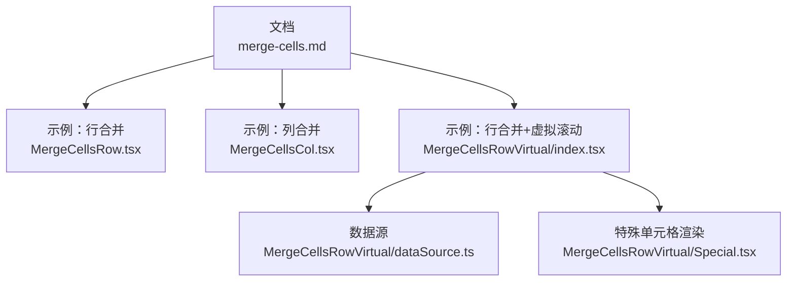
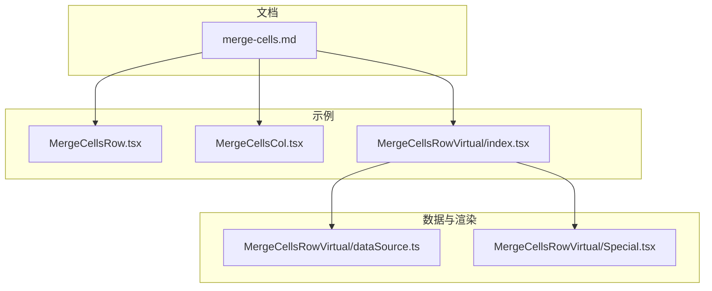
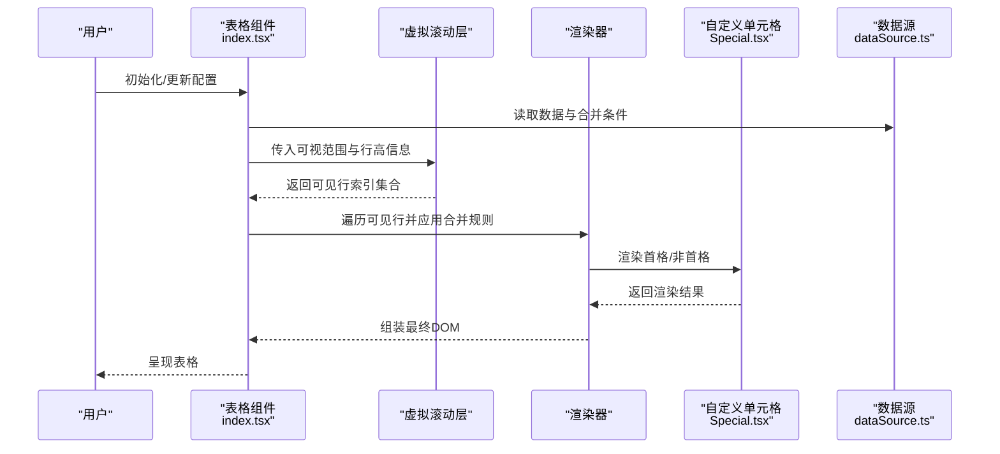
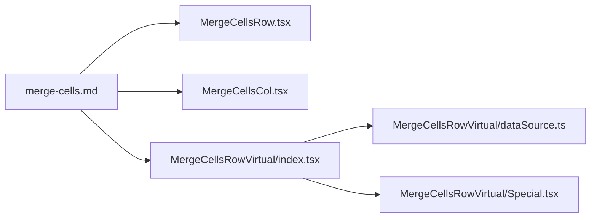

# 合并单元格

<cite>
**本文引用的文件**   
- [merge-cells.md](file://docs-src/main/table/basic/merge-cells.md)
- [MergeCellsRow.tsx](file://docs-demo/basic/merge-cells/MergeCellsRow.tsx)
- [MergeCellsCol.tsx](file://docs-demo/basic/merge-cells/MergeCellsCol.tsx)
- [MergeCellsRow/index.tsx](file://docs-demo/basic/merge-cells/MergeCellsRowVirtual/index.tsx)
- [MergeCellsRow/dataSource.ts](file://docs-demo/basic/merge-cells/MergeCellsRowVirtual/dataSource.ts)
- [MergeCellsRow/Special.tsx](file://docs-demo/basic/merge-cells/MergeCellsRowVirtual/Special.tsx)
</cite>

## 目录
1. [简介](#简介)
2. [项目结构](#项目结构)
3. [核心组件](#核心组件)
4. [架构总览](#架构总览)
5. [详细组件分析](#详细组件分析)
6. [依赖分析](#依赖分析)
7. [性能考虑](#性能考虑)
8. [故障排查指南](#故障排查指南)
9. [结论](#结论)
10. [附录](#附录)

## 简介
本章节面向需要在表格中实现“合并单元格”的开发者，围绕行合并与列合并的实现原理、配置方法、事件处理、虚拟滚动兼容性与复杂布局场景展开。文档以仓库中的示例与文档为基准，提供从入门到进阶的系统性说明，并给出调试技巧与最佳实践建议。

## 项目结构
与“合并单元格”相关的代码与文档主要分布在以下位置：
- 文档说明：docs-src/main/table/basic/merge-cells.md
- 基础示例（行合并）：docs-demo/basic/merge-cells/MergeCellsRow.tsx
- 基础示例（列合并）：docs-demo/basic/merge-cells/MergeCellsCol.tsx
- 行合并 + 虚拟滚动示例：docs-demo/basic/merge-cells/MergeCellsRowVirtual/index.tsx、dataSource.ts、Special.tsx

图表来源
- [merge-cells.md](file://docs-src/main/table/basic/merge-cells.md)
- [MergeCellsRow.tsx](file://docs-demo/basic/merge-cells/MergeCellsRow.tsx)
- [MergeCellsCol.tsx](file://docs-demo/basic/merge-cells/MergeCellsCol.tsx)
- [MergeCellsRow/index.tsx](file://docs-demo/basic/merge-cells/MergeCellsRowVirtual/index.tsx)
- [MergeCellsRow/dataSource.ts](file://docs-demo/basic/merge-cells/MergeCellsRowVirtual/dataSource.ts)
- [MergeCellsRow/Special.tsx](file://docs-demo/basic/merge-cells/MergeCellsRowVirtual/Special.tsx)

章节来源
- [merge-cells.md](file://docs-src/main/table/basic/merge-cells.md)
- [MergeCellsRow.tsx](file://docs-demo/basic/merge-cells/MergeCellsRow.tsx)
- [MergeCellsCol.tsx](file://docs-demo/basic/merge-cells/MergeCellsCol.tsx)
- [MergeCellsRow/index.tsx](file://docs-demo/basic/merge-cells/MergeCellsRowVirtual/index.tsx)
- [MergeCellsRow/dataSource.ts](file://docs-demo/basic/merge-cells/MergeCellsRowVirtual/dataSource.ts)
- [MergeCellsRow/Special.tsx](file://docs-demo/basic/merge-cells/MergeCellsRowVirtual/Special.tsx)

## 核心组件
- 文档入口：merge-cells.md 提供了合并单元格的总体说明与使用指引。
- 行合并示例：MergeCellsRow.tsx 演示了如何定义行合并规则并在表格中生效。
- 列合并示例：MergeCellsCol.tsx 演示了列合并的配置方式与边界处理要点。
- 虚拟滚动兼容：MergeCellsRowVirtual/index.tsx 展示了在开启纵向虚拟滚动时，行合并的正确用法与注意事项；dataSource.ts 提供示例数据；Special.tsx 展示自定义单元格渲染。

章节来源
- [merge-cells.md](file://docs-src/main/table/basic/merge-cells.md)
- [MergeCellsRow.tsx](file://docs-demo/basic/merge-cells/MergeCellsRow.tsx)
- [MergeCellsCol.tsx](file://docs-demo/basic/merge-cells/MergeCellsCol.tsx)
- [MergeCellsRow/index.tsx](file://docs-demo/basic/merge-cells/MergeCellsRowVirtual/index.tsx)
- [MergeCellsRow/dataSource.ts](file://docs-demo/basic/merge-cells/MergeCellsRowVirtual/dataSource.ts)
- [MergeCellsRow/Special.tsx](file://docs-demo/basic/merge-cells/MergeCellsRowVirtual/Special.tsx)

## 架构总览
下图展示了“合并单元格”功能在示例工程中的组织关系与数据流向：文档驱动示例，示例通过数据源与自定义单元格完成渲染，虚拟滚动示例在此基础上叠加滚动优化。

图表来源
- [merge-cells.md](file://docs-src/main/table/basic/merge-cells.md)
- [MergeCellsRow.tsx](file://docs-demo/basic/merge-cells/MergeCellsRow.tsx)
- [MergeCellsCol.tsx](file://docs-demo/basic/merge-cells/MergeCellsCol.tsx)
- [MergeCellsRow/index.tsx](file://docs-demo/basic/merge-cells/MergeCellsRowVirtual/index.tsx)
- [MergeCellsRow/dataSource.ts](file://docs-demo/basic/merge-cells/MergeCellsRowVirtual/dataSource.ts)
- [MergeCellsRow/Special.tsx](file://docs-demo/basic/merge-cells/MergeCellsRowVirtual/Special.tsx)

## 详细组件分析

### 行合并示例（MergeCellsRow.tsx）
- 目标：演示如何在表格中启用行合并，并通过配置指定需要合并的行范围。
- 关键点：
  - 合并规则的声明方式与数据结构约定。
  - 合并后的单元格渲染策略（仅首格渲染内容，其余隐藏）。
  - 与排序、筛选等功能的交互注意事项。
- 适用场景：分组统计、层级汇总、报表标题行合并等。

章节来源
- [MergeCellsRow.tsx](file://docs-demo/basic/merge-cells/MergeCellsRow.tsx)

### 列合并示例（MergeCellsCol.tsx）
- 目标：演示列合并的配置方法与边界处理。
- 关键点：
  - 列合并区间定义与跨列渲染逻辑。
  - 表头与数据区列合并的一致性要求。
  - 固定列、自适应宽度下的边界对齐问题。
- 适用场景：多级表头、指标聚合、横向维度分组。

章节来源
- [MergeCellsCol.tsx](file://docs-demo/basic/merge-cells/MergeCellsCol.tsx)

### 行合并 + 虚拟滚动（MergeCellsRowVirtual）
- 目标：在开启纵向虚拟滚动的情况下正确实现行合并，保证滚动位置同步与可见区域计算准确。
- 关键文件职责：
  - index.tsx：组合表格、合并规则与虚拟滚动配置，协调渲染流程。
  - dataSource.ts：提供示例数据，包含用于判断合并条件的字段。
  - Special.tsx：自定义单元格渲染，处理合并后首格显示与后续格子的占位或隐藏。
- 兼容性要点：
  - 虚拟滚动按索引映射真实数据行，合并规则需基于稳定索引计算。
  - 滚动过程中避免频繁重算合并区间，必要时缓存结果。
  - 首格渲染高度与合并跨度一致，确保视觉连续。

图表来源
- [MergeCellsRow/index.tsx](file://docs-demo/basic/merge-cells/MergeCellsRowVirtual/index.tsx)
- [MergeCellsRow/dataSource.ts](file://docs-demo/basic/merge-cells/MergeCellsRowVirtual/dataSource.ts)
- [MergeCellsRow/Special.tsx](file://docs-demo/basic/merge-cells/MergeCellsRowVirtual/Special.tsx)

章节来源
- [MergeCellsRow/index.tsx](file://docs-demo/basic/merge-cells/MergeCellsRowVirtual/index.tsx)
- [MergeCellsRow/dataSource.ts](file://docs-demo/basic/merge-cells/MergeCellsRowVirtual/dataSource.ts)
- [MergeCellsRow/Special.tsx](file://docs-demo/basic/merge-cells/MergeCellsRowVirtual/Special.tsx)

### 概念性总览（无具体文件映射）
- 合并规则计算：通常基于相邻行的某字段值是否相同进行分组，生成行/列的起止索引区间。
- 边界处理：确保合并区间不越界，且与表头、固定列、冻结行等特性协同工作。
- 事件冒泡：合并后仅首格响应交互事件，避免重复触发；必要时在父容器统一捕获。
- 动态/条件合并：根据运行时状态（如筛选、排序、分页）重新计算合并区间。
- 虚拟滚动兼容：将合并区间映射到虚拟索引空间，缓存可见区间的合并结果，减少重排。

[本节为概念性说明，未直接分析具体文件，故不附“章节来源”]

## 依赖分析
- 文档与示例之间的依赖关系清晰：文档作为入口，引导读者理解各示例的使用方式。
- 示例内部依赖：
  - 行合并示例依赖表格组件的合并能力。
  - 列合并示例依赖列维度的合并支持。
  - 虚拟滚动示例依赖数据源与自定义单元格，同时与虚拟滚动层协作。

图表来源
- [merge-cells.md](file://docs-src/main/table/basic/merge-cells.md)
- [MergeCellsRow.tsx](file://docs-demo/basic/merge-cells/MergeCellsRow.tsx)
- [MergeCellsCol.tsx](file://docs-demo/basic/merge-cells/MergeCellsCol.tsx)
- [MergeCellsRow/index.tsx](file://docs-demo/basic/merge-cells/MergeCellsRowVirtual/index.tsx)
- [MergeCellsRow/dataSource.ts](file://docs-demo/basic/merge-cells/MergeCellsRowVirtual/dataSource.ts)
- [MergeCellsRow/Special.tsx](file://docs-demo/basic/merge-cells/MergeCellsRowVirtual/Special.tsx)

章节来源
- [merge-cells.md](file://docs-src/main/table/basic/merge-cells.md)
- [MergeCellsRow.tsx](file://docs-demo/basic/merge-cells/MergeCellsRow.tsx)
- [MergeCellsCol.tsx](file://docs-demo/basic/merge-cells/MergeCellsCol.tsx)
- [MergeCellsRow/index.tsx](file://docs-demo/basic/merge-cells/MergeCellsRowVirtual/index.tsx)
- [MergeCellsRow/dataSource.ts](file://docs-demo/basic/merge-cells/MergeCellsRowVirtual/dataSource.ts)
- [MergeCellsRow/Special.tsx](file://docs-demo/basic/merge-cells/MergeCellsRowVirtual/Special.tsx)

## 性能考虑
- 合并区间缓存：对静态或低频变化的数据，缓存合并结果，避免每次渲染都重新计算。
- 可见区域裁剪：仅在虚拟滚动可见范围内计算合并区间，降低复杂度。
- 首格渲染优化：合并后仅首格参与完整渲染，其余格子采用轻量占位，减少DOM节点数量。
- 事件去抖：在快速滚动或频繁交互时，对事件处理进行节流/防抖，避免抖动导致的重排。
- 样式与布局：合并边框与背景色应一次性计算，避免多次回流。

[本节提供通用指导，未直接分析具体文件，故不附“章节来源”]

## 故障排查指南
- 合并错位或重叠：检查合并区间是否越界，确认排序/筛选后索引映射是否正确。
- 虚拟滚动闪烁：确认首格高度与合并跨度一致，避免滚动过程中高度突变。
- 事件重复触发：确保仅首格绑定交互事件，或在父容器统一拦截。
- 固定列/冻结行冲突：核对合并区间是否与固定区域对齐，必要时调整起始列/行索引。
- 自定义单元格异常：在 Special.tsx 中打印关键状态，验证合并判定条件与渲染分支。

章节来源
- [MergeCellsRow/index.tsx](file://docs-demo/basic/merge-cells/MergeCellsRowVirtual/index.tsx)
- [MergeCellsRow/Special.tsx](file://docs-demo/basic/merge-cells/MergeCellsRowVirtual/Special.tsx)

## 结论
通过文档与示例的配合，可以在表格中稳健地实现行合并与列合并，并在虚拟滚动环境下保持良好性能与交互体验。建议在项目中遵循“规则前置、缓存优先、首格渲染、事件收敛”的原则，结合复杂布局需求进行扩展。

[本节为总结性内容，未直接分析具体文件，故不附“章节来源”]

## 附录
- 参考文档：merge-cells.md
- 示例路径：
  - 行合并：MergeCellsRow.tsx
  - 列合并：MergeCellsCol.tsx
  - 行合并+虚拟滚动：MergeCellsRowVirtual/index.tsx、dataSource.ts、Special.tsx

章节来源
- [merge-cells.md](file://docs-src/main/table/basic/merge-cells.md)
- [MergeCellsRow.tsx](file://docs-demo/basic/merge-cells/MergeCellsRow.tsx)
- [MergeCellsCol.tsx](file://docs-demo/basic/merge-cells/MergeCellsCol.tsx)
- [MergeCellsRow/index.tsx](file://docs-demo/basic/merge-cells/MergeCellsRowVirtual/index.tsx)
- [MergeCellsRow/dataSource.ts](file://docs-demo/basic/merge-cells/MergeCellsRowVirtual/dataSource.ts)
- [MergeCellsRow/Special.tsx](file://docs-demo/basic/merge-cells/MergeCellsRowVirtual/Special.tsx)