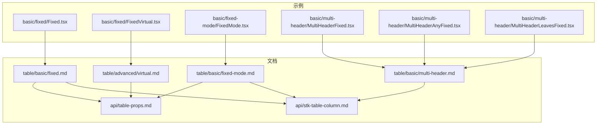
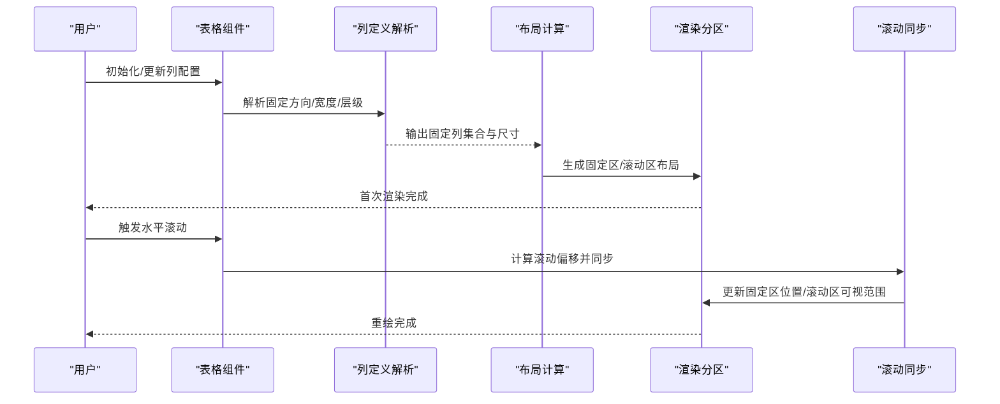
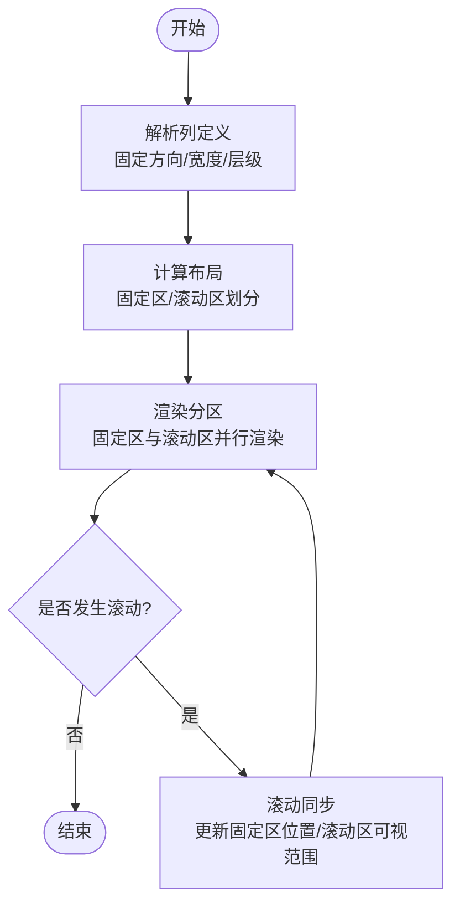
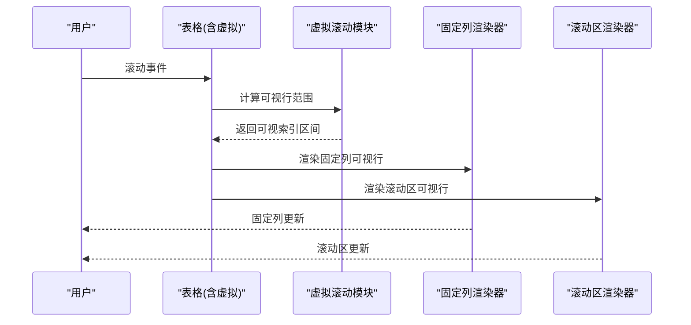
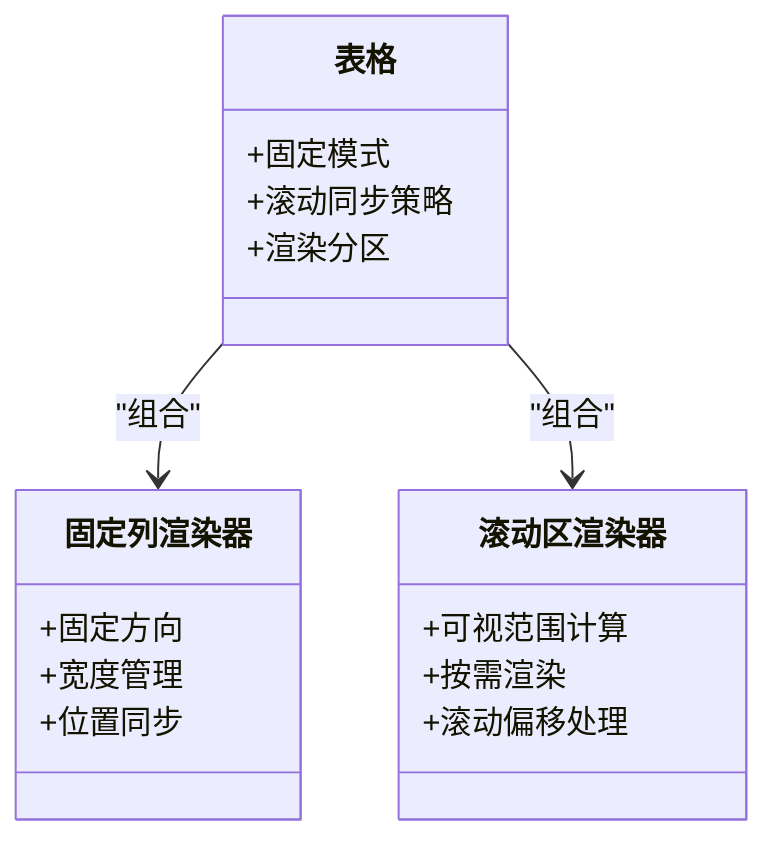
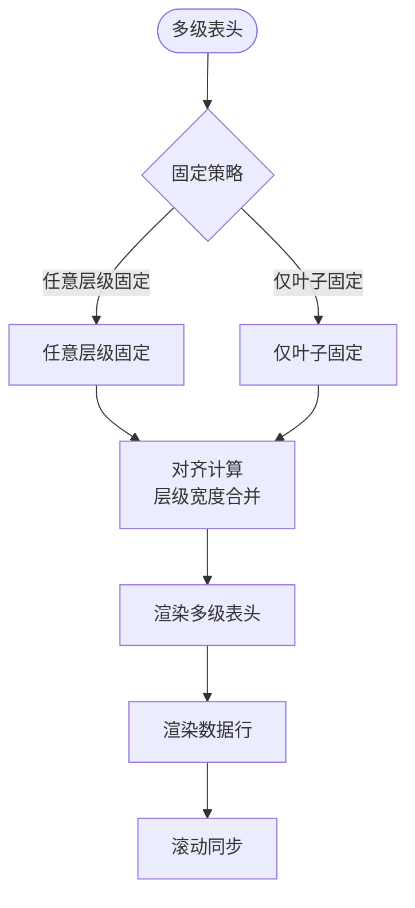
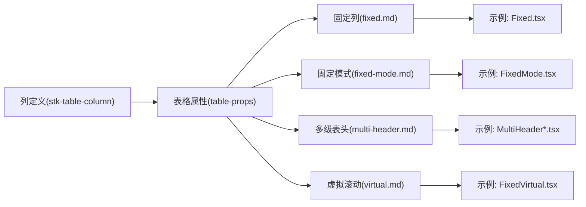

# 固定列

<cite>
**本文引用的文件**
- [Fixed.tsx](file://docs-demo/basic/fixed/Fixed.tsx)
- [FixedVirtual.tsx](file://docs-demo/basic/fixed/FixedVirtual.tsx)
- [FixedMode.tsx](file://docs-demo/basic/fixed-mode/FixedMode.tsx)
- [MultiHeaderFixed.tsx](file://docs-demo/basic/multi-header/MultiHeaderFixed.tsx)
- [MultiHeaderAnyFixed.tsx](file://docs-demo/basic/multi-header/MultiHeaderAnyFixed.tsx)
- [MultiHeaderLeavesFixed.tsx](file://docs-demo/basic/multi-header/MultiHeaderLeavesFixed.tsx)
- [table-props.md](file://docs-src/main/api/table-props.md)
- [stk-table-column.md](file://docs-src/main/api/stk-table-column.md)
- [fixed.md](file://docs-src/main/table/basic/fixed.md)
- [fixed-mode.md](file://docs-src/main/table/basic/fixed-mode.md)
- [multi-header.md](file://docs-src/main/table/basic/multi-header.md)
- [virtual.md](file://docs-src/main/table/advanced/virtual.md)
</cite>

## 目录
1. [简介](#简介)
2. [项目结构](#项目结构)
3. [核心组件](#核心组件)
4. [架构总览](#架构总览)
5. [详细组件分析](#详细组件分析)
6. [依赖分析](#依赖分析)
7. [性能考虑](#性能考虑)
8. [故障排查指南](#故障排查指南)
9. [结论](#结论)
10. [附录](#附录)

## 简介
本技术文档围绕“固定列”能力展开，系统性阐述其实现原理、配置方法、复杂布局兼容方案与性能优化策略。内容覆盖左右固定、粘性定位、滚动同步等核心技术点，并结合多级表头、虚拟滚动、自定义样式等企业级常见场景给出最佳实践与排障建议。

## 项目结构
仓库中与“固定列”直接相关的示例与文档分布如下：
- 基础示例
  - docs-demo/basic/fixed/Fixed.tsx：演示固定列基本用法
  - docs-demo/basic/fixed/FixedVirtual.tsx：演示固定列与虚拟滚动的结合
  - docs-demo/basic/fixed-mode/FixedMode.tsx：演示固定模式相关选项
- 多级表头与固定列
  - docs-demo/basic/multi-header/MultiHeaderFixed.tsx
  - docs-demo/basic/multi-header/MultiHeaderAnyFixed.tsx
  - docs-demo/basic/multi-header/MultiHeaderLeavesFixed.tsx
- 官方文档
  - docs-src/main/table/basic/fixed.md：固定列使用说明
  - docs-src/main/table/basic/fixed-mode.md：固定模式说明
  - docs-src/main/table/basic/multi-header.md：多级表头说明
  - docs-src/main/table/advanced/virtual.md：虚拟滚动说明
  - docs-src/main/api/table-props.md：表格属性 API
  - docs-src/main/api/stk-table-column.md：列定义 API

图表来源
- [Fixed.tsx](file://docs-demo/basic/fixed/Fixed.tsx)
- [FixedVirtual.tsx](file://docs-demo/basic/fixed/FixedVirtual.tsx)
- [FixedMode.tsx](file://docs-demo/basic/fixed-mode/FixedMode.tsx)
- [MultiHeaderFixed.tsx](file://docs-demo/basic/multi-header/MultiHeaderFixed.tsx)
- [MultiHeaderAnyFixed.tsx](file://docs-demo/basic/multi-header/MultiHeaderAnyFixed.tsx)
- [MultiHeaderLeavesFixed.tsx](file://docs-demo/basic/multi-header/MultiHeaderLeavesFixed.tsx)
- [fixed.md](file://docs-src/main/table/basic/fixed.md)
- [fixed-mode.md](file://docs-src/main/table/basic/fixed-mode.md)
- [multi-header.md](file://docs-src/main/table/basic/multi-header.md)
- [virtual.md](file://docs-src/main/table/advanced/virtual.md)
- [table-props.md](file://docs-src/main/api/table-props.md)
- [stk-table-column.md](file://docs-src/main/api/stk-table-column.md)

章节来源
- [Fixed.tsx](file://docs-demo/basic/fixed/Fixed.tsx)
- [FixedVirtual.tsx](file://docs-demo/basic/fixed/FixedVirtual.tsx)
- [FixedMode.tsx](file://docs-demo/basic/fixed-mode/FixedMode.tsx)
- [MultiHeaderFixed.tsx](file://docs-demo/basic/multi-header/MultiHeaderFixed.tsx)
- [MultiHeaderAnyFixed.tsx](file://docs-demo/basic/multi-header/MultiHeaderAnyFixed.tsx)
- [MultiHeaderLeavesFixed.tsx](file://docs-demo/basic/multi-header/MultiHeaderLeavesFixed.tsx)
- [fixed.md](file://docs-src/main/table/basic/fixed.md)
- [fixed-mode.md](file://docs-src/main/table/basic/fixed-mode.md)
- [multi-header.md](file://docs-src/main/table/basic/multi-header.md)
- [virtual.md](file://docs-src/main/table/advanced/virtual.md)
- [table-props.md](file://docs-src/main/api/table-props.md)
- [stk-table-column.md](file://docs-src/main/api/stk-table-column.md)

## 核心组件
- 固定列（Basic）
  - 通过列定义启用固定方向与宽度，支持左/右固定；在容器内以粘性或分层渲染方式保持可见。
  - 参考示例路径：[docs-demo/basic/fixed/Fixed.tsx](file://docs-demo/basic/fixed/Fixed.tsx)
- 固定列 + 虚拟滚动（Advanced）
  - 在大数据量场景下，将固定列与虚拟滚动组合使用，减少 DOM 节点数量，提升滚动性能。
  - 参考示例路径：[docs-demo/basic/fixed/FixedVirtual.tsx](file://docs-demo/basic/fixed/FixedVirtual.tsx)
- 固定模式（Mode）
  - 提供不同固定模式的切换与行为差异，如固定区域与滚动区域的划分、滚动同步策略等。
  - 参考示例路径：[docs-demo/basic/fixed-mode/FixedMode.tsx](file://docs-demo/basic/fixed-mode/FixedMode.tsx)
- 多级表头与固定列
  - 在多级表头结构中，可对任意层级或叶子层级的列进行固定，保证表头与数据列对齐一致。
  - 参考示例路径：
    - [docs-demo/basic/multi-header/MultiHeaderFixed.tsx](file://docs-demo/basic/multi-header/MultiHeaderFixed.tsx)
    - [docs-demo/basic/multi-header/MultiHeaderAnyFixed.tsx](file://docs-demo/basic/multi-header/MultiHeaderAnyFixed.tsx)
    - [docs-demo/basic/multi-header/MultiHeaderLeavesFixed.tsx](file://docs-demo/basic/multi-header/MultiHeaderLeavesFixed.tsx)

章节来源
- [Fixed.tsx](file://docs-demo/basic/fixed/Fixed.tsx)
- [FixedVirtual.tsx](file://docs-demo/basic/fixed/FixedVirtual.tsx)
- [FixedMode.tsx](file://docs-demo/basic/fixed-mode/FixedMode.tsx)
- [MultiHeaderFixed.tsx](file://docs-demo/basic/multi-header/MultiHeaderFixed.tsx)
- [MultiHeaderAnyFixed.tsx](file://docs-demo/basic/multi-header/MultiHeaderAnyFixed.tsx)
- [MultiHeaderLeavesFixed.tsx](file://docs-demo/basic/multi-header/MultiHeaderLeavesFixed.tsx)

## 架构总览
固定列的整体工作流可抽象为“列定义解析 → 布局计算 → 渲染分区 → 滚动同步”。下图展示了从用户交互到最终渲染的关键步骤。

图表来源
- [Fixed.tsx](file://docs-demo/basic/fixed/Fixed.tsx)
- [FixedVirtual.tsx](file://docs-demo/basic/fixed/FixedVirtual.tsx)
- [FixedMode.tsx](file://docs-demo/basic/fixed-mode/FixedMode.tsx)
- [multi-header.md](file://docs-src/main/table/basic/multi-header.md)
- [virtual.md](file://docs-src/main/table/advanced/virtual.md)

## 详细组件分析

### 固定列（Basic）
- 功能要点
  - 固定方向：支持 left/right 两种方向，用于将关键信息始终保持在视口边缘。
  - 宽度设置：可通过列定义指定固定列宽度，确保在不同屏幕尺寸下的可读性。
  - 响应式适配：结合容器宽度与列宽策略，避免溢出与错位。
- 典型用法
  - 在列定义中开启固定方向并设置宽度，即可在表格中形成固定侧栏。
  - 参考示例路径：[docs-demo/basic/fixed/Fixed.tsx](file://docs-demo/basic/fixed/Fixed.tsx)

图表来源
- [Fixed.tsx](file://docs-demo/basic/fixed/Fixed.tsx)
- [fixed.md](file://docs-src/main/table/basic/fixed.md)
- [table-props.md](file://docs-src/main/api/table-props.md)
- [stk-table-column.md](file://docs-src/main/api/stk-table-column.md)

章节来源
- [Fixed.tsx](file://docs-demo/basic/fixed/Fixed.tsx)
- [fixed.md](file://docs-src/main/table/basic/fixed.md)
- [table-props.md](file://docs-src/main/api/table-props.md)
- [stk-table-column.md](file://docs-src/main/api/stk-table-column.md)

### 固定列 + 虚拟滚动（Advanced）
- 兼容性要点
  - 固定列不参与虚拟渲染的“隐藏区间”，但需与滚动区保持一致的滚动进度与行高策略。
  - 虚拟滚动仅对非固定列的数据行进行按需渲染，固定列行按可视范围渲染，降低内存占用。
- 典型用法
  - 在大数据量表格中，同时启用固定列与虚拟滚动，以获得流畅的水平/垂直滚动体验。
  - 参考示例路径：[docs-demo/basic/fixed/FixedVirtual.tsx](file://docs-demo/basic/fixed/FixedVirtual.tsx)

图表来源
- [FixedVirtual.tsx](file://docs-demo/basic/fixed/FixedVirtual.tsx)
- [virtual.md](file://docs-src/main/table/advanced/virtual.md)
- [table-props.md](file://docs-src/main/api/table-props.md)

章节来源
- [FixedVirtual.tsx](file://docs-demo/basic/fixed/FixedVirtual.tsx)
- [virtual.md](file://docs-src/main/table/advanced/virtual.md)
- [table-props.md](file://docs-src/main/api/table-props.md)

### 固定模式（Mode）
- 模式差异
  - 不同固定模式会影响固定区域与滚动区域的边界、滚动条显示与联动行为。
  - 某些模式下，固定列可能采用粘性定位；另一些模式则通过分层渲染与偏移控制实现。
- 典型用法
  - 根据业务需求选择合适模式，平衡性能与视觉一致性。
  - 参考示例路径：[docs-demo/basic/fixed-mode/FixedMode.tsx](file://docs-demo/basic/fixed-mode/FixedMode.tsx)

图表来源
- [FixedMode.tsx](file://docs-demo/basic/fixed-mode/FixedMode.tsx)
- [fixed-mode.md](file://docs-src/main/table/basic/fixed-mode.md)
- [table-props.md](file://docs-src/main/api/table-props.md)

章节来源
- [FixedMode.tsx](file://docs-demo/basic/fixed-mode/FixedMode.tsx)
- [fixed-mode.md](file://docs-src/main/table/basic/fixed-mode.md)
- [table-props.md](file://docs-src/main/api/table-props.md)

### 多级表头与固定列
- 兼容要点
  - 多级表头的任意层级均可启用固定，也可仅对叶子列固定，保证表头与数据列的对齐关系。
  - 固定列在多行表头场景下需要维护层级结构与宽度继承规则。
- 典型用法
  - 在复杂报表中，将关键维度列固定，同时保留多级分组表头。
  - 参考示例路径：
    - [docs-demo/basic/multi-header/MultiHeaderFixed.tsx](file://docs-demo/basic/multi-header/MultiHeaderFixed.tsx)
    - [docs-demo/basic/multi-header/MultiHeaderAnyFixed.tsx](file://docs-demo/basic/multi-header/MultiHeaderAnyFixed.tsx)
    - [docs-demo/basic/multi-header/MultiHeaderLeavesFixed.tsx](file://docs-demo/basic/multi-header/MultiHeaderLeavesFixed.tsx)

图表来源
- [MultiHeaderFixed.tsx](file://docs-demo/basic/multi-header/MultiHeaderFixed.tsx)
- [MultiHeaderAnyFixed.tsx](file://docs-demo/basic/multi-header/MultiHeaderAnyFixed.tsx)
- [MultiHeaderLeavesFixed.tsx](file://docs-demo/basic/multi-header/MultiHeaderLeavesFixed.tsx)
- [multi-header.md](file://docs-src/main/table/basic/multi-header.md)
- [stk-table-column.md](file://docs-src/main/api/stk-table-column.md)

章节来源
- [MultiHeaderFixed.tsx](file://docs-demo/basic/multi-header/MultiHeaderFixed.tsx)
- [MultiHeaderAnyFixed.tsx](file://docs-demo/basic/multi-header/MultiHeaderAnyFixed.tsx)
- [MultiHeaderLeavesFixed.tsx](file://docs-demo/basic/multi-header/MultiHeaderLeavesFixed.tsx)
- [multi-header.md](file://docs-src/main/table/basic/multi-header.md)
- [stk-table-column.md](file://docs-src/main/api/stk-table-column.md)

## 依赖分析
- 列定义与表格属性的耦合
  - 固定列的行为由列定义与表格属性共同决定，包括固定方向、宽度、模式等。
  - 参考文档：
    - [table-props.md](file://docs-src/main/api/table-props.md)
    - [stk-table-column.md](file://docs-src/main/api/stk-table-column.md)
- 示例与文档的映射
  - 各示例均对应相应文档说明，便于快速定位配置项与行为差异。
  - 参考文档：
    - [fixed.md](file://docs-src/main/table/basic/fixed.md)
    - [fixed-mode.md](file://docs-src/main/table/basic/fixed-mode.md)
    - [multi-header.md](file://docs-src/main/table/basic/multi-header.md)
    - [virtual.md](file://docs-src/main/table/advanced/virtual.md)

图表来源
- [table-props.md](file://docs-src/main/api/table-props.md)
- [stk-table-column.md](file://docs-src/main/api/stk-table-column.md)
- [fixed.md](file://docs-src/main/table/basic/fixed.md)
- [fixed-mode.md](file://docs-src/main/table/basic/fixed-mode.md)
- [multi-header.md](file://docs-src/main/table/basic/multi-header.md)
- [virtual.md](file://docs-src/main/table/advanced/virtual.md)
- [Fixed.tsx](file://docs-demo/basic/fixed/Fixed.tsx)
- [FixedMode.tsx](file://docs-demo/basic/fixed-mode/FixedMode.tsx)
- [MultiHeaderFixed.tsx](file://docs-demo/basic/multi-header/MultiHeaderFixed.tsx)
- [MultiHeaderAnyFixed.tsx](file://docs-demo/basic/multi-header/MultiHeaderAnyFixed.tsx)
- [MultiHeaderLeavesFixed.tsx](file://docs-demo/basic/multi-header/MultiHeaderLeavesFixed.tsx)
- [FixedVirtual.tsx](file://docs-demo/basic/fixed/FixedVirtual.tsx)

章节来源
- [table-props.md](file://docs-src/main/api/table-props.md)
- [stk-table-column.md](file://docs-src/main/api/stk-table-column.md)
- [fixed.md](file://docs-src/main/table/basic/fixed.md)
- [fixed-mode.md](file://docs-src/main/table/basic/fixed-mode.md)
- [multi-header.md](file://docs-src/main/table/basic/multi-header.md)
- [virtual.md](file://docs-src/main/table/advanced/virtual.md)
- [Fixed.tsx](file://docs-demo/basic/fixed/Fixed.tsx)
- [FixedMode.tsx](file://docs-demo/basic/fixed-mode/FixedMode.tsx)
- [MultiHeaderFixed.tsx](file://docs-demo/basic/multi-header/MultiHeaderFixed.tsx)
- [MultiHeaderAnyFixed.tsx](file://docs-demo/basic/multi-header/MultiHeaderAnyFixed.tsx)
- [MultiHeaderLeavesFixed.tsx](file://docs-demo/basic/multi-header/MultiHeaderLeavesFixed.tsx)
- [FixedVirtual.tsx](file://docs-demo/basic/fixed/FixedVirtual.tsx)

## 性能考虑
- 重绘优化
  - 固定列与滚动区的渲染应尽可能分离，避免固定列变更引发整表重绘。
  - 利用只更新可视范围的策略，减少不必要的 DOM 操作。
- 内存管理
  - 在大数据量场景下，优先使用虚拟滚动，并对固定列的行也采用可视范围渲染，降低内存占用。
- 滚动性能调优
  - 合理设置固定列宽度与容器尺寸，避免频繁回流与重排。
  - 在高频滚动事件中节流或防抖，减少同步计算开销。
- 参考文档
  - [virtual.md](file://docs-src/main/table/advanced/virtual.md)
  - [table-props.md](file://docs-src/main/api/table-props.md)

## 故障排查指南
- 常见问题
  - 固定列与滚动区错位：检查列宽度与容器宽度是否一致，确认多级表头的宽度合并是否正确。
  - 固定列遮挡内容：调整固定列宽度或容器边距，避免与滚动区重叠。
  - 虚拟滚动与固定列不同步：确认固定列与滚动区的行高策略一致，并确保可视范围计算正确。
- 定位方法
  - 对照示例与文档逐项核对配置项，逐步缩小问题范围。
  - 参考示例路径：
    - [docs-demo/basic/fixed/Fixed.tsx](file://docs-demo/basic/fixed/Fixed.tsx)
    - [docs-demo/basic/fixed/FixedVirtual.tsx](file://docs-demo/basic/fixed/FixedVirtual.tsx)
    - [docs-demo/basic/fixed-mode/FixedMode.tsx](file://docs-demo/basic/fixed-mode/FixedMode.tsx)
    - [docs-demo/basic/multi-header/MultiHeaderFixed.tsx](file://docs-demo/basic/multi-header/MultiHeaderFixed.tsx)
    - [docs-demo/basic/multi-header/MultiHeaderAnyFixed.tsx](file://docs-demo/basic/multi-header/MultiHeaderAnyFixed.tsx)
    - [docs-demo/basic/multi-header/MultiHeaderLeavesFixed.tsx](file://docs-demo/basic/multi-header/MultiHeaderLeavesFixed.tsx)
- 参考文档
  - [fixed.md](file://docs-src/main/table/basic/fixed.md)
  - [fixed-mode.md](file://docs-src/main/table/basic/fixed-mode.md)
  - [multi-header.md](file://docs-src/main/table/basic/multi-header.md)
  - [virtual.md](file://docs-src/main/table/advanced/virtual.md)

## 结论
固定列在企业级应用中广泛用于突出关键信息、提升数据可读性与操作效率。通过合理的列定义、模式选择与性能优化策略，可在复杂布局（多级表头、虚拟滚动）中保持稳定与流畅的体验。建议在实际项目中结合示例与文档，逐步验证与调优，以达到最佳的用户体验与性能表现。

## 附录
- 常用配置项速查
  - 固定方向：left / right
  - 固定宽度：在列定义中设置
  - 固定模式：根据业务需求选择
  - 多级表头：支持任意层级或仅叶子列固定
  - 虚拟滚动：与固定列组合使用时注意行高与可视范围一致性
- 参考文档
  - [table-props.md](file://docs-src/main/api/table-props.md)
  - [stk-table-column.md](file://docs-src/main/api/stk-table-column.md)
  - [fixed.md](file://docs-src/main/table/basic/fixed.md)
  - [fixed-mode.md](file://docs-src/main/table/basic/fixed-mode.md)
  - [multi-header.md](file://docs-src/main/table/basic/multi-header.md)
  - [virtual.md](file://docs-src/main/table/advanced/virtual.md)