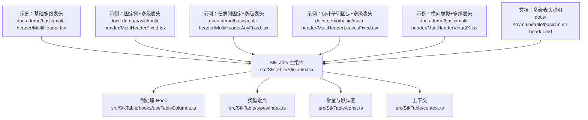
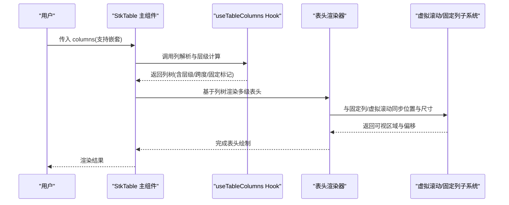
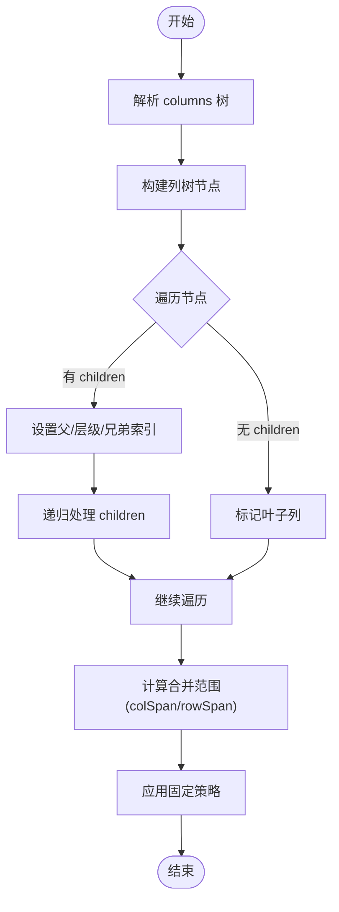
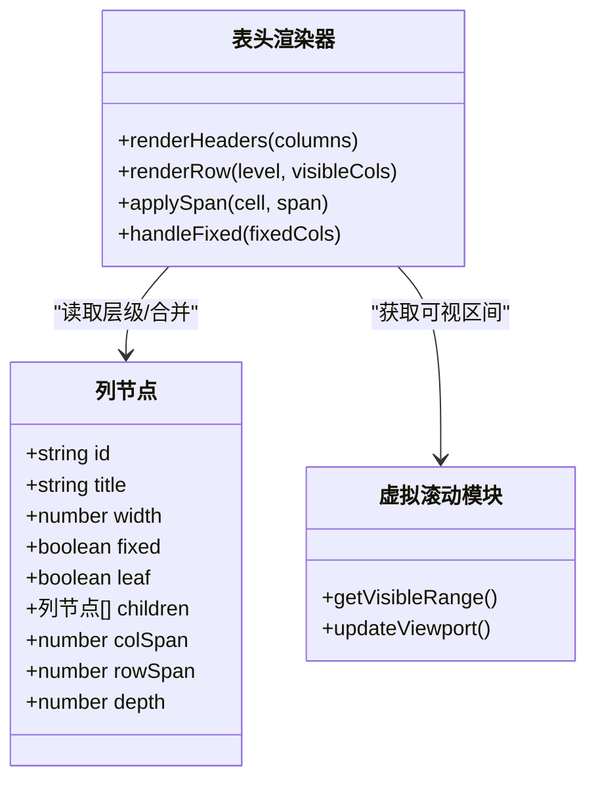
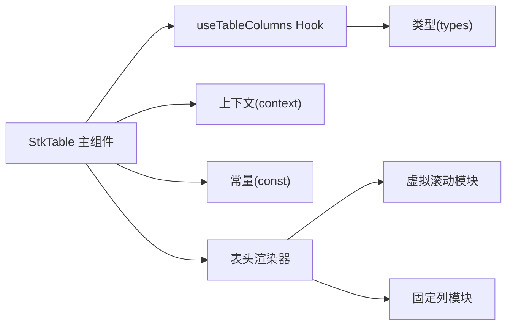

# 多级表头

<cite>
**本文引用的文件**   
- [src/StkTable/StkTable.tsx](file://src/StkTable/StkTable.tsx)
- [src/StkTable/hooks/useTableColumns.ts](file://src/StkTable/hooks/useTableColumns.ts)
- [src/StkTable/types/index.ts](file://src/StkTable/types/index.ts)
- [src/StkTable/const.ts](file://src/StkTable/const.ts)
- [src/StkTable/context.ts](file://src/StkTable/context.ts)
- [docs-demo/basic/multi-header/MultiHeader.tsx](file://docs-demo/basic/multi-header/MultiHeader.tsx)
- [docs-demo/basic/multi-header/MultiHeaderFixed.tsx](file://docs-demo/basic/multi-header/MultiHeaderFixed.tsx)
- [docs-demo/basic/multi-header/MultiHeaderAnyFixed.tsx](file://docs-demo/basic/multi-header/MultiHeaderAnyFixed.tsx)
- [docs-demo/basic/multi-header/MultiHeaderLeavesFixed.tsx](file://docs-demo/basic/multi-header/MultiHeaderLeavesFixed.tsx)
- [docs-demo/basic/multi-header/MultiHeaderVirtualX.tsx](file://docs-demo/basic/multi-header/MultiHeaderVirtualX.tsx)
- [docs-src/main/table/basic/multi-header.md](file://docs-src/main/table/basic/multi-header.md)
</cite>

## 目录
1. [简介](#简介)
2. [项目结构](#项目结构)
3. [核心组件](#核心组件)
4. [架构总览](#架构总览)
5. [详细组件分析](#详细组件分析)
6. [依赖关系分析](#依赖关系分析)
7. [性能考量](#性能考量)
8. [故障排查指南](#故障排查指南)
9. [结论](#结论)
10. [附录](#附录)

## 简介
本技术文档聚焦于“多级表头”能力，围绕数据结构设计、层级关系计算、渲染机制与配置方法展开，覆盖嵌套列定义、跨列合并、动态层级等高级特性，并给出与固定列、虚拟滚动等功能的集成方案与最佳实践。文档同时提供复杂业务场景（财务报表、数据分析面板、管理后台）的设计思路与示例路径，帮助读者快速落地。

## 项目结构
仓库采用“源码 + 演示 + 文档”的三层组织：
- 源码层：StkTable 核心实现位于 src/StkTable，包含主组件、类型定义、常量、上下文与列处理 Hook。
- 演示层：docs-demo 下按功能分类提供可运行示例，multi-header 子目录集中展示多级表头的多种组合用法。
- 文档层：docs-src 提供多语言文档页面，其中 multi-header.md 为官方使用说明入口。

图表来源
- [src/StkTable/StkTable.tsx](file://src/StkTable/StkTable.tsx)
- [src/StkTable/hooks/useTableColumns.ts](file://src/StkTable/hooks/useTableColumns.ts)
- [src/StkTable/types/index.ts](file://src/StkTable/types/index.ts)
- [src/StkTable/const.ts](file://src/StkTable/const.ts)
- [src/StkTable/context.ts](file://src/StkTable/context.ts)
- [docs-demo/basic/multi-header/MultiHeader.tsx](file://docs-demo/basic/multi-header/MultiHeader.tsx)
- [docs-demo/basic/multi-header/MultiHeaderFixed.tsx](file://docs-demo/basic/multi-header/MultiHeaderFixed.tsx)
- [docs-demo/basic/multi-header/MultiHeaderAnyFixed.tsx](file://docs-demo/basic/multi-header/MultiHeaderAnyFixed.tsx)
- [docs-demo/basic/multi-header/MultiHeaderLeavesFixed.tsx](file://docs-demo/basic/multi-header/MultiHeaderLeavesFixed.tsx)
- [docs-demo/basic/multi-header/MultiHeaderVirtualX.tsx](file://docs-demo/basic/multi-header/MultiHeaderVirtualX.tsx)
- [docs-src/main/table/basic/multi-header.md](file://docs-src/main/table/basic/multi-header.md)

章节来源
- [src/StkTable/StkTable.tsx](file://src/StkTable/StkTable.tsx)
- [src/StkTable/hooks/useTableColumns.ts](file://src/StkTable/hooks/useTableColumns.ts)
- [src/StkTable/types/index.ts](file://src/StkTable/types/index.ts)
- [src/StkTable/const.ts](file://src/StkTable/const.ts)
- [src/StkTable/context.ts](file://src/StkTable/context.ts)
- [docs-demo/basic/multi-header/MultiHeader.tsx](file://docs-demo/basic/multi-header/MultiHeader.tsx)
- [docs-demo/basic/multi-header/MultiHeaderFixed.tsx](file://docs-demo/basic/multi-header/MultiHeaderFixed.tsx)
- [docs-demo/basic/multi-header/MultiHeaderAnyFixed.tsx](file://docs-demo/basic/multi-header/MultiHeaderAnyFixed.tsx)
- [docs-demo/basic/multi-header/MultiHeaderLeavesFixed.tsx](file://docs-demo/basic/multi-header/MultiHeaderLeavesFixed.tsx)
- [docs-demo/basic/multi-header/MultiHeaderVirtualX.tsx](file://docs-demo/basic/multi-header/MultiHeaderVirtualX.tsx)
- [docs-src/main/table/basic/multi-header.md](file://docs-src/main/table/basic/multi-header.md)

## 核心组件
- StkTable 主组件：负责整体布局、事件分发、与列系统交互，承载多级表头渲染入口。
- useTableColumns Hook：对传入的 columns 进行解析、扁平化、层级计算与缓存，输出供渲染使用的列元数据。
- types/index.ts：定义列节点、多级表头相关字段、合并范围、固定策略等类型契约。
- const.ts：提供默认值、常量与边界条件。
- context.ts：在组件树中共享表格状态与列信息，便于多级表头与固定列、虚拟滚动等功能协同。

章节来源
- [src/StkTable/StkTable.tsx](file://src/StkTable/StkTable.tsx)
- [src/StkTable/hooks/useTableColumns.ts](file://src/StkTable/hooks/useTableColumns.ts)
- [src/StkTable/types/index.ts](file://src/StkTable/types/index.ts)
- [src/StkTable/const.ts](file://src/StkTable/const.ts)
- [src/StkTable/context.ts](file://src/StkTable/context.ts)

## 架构总览
下图展示了多级表头从配置到渲染的关键路径：用户通过 columns 声明嵌套列，useTableColumns 将其转换为带层级信息的列树；StkTable 读取该列树并按行渲染多级表头，同时与固定列、虚拟滚动等子系统协作。

图表来源
- [src/StkTable/StkTable.tsx](file://src/StkTable/StkTable.tsx)
- [src/StkTable/hooks/useTableColumns.ts](file://src/StkTable/hooks/useTableColumns.ts)

## 详细组件分析

### 数据结构与层级关系计算
- 列节点模型：每个列节点包含标识、标题、宽度、对齐、是否固定、是否叶子、children 等字段，用于表达树形结构。
- 层级计算：自顶向下遍历 children，累计深度；为每个节点记录其所在层级、父节点链、兄弟索引等，以便计算跨列合并范围。
- 合并范围：根据父子关系与兄弟数量推导 colSpan/rowSpan，确保同一父节点下的子列在对应层级正确合并。
- 固定策略：区分整列固定与仅叶子列固定，结合横向滚动与虚拟渲染时的可见区间计算，保证固定列在不同层级下位置一致。

图表来源
- [src/StkTable/hooks/useTableColumns.ts](file://src/StkTable/hooks/useTableColumns.ts)
- [src/StkTable/types/index.ts](file://src/StkTable/types/index.ts)

章节来源
- [src/StkTable/hooks/useTableColumns.ts](file://src/StkTable/hooks/useTableColumns.ts)
- [src/StkTable/types/index.ts](file://src/StkTable/types/index.ts)

### 渲染机制
- 表头分层渲染：依据层级信息逐层生成表头行，每行内按列顺序渲染单元格，并根据合并范围决定单元格跨越的列数。
- 固定列渲染：固定列不参与横向滚动，需独立定位与遮罩处理，确保与滚动区域对齐。
- 虚拟滚动集成：仅渲染可视区域内的表头单元，减少 DOM 节点数量；与列宽变化、列显隐联动时及时更新可视区间。
- 样式与对齐：统一处理边框、背景、文字对齐、溢出省略等，保证多级表头在不同主题下的一致性。

图表来源
- [src/StkTable/StkTable.tsx](file://src/StkTable/StkTable.tsx)
- [src/StkTable/hooks/useTableColumns.ts](file://src/StkTable/hooks/useTableColumns.ts)

章节来源
- [src/StkTable/StkTable.tsx](file://src/StkTable/StkTable.tsx)
- [src/StkTable/hooks/useTableColumns.ts](file://src/StkTable/hooks/useTableColumns.ts)

### 配置方法与高级特性
- 嵌套列定义：通过 children 数组声明多级表头，支持任意深度嵌套。
- 跨列合并：由系统自动计算合并范围，也可在列节点上显式指定合并参数以覆盖默认行为。
- 动态层级：运行时修改 columns 或切换层级结构，Hook 会重新计算层级与合并范围，触发增量更新。
- 固定列策略：
  - 整列固定：在父级或叶子列上启用固定，所有层级均参与固定。
  - 仅叶子列固定：仅在叶子列启用固定，父级不固定，适合复杂分组场景。
- 横向虚拟滚动：与多级表头无缝集成，仅渲染可视区表头，提升大数据量下的性能。

章节来源
- [docs-demo/basic/multi-header/MultiHeader.tsx](file://docs-demo/basic/multi-header/MultiHeader.tsx)
- [docs-demo/basic/multi-header/MultiHeaderFixed.tsx](file://docs-demo/basic/multi-header/MultiHeaderFixed.tsx)
- [docs-demo/basic/multi-header/MultiHeaderAnyFixed.tsx](file://docs-demo/basic/multi-header/MultiHeaderAnyFixed.tsx)
- [docs-demo/basic/multi-header/MultiHeaderLeavesFixed.tsx](file://docs-demo/basic/multi-header/MultiHeaderLeavesFixed.tsx)
- [docs-demo/basic/multi-header/MultiHeaderVirtualX.tsx](file://docs-demo/basic/multi-header/MultiHeaderVirtualX.tsx)
- [docs-src/main/table/basic/multi-header.md](file://docs-src/main/table/basic/multi-header.md)

### 复杂业务场景方案
- 财务报表：多层分组（如公司-部门-科目），配合跨列合并与固定列（左侧科目列固定），使用虚拟滚动应对大量明细行。
- 数据分析面板：多维度指标分组，动态切换维度层级，按需显示/隐藏列，结合横向虚拟滚动优化交互体验。
- 管理后台：通用列表+多级表头，支持排序、筛选、自定义单元格，固定关键操作列，保持长列表流畅性。

[本节为概念性内容，不直接分析具体文件]

## 依赖关系分析
- 组件耦合：StkTable 主组件依赖 useTableColumns 提供的列元数据；表头渲染器依赖列树与虚拟滚动模块。
- 外部依赖：与固定列、虚拟滚动子系统通过上下文与接口契约协作，避免强耦合。
- 循环依赖：通过 Hook 与类型解耦，降低循环引用风险。

图表来源
- [src/StkTable/StkTable.tsx](file://src/StkTable/StkTable.tsx)
- [src/StkTable/hooks/useTableColumns.ts](file://src/StkTable/hooks/useTableColumns.ts)
- [src/StkTable/types/index.ts](file://src/StkTable/types/index.ts)
- [src/StkTable/const.ts](file://src/StkTable/const.ts)
- [src/StkTable/context.ts](file://src/StkTable/context.ts)

章节来源
- [src/StkTable/StkTable.tsx](file://src/StkTable/StkTable.tsx)
- [src/StkTable/hooks/useTableColumns.ts](file://src/StkTable/hooks/useTableColumns.ts)
- [src/StkTable/types/index.ts](file://src/StkTable/types/index.ts)
- [src/StkTable/const.ts](file://src/StkTable/const.ts)
- [src/StkTable/context.ts](file://src/StkTable/context.ts)

## 性能考量
- 列树计算缓存：对 columns 变更进行浅比较与缓存，避免重复计算层级与合并范围。
- 增量更新：仅当列结构或固定策略变化时重算，其他属性变化走轻量更新。
- 可视区渲染：多级表头与虚拟滚动联动，减少 DOM 节点数量，降低重排与回流。
- 固定列优化：固定列独立渲染层，避免与滚动区域频繁同步，提高滚动性能。

[本节为通用性能建议，不直接分析具体文件]

## 故障排查指南
- 列未生效：检查 columns 的 key/id 是否唯一，children 结构是否符合类型约束。
- 合并异常：确认父子关系与兄弟数量是否正确，必要时显式指定合并范围。
- 固定错位：核对固定策略（整列固定 vs 仅叶子列固定）与横向滚动容器尺寸。
- 虚拟滚动抖动：确保列宽稳定，避免频繁改变列结构导致可视区间频繁重算。
- 兼容性：不同浏览器对表格布局差异可能导致边框/对齐不一致，建议使用统一样式与测试矩阵验证。

章节来源
- [src/StkTable/types/index.ts](file://src/StkTable/types/index.ts)
- [src/StkTable/const.ts](file://src/StkTable/const.ts)
- [docs-src/main/table/basic/multi-header.md](file://docs-src/main/table/basic/multi-header.md)

## 结论
多级表头通过清晰的列树模型与高效的层级计算，实现了灵活的嵌套列定义与跨列合并；与固定列、虚拟滚动的集成使其在复杂业务场景中具备良好性能与可扩展性。遵循本文的配置方法与最佳实践，可在报表、分析与后台系统中快速落地高质量的多级表头体验。

[本节为总结性内容，不直接分析具体文件]

## 附录
- 示例路径
  - 基础多级表头：[docs-demo/basic/multi-header/MultiHeader.tsx](file://docs-demo/basic/multi-header/MultiHeader.tsx)
  - 固定列+多级表头：[docs-demo/basic/multi-header/MultiHeaderFixed.tsx](file://docs-demo/basic/multi-header/MultiHeaderFixed.tsx)
  - 任意列固定+多级表头：[docs-demo/basic/multi-header/MultiHeaderAnyFixed.tsx](file://docs-demo/basic/multi-header/MultiHeaderAnyFixed.tsx)
  - 仅叶子列固定+多级表头：[docs-demo/basic/multi-header/MultiHeaderLeavesFixed.tsx](file://docs-demo/basic/multi-header/MultiHeaderLeavesFixed.tsx)
  - 横向虚拟+多级表头：[docs-demo/basic/multi-header/MultiHeaderVirtualX.tsx](file://docs-demo/basic/multi-header/MultiHeaderVirtualX.tsx)
- 官方文档：[docs-src/main/table/basic/multi-header.md](file://docs-src/main/table/basic/multi-header.md)