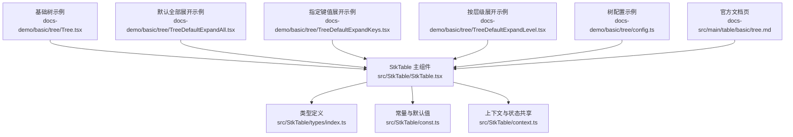
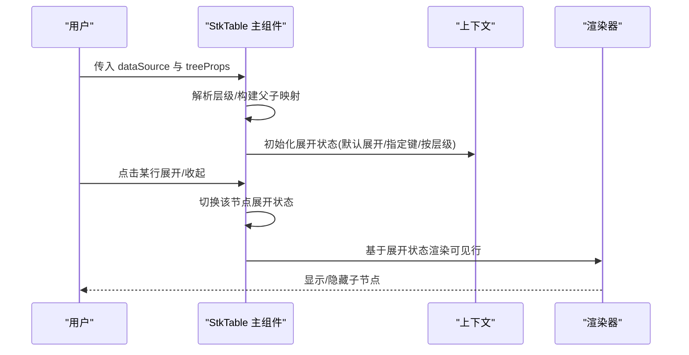
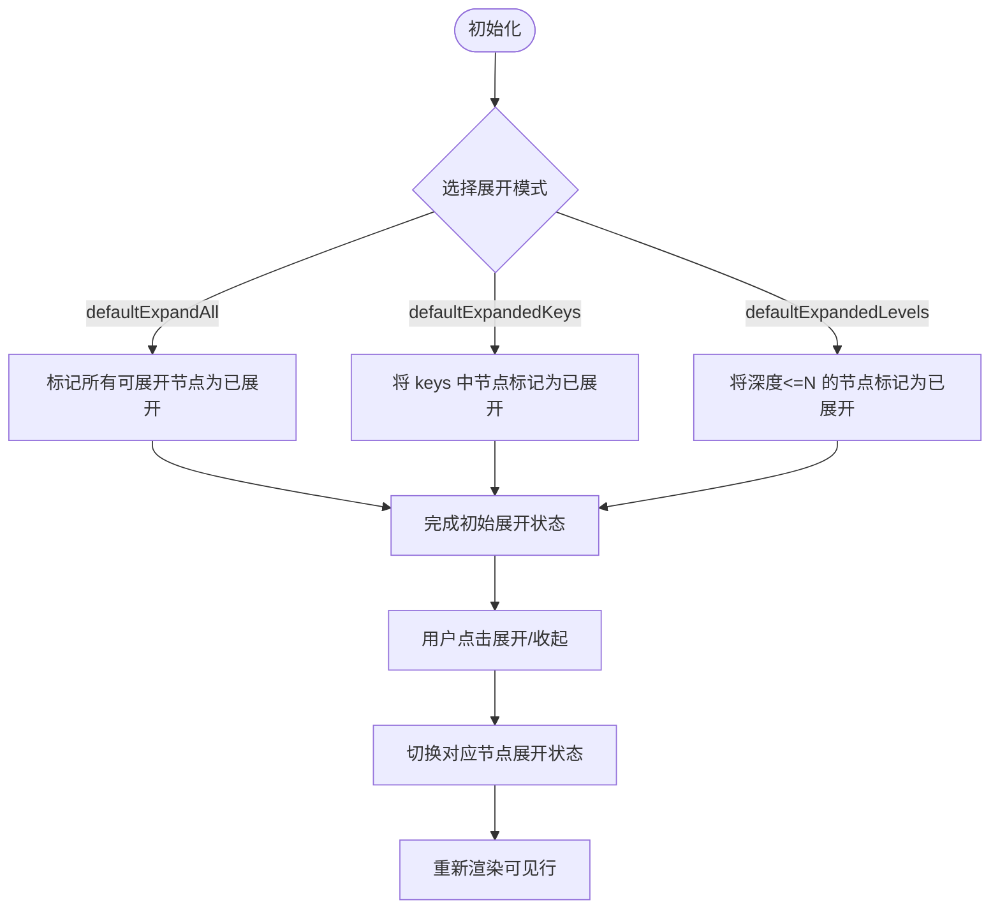
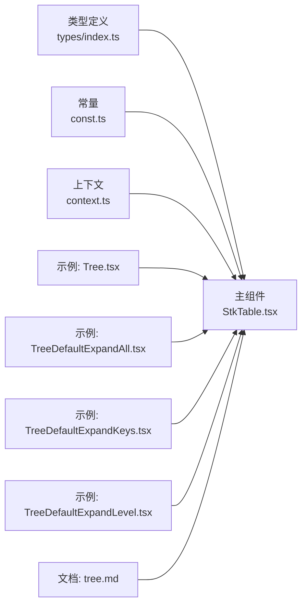

# 树形结构

<cite>
**本文引用的文件**   
- [src/StkTable/StkTable.tsx](file://src/StkTable/StkTable.tsx)
- [src/StkTable/types/index.ts](file://src/StkTable/types/index.ts)
- [src/StkTable/const.ts](file://src/StkTable/const.ts)
- [src/StkTable/context.ts](file://src/StkTable/context.ts)
- [docs-demo/basic/tree/Tree.tsx](file://docs-demo/basic/tree/Tree.tsx)
- [docs-demo/basic/tree/TreeDefaultExpandAll.tsx](file://docs-demo/basic/tree/TreeDefaultExpandAll.tsx)
- [docs-demo/basic/tree/TreeDefaultExpandKeys.tsx](file://docs-demo/basic/tree/TreeDefaultExpandKeys.tsx)
- [docs-demo/basic/tree/TreeDefaultExpandLevel.tsx](file://docs-demo/basic/tree/TreeDefaultExpandLevel.tsx)
- [docs-demo/basic/tree/config.ts](file://docs-demo/basic/tree/config.ts)
- [docs-src/main/table/basic/tree.md](file://docs-src/main/table/basic/tree.md)
</cite>

## 目录
1. [简介](#简介)
2. [项目结构](#项目结构)
3. [核心组件](#核心组件)
4. [架构总览](#架构总览)
5. [详细组件分析](#详细组件分析)
6. [依赖分析](#依赖分析)
7. [性能考虑](#性能考虑)
8. [故障排查指南](#故障排查指南)
9. [结论](#结论)
10. [附录](#附录)

## 简介
本章节面向需要在表格中展示层级数据的开发者，系统性说明树形结构的定义方式、父子关系配置、展开收起逻辑与多种展开模式（默认全部展开、指定键值展开、按层级展开），并给出性能优化策略与复杂业务场景的解决方案。文档同时提供最佳实践指导与示例路径，帮助快速落地。

## 项目结构
仓库中与“树形结构”相关的主要位置如下：
- 核心实现位于 src/StkTable 下，包含主组件、类型定义、常量与上下文等。
- 演示与文档位于 docs-demo/basic/tree 与 docs-src/main/table/basic/tree.md。

图表来源
- [src/StkTable/StkTable.tsx](file://src/StkTable/StkTable.tsx)
- [src/StkTable/types/index.ts](file://src/StkTable/types/index.ts)
- [src/StkTable/const.ts](file://src/StkTable/const.ts)
- [src/StkTable/context.ts](file://src/StkTable/context.ts)
- [docs-demo/basic/tree/Tree.tsx](file://docs-demo/basic/tree/Tree.tsx)
- [docs-demo/basic/tree/TreeDefaultExpandAll.tsx](file://docs-demo/basic/tree/TreeDefaultExpandAll.tsx)
- [docs-demo/basic/tree/TreeDefaultExpandKeys.tsx](file://docs-demo/basic/tree/TreeDefaultExpandKeys.tsx)
- [docs-demo/basic/tree/TreeDefaultExpandLevel.tsx](file://docs-demo/basic/tree/TreeDefaultExpandLevel.tsx)
- [docs-demo/basic/tree/config.ts](file://docs-demo/basic/tree/config.ts)
- [docs-src/main/table/basic/tree.md](file://docs-src/main/table/basic/tree.md)

章节来源
- [src/StkTable/StkTable.tsx](file://src/StkTable/StkTable.tsx)
- [src/StkTable/types/index.ts](file://src/StkTable/types/index.ts)
- [src/StkTable/const.ts](file://src/StkTable/const.ts)
- [src/StkTable/context.ts](file://src/StkTable/context.ts)
- [docs-demo/basic/tree/Tree.tsx](file://docs-demo/basic/tree/Tree.tsx)
- [docs-demo/basic/tree/TreeDefaultExpandAll.tsx](file://docs-demo/basic/tree/TreeDefaultExpandAll.tsx)
- [docs-demo/basic/tree/TreeDefaultExpandKeys.tsx](file://docs-demo/basic/tree/TreeDefaultExpandKeys.tsx)
- [docs-demo/basic/tree/TreeDefaultExpandLevel.tsx](file://docs-demo/basic/tree/TreeDefaultExpandLevel.tsx)
- [docs-demo/basic/tree/config.ts](file://docs-demo/basic/tree/config.ts)
- [docs-src/main/table/basic/tree.md](file://docs-src/main/table/basic/tree.md)

## 核心组件
- StkTable 主组件负责渲染表格行、处理交互事件，并在启用树形模式时管理节点的展开/收起状态以及层级计算。
- 类型定义集中描述了树节点字段约定、展开控制参数、回调签名等。
- 常量模块提供默认行为与开关项。
- 上下文用于在组件树内共享表格实例、列配置、展开状态等。

章节来源
- [src/StkTable/StkTable.tsx](file://src/StkTable/StkTable.tsx)
- [src/StkTable/types/index.ts](file://src/StkTable/types/index.ts)
- [src/StkTable/const.ts](file://src/StkTable/const.ts)
- [src/StkTable/context.ts](file://src/StkTable/context.ts)

## 架构总览
下图展示了树形功能在主组件中的关键流程：数据进入后，根据树配置进行层级解析与展开状态初始化；用户点击展开按钮或触发键盘操作时，更新内部展开集合；渲染阶段依据展开状态决定是否渲染子节点。

图表来源
- [src/StkTable/StkTable.tsx](file://src/StkTable/StkTable.tsx)
- [src/StkTable/context.ts](file://src/StkTable/context.ts)

## 详细组件分析

### 层级数据定义与父子关系配置
- 数据模型约定
  - 每个节点需具备唯一标识键（如 id）。
  - 通过 children 字段表示子节点，形成树形结构。
  - 若后端返回扁平列表，可通过 keyField 与 parentKeyField 指定父子关联规则。
- 配置要点
  - keyField：节点唯一键名。
  - parentKeyField：父节点键名字段名。
  - childrenField：子节点数组字段名。
  - expandable：是否开启可展开能力。
  - defaultExpandAll/defaultExpandedKeys/defaultExpandedLevels：控制初始展开模式。
- 使用建议
  - 优先使用扁平数据配合 parentKeyField，便于服务端分页与增量更新。
  - 确保 keyField 全局唯一且稳定，避免重复导致状态错乱。

章节来源
- [src/StkTable/types/index.ts](file://src/StkTable/types/index.ts)
- [docs-demo/basic/tree/config.ts](file://docs-demo/basic/tree/config.ts)
- [docs-src/main/table/basic/tree.md](file://docs-src/main/table/basic/tree.md)

### 展开/收起逻辑与展开模式
- 默认全部展开
  - 设置 defaultExpandAll 为 true，所有有子节点的节点初始展开。
  - 适用场景：小中型数据集，希望一次性呈现全貌。
- 指定键值展开
  - 设置 defaultExpandedKeys 为键值数组，仅这些节点初始展开。
  - 适用场景：需要聚焦特定分支，减少首屏渲染量。
- 按层级展开
  - 设置 defaultExpandedLevels 为数字，展开到指定深度。
  - 适用场景：引导式浏览，逐步深入。
- 交互控制
  - 支持通过受控或非受控方式维护展开集合，结合 onExpand 回调同步外部状态。
  - 支持键盘导航与无障碍访问（如空格/回车切换展开）。

图表来源
- [src/StkTable/StkTable.tsx](file://src/StkTable/StkTable.tsx)
- [docs-demo/basic/tree/TreeDefaultExpandAll.tsx](file://docs-demo/basic/tree/TreeDefaultExpandAll.tsx)
- [docs-demo/basic/tree/TreeDefaultExpandKeys.tsx](file://docs-demo/basic/tree/TreeDefaultExpandKeys.tsx)
- [docs-demo/basic/tree/TreeDefaultExpandLevel.tsx](file://docs-demo/basic/tree/TreeDefaultExpandLevel.tsx)

章节来源
- [docs-demo/basic/tree/TreeDefaultExpandAll.tsx](file://docs-demo/basic/tree/TreeDefaultExpandAll.tsx)
- [docs-demo/basic/tree/TreeDefaultExpandKeys.tsx](file://docs-demo/basic/tree/TreeDefaultExpandKeys.tsx)
- [docs-demo/basic/tree/TreeDefaultExpandLevel.tsx](file://docs-demo/basic/tree/TreeDefaultExpandLevel.tsx)
- [docs-src/main/table/basic/tree.md](file://docs-src/main/table/basic/tree.md)

### 示例与最佳实践
- 基础树
  - 参考路径：[docs-demo/basic/tree/Tree.tsx](file://docs-demo/basic/tree/Tree.tsx)
- 默认全部展开
  - 参考路径：[docs-demo/basic/tree/TreeDefaultExpandAll.tsx](file://docs-demo/basic/tree/TreeDefaultExpandAll.tsx)
- 指定键值展开
  - 参考路径：[docs-demo/basic/tree/TreeDefaultExpandKeys.tsx](file://docs-demo/basic/tree/TreeDefaultExpandKeys.tsx)
- 按层级展开
  - 参考路径：[docs-demo/basic/tree/TreeDefaultExpandLevel.tsx](file://docs-demo/basic/tree/TreeDefaultExpandLevel.tsx)
- 配置示例
  - 参考路径：[docs-demo/basic/tree/config.ts](file://docs-demo/basic/tree/config.ts)

章节来源
- [docs-demo/basic/tree/Tree.tsx](file://docs-demo/basic/tree/Tree.tsx)
- [docs-demo/basic/tree/TreeDefaultExpandAll.tsx](file://docs-demo/basic/tree/TreeDefaultExpandAll.tsx)
- [docs-demo/basic/tree/TreeDefaultExpandKeys.tsx](file://docs-demo/basic/tree/TreeDefaultExpandKeys.tsx)
- [docs-demo/basic/tree/TreeDefaultExpandLevel.tsx](file://docs-demo/basic/tree/TreeDefaultExpandLevel.tsx)
- [docs-demo/basic/tree/config.ts](file://docs-demo/basic/tree/config.ts)

## 依赖分析
- 组件耦合
  - StkTable 主组件依赖类型定义与上下文，以统一树节点结构与状态共享。
  - 常量模块提供默认展开行为与开关项，降低配置复杂度。
- 外部依赖
  - 示例与文档页面通过 props 向主组件注入树形配置与数据源。
- 潜在循环依赖
  - 当前结构清晰分层，未见直接循环引用风险。

图表来源
- [src/StkTable/StkTable.tsx](file://src/StkTable/StkTable.tsx)
- [src/StkTable/types/index.ts](file://src/StkTable/types/index.ts)
- [src/StkTable/const.ts](file://src/StkTable/const.ts)
- [src/StkTable/context.ts](file://src/StkTable/context.ts)
- [docs-demo/basic/tree/Tree.tsx](file://docs-demo/basic/tree/Tree.tsx)
- [docs-demo/basic/tree/TreeDefaultExpandAll.tsx](file://docs-demo/basic/tree/TreeDefaultExpandAll.tsx)
- [docs-demo/basic/tree/TreeDefaultExpandKeys.tsx](file://docs-demo/basic/tree/TreeDefaultExpandKeys.tsx)
- [docs-demo/basic/tree/TreeDefaultExpandLevel.tsx](file://docs-demo/basic/tree/TreeDefaultExpandLevel.tsx)
- [docs-src/main/table/basic/tree.md](file://docs-src/main/table/basic/tree.md)

章节来源
- [src/StkTable/StkTable.tsx](file://src/StkTable/StkTable.tsx)
- [src/StkTable/types/index.ts](file://src/StkTable/types/index.ts)
- [src/StkTable/const.ts](file://src/StkTable/const.ts)
- [src/StkTable/context.ts](file://src/StkTable/context.ts)

## 性能考虑
- 懒加载
  - 对深层级或大数据集，建议在用户展开时按需请求子节点数据，避免首屏压力。
  - 可在 onExpand 回调中触发异步加载，并将结果合并回 dataSource。
- 增量更新
  - 使用扁平数据 + parentKeyField 的方式，便于精准定位与局部更新。
  - 新增/删除/移动节点时，尽量只变更受影响分支，保持 key 稳定。
- 缓存机制
  - 对已加载的子节点进行内存缓存，避免重复请求。
  - 结合虚拟滚动（如 Y 轴虚拟化）进一步降低渲染开销。
- 渲染优化
  - 合理设置 defaultExpandedLevels 控制首屏行数。
  - 避免在每行渲染中进行昂贵计算，必要时使用 memo 化单元格。
- 搜索与过滤
  - 搜索命中时，自动展开祖先链以确保目标节点可见。
  - 过滤结果集时，注意保留父子关系完整性，避免断链。

[本节为通用性能建议，不直接分析具体文件]

## 故障排查指南
- 节点无法展开
  - 检查 keyField 是否唯一且稳定。
  - 确认 children 字段存在且非空。
  - 验证 expandable 是否开启。
- 展开状态异常
  - 若使用受控模式，确保外部 state 与内部状态一致。
  - 检查 defaultExpandedKeys 中的键是否存在于数据中。
- 性能问题
  - 首屏行数过多：调整 defaultExpandedLevels 或默认收起。
  - 频繁重渲染：避免在每次渲染时创建新的对象/函数作为 props。
- 搜索/过滤后找不到节点
  - 确认搜索逻辑会向上展开必要祖先节点。
  - 过滤条件未破坏父子关系导致节点被误删。

章节来源
- [src/StkTable/types/index.ts](file://src/StkTable/types/index.ts)
- [docs-src/main/table/basic/tree.md](file://docs-src/main/table/basic/tree.md)

## 结论
树形结构在表格中的应用广泛，关键在于清晰的层级数据定义、合理的展开模式与良好的性能策略。通过懒加载、增量更新与缓存等手段，可以在保证用户体验的同时支撑大规模数据。结合搜索、过滤、拖拽排序等高级能力，可以构建出强大的业务型表格。

[本节为总结性内容，不直接分析具体文件]

## 附录
- 示例入口
  - 基础树：[docs-demo/basic/tree/Tree.tsx](file://docs-demo/basic/tree/Tree.tsx)
  - 默认全部展开：[docs-demo/basic/tree/TreeDefaultExpandAll.tsx](file://docs-demo/basic/tree/TreeDefaultExpandAll.tsx)
  - 指定键值展开：[docs-demo/basic/tree/TreeDefaultExpandKeys.tsx](file://docs-demo/basic/tree/TreeDefaultExpandKeys.tsx)
  - 按层级展开：[docs-demo/basic/tree/TreeDefaultExpandLevel.tsx](file://docs-demo/basic/tree/TreeDefaultExpandLevel.tsx)
  - 配置示例：[docs-demo/basic/tree/config.ts](file://docs-demo/basic/tree/config.ts)
- 官方文档
  - 树形结构文档页：[docs-src/main/table/basic/tree.md](file://docs-src/main/table/basic/tree.md)