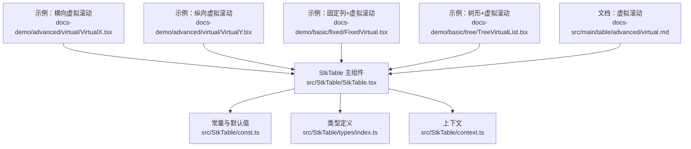
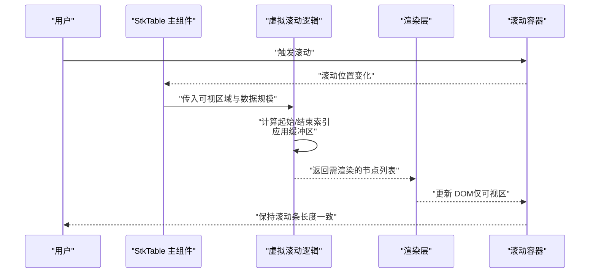
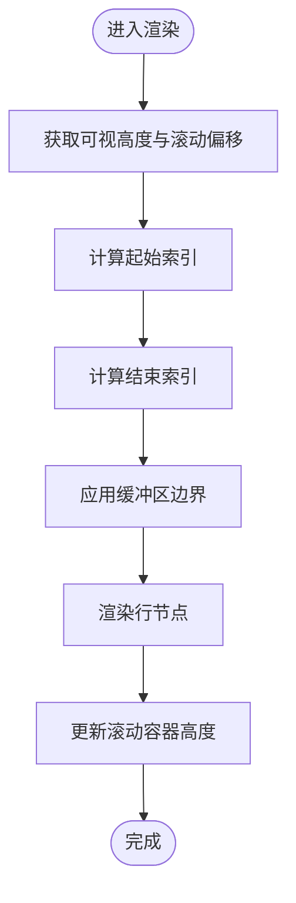
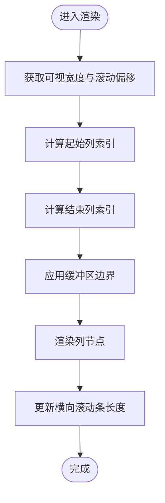
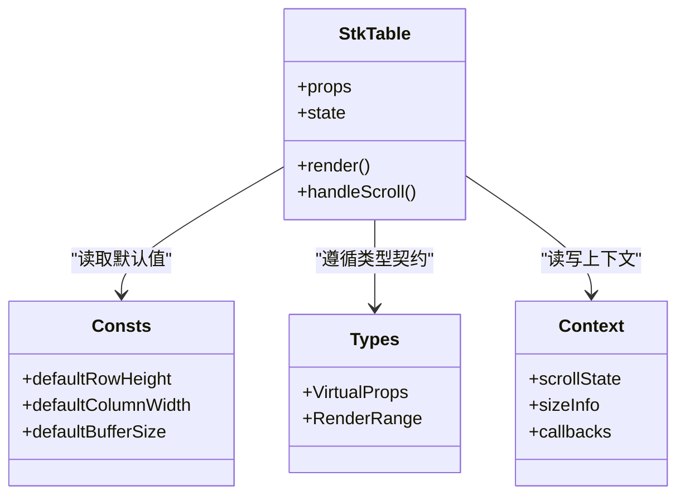

# 虚拟滚动

<cite>
**本文引用的文件**   
- [src/StkTable/StkTable.tsx](file://src/StkTable/StkTable.tsx)
- [src/StkTable/const.ts](file://src/StkTable/const.ts)
- [src/StkTable/context.ts](file://src/StkTable/context.ts)
- [src/StkTable/types/index.ts](file://src/StkTable/types/index.ts)
- [docs-demo/advanced/virtual/VirtualX.tsx](file://docs-demo/advanced/virtual/VirtualX.tsx)
- [docs-demo/advanced/virtual/VirtualY.tsx](file://docs-demo/advanced/virtual/VirtualY.tsx)
- [docs-demo/basic/fixed/FixedVirtual.tsx](file://docs-demo/basic/fixed/FixedVirtual.tsx)
- [docs-demo/basic/tree/TreeVirtualList.tsx](file://docs-demo/basic/tree/TreeVirtualList.tsx)
- [docs-src/main/table/advanced/virtual.md](file://docs-src/main/table/advanced/virtual.md)
</cite>

## 目录
1. [简介](#简介)
2. [项目结构](#项目结构)
3. [核心组件](#核心组件)
4. [架构总览](#架构总览)
5. [详细组件分析](#详细组件分析)
6. [依赖关系分析](#依赖关系分析)
7. [性能考虑](#性能考虑)
8. [故障排查指南](#故障排查指南)
9. [结论](#结论)
10. [附录](#附录)

## 简介
本文件围绕“虚拟滚动”能力，系统阐述横向与纵向虚拟滚动的实现原理、关键配置项（如 rowHeight、columnWidth、bufferSize）的作用与最佳实践，并结合仓库中的示例与文档说明，给出大数据量场景下的性能优化策略、常见问题排查与调优建议。内容兼顾初学者与进阶读者，力求以清晰的图示与分层的讲解帮助快速掌握并正确落地。

## 项目结构
与虚拟滚动直接相关的代码与示例分布如下：
- 核心实现入口与上下文：StkTable 主组件、常量、类型定义与上下文
- 演示用例：横向虚拟滚动、纵向虚拟滚动、固定列+虚拟滚动、树形+虚拟滚动
- 官方文档：高级特性之虚拟滚动说明页

图表来源
- [src/StkTable/StkTable.tsx](file://src/StkTable/StkTable.tsx)
- [src/StkTable/const.ts](file://src/StkTable/const.ts)
- [src/StkTable/types/index.ts](file://src/StkTable/types/index.ts)
- [src/StkTable/context.ts](file://src/StkTable/context.ts)
- [docs-demo/advanced/virtual/VirtualX.tsx](file://docs-demo/advanced/virtual/VirtualX.tsx)
- [docs-demo/advanced/virtual/VirtualY.tsx](file://docs-demo/advanced/virtual/VirtualY.tsx)
- [docs-demo/basic/fixed/FixedVirtual.tsx](file://docs-demo/basic/fixed/FixedVirtual.tsx)
- [docs-demo/basic/tree/TreeVirtualList.tsx](file://docs-demo/basic/tree/TreeVirtualList.tsx)
- [docs-src/main/table/advanced/virtual.md](file://docs-src/main/table/advanced/virtual.md)

章节来源
- [src/StkTable/StkTable.tsx](file://src/StkTable/StkTable.tsx)
- [src/StkTable/const.ts](file://src/StkTable/const.ts)
- [src/StkTable/types/index.ts](file://src/StkTable/types/index.ts)
- [src/StkTable/context.ts](file://src/StkTable/context.ts)
- [docs-demo/advanced/virtual/VirtualX.tsx](file://docs-demo/advanced/virtual/VirtualX.tsx)
- [docs-demo/advanced/virtual/VirtualY.tsx](file://docs-demo/advanced/virtual/VirtualY.tsx)
- [docs-demo/basic/fixed/FixedVirtual.tsx](file://docs-demo/basic/fixed/FixedVirtual.tsx)
- [docs-demo/basic/tree/TreeVirtualList.tsx](file://docs-demo/basic/tree/TreeVirtualList.tsx)
- [docs-src/main/table/advanced/virtual.md](file://docs-src/main/table/advanced/virtual.md)

## 核心组件
- StkTable 主组件：负责接收 props（含虚拟滚动相关配置）、维护滚动状态、计算可视区域与渲染窗口、协调固定列/树形等扩展能力。
- 常量与默认值：提供虚拟滚动相关默认参数（如行高、列宽、缓冲大小等）。
- 类型定义：约束虚拟滚动相关接口与数据结构。
- 上下文：在组件树中共享滚动状态、尺寸信息、回调等。

章节来源
- [src/StkTable/StkTable.tsx](file://src/StkTable/StkTable.tsx)
- [src/StkTable/const.ts](file://src/StkTable/const.ts)
- [src/StkTable/types/index.ts](file://src/StkTable/types/index.ts)
- [src/StkTable/context.ts](file://src/StkTable/context.ts)

## 架构总览
虚拟滚动整体流程可抽象为：监听滚动事件 → 计算可视范围 → 确定需要渲染的索引区间 → 复用 DOM 节点进行渲染 → 同步滚动条高度/宽度以保持视觉连续性。

图表来源
- [src/StkTable/StkTable.tsx](file://src/StkTable/StkTable.tsx)
- [src/StkTable/const.ts](file://src/StkTable/const.ts)
- [src/StkTable/context.ts](file://src/StkTable/context.ts)

## 详细组件分析

### 纵向虚拟滚动（行方向）
- 可视区域计算：基于容器高度与当前滚动偏移，结合行高（固定或动态）估算可见行的起止索引。
- DOM 节点复用：仅渲染可视区及前后缓冲区的行，避免一次性创建大量节点。
- 滚动流畅性：通过占位容器维持滚动条真实长度，减少重排重绘。

图表来源
- [src/StkTable/StkTable.tsx](file://src/StkTable/StkTable.tsx)
- [src/StkTable/const.ts](file://src/StkTable/const.ts)

章节来源
- [src/StkTable/StkTable.tsx](file://src/StkTable/StkTable.tsx)
- [src/StkTable/const.ts](file://src/StkTable/const.ts)

### 横向虚拟滚动（列方向）
- 可视区域计算：基于容器宽度与列宽（固定或动态），估算可见列的起止索引。
- 节点复用：仅渲染可视区及缓冲列，配合绝对定位或偏移实现横向滑动。
- 性能要点：列宽变更时及时刷新布局缓存，避免频繁测量。

图表来源
- [src/StkTable/StkTable.tsx](file://src/StkTable/StkTable.tsx)
- [src/StkTable/const.ts](file://src/StkTable/const.ts)

章节来源
- [src/StkTable/StkTable.tsx](file://src/StkTable/StkTable.tsx)
- [src/StkTable/const.ts](file://src/StkTable/const.ts)

### 配置项详解与最佳实践
- rowHeight
  - 作用：指定每行的高度。若为固定值，可显著提升计算效率；若为函数，则需在数据稳定后尽快返回准确高度。
  - 最佳实践：优先使用固定行高；若必须动态行高，尽量对行高做缓存，避免重复计算。
- columnWidth
  - 作用：指定每列的宽度。支持固定值或按列配置。
  - 最佳实践：固定列宽更利于性能；列宽可变时需关注布局缓存失效时机。
- bufferSize
  - 作用：可视区外的缓冲行数/列数，用于提升滚动顺滑度，减少频繁重新渲染。
  - 最佳实践：根据设备性能与交互习惯调整，一般 2~5 较为均衡。
- 其他常见选项（参考文档与类型定义）
  - 是否启用横向/纵向虚拟滚动开关、滚动节流/防抖策略、滚动回调等。

章节来源
- [src/StkTable/types/index.ts](file://src/StkTable/types/index.ts)
- [src/StkTable/const.ts](file://src/StkTable/const.ts)
- [docs-src/main/table/advanced/virtual.md](file://docs-src/main/table/advanced/virtual.md)

### 示例与集成用法
- 基础纵向虚拟滚动
  - 参考：[docs-demo/advanced/virtual/VirtualY.tsx](file://docs-demo/advanced/virtual/VirtualY.tsx)
- 基础横向虚拟滚动
  - 参考：[docs-demo/advanced/virtual/VirtualX.tsx](file://docs-demo/advanced/virtual/VirtualX.tsx)
- 固定列 + 虚拟滚动
  - 参考：[docs-demo/basic/fixed/FixedVirtual.tsx](file://docs-demo/basic/fixed/FixedVirtual.tsx)
- 树形结构 + 虚拟滚动
  - 参考：[docs-demo/basic/tree/TreeVirtualList.tsx](file://docs-demo/basic/tree/TreeVirtualList.tsx)

章节来源
- [docs-demo/advanced/virtual/VirtualY.tsx](file://docs-demo/advanced/virtual/VirtualY.tsx)
- [docs-demo/advanced/virtual/VirtualX.tsx](file://docs-demo/advanced/virtual/VirtualX.tsx)
- [docs-demo/basic/fixed/FixedVirtual.tsx](file://docs-demo/basic/fixed/FixedVirtual.tsx)
- [docs-demo/basic/tree/TreeVirtualList.tsx](file://docs-demo/basic/tree/TreeVirtualList.tsx)

### 与其他功能的集成
- 固定列
  - 固定列不参与虚拟滚动渲染，但需与滚动容器联动，确保横向滚动时固定列与虚拟列对齐。
  - 参考：[docs-demo/basic/fixed/FixedVirtual.tsx](file://docs-demo/basic/fixed/FixedVirtual.tsx)
- 树形结构
  - 树节点展开/折叠会改变数据总量与层级深度，需保证虚拟滚动能感知最新的数据规模与行高。
  - 参考：[docs-demo/basic/tree/TreeVirtualList.tsx](file://docs-demo/basic/tree/TreeVirtualList.tsx)

章节来源
- [docs-demo/basic/fixed/FixedVirtual.tsx](file://docs-demo/basic/fixed/FixedVirtual.tsx)
- [docs-demo/basic/tree/TreeVirtualList.tsx](file://docs-demo/basic/tree/TreeVirtualList.tsx)

## 依赖关系分析
- StkTable 主组件依赖：
  - 常量与默认值：提供虚拟滚动默认行为
  - 类型定义：约束接口契约
  - 上下文：在组件树内传递滚动状态与尺寸信息
- 示例与文档：
  - 示例通过 props 驱动虚拟滚动行为
  - 文档提供使用说明与注意事项

图表来源
- [src/StkTable/StkTable.tsx](file://src/StkTable/StkTable.tsx)
- [src/StkTable/const.ts](file://src/StkTable/const.ts)
- [src/StkTable/types/index.ts](file://src/StkTable/types/index.ts)
- [src/StkTable/context.ts](file://src/StkTable/context.ts)

章节来源
- [src/StkTable/StkTable.tsx](file://src/StkTable/StkTable.tsx)
- [src/StkTable/const.ts](file://src/StkTable/const.ts)
- [src/StkTable/types/index.ts](file://src/StkTable/types/index.ts)
- [src/StkTable/context.ts](file://src/StkTable/context.ts)

## 性能考虑
- 内存管理
  - 控制渲染窗口大小：合理设置 bufferSize，避免过多节点常驻内存。
  - 行高/列宽缓存：对动态尺寸结果做缓存，避免重复测量。
- 渲染优化
  - 固定尺寸优先：固定 rowHeight/columnWidth 可减少布局抖动与重排。
  - 最小化重绘：仅在必要更新时触发渲染，避免频繁 state 更新。
- 滚动流畅性
  - 节流/防抖：对高频滚动事件进行节流或 requestAnimationFrame 合并处理。
  - 占位容器：通过占位高度/宽度维持滚动条长度，避免跳动。
- 大数据量策略
  - 分页/懒加载：结合远端数据分批加载，降低首屏压力。
  - 增量更新：对局部数据变更采用细粒度更新，避免整表重渲染。

[本节为通用指导，不直接分析具体文件]

## 故障排查指南
- 现象：滚动卡顿或掉帧
  - 检查是否开启不必要的动画或复杂样式
  - 确认 bufferSize 是否过大导致节点过多
  - 评估行高/列宽是否为动态且未缓存
- 现象：滚动条长度不正确
  - 检查占位容器高度/宽度是否与总数据规模匹配
  - 确认数据变更后是否触发了尺寸更新
- 现象：固定列错位
  - 核对横向滚动偏移与固定列容器的联动逻辑
  - 检查列宽变更后的布局缓存是否失效
- 现象：树形展开/折叠后滚动异常
  - 确认数据规模变化后是否重新计算可视范围
  - 检查行高缓存是否随展开状态更新

章节来源
- [src/StkTable/StkTable.tsx](file://src/StkTable/StkTable.tsx)
- [docs-src/main/table/advanced/virtual.md](file://docs-src/main/table/advanced/virtual.md)

## 结论
虚拟滚动通过“按需渲染 + 节点复用 + 占位容器”的组合策略，有效解决了大数据量表格的渲染与滚动性能问题。在实际项目中，应优先采用固定尺寸、合理设置缓冲区、做好尺寸缓存与事件节流，并结合固定列、树形等特性进行集成测试与调优，以获得稳定流畅的用户体验。

[本节为总结性内容，不直接分析具体文件]

## 附录
- 示例路径速查
  - 纵向虚拟滚动：[docs-demo/advanced/virtual/VirtualY.tsx](file://docs-demo/advanced/virtual/VirtualY.tsx)
  - 横向虚拟滚动：[docs-demo/advanced/virtual/VirtualX.tsx](file://docs-demo/advanced/virtual/VirtualX.tsx)
  - 固定列+虚拟滚动：[docs-demo/basic/fixed/FixedVirtual.tsx](file://docs-demo/basic/fixed/FixedVirtual.tsx)
  - 树形+虚拟滚动：[docs-demo/basic/tree/TreeVirtualList.tsx](file://docs-demo/basic/tree/TreeVirtualList.tsx)
- 文档参考
  - 虚拟滚动说明：[docs-src/main/table/advanced/virtual.md](file://docs-src/main/table/advanced/virtual.md)