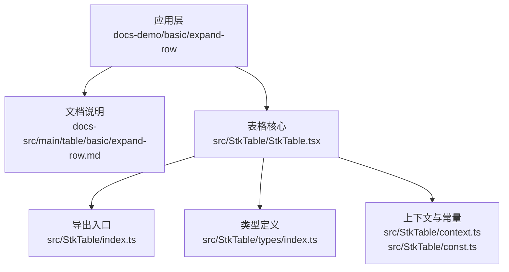
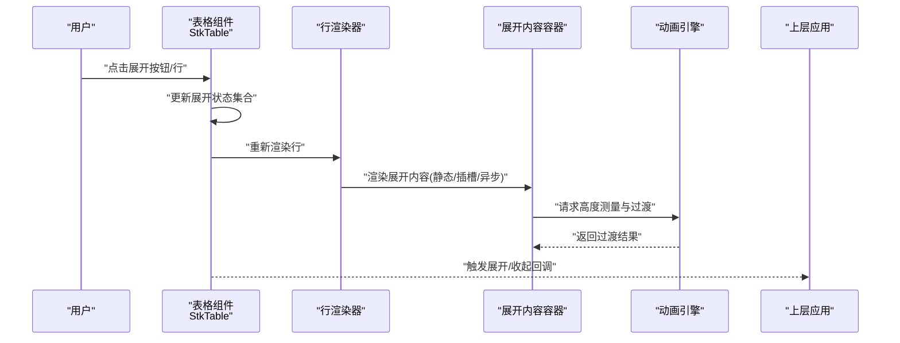
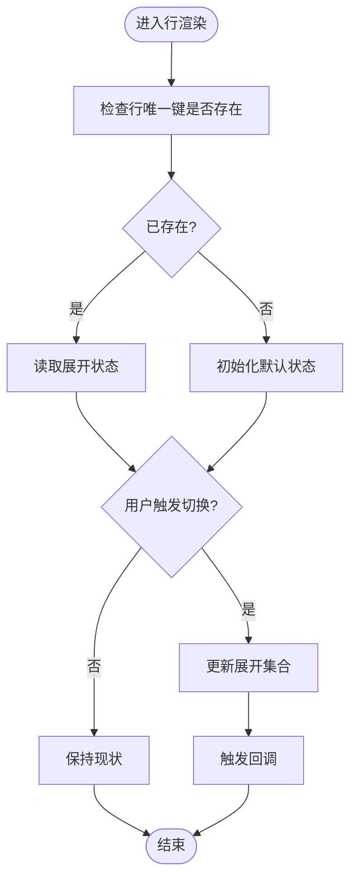
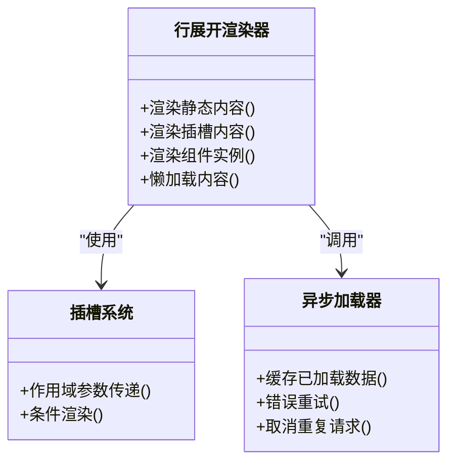
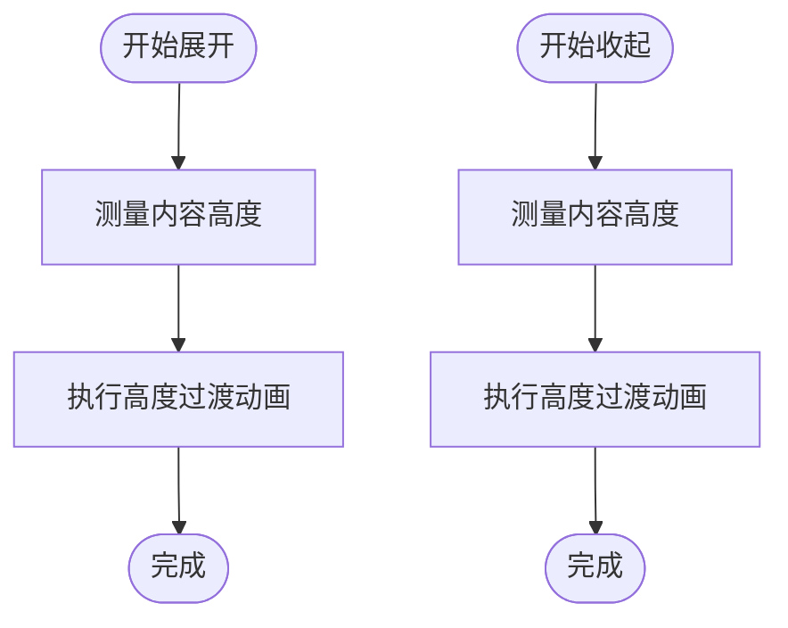
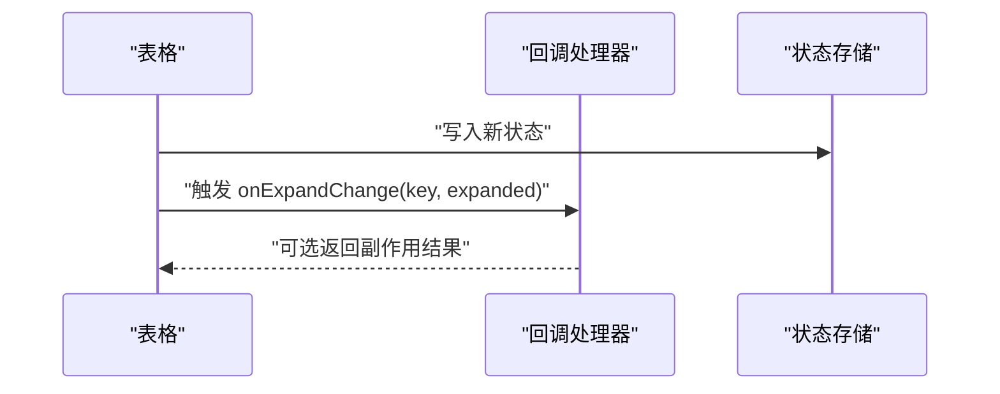
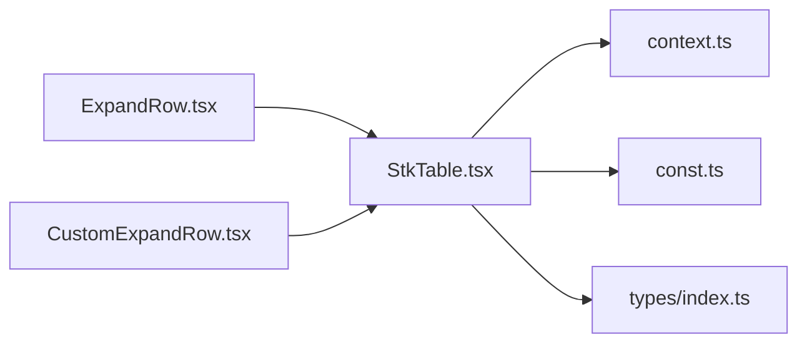

# 行展开

<cite>
**本文引用的文件**   
- [ExpandRow.tsx](file://docs-demo/basic/expand-row/ExpandRow.tsx)
- [CustomExpandRow.tsx](file://docs-demo/basic/expand-row/CustomExpandRow.tsx)
- [expand-row.md](file://docs-src/main/table/basic/expand-row.md)
- [StkTable.tsx](file://src/StkTable/StkTable.tsx)
- [index.ts](file://src/StkTable/index.ts)
- [const.ts](file://src/StkTable/const.ts)
- [context.ts](file://src/StkTable/context.ts)
- [types/index.ts](file://src/StkTable/types/index.ts)
</cite>

## 目录
1. [简介](#简介)
2. [项目结构](#项目结构)
3. [核心组件与能力](#核心组件与能力)
4. [架构总览](#架构总览)
5. [详细实现分析](#详细实现分析)
6. [依赖关系分析](#依赖关系分析)
7. [性能优化策略](#性能优化策略)
8. [故障排查指南](#故障排查指南)
9. [结论](#结论)
10. [附录：示例与最佳实践](#附录示例与最佳实践)

## 简介
本章节聚焦“行展开”能力的完整说明，涵盖展开状态管理、内容渲染机制、动画效果、自定义扩展方式（插槽、组件集成、动态加载）、大数据量场景下的性能优化方案，以及常见复杂业务场景的落地建议。文档同时提供代码级图示与参考路径，帮助读者快速理解并高效使用。

## 项目结构
围绕“行展开”，仓库包含演示与文档两类资源：
- 演示代码位于 docs-demo/basic/expand-row，提供基础用法与自定义展开内容的示例。
- 文档说明位于 docs-src/main/table/basic/expand-row.md，覆盖 API 与使用要点。
- 核心库源码位于 src/StkTable，包括主组件、类型定义、上下文与常量等。

图表来源
- [ExpandRow.tsx](file://docs-demo/basic/expand-row/ExpandRow.tsx)
- [CustomExpandRow.tsx](file://docs-demo/basic/expand-row/CustomExpandRow.tsx)
- [expand-row.md](file://docs-src/main/table/basic/expand-row.md)
- [StkTable.tsx](file://src/StkTable/StkTable.tsx)
- [index.ts](file://src/StkTable/index.ts)
- [types/index.ts](file://src/StkTable/types/index.ts)
- [context.ts](file://src/StkTable/context.ts)
- [const.ts](file://src/StkTable/const.ts)

章节来源
- [ExpandRow.tsx](file://docs-demo/basic/expand-row/ExpandRow.tsx)
- [CustomExpandRow.tsx](file://docs-demo/basic/expand-row/CustomExpandRow.tsx)
- [expand-row.md](file://docs-src/main/table/basic/expand-row.md)
- [StkTable.tsx](file://src/StkTable/StkTable.tsx)
- [index.ts](file://src/StkTable/index.ts)
- [types/index.ts](file://src/StkTable/types/index.ts)
- [context.ts](file://src/StkTable/context.ts)
- [const.ts](file://src/StkTable/const.ts)

## 核心组件与能力
- 行展开开关：通过列配置启用展开按钮或点击整行触发展开。
- 展开内容渲染：支持静态 JSX、插槽、异步组件与动态数据加载。
- 展开状态管理：维护每行的展开/收起状态，支持受控与非受控模式。
- 动画过渡：展开/收起过程具备平滑高度过渡，避免布局抖动。
- 事件回调：提供展开/收起生命周期钩子，便于统计与副作用处理。
- 可访问性与交互：键盘导航、焦点管理与语义化标记。

章节来源
- [expand-row.md](file://docs-src/main/table/basic/expand-row.md)
- [StkTable.tsx](file://src/StkTable/StkTable.tsx)

## 架构总览
行展开在表格中作为“行内子视图”存在，其关键流程如下：
- 用户操作（点击展开按钮或行）触发状态变更。
- 表格根据当前行 key 与展开集合计算是否显示展开区域。
- 渲染器按需渲染展开内容（静态/插槽/异步）。
- 动画引擎驱动高度变化，完成过渡。
- 事件回调通知上层应用进行后续处理。

图表来源
- [StkTable.tsx](file://src/StkTable/StkTable.tsx)
- [expand-row.md](file://docs-src/main/table/basic/expand-row.md)

## 详细实现分析

### 展开状态管理
- 状态模型：以行唯一标识为键，布尔值表示展开与否；支持批量控制与默认展开配置。
- 受控模式：由外部 props 控制展开集合，适合需要持久化或跨组件共享的场景。
- 非受控模式：内部维护展开集合，适合简单场景。
- 变更策略：最小化重渲染，仅对受影响行进行局部更新。

图表来源
- [StkTable.tsx](file://src/StkTable/StkTable.tsx)
- [types/index.ts](file://src/StkTable/types/index.ts)

章节来源
- [StkTable.tsx](file://src/StkTable/StkTable.tsx)
- [types/index.ts](file://src/StkTable/types/index.ts)

### 内容渲染机制
- 静态内容：直接渲染传入的 JSX。
- 插槽扩展：通过插槽注入自定义 UI，支持接收行数据与作用域参数。
- 组件集成：将复杂逻辑封装为独立组件，按需挂载到展开区域。
- 动态加载：在首次展开时发起数据请求，结合占位与骨架屏提升体验。

图表来源
- [StkTable.tsx](file://src/StkTable/StkTable.tsx)
- [CustomExpandRow.tsx](file://docs-demo/basic/expand-row/CustomExpandRow.tsx)

章节来源
- [CustomExpandRow.tsx](file://docs-demo/basic/expand-row/CustomExpandRow.tsx)
- [StkTable.tsx](file://src/StkTable/StkTable.tsx)

### 动画效果
- 高度测量：在内容挂载后测量实际高度，用于过渡计算。
- 过渡曲线：采用 ease-in-out 等自然曲线，保证视觉连贯。
- 防抖与节流：在频繁切换时合并动画帧，减少抖动。
- 无障碍：确保屏幕阅读器能感知展开/收起状态变化。

图表来源
- [StkTable.tsx](file://src/StkTable/StkTable.tsx)

章节来源
- [StkTable.tsx](file://src/StkTable/StkTable.tsx)

### 事件与回调
- 展开/收起回调：在状态变更后触发，携带行键与新状态。
- 错误回调：当异步加载失败时上报，便于统一处理。
- 统计埋点：在回调中记录用户行为指标。

图表来源
- [StkTable.tsx](file://src/StkTable/StkTable.tsx)

章节来源
- [StkTable.tsx](file://src/StkTable/StkTable.tsx)

## 依赖关系分析
- 组件耦合：行展开逻辑集中在表格主组件，通过上下文与类型定义解耦。
- 外部依赖：动画与测量通常依赖浏览器 API 与 React 生命周期。
- 循环依赖：应避免在展开内容与表格之间形成强引用，必要时通过回调或上下文通信。

图表来源
- [StkTable.tsx](file://src/StkTable/StkTable.tsx)
- [context.ts](file://src/StkTable/context.ts)
- [const.ts](file://src/StkTable/const.ts)
- [types/index.ts](file://src/StkTable/types/index.ts)
- [ExpandRow.tsx](file://docs-demo/basic/expand-row/ExpandRow.tsx)
- [CustomExpandRow.tsx](file://docs-demo/basic/expand-row/CustomExpandRow.tsx)

章节来源
- [StkTable.tsx](file://src/StkTable/StkTable.tsx)
- [context.ts](file://src/StkTable/context.ts)
- [const.ts](file://src/StkTable/const.ts)
- [types/index.ts](file://src/StkTable/types/index.ts)
- [ExpandRow.tsx](file://docs-demo/basic/expand-row/ExpandRow.tsx)
- [CustomExpandRow.tsx](file://docs-demo/basic/expand-row/CustomExpandRow.tsx)

## 性能优化策略
- 懒加载：仅在首次展开时加载详情数据，避免首屏压力。
- 缓存机制：对已加载的行展开内容进行内存缓存，复用 DOM 片段与数据。
- 虚拟滚动配合：在大列表下结合虚拟滚动，减少渲染节点数量。
- 增量更新：仅对发生变化的行进行局部重渲染，降低整体开销。
- 内存管理：及时释放不再可见的展开内容，防止内存泄漏。
- 请求去重与取消：并发展开时合并相同请求，并在组件卸载时取消未完成的网络请求。

[本节为通用指导，不直接分析具体文件]

## 故障排查指南
- 展开后高度异常：检查内容测量时机与 CSS 样式冲突，确保在内容完全挂载后再测量。
- 动画卡顿：确认是否在高频操作中触发了大量重排，考虑合并动画帧与节流。
- 状态不同步：核对受控与非受控模式的 props 一致性，避免混用导致状态漂移。
- 内存占用过高：评估展开内容体积与缓存策略，必要时限制最大缓存行数。
- 异步加载失败：完善错误边界与重试策略，提供用户可感知的反馈。

章节来源
- [StkTable.tsx](file://src/StkTable/StkTable.tsx)

## 结论
行展开功能通过清晰的状态管理、灵活的渲染机制与稳定的动画过渡，提供了良好的用户体验与可扩展性。结合懒加载、缓存与虚拟滚动等策略，可在大数据量场景下保持流畅。建议在复杂业务中优先采用受控模式与组件化拆分，确保可维护性与可测试性。

[本节为总结，不直接分析具体文件]

## 附录：示例与最佳实践
- 基础展开：参考基础示例，了解如何启用展开按钮与默认展开配置。
- 自定义展开内容：参考自定义示例，学习插槽与组件集成的方式。
- 动态加载：在首次展开时发起请求，展示骨架屏与错误提示。
- 交互设计建议：
  - 明确指示：使用箭头图标与文本提示，告知用户可展开。
  - 渐进披露：先展示摘要，再在展开区域呈现详细信息。
  - 可访问性：确保键盘可达与屏幕阅读器可读。
  - 一致性：统一的动画时长与曲线，避免突兀切换。

章节来源
- [ExpandRow.tsx](file://docs-demo/basic/expand-row/ExpandRow.tsx)
- [CustomExpandRow.tsx](file://docs-demo/basic/expand-row/CustomExpandRow.tsx)
- [expand-row.md](file://docs-src/main/table/basic/expand-row.md)