# 高级特性

<cite>
**本文引用的文件**   
- [StkTable.tsx](file://src/StkTable/StkTable.tsx)
- [index.ts](file://src/StkTable/index.ts)
- [const.ts](file://src/StkTable/const.ts)
- [context.ts](file://src/StkTable/context.ts)
- [useTableColumns.ts](file://src/StkTable/hooks/useTableColumns.ts)
- [index.tsx](file://src/StkTable/components/index.tsx)
- [VirtualY.tsx](file://docs-demo/advanced/virtual/VirtualY.tsx)
- [VirtualX.tsx](file://docs-demo/advanced/virtual/VirtualX.tsx)
- [Tree.tsx](file://docs-demo/basic/tree/Tree.tsx)
- [TreeVirtualList.tsx](file://docs-demo/basic/tree/TreeVirtualList.tsx)
- [Fixed.tsx](file://docs-demo/basic/fixed/Fixed.tsx)
- [FixedVirtual.tsx](file://docs-demo/basic/fixed/FixedVirtual.tsx)
- [MultiHeader.tsx](file://docs-demo/basic/multi-header/MultiHeader.tsx)
- [MergeCellsRow.tsx](file://docs-demo/basic/merge-cells/MergeCellsRow.tsx)
- [ExpandRow.tsx](file://docs-demo/basic/expand-row/ExpandRow.tsx)
- [AutoHeightVirtual/index.tsx](file://docs-demo/advanced/auto-height-virtual/AutoHeightVirtual/index.tsx)
- [PretextAutoHeight/index.tsx](file://docs-demo/advanced/auto-height-virtual/PretextAutoHeight/index.tsx)
- [HugeData/index.tsx](file://docs-demo/demos/HugeData/index.tsx)
- [Matrix/index.tsx](file://docs-demo/demos/Matrix/index.tsx)
- [PanelTree/index.tsx](file://docs-demo/demos/PanelTree/index.tsx)
- [table-props.md](file://docs-src/main/api/table-props.md)
- [virtual.md](file://docs-src/main/table/advanced/virtual.md)
- [tree.md](file://docs-src/main/table/basic/tree.md)
- [fixed.md](file://docs-src/main/table/basic/fixed.md)
- [multi-header.md](file://docs-src/main/table/basic/multi-header.md)
- [merge-cells.md](file://docs-src/main/table/basic/merge-cells.md)
- [expand-row.md](file://docs-src/main/table/basic/expand-row.md)
</cite>

## 目录
1. [简介](#简介)
2. [项目结构](#项目结构)
3. [核心组件](#核心组件)
4. [架构总览](#架构总览)
5. [详细组件分析](#详细组件分析)
6. [依赖关系分析](#依赖关系分析)
7. [性能考量](#性能考量)
8. [故障排查指南](#故障排查指南)
9. [结论](#结论)
10. [附录](#附录)

## 简介
本章节聚焦 StkTable 的高级特性，包括虚拟滚动（横向与纵向）、树形数据结构、固定列、合并单元格、多级表头、行展开等。文档将系统阐述各项特性的实现原理、配置方法、性能考虑与内存管理策略，并通过复杂业务场景的完整解决方案，帮助开发者构建高性能、功能丰富的企业级表格应用。

## 项目结构
仓库采用“源码 + 演示 + 文档”的分层组织方式：
- src/StkTable：核心库源码，包含主组件、上下文、常量、类型、钩子与内置自定义单元格等。
- docs-demo：面向文档与示例的前端演示代码，覆盖基础能力与高级特性。
- docs-src：VitePress 文档源，提供 API 说明与使用指南。
- lib：打包产物与类型声明。

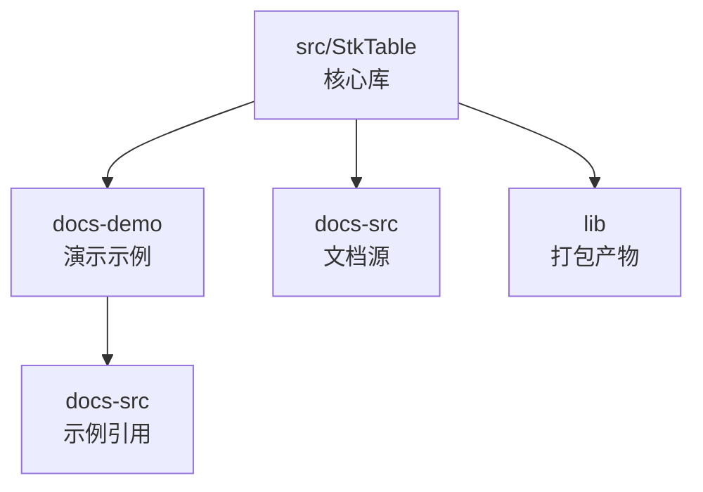

图表来源
- [StkTable.tsx](file://src/StkTable/StkTable.tsx)
- [index.ts](file://src/StkTable/index.ts)
- [VirtualY.tsx](file://docs-demo/advanced/virtual/VirtualY.tsx)
- [VirtualX.tsx](file://docs-demo/advanced/virtual/VirtualX.tsx)

章节来源
- [StkTable.tsx](file://src/StkTable/StkTable.tsx)
- [index.ts](file://src/StkTable/index.ts)

## 核心组件
- 主组件入口：导出并封装表格核心逻辑，统一处理列解析、数据流、事件分发与渲染管线。
- 上下文与常量：提供全局状态、主题、尺寸、滚动与虚拟化相关常量，降低耦合。
- 钩子 useTableColumns：负责列定义规范化、层级计算、可见性过滤与排序/筛选后的列映射。
- 组件聚合 index.tsx：组合内部子模块（如头部、主体、底部、滚动容器等）。

章节来源
- [StkTable.tsx](file://src/StkTable/StkTable.tsx)
- [useTableColumns.ts](file://src/StkTable/hooks/useTableColumns.ts)
- [index.tsx](file://src/StkTable/components/index.tsx)
- [const.ts](file://src/StkTable/const.ts)
- [context.ts](file://src/StkTable/context.ts)

## 架构总览
StkTable 采用“配置驱动 + 上下文共享 + 模块化渲染”的架构：
- 配置层：通过 props 与列定义驱动行为（如虚拟滚动、固定列、多级表头、合并单元格、树形数据、行展开等）。
- 上下文层：在组件树中共享表格实例、主题、滚动位置、选中状态等。
- 渲染层：根据配置生成列元信息，按需渲染可视区域内容，结合虚拟滚动与懒加载优化性能。

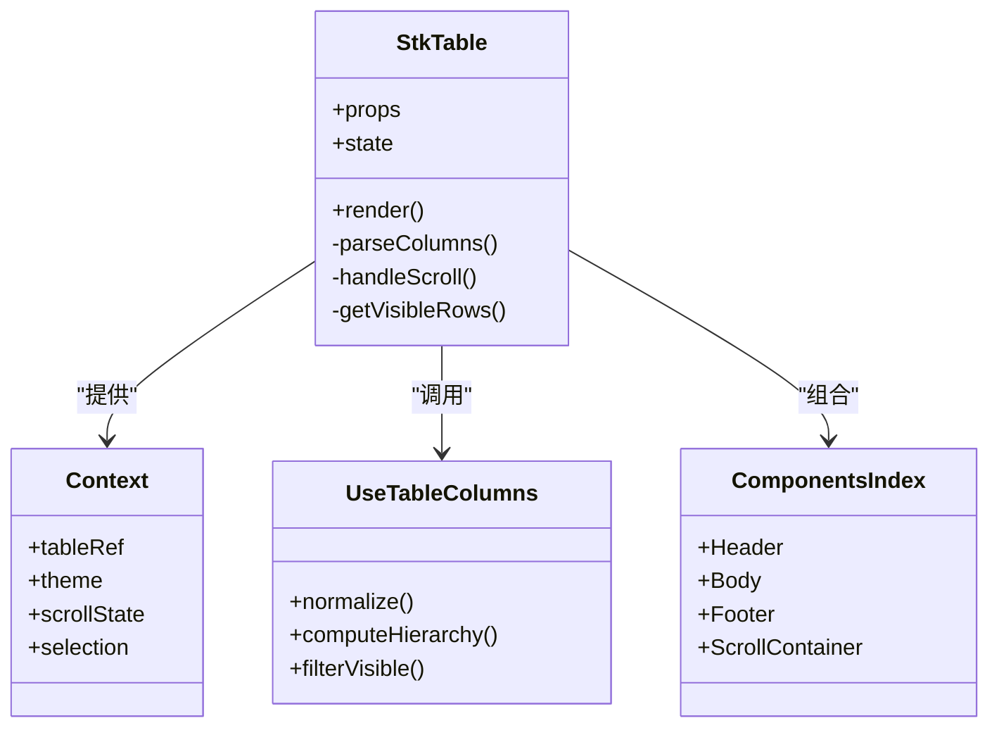

图表来源
- [StkTable.tsx](file://src/StkTable/StkTable.tsx)
- [context.ts](file://src/StkTable/context.ts)
- [useTableColumns.ts](file://src/StkTable/hooks/useTableColumns.ts)
- [index.tsx](file://src/StkTable/components/index.tsx)

## 详细组件分析

### 虚拟滚动（纵向）
- 实现原理
  - 基于可视区域高度与行高估算，仅渲染可视范围内的行节点，配合占位容器维持滚动条长度。
  - 支持动态行高与自适应高度场景，通过测量或回调更新行高缓存。
- 配置要点
  - 启用纵向虚拟滚动属性；设置预估行高或行高函数；必要时开启自适应高度模式。
- 性能与内存
  - 控制渲染批次，避免频繁重排；对大对象数据进行浅比较或稳定 key，减少不必要的重建。
  - 在大数据量下优先使用服务端分页或增量加载。
- 参考示例
  - 基础纵向虚拟滚动示例
  - 自适应高度虚拟滚动示例
  - 前置文本自适应高度示例

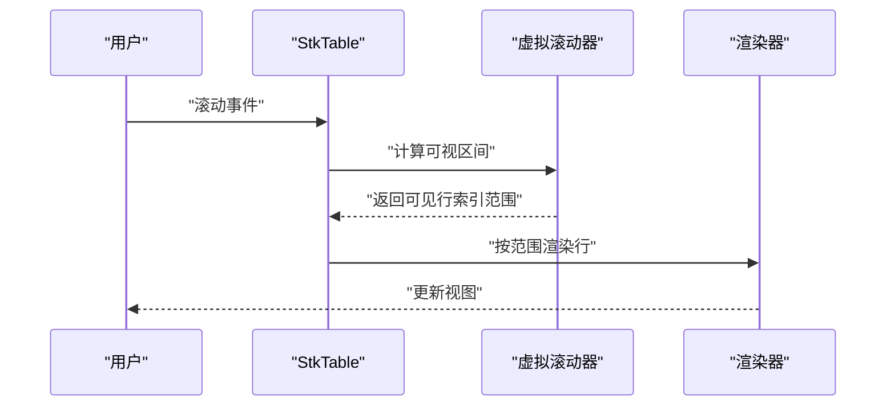

图表来源
- [VirtualY.tsx](file://docs-demo/advanced/virtual/VirtualY.tsx)
- [AutoHeightVirtual/index.tsx](file://docs-demo/advanced/auto-height-virtual/AutoHeightVirtual/index.tsx)
- [PretextAutoHeight/index.tsx](file://docs-demo/advanced/auto-height-virtual/PretextAutoHeight/index.tsx)

章节来源
- [VirtualY.tsx](file://docs-demo/advanced/virtual/VirtualY.tsx)
- [AutoHeightVirtual/index.tsx](file://docs-demo/advanced/auto-height-virtual/AutoHeightVirtual/index.tsx)
- [PretextAutoHeight/index.tsx](file://docs-demo/advanced/auto-height-virtual/PretextAutoHeight/index.tsx)
- [virtual.md](file://docs-src/main/table/advanced/virtual.md)

### 虚拟滚动（横向）
- 实现原理
  - 基于可视宽度与列宽估算，仅渲染可视区域内的列节点，配合横向占位容器维持滚动条长度。
  - 与固定列协同工作时，需确保固定列不参与虚拟切片，保持布局一致性。
- 配置要点
  - 启用横向虚拟滚动属性；合理设置列宽；与固定列、多级表头组合时注意边界计算。
- 性能与内存
  - 列变更频率低时，缓存列宽与偏移；避免在滚动回调中进行昂贵计算。
- 参考示例
  - 横向虚拟滚动示例

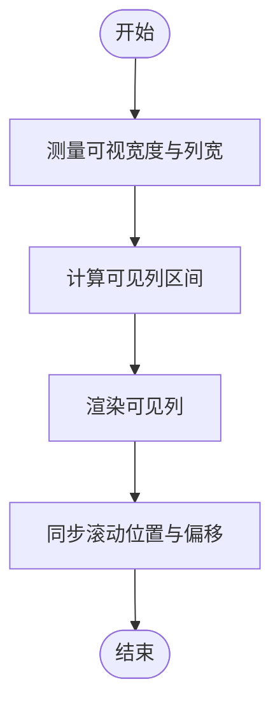

图表来源
- [VirtualX.tsx](file://docs-demo/advanced/virtual/VirtualX.tsx)

章节来源
- [VirtualX.tsx](file://docs-demo/advanced/virtual/VirtualX.tsx)
- [virtual.md](file://docs-src/main/table/advanced/virtual.md)

### 树形数据结构
- 实现原理
  - 将扁平数据转换为树形结构，维护展开/折叠状态集合；渲染时按层级递归输出节点。
  - 支持默认展开所有、默认展开指定键、默认展开层级等策略。
- 配置要点
  - 指定树形字段标识与父子关系；配置展开状态与默认展开策略；与虚拟滚动组合时需保证可预测的行高或自适应高度。
- 性能与内存
  - 使用稳定的唯一键；仅在展开变化时更新受影响分支；大数据量建议结合虚拟滚动与懒加载。
- 参考示例
  - 基础树形表格
  - 默认展开所有
  - 默认展开指定键
  - 默认展开层级
  - 树形+虚拟列表

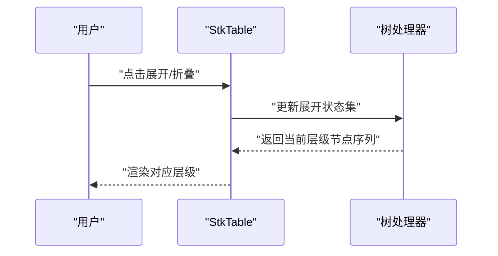

图表来源
- [Tree.tsx](file://docs-demo/basic/tree/Tree.tsx)
- [TreeVirtualList.tsx](file://docs-demo/basic/tree/TreeVirtualList.tsx)

章节来源
- [Tree.tsx](file://docs-demo/basic/tree/Tree.tsx)
- [TreeVirtualList.tsx](file://docs-demo/basic/tree/TreeVirtualList.tsx)
- [tree.md](file://docs-src/main/table/basic/tree.md)

### 固定列
- 实现原理
  - 将指定列从滚动容器中分离，使用绝对定位固定在视口边缘；主体区域滚动时同步偏移。
  - 与虚拟滚动组合时，固定列不参与虚拟切片，避免错位。
- 配置要点
  - 为列配置固定方向（左/右）；在多列与多级表头场景下，确保固定列的层级与对齐正确。
- 性能与内存
  - 固定列数量不宜过多；避免在固定列内执行重型渲染。
- 参考示例
  - 基础固定列
  - 固定列+虚拟滚动

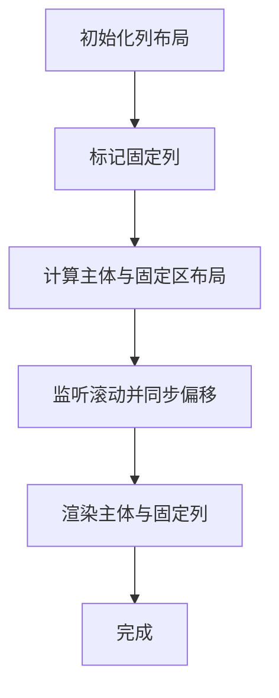

图表来源
- [Fixed.tsx](file://docs-demo/basic/fixed/Fixed.tsx)
- [FixedVirtual.tsx](file://docs-demo/basic/fixed/FixedVirtual.tsx)

章节来源
- [Fixed.tsx](file://docs-demo/basic/fixed/Fixed.tsx)
- [FixedVirtual.tsx](file://docs-demo/basic/fixed/FixedVirtual.tsx)
- [fixed.md](file://docs-src/main/table/basic/fixed.md)

### 合并单元格
- 实现原理
  - 通过行列跨度描述（行合并/列合并）在渲染阶段进行单元格拼接与覆盖绘制。
  - 与虚拟滚动组合时，需确保合并区域的可见性判断准确，避免跨区渲染错误。
- 配置要点
  - 为需要合并的单元格提供跨度信息；在多级表头与固定列场景下，注意合并边界与对齐。
- 性能与内存
  - 合并计算尽量缓存结果；避免在滚动回调中重复计算。
- 参考示例
  - 行合并
  - 列合并

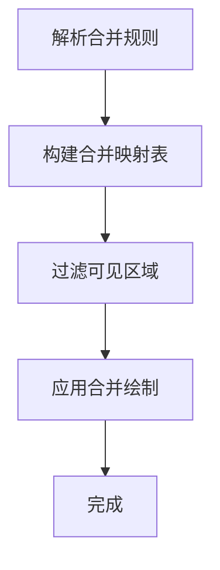

图表来源
- [MergeCellsRow.tsx](file://docs-demo/basic/merge-cells/MergeCellsRow.tsx)

章节来源
- [MergeCellsRow.tsx](file://docs-demo/basic/merge-cells/MergeCellsRow.tsx)
- [merge-cells.md](file://docs-src/main/table/basic/merge-cells.md)

### 多级表头
- 实现原理
  - 将列定义抽象为树形结构，父列作为分组头，子列为叶子列；渲染时按层级输出表头行。
  - 与固定列、虚拟滚动组合时，需保证层级对齐与滚动同步。
- 配置要点
  - 为列定义层级关系；在固定列场景下，明确哪些父/子列参与固定。
- 性能与内存
  - 表头层级较深时，缓存层级布局；避免在滚动过程中重新计算。
- 参考示例
  - 基础多级表头
  - 多级表头+固定列
  - 多级表头+横向虚拟滚动

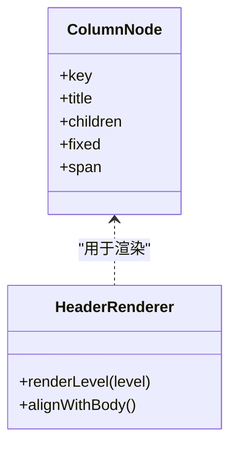

图表来源
- [MultiHeader.tsx](file://docs-demo/basic/multi-header/MultiHeader.tsx)

章节来源
- [MultiHeader.tsx](file://docs-demo/basic/multi-header/MultiHeader.tsx)
- [multi-header.md](file://docs-src/main/table/basic/multi-header.md)

### 行展开
- 实现原理
  - 为每行提供展开/折叠状态，展开后在行下方插入详情区域；支持自定义展开内容。
- 配置要点
  - 指定展开触发方式与内容插槽；与虚拟滚动组合时，需考虑展开区域的高度变化。
- 性能与内存
  - 仅渲染当前展开行的详情；避免一次性展开大量行。
- 参考示例
  - 基础行展开
  - 自定义展开内容

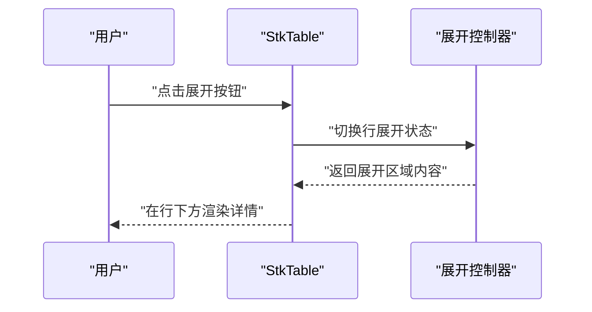

图表来源
- [ExpandRow.tsx](file://docs-demo/basic/expand-row/ExpandRow.tsx)

章节来源
- [ExpandRow.tsx](file://docs-demo/basic/expand-row/ExpandRow.tsx)
- [expand-row.md](file://docs-src/main/table/basic/expand-row.md)

### 复杂业务场景方案

#### 大数据量渲染
- 目标：在海量数据下保持流畅交互与低内存占用。
- 方案要点
  - 纵向虚拟滚动 + 预估行高或自适应高度；必要时启用横向虚拟滚动。
  - 服务端分页/增量加载；前端仅维护可视窗口数据。
  - 稳定 key 与浅比较，减少重渲染。
- 参考示例
  - 大数据量示例

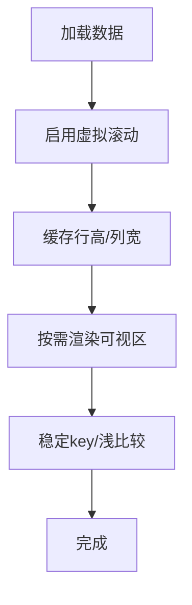

图表来源
- [HugeData/index.tsx](file://docs-demo/demos/HugeData/index.tsx)

章节来源
- [HugeData/index.tsx](file://docs-demo/demos/HugeData/index.tsx)

#### 层级数据展示
- 目标：清晰呈现树形结构，支持展开/折叠与导航。
- 方案要点
  - 树形数据结构 + 默认展开策略；与虚拟滚动组合提升性能。
  - 为不同层级提供差异化样式与操作。
- 参考示例
  - 树形表格 + 虚拟列表

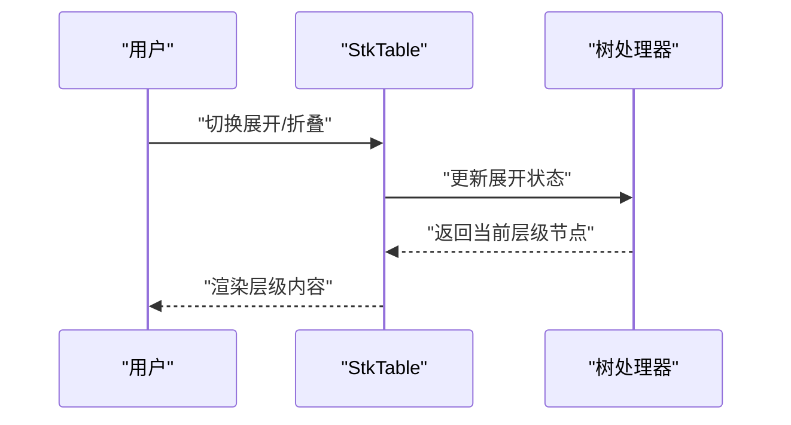

图表来源
- [TreeVirtualList.tsx](file://docs-demo/basic/tree/TreeVirtualList.tsx)

章节来源
- [TreeVirtualList.tsx](file://docs-demo/basic/tree/TreeVirtualList.tsx)

#### 复杂表格布局
- 目标：组合固定列、多级表头、合并单元格、虚拟滚动等能力，满足复杂报表需求。
- 方案要点
  - 先确定固定列与多级表头的层级关系，再计算合并区域；最后启用虚拟滚动优化渲染。
  - 在滚动与布局变化时，缓存中间结果，避免重复计算。
- 参考示例
  - 矩阵表格（复杂布局）
  - 面板树（侧边树+表格联动）

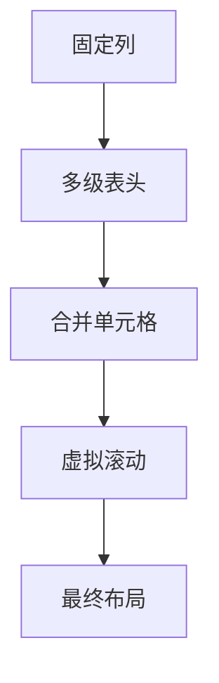

图表来源
- [Matrix/index.tsx](file://docs-demo/demos/Matrix/index.tsx)
- [PanelTree/index.tsx](file://docs-demo/demos/PanelTree/index.tsx)

章节来源
- [Matrix/index.tsx](file://docs-demo/demos/Matrix/index.tsx)
- [PanelTree/index.tsx](file://docs-demo/demos/PanelTree/index.tsx)

## 依赖关系分析
- 组件间依赖
  - 主组件依赖上下文与列钩子，组合内部子组件完成渲染。
  - 演示示例依赖主组件导出的 API，通过 props 配置高级特性。
- 外部依赖
  - 文档与示例通过 VitePress 与 React 生态集成。

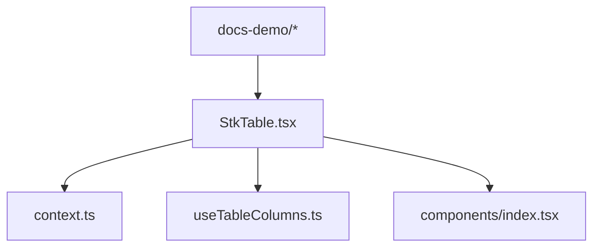

图表来源
- [StkTable.tsx](file://src/StkTable/StkTable.tsx)
- [context.ts](file://src/StkTable/context.ts)
- [useTableColumns.ts](file://src/StkTable/hooks/useTableColumns.ts)
- [index.tsx](file://src/StkTable/components/index.tsx)

章节来源
- [StkTable.tsx](file://src/StkTable/StkTable.tsx)
- [index.ts](file://src/StkTable/index.ts)

## 性能考量
- 虚拟滚动
  - 预估行高与自适应高度并存时，优先使用预估行高以减少测量开销；在必须精确高度时使用自适应高度并限制测量频率。
  - 横向虚拟滚动与固定列组合时，确保固定列不参与切片，避免布局抖动。
- 树形数据
  - 使用稳定唯一键；仅在展开状态变化时更新受影响分支；大数据量下结合虚拟滚动。
- 固定列
  - 控制固定列数量与复杂度；避免在固定列内进行重型渲染。
- 合并单元格
  - 缓存合并映射；在滚动回调中避免重复计算。
- 多级表头
  - 缓存层级布局；减少滚动过程中的重排。
- 行展开
  - 仅渲染当前展开行详情；避免批量展开导致性能下降。
- 通用优化
  - 稳定 key、浅比较、惰性加载、分片渲染；合理使用 memo 与 useMemo/useCallback。

[本节为通用指导，不直接分析具体文件]

## 故障排查指南
- 虚拟滚动错位
  - 检查行高预估是否准确；确认自适应高度模式下测量时机是否正确。
  - 横向虚拟滚动与固定列组合时，核对固定列不参与切片。
- 树形数据异常
  - 确认父子关系字段与唯一键稳定；展开状态更新是否影响正确分支。
- 固定列重叠
  - 核对固定列的层级与对齐；检查多级表头下的固定列边界。
- 合并单元格显示异常
  - 验证合并映射在可见区域内是否正确应用；避免跨区渲染。
- 多级表头对齐问题
  - 检查层级布局缓存；确保滚动同步与偏移计算正确。
- 行展开导致布局抖动
  - 控制展开区域高度变化；避免在滚动回调中执行昂贵操作。

章节来源
- [virtual.md](file://docs-src/main/table/advanced/virtual.md)
- [tree.md](file://docs-src/main/table/basic/tree.md)
- [fixed.md](file://docs-src/main/table/basic/fixed.md)
- [merge-cells.md](file://docs-src/main/table/basic/merge-cells.md)
- [multi-header.md](file://docs-src/main/table/basic/multi-header.md)
- [expand-row.md](file://docs-src/main/table/basic/expand-row.md)

## 结论
通过虚拟滚动、树形数据、固定列、合并单元格、多级表头与行展开的组合使用，StkTable 能够胜任复杂的企业级表格场景。关键在于合理的配置与性能优化策略：以虚拟滚动为核心，辅以稳定的数据模型、缓存机制与惰性渲染，从而在大体量数据与复杂布局下保持流畅体验。

[本节为总结性内容，不直接分析具体文件]

## 附录
- API 参考
  - 表格属性与列定义请参考文档源中的 API 说明。
- 示例路径
  - 高级特性示例位于 docs-demo/advanced 与 docs-demo/basic 目录。
  - 复杂场景示例位于 docs-demo/demos 目录。

章节来源
- [table-props.md](file://docs-src/main/api/table-props.md)
- [virtual.md](file://docs-src/main/table/advanced/virtual.md)
- [tree.md](file://docs-src/main/table/basic/tree.md)
- [fixed.md](file://docs-src/main/table/basic/fixed.md)
- [multi-header.md](file://docs-src/main/table/basic/multi-header.md)
- [merge-cells.md](file://docs-src/main/table/basic/merge-cells.md)
- [expand-row.md](file://docs-src/main/table/basic/expand-row.md)